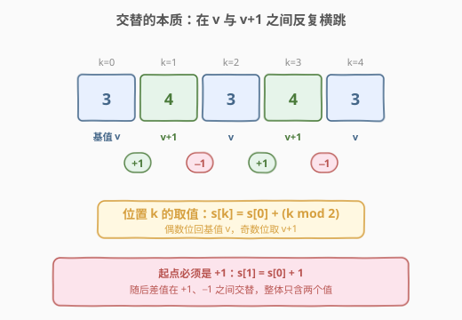
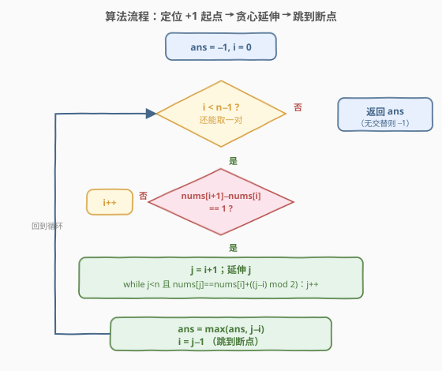

# LeetCode 最长交替子数组 题解

## 1. 题目概述

- **标题 / 题号**：最长交替子数组（#2765，easy）
- **链接**：https://leetcode.cn/problems/longest-alternating-subarray/
- **难度**：简单
- **标签**：数组、枚举

**题意**：给你一个下标从 `0` 开始的整数数组 `nums`。如果 `nums` 中长度为 `m` 的子数组 `s` 满足以下条件，称它是一个**交替子数组**：

- $m > 1$。
- $s_1 = s_0 + 1$。
- 子数组 `s` 与数组 $[s_0, s_1, s_0, s_1, \ldots, s_{(m-1)\bmod 2}]$ 一样。即差值交替：$s_1-s_0=1$、$s_2-s_1=-1$、$s_3-s_2=1$、$s_4-s_3=-1$，以此类推，直到 $s_{m-1}-s_{m-2}=(-1)^m$。

返回 `nums` 中所有**交替**子数组中，最长的长度；若不存在交替子数组，返回 `-1`。子数组是数组中一段连续**非空**的元素序列。

**示例 1**：

```text
输入：nums = [2,3,4,3,4]
输出：4
解释：交替子数组有 [2,3]、[3,4]、[3,4,3] 和 [3,4,3,4]。最长为 [3,4,3,4]，长度 4。
```

**示例 2**：

```text
输入：nums = [4,5,6]
输出：2
解释：[4,5] 和 [5,6] 是仅有的两个交替子数组，长度均为 2。
```

**约束**：

- $2 \le \text{nums.length} \le 100$
- $1 \le \text{nums}[i] \le 10^4$

> 💡 本题看起来在描述一串"差值交替 +1/−1"的序列，容易让人陷入逐对比较相邻差值的细节。真正的破局点是看穿这串描述的**等价形式**：交替子数组其实在两个值 $v$ 与 $v+1$ 之间反复横跳。一旦确认这一点，每个位置该取什么值就是 $s[k] = s_0 + (k \bmod 2)$，校验坍缩成一次比较，整条数组可用一次扫描贪心延伸。

## 2. 解题思路

### 2.1 暴力思路：枚举所有子数组逐个校验

最朴素的直觉是按题意直接枚举：双重循环枚举起点 $i$ 和终点 $j$，对每个子数组 $\text{nums}[i..j]$ 校验它是否为交替子数组——先要求 $\text{nums}[i+1] = \text{nums}[i]+1$，再逐位核对差值是否按 $+1,-1,+1,-1,\ldots$ 交替。

这条路能走通但有三处浪费：

| 浪费点 | 说明 |
|--------|------|
| **重复校验** | 固定起点 $i$ 时，$\text{nums}[i..j]$ 与 $\text{nums}[i..j+1]$ 的前 $j-i$ 位高度重叠，却被逐个重判，复杂度退化到 $O(n^3)$ |
| **起点判得太晚** | 若 $\text{nums}[i+1] \ne \text{nums}[i]+1$，则以 $i$ 为起点的任何子数组都不可能交替，却仍会枚举所有终点 |
| **看不出可"跳过"** | 一段交替区间在某个位置断裂后，断裂点之前的所有后缀都不可能越过断裂点延伸更长，却仍逐起点重扫 |

$n \le 100$ 时 $O(n^3)$ 也能过，但暴力把人困在"逐对看差值"的视角里，错过了更简洁的结构。

### 2.2 核心观察：交替子数组只在 v 与 v+1 两个值间反复横跳



破局的第一步是把题面那串"差值交替"翻译成**取值规律**。由 $s_1 = s_0+1$ 与"差值在 $+1,-1$ 间交替"两条，归纳可得：交替子数组里**只出现两个值**——基值 $v = s_0$ 与 $v+1$。它们按位置奇偶分布：

> 💡 **取值规律**：对交替子数组中下标为 $k$（从子数组起点起算）的位置，恒有 $$s_k = s_0 + (k \bmod 2)$$ 即偶数位（$k=0,2,4,\ldots$）取基值 $v$，奇数位（$k=1,3,5,\ldots$）取 $v+1$。

验证这个规律满足题面所有条件：$s_1 = s_0+1$ ✓；相邻差值 $s_{k+1}-s_k = (s_0+((k+1)\bmod 2))-(s_0+(k\bmod 2))$，当 $k$ 为偶时为 $+1$、$k$ 为奇时为 $-1$，恰为 $+1,-1,+1,-1,\ldots$ ✓；末项 $s_{m-1}-s_{m-2} = (-1)^m$ ✓（$m-1$ 与 $m-2$ 奇偶性相反，差值符号取决于 $m-1$ 的奇偶即 $m$ 的奇偶）。三条全中。

这条规律把"逐对看差值"压成"逐位看是否等于 $v+(k\bmod 2)$"——**一次比较即可**。更关键的是它带来贪心延伸的可能：

> ⚠️ **起点约束**：交替子数组必须以 $+1$ 开步（$s_1=s_0+1$）。所以只有 $\text{nums}[i+1]-\text{nums}[i]=1$ 的位置 $i$ 才可能成为起点，其余位置直接跳过。

### 2.3 算法流程图



基于取值规律，单次扫描即可。维护答案 `ans`（初值 $-1$）与游标 $i$：

1. **定位起点**：在 $i$ 处若 $\text{nums}[i+1]-\text{nums}[i] \ne 1$，则 $i$ 不可能是起点，$i \gets i+1$ 继续找。
2. **贪心延伸**：找到起点 $i$ 后，令 $j$ 从 $i+1$ 起向右走，只要 $\text{nums}[j] = \text{nums}[i] + ((j-i)\bmod 2)$ 就继续 $j\gets j+1$，直到首个不满足的位置停下。此时交替区间为 $[i,\, j-1]$，长度 $j-i$。
3. **更新与跳转**：`ans = max(ans, j-i)`；随后把 $i$ 直接跳到 $j-1$（断点的前一格），从那里重新尝试新的 $+1$ 起点。

> 💡 **为什么能从 $i$ 直接跳到 $j-1$？** 关键引理：**起于 $[i, j-1]$ 内任一后缀的交替子数组，都不可能越过断点 $j$ 延伸更长**。因为断点 $j$ 处 $\text{nums}[j] \ne \text{nums}[i]+((j-i)\bmod 2)$，而对任意后缀起点 $i' \in (i, j-1]$，它在 $j$ 处的期望值同样是 $\text{nums}[i']+((j-i')\bmod 2)$；由于 $[i, j-1]$ 整段是同一条交替链，$\text{nums}[i'] = \text{nums}[i]+((i'-i)\bmod 2)$，于是后缀在 $j$ 的期望值 $= \text{nums}[i]+((i'-i)+(j-i'))\bmod 2 = \text{nums}[i]+((j-i)\bmod 2)$——与原起点期望相同，同样不满足。故这些后缀长度 $\le j-i' < j-i$，比已得答案短，跳过无损。下一处可能更长的起点从 $j-1$ 起试即可（它能否成起点取决于 $\text{nums}[j]-\text{nums}[j-1]$ 是否为 $1$）。

由于 $j$ 只前进不回退、$i$ 每次跳到 $j-1$ 后最多再走几步就定位下一个起点，每个元素被访问均摊 $O(1)$，总体 $O(n)$。

### 2.4 示例演算

![示例演算：[2,3,4,3,4] 先得 len=2，再得 len=4，返回 4](../images/p2765_walkthrough.svg)

以**示例 1**（`nums = [2,3,4,3,4]`，$n=5$）为例：

| 轮次 | 起点 $i$ | 基值 $v$ | 延伸过程 | 断点 $j$ | 本轮长度 | `ans` | 跳转后 $i$ |
|------|---------|----------|----------|----------|---------|-------|------------|
| ① | $0$ | $\text{nums}[0]=2$ | $\text{nums}[1]=3=2+1$ ✓；$\text{nums}[2]=4 \ne 2+0=2$ ✗ | $2$ | $2-0=2$ | $\max(-1,2)=2$ | $j-1=1$ |
| ② | $1$ | $\text{nums}[1]=3$ | $\text{nums}[2]=4=3+1$ ✓；$\text{nums}[3]=3=3+0$ ✓；$\text{nums}[4]=4=3+1$ ✓；到末尾 | $5$ | $5-1=4$ | $\max(2,4)=4$ | $j-1=4$ |
| ③ | $4$ | — | $i+1=5 \ge n$，无起点可选 | — | — | — | 结束 |

返回 `ans = 4` ✓。注意轮 ① 在下标 2（值 4）处断裂后，$i$ 直接跳到 1 而非逐个挪动，正是跳转引理的体现；轮 ② 从 $i=1$ 出发一路延伸到末尾得到长度 4。

以**示例 2**（`nums = [4,5,6]`）为例：$i=0$，$v=4$，$\text{nums}[1]=5=4+1$ ✓ 但 $\text{nums}[2]=6 \ne 4+0=4$ ✗，断点 $j=2$，长度 $2$，`ans=2`，跳到 $i=1$；$i=1$，$v=5$，$\text{nums}[2]=6=5+1$ ✓ 到末尾 $j=3$，长度 $2$，`ans` 仍 $2$，跳到 $i=2$；$i=2$ 时 $i+1=3\ge n$ 结束。返回 $2$ ✓。

## 3. 参考代码

### C++（一次扫描 + 贪心延伸）

```cpp
class Solution {
public:
    int alternatingSubarray(vector<int>& nums) {
        int n = nums.size(), ans = -1;
        for (int i = 0; i < n - 1;) {
            if (nums[i + 1] - nums[i] != 1) {  // 非 +1 开步，跳过
                i++;
                continue;
            }
            int j = i + 1;
            while (j < n && nums[j] == nums[i] + ((j - i) & 1)) {  // 期望 = v + (k mod 2)
                j++;
            }
            ans = max(ans, j - i);
            i = j - 1;  // 跳到断点前一格，重新找起点
        }
        return ans;
    }
};
```

> 💡 `(j - i) & 1` 用按位与替代 `% 2`，等价且常数更小；核心是**期望值 `nums[i] + ((j - i) % 2)`**，把"差值交替"压成一次比较。`i = j - 1` 配合跳转引理保证 $O(n)$。

### C++（暴力枚举，$O(n^2)$，对照用）

```cpp
class Solution {
public:
    int alternatingSubarray(vector<int>& nums) {
        int n = nums.size(), ans = -1;
        for (int i = 0; i < n - 1; i++) {
            if (nums[i + 1] - nums[i] != 1) continue;  // 起点必须 +1 开步
            int j = i + 1;
            for (; j < n; j++) {
                if (nums[j] != nums[i] + ((j - i) & 1)) break;  // 逐位校验取值规律
            }
            ans = max(ans, j - i);
        }
        return ans;
    }
};
```

> 💡 暴力版与贪心版唯一区别：外层 `for` 固定步长推进 $i$，不跳转。固定起点后内层延伸逻辑完全一致，复杂度 $O(n^2)$，对 $n \le 100$ 足够。它对照出贪心版"跳到 $j-1$"的优化价值。

### Python

```python
class Solution:
    def alternatingSubarray(self, nums: List[int]) -> int:
        n, ans, i = len(nums), -1, 0
        while i < n - 1:
            if nums[i + 1] - nums[i] != 1:
                i += 1
                continue
            j = i + 1
            while j < n and nums[j] == nums[i] + ((j - i) & 1):
                j += 1
            ans = max(ans, j - i)
            i = j - 1
        return ans
```

> 💡 Python 版与 C++ 贪心版逻辑一一对应：`while` 外层推进 $i$、内层延伸 $j$、`i = j - 1` 跳转。`& 1` 同样可行（Python 整数按位与），也可写成 `(j - i) % 2` 更直观。

## 4. 复杂度分析

| 维度 | 复杂度 | 说明 |
|------|--------|------|
| 时间复杂度 | $O(n)$ | $j$ 只前进不回退，$i$ 每次跳到 $j-1$ 后最多再走几步即定位下一起点，每个元素均摊访问 $O(1)$ |
| 空间复杂度 | $O(1)$ | 仅用 `ans`、`i`、`j` 等若干标量，无额外数据结构 |

> 💡 暴力枚举版为 $O(n^2)$ 时间、$O(1)$ 空间，对 $n \le 100$ 同样通过。贪心版的优势在数据规模放大时才显现——本题约束很小，两种写法都 acceptable，但贪心版的"跳转"思想是通用技巧。

## 5. 扩展：差值视角与"期望值"视角的等价转换

本题的精髓不在代码而在**视角转换**：题面用"相邻差值交替 $+1,-1$"描述交替子数组，解题时把它翻译成"位置 $k$ 取值 $s_0+(k\bmod 2)$"。两种描述等价，但后者把**两个相邻量的关系**（差值）变成**单个量与起点的绝对关系**（期望值），于是：

- 校验从"看相邻两位算差值再判符号"简化为"看一位是否等于期望值"；
- 延伸时无需维护"上一段差值是 +1 还是 −1"的状态，只看绝对期望。

> ⚠️ **易错点：起点必须是 +1 而非 −1**。题面规定 $s_1 = s_0+1$，所以交替子数组只能以 $+1$ 开步。若误把起点条件写成"相邻差值非零即交替"，会把 $[5,4,5,4]$ 这类以 $-1$ 开步的序列误判为交替子数组——但它们不满足 $s_1=s_0+1$，是**假交替**。起点判据 `nums[i+1] - nums[i] == 1` 是硬约束。

另一个值得玩味的角度：如果题面把"交替"放宽为"差值在 $\{+d, -d\}$ 间交替、起点为 $+d$"（$d$ 任意），只需把期望值改成 $s_0 + d \cdot (k \bmod 2)$、起点判据改成 $\text{nums}[i+1]-\text{nums}[i]=d$，整套贪心框架原样适用。本题 $d=1$ 是其特例。这正是把"差值视角"统一到"期望值视角"的收益——参数化 $d$ 即得一般解。

## 6. 面试要点

1. **为什么交替子数组里只有两个值 $v$ 与 $v+1$？**

   > 由 $s_1=s_0+1$ 与差值交替 $+1,-1,+1,-1,\ldots$：$s_0=v$，$s_1=v+1$，$s_2=s_1-1=v$，$s_3=s_2+1=v+1$，……归纳即得偶数位恒为 $v$、奇数位恒为 $v+1$。整条子数组只在两值间反复横跳。

2. **为什么固定起点后校验只需一次比较？**

   > 因为取值规律给出绝对期望 $s_k = s_0+(k\bmod 2)$。延伸时不必再算相邻差值、不必维护"上一段符号"的状态，直接比较 $\text{nums}[j]$ 是否等于 $\text{nums}[i]+((j-i)\bmod 2)$ 即可，把两变量的关系压成单变量与起点的绝对关系。

3. **贪心版为什么是 $O(n)$ 而非 $O(n^2)$？**

   > 关键在延伸指针 $j$ 单调不回退，且断点后 $i$ 直接跳到 $j-1$ 而非逐格挪动。跳转引理保证 $[i, j-1]$ 内的后缀都不可能越过 $j$ 延伸更长，故跳过它们无损最优性；$i$ 跳到 $j-1$ 后最多再走几步即定位下一起点。每个元素被 $j$ 访问均摊 $O(1)$，总计 $O(n)$。

4. **起点为什么必须是 $+1$ 开步？**

   > 题面硬性规定 $s_1 = s_0+1$，所以任何交替子数组的首段差值必为 $+1$。若 $\text{nums}[i+1]-\text{nums}[i]\ne 1$，$i$ 绝无可能是起点，直接跳过。误把起点判据放宽为"差值非零"会把 $[5,4,5,4]$ 这类以 $-1$ 开步的假交替误纳。

5. **如果约束放大到 $n=10^5$，暴力还行吗？**

   > 暴力 $O(n^2)$ 会超时，必须用贪心 $O(n)$。好在贪心版只把外层 `for` 改成 `while` 并加 `i = j-1` 跳转，逻辑等价、改动极小。这也说明"先写暴力理清逻辑、再用跳转优化"是稳妥路径。

> 💡 **一句话总结**：2765 = "交替 = 只在 v 与 v+1 间横跳 → $s_k = s_0+(k\bmod 2)$ → 贪心延伸 + 断点跳转"。考点在把"差值交替"翻译成"绝对期望值"的视角转换，看清这一点后 $O(n)$ 一次扫描即终局。

## 同类练习题

| # | 题目 | 与本题的关联 |
|---|------|-------------|
| 978 | [最长湍流子数组](https://leetcode.cn/problems/longest-turbulent-subarray/) | 本题的"比较符号交替"兄弟题（相邻比较结果是 $>,<,>,<,\ldots$），同样可用贪心延伸 + 状态指针，对照"差值交替"与"符号交替"两种形态 |
| 376 | [摆动序列](https://leetcode.cn/problems/wiggle-subsequence/) | 求最长的"摆动"（差值符号交替）子序列，与本题同属交替/摆动家族，对比"子数组（连续）"与"子序列（可删）"的贪心差异 |
| 674 | [最长连续递增序列](https://leetcode.cn/problems/longest-continuous-increasing-subsequence/) | 最简的"延伸子数组"模板（单调递增），可作为本题"贪心延伸 + 指针推进"骨架的无交替退化版 |
| 2401 | [最长优雅子数组](https://leetcode.cn/problems/longest-nice-subarray/) | 同为"最长满足条件的连续子数组 + 双指针延伸"，体会不同条件（按位约束 vs 取值规律）下同一延伸框架的复用 |
