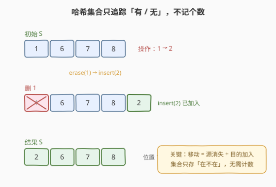
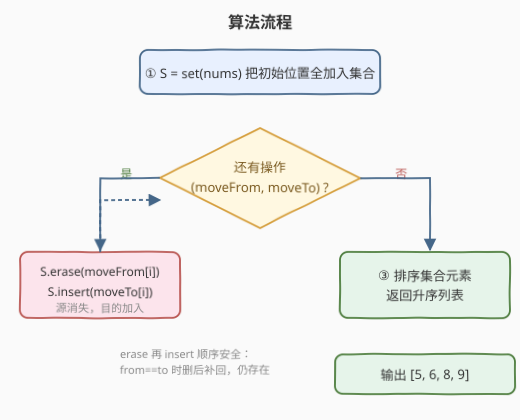

# 重新放置石块

- **题目名称**：重新放置石块
- **链接**：[2766. 重新放置石块](https://leetcode.cn/problems/relocate-marbles/)
- **难度**：中等
- **标签**：数组、哈希表、排序、模拟

## 1. 题目概述

给你一个下标从 `0` 开始的整数数组 `nums`，表示一些石块的**初始位置**。再给你两个长度**相等**的下标从 `0` 开始的整数数组 `moveFrom` 和 `moveTo`。

在 `moveFrom.length` 次操作内，你将改变石块的位置。在第 `i` 次操作中，你将位置在 `moveFrom[i]` 的**所有**石块移到位置 `moveTo[i]`。

完成这些操作后，请你按**升序**返回所有**有**石块的位置。

> 注意：
> - 如果一个位置至少有一个石块，我们称这个位置**有**石块。
> - 一个位置可能会有多个石块。

**示例 1**：

```text
输入：nums = [1,6,7,8], moveFrom = [1,7,2], moveTo = [2,9,5]
输出：[5,6,8,9]
解释：一开始，石块在位置 1,6,7,8。
第 i = 0 步：位置 1 的石块移到 2，位置 2,6,7,8 有石块。
第 i = 1 步：位置 7 的石块移到 9，位置 2,6,8,9 有石块。
第 i = 2 步：位置 2 的石块移到 5，位置 5,6,8,9 有石块。
最后，至少有一个石块的位置为 [5,6,8,9]。
```

**示例 2**：

```text
输入：nums = [1,1,3,3], moveFrom = [1,3], moveTo = [2,2]
输出：[2]
解释：一开始，石块在位置 [1,1,3,3]。
第 i = 0 步：位置 1 的石块移到 2，有石块的位置为 [2,2,3,3]。
第 i = 1 步：位置 3 的石块移到 2，有石块的位置为 [2,2,2,2]。
由于 2 是唯一有石块的位置，返回 [2]。
```

**约束条件**：

- $1 \le \text{nums.length} \le 10^5$
- $1 \le \text{moveFrom.length} \le 10^5$
- `moveFrom.length == moveTo.length`
- $1 \le \text{nums[i]}, \text{moveFrom[i]}, \text{moveTo[i]} \le 10^9$
- 测试数据保证在进行第 $i$ 步操作时，`moveFrom[i]` 处至少有一个石块。

> 💡 本题是 LeetCode 周赛 353 第三题。表面是"移动石块"的模拟，实质只要回答一个问题——**操作结束后哪些位置还留有石块**。一旦意识到"个数无关紧要，只需记在不在"，问题就坍缩成一道哈希集合的增删题：每次操作把源位置删掉、目的位置加上即可。

---

## 2. 解题思路

### 2.1 暴力思路：逐个搬运石块

最直白的做法是忠实模拟"搬运"过程：用一个容器（数组或列表）保存**每一个石块**的当前位置，每次操作遍历所有石块，凡是位置等于 `moveFrom[i]` 的就改成 `moveTo[i]`，最后去重排序。

这条路能过，但有三个痛点：

| 痛点 | 说明 |
|------|------|
| **规模爆炸** | `nums` 长度可达 $10^5$，操作也达 $10^5$ 次，逐个搬运最坏 $O(n \cdot m) = 10^{10}$，直接 TLE |
| **计数无意义** | 同一位置堆多少石块不影响"有没有"这一答案，逐个跟踪纯属浪费 |
| **去重收尾麻烦** | 最后还要对 $10^5$ 个位置去重再排序，多一道工序 |

更关键的是——**题目只问"哪些位置有石块"，不问各位置有几块**。这暗示我们应当从"在不在"而非"多少个"的层面建模，把逐石块模拟升格为逐位置建模。

### 2.2 核心观察：用哈希集合追踪"有/无"，移动 = 删源 + 加目的



破局的关键是对"移动所有石块"这一操作的精确理解。把 `moveFrom[i]` 处**所有**石块搬到 `moveTo[i]`，等价于两件事同时发生：

> 💡 **推论一（源变空）**：操作后 `moveFrom[i]` 处**一个石块都不剩**（除非 `moveFrom[i] == moveTo[i]`），该位置从"有"变"无"。

> 💡 **推论二（目的变有）**：操作后 `moveTo[i]` 处**至少有一个石块**（搬来的那些），该位置必然"有"。

这两条恰好对应哈希集合的两个原语——**删除**与**加入**：

| 操作语义 | 集合动作 |
|---------|---------|
| 源位置变空 | `S.erase(moveFrom[i])` |
| 目的位置变有 | `S.insert(moveTo[i])` |

而题目对"有石块"的定义正是"至少一个"，与集合的"在不在"完美同构——**个数被彻底丢弃，只保留存在性**。初始时把 `nums` 全塞进集合，每个位置至多保留一个"代表"，之后的增删都作用于这个存在性集合。

> ⚠️ **为什么题面保证"第 $i$ 步时 `moveFrom[i]` 处至少有一个石块"？** 因为这保证 `erase` 操作永远命中集合中的元素——源在执行前一定"有"，删它才合法。若没有这条保证，需先 `count` 判存在再删，但这题免检。

#### 边界：`moveFrom[i] == moveTo[i]` 时怎么办？

这是最易踩的坑。若源与目的相同，"搬到自己"后该位置理应**仍有石块**。用"先删后加"的顺序天然解决：

```
S.erase(from);   // from 被删（位置暂时"无"）
S.insert(to);    // to == from，又加回来（位置恢复"有"）
```

净效果是位置仍在集合中 ✓。注意**必须先 erase 再 insert**：若反过来先 `insert(to)` 再 `erase(from)`，当 `from == to` 时会把刚加的目的也一并删掉，得到空集——这就错了。所以顺序不可颠倒。

### 2.3 算法流程图



实现只有三个动作，极其简洁：

1. **初始化**：`S = set(nums)`，把所有初始位置加入集合（重复位置自动合并）；
2. **循环处理**：对每对 `(moveFrom[i], moveTo[i])`，执行 `S.erase(moveFrom[i])` 后 `S.insert(moveTo[i])`；
3. **收尾**：把集合元素取出排序，返回升序列表。

> 💡 由于位置值域高达 $10^9$，不能用数组下标直接索引，必须用哈希集合（`unordered_set`）。最终排序是因为哈希集合无序，而题目要求升序输出。集合大小 $\le n + m$，排序 $O((n+m)\log(n+m))$ 可接受。

### 2.4 示例演算

![示例 1 演算：三步操作逐一删源加目的，最终排序得 [5,6,8,9]](../images/p2766_walkthrough.svg)

以**示例 1**（`nums = [1,6,7,8]`）为例，集合状态演进如下：

| 步骤 | 操作 (from→to) | erase | insert | 集合 S |
|------|---------------|-------|--------|--------|
| 初始 | — | — | — | $\{1, 6, 7, 8\}$ |
| i=0 | 1 → 2 | 1 | 2 | $\{2, 6, 7, 8\}$ |
| i=1 | 7 → 9 | 7 | 9 | $\{2, 6, 8, 9\}$ |
| i=2 | 2 → 5 | 2 | 5 | $\{5, 6, 8, 9\}$ |
| 排序 | sort | — | — | $[5, 6, 8, 9]$ ✓ |

以**示例 2**（`nums = [1,1,3,3]`）为例：初始 `set` 自动把重复的 `1`、`3` 合并为 $\{1, 3\}$；

| 步骤 | 操作 | erase | insert | 集合 S |
|------|------|-------|--------|--------|
| 初始 | — | — | — | $\{1, 3\}$ |
| i=0 | 1 → 2 | 1 | 2 | $\{2, 3\}$ |
| i=1 | 3 → 2 | 3 | 2 | $\{2\}$ |
| 排序 | sort | — | — | $[2]$ ✓ |

注意示例 2 中两次 `insert(2)`：第二次时 `2` 已在集合中，`insert` 是幂等的无操作——这正体现"个数无关，只记在不在"。

---

## 3. 参考代码

### C++（哈希集合）

```cpp
class Solution {
public:
    vector<int> relocateMarbles(vector<int>& nums, vector<int>& moveFrom, vector<int>& moveTo) {
        unordered_set<int> S(nums.begin(), nums.end());
        for (int i = 0; i < (int)moveFrom.size(); i++) {
            S.erase(moveFrom[i]);
            S.insert(moveTo[i]);
        }
        vector<int> ans(S.begin(), S.end());
        sort(ans.begin(), ans.end());
        return ans;
    }
};
```

> 💡 `unordered_set` 的构造函数直接接收迭代器区间，`nums` 中的重复位置在入集合时自动合并。循环体只有两行——`erase` 拆源、`insert` 补目的，顺序不可颠倒。最后 `sort` 收尾即可。

### Python

```python
class Solution:
    def relocateMarbles(self, nums: List[int], moveFrom: List[int], moveTo: List[int]) -> List[int]:
        S = set(nums)
        for f, t in zip(moveFrom, moveTo):
            S.discard(f)
            S.add(t)
        return sorted(S)
```

> 💡 Python 用 `set.discard(f)` 而非 `remove(f)`：`discard` 在元素不存在时不报错（静默无操作），更稳健；虽然题面保证 `f` 必在集合中，`discard` 也能正确处理，避免任何边界意外。`sorted(S)` 直接返回升序列表。也可以写成 `S.discard(f); S.add(t)` 两行，等价。

---

## 4. 复杂度分析

| 维度 | 复杂度 | 说明 |
|------|--------|------|
| 时间复杂度 | $O(n + m + k\log k)$ | 初始化集合 $O(n)$；$m$ 次增删每次均摊 $O(1)$；最后排序 $k$ 个结果位置 $O(k\log k)$，其中 $k \le n + m$ |
| 空间复杂度 | $O(n + m)$ | 集合最多容纳 $n + m$ 个不同位置（初始 $n$ 个 + 操作中新增的目的） |

> 💡 位置值域 $10^9$ 决定了必须用哈希结构而非位图/数组。若值域很小（如 $\le 10^6$），可用 `vector<bool>` 做存在性数组，增删 $O(1)$ 且常数更小、最后线性扫描收集——但本题值域过大，哈希集合是唯一选择。

---

## 5. 扩展：为什么不直接排序去重？

一个看似更简洁的思路是"用 `set`（有序）代替 `unordered_set`"，让最终结果天然有序、省去 `sort`：

```cpp
set<int> S(nums.begin(), nums.end());  // 红黑树，有序
```

这样做正确，但**常数更大**：红黑树每次 `insert`/`erase` 是 $O(\log n)$，$m$ 次操作共 $O(m \log(n+m))$；而 `unordered_set` 增删均摊 $O(1)$，只在最后一次性 $O(k\log k)$ 排序。当 $n, m$ 都接近 $10^5$ 时，哈希版通常更快。

| 方案 | 增删复杂度 | 收尾复杂度 | 实测倾向 |
|------|-----------|-----------|---------|
| `unordered_set` + `sort` | $O(m)$ 均摊 | $O(k\log k)$ | ✅ 推荐 |
| `set`（红黑树） | $O(m\log(n+m))$ | $O(k)$（已有序） | 值域小或需频繁查询时考虑 |

> ⚠️ 另一个易错点：误以为要"逐石块"记录。曾有解法用 `map<int,int>` 记每个位置的石块数，每次 `cnt[from]--`、`cnt[to]++`，再筛出 `cnt>0` 的位置。这虽也正确，但**计数完全多余**——答案只依赖存在性，计数信息用完即弃。`set` 的"删源加目的"两步即可，省去计数与事后筛值的开销，更贴合题意。

---

## 6. 面试要点

1. **为什么用集合而不是计数数组？**

   > 位置值域高达 $10^9$，数组下标无法直接索引，必须哈希。且题目只问"哪些位置有石块"——存在性而非个数，集合的"在不在"与题意同构，计数信息是冗余的，用 `set` 比用 `map<int,int>` 更精炼。

2. **`erase` 和 `insert` 的顺序为什么不能反？**

   > 当 `moveFrom[i] == moveTo[i]` 时，"搬到自己"后位置应仍有石块。先 `erase` 再 `insert`：删后补回，净效果仍在集合 ✓。若反过来先 `insert(to)` 再 `erase(from)`，`from==to` 会把刚加的目的也删掉，得空集 ✗。所以顺序不可颠倒。

3. **`moveFrom[i] == moveTo[i]` 时集合状态如何变化？**

   > 先删 `from`（位置暂时消失），再加 `to`（等于 `from`，补回）。最终位置仍在集合中，与"石块没动"的语义一致。题面这类"原地不动"操作是天然的边界用例，必须覆盖。

4. **为什么题面要保证"第 $i$ 步时 `moveFrom[i]` 处至少有一个石块"？**

   > 这保证 `erase` 永远命中——源在执行前一定"有"，删它才合法。没有这条保证时需先判存在再删（C++ 的 `erase` 对不存在元素是安全的无操作，但语义上需明确）。该保证让解法可以无条件直删，简化实现。

5. **复杂度瓶颈在哪？**

   > 增删 $O(n+m)$ 不是瓶颈，排序 $O(k\log k)$ 才是主要开销（$k \le n+m$）。若值域压缩到很小，可换 `vector<bool>` 存在性数组，增删 $O(1)$、收尾线性扫描 $O(V)$，当 $V \ll k\log k$ 时更优——但本题值域过大不适用。

> 💡 **一句话总结**：2766 = "移动 = 源消失 + 目的加入 → 集合删源加目的 → 排序输出"。考点在**把'个数'降维成'存在性'**——看清题目只问"有没有"而非"有几个"，哈希集合两步操作即终局。

---

## 7. 同类练习题

- [349. 两个数组的交集](https://leetcode.cn/problems/intersection-of-two-arrays/)：同样是哈希集合做存在性判定，对照"交集=两集合的 in 运算"与本题"删源加目的"两种集合增删用法
- [705. 设计哈希集合](https://leetcode.cn/problems/design-hashset/)：手撕哈希集合的 `add`/`remove`/`contains`，理解本题所依赖的底层数据结构如何实现存在性存储
- [217. 存在重复元素](https://leetcode.cn/problems/contains-duplicate/)：集合最朴素的存在性应用——"是否重复"即"insert 时已存在与否"，与本题"集合只存一个代表"共享去重思想
- [2716. 最小化字符串长度](https://leetcode.cn/problems/minimize-string-length/)：同仓周赛题，同样"看似模拟实则坍缩成集合"——把多石块/多字符的计数问题降维成存在性问题，思路高度同构
