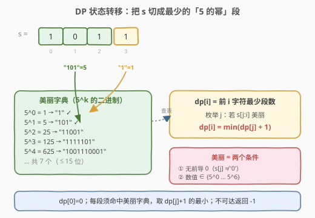
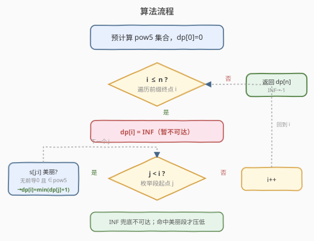
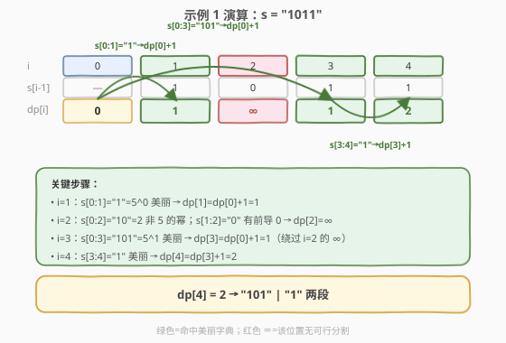

# 将字符串分割为最少的美丽子字符串

- **题目名称**：将字符串分割为最少的美丽子字符串
- **链接**：[2767. 将字符串分割为最少的美丽子字符串](https://leetcode.cn/problems/partition-string-into-minimum-beautiful-substrings/)
- **难度**：中等
- **标签**：字符串、动态规划

## 1. 题目概述

给你一个二进制字符串 `s`，你需要将字符串分割成一个或多个**子字符串**，使每个子字符串都是**美丽**的。

一个字符串是**美丽**的，当且仅当：

- 它**不包含前导 0**；
- 它是 `5` 的幂的**二进制**表示。

返回分割后的子字符串的**最少**数目。若无法分割，返回 `-1`。

**示例 1**：

```text
输入：s = "1011"
输出：2
解释：分成 ["101", "1"]。"101"=5=5^1，"1"=1=5^0，均无前导 0。
```

**示例 2**：

```text
输入：s = "111"
输出：3
解释：分成 ["1","1","1"]，每段都是 5^0=1 的二进制。
```

**示例 3**：

```text
输入：s = "0"
输出：-1
解释："0" 有前导 0 且 0 不是 5 的幂，无法分割。
```

**约束条件**：

- `1 <= s.length <= 15`
- `s[i]` 是 `'0'` 或 `'1'`

> 💡 这是一道**字符串分割 DP**，与 [132. 分割回文串 II](../0101-0200/132_分割回文串II.md)、[139. 单词拆分](../0101-0200/139_单词拆分.md)、[2707. 字符串中的额外字符](../2701-2800/2707_字符串中的额外字符.md) 同属一个范式：枚举「最后一段」是否合法，取最小。本题把「合法」换成「无前导 0 且是 5 的幂的二进制」。

---

## 2. 解题思路

### 2.1 暴力思路：枚举所有分割方案

长度为 $n$ 的字符串有 $n-1$ 个间隙，每个间隙切或不切，共 $2^{n-1}$ 种方案。逐一验证每段是否美丽并记录段数最小值。本题 $n \le 15$，$2^{14}=16384$ 种方案，暴力递归其实也能过，但这是指数级，思路不够通用——若 $n$ 变大就立刻失效。瓶颈在于「剩余后缀怎么切」被反复重算，存在大量重叠子问题。

### 2.2 核心观察：一维分割 DP + 5 的幂字典



定义 `dp[i]` 为**前 `i` 个字符（`s[0..i-1]`）分割成全美丽段的最少段数**。对每个终点 `i`，枚举最后一段的起点 `j`：若 `s[j..i-1]` 美丽，则这一段独立成最后一段，`dp[i] = dp[j] + 1`；取所有可行 `j` 的最小。

$$dp[i] = \min_{\substack{0 \le j < i \\ s[j{:}i]\ \text{美丽}}} \big(dp[j] + 1\big)$$

边界 `dp[0] = 0`（空前缀 0 段），答案为 `dp[n]`，若仍为「不可达」则返回 `-1`。

**「美丽」如何判定？** 题目给了两个条件，缺一不可：

1. **无前导 0**：`s[j] != '0'`。这条必须单独检查——因为 `int("01", 2) == 1` 会和 `5^0=1` 撞上，把 `"01"` 误判成美丽。
2. **数值是 5 的幂**：把 `s[j:i]` 当二进制求值，查是否在「5 的幂集合」里。

> ⚠️ **关键陷阱**：5 的幂的二进制表示**不含前导 0**（`5^0=1` 写作 `"1"`，`5^1=5` 写作 `"101"`……），所以你既可以「先查前导 0、再查数值」，也可以**直接把 7 个美丽串当字符串字典**做集合匹配——后者天然规避前导 0 问题（`"01" != "1"`）。详见第 5 节。

**字典有多小？** 因为 $s.length \le 15$，一段的最大值是 $2^{15}-1=32767$。5 的幂序列 $5^0, 5^1, \dots$ 中不超过 32767 的只有：

| $k$ | $5^k$ | 二进制 | 位数 |
|-----|-------|--------|------|
| 0 | 1 | `1` | 1 |
| 1 | 5 | `101` | 3 |
| 2 | 25 | `11001` | 5 |
| 3 | 125 | `1111101` | 7 |
| 4 | 625 | `1001110001` | 10 |
| 5 | 3125 | `110000110101` | 12 |
| 6 | 15625 | `11110100001001` | 14 |

> 💡 $5^7=78125$ 已超 $2^{15}-1$，故美丽字典**只有 7 个元素**——这道题本质是在一个**只有 7 个词的固定字典**上做「最少段数」分割。规模极小，朴素 $O(n^2)$ DP 即可。

### 2.3 算法流程图



### 2.4 示例演算



以**示例 1**（`s = "1011"`）为例，`pow5 = {1,5,25,125,625,3125,15625}`，`dp` 表如下（绿色=命中美丽字典，红色 ∞=不可达）：

| i | s[i-1] | 枚举 j 的尝试 | dp[i] |
|---|--------|---------------|-------|
| 0 | — | — | 0 |
| 1 | 1 | j=0：s[0:1]="1"=1∈pow5 → dp[0]+1 | **1** |
| 2 | 0 | j=0："10"=2∉pow5；j=1：s[1]='0' 前导 0 跳过 | **∞** |
| 3 | 1 | j=0："101"=5∈pow5 → dp[0]+1=1（最优） | **1** |
| 4 | 1 | j=0："1011"=11∉；j=2："11"=3∉；j=3："1"=1∈→dp[3]+1=2 | **2** |

- **i=1**：`"1"` 美丽，`dp[1]=dp[0]+1=1`。
- **i=2**：`"10"=2` 不是 5 的幂，`"0"` 有前导 0，`dp[2]=∞`（前缀 `"10"` 无法分割）。
- **i=3**：`"101"=5` 美丽 → `dp[3]=dp[0]+1=1`，**绕过了** `dp[2]=∞` 的死胡同（最后一段直接从 0 切到 3）。
- **i=4**：`"1"` 美丽 → `dp[4]=dp[3]+1=2`。

答案 = `dp[4] = 2`，对应分割 `"101" | "1"`。✓

> 💡 **为何 `i=2` 的 ∞ 不影响 `dp[3]`？** 分割 DP 的转移只看「最后一段 `s[j:i]`」和「前缀 `dp[j]`」。`dp[3]` 可取 `j=0`，让 `s[0:3]="101"` 整段做最后一段，前缀就是 `dp[0]=0`，与 `dp[2]` 无关。这正是「枚举最后一段」的力量——不必保证前缀每个位置都可分，只要存在某个可分的切点即可。

---

## 3. 参考代码

### C++

```cpp
class Solution {
public:
    int minimumBeautifulSubstrings(string s) {
        int n = s.size();
        // 5 的幂：s.length<=15，最大 2^15-1=32767，5^0..5^6 共 7 个
        unordered_set<int> pow5;
        for (long long p = 1; p < (1 << 15); p *= 5) pow5.insert(p);

        vector<int> dp(n + 1, INT_MAX);
        dp[0] = 0;                              // 空前缀：0 段
        for (int i = 1; i <= n; i++) {
            for (int j = 0; j < i; j++) {
                if (s[j] == '0') continue;      // 条件 1：无前导 0
                int val = 0;
                for (int k = j; k < i; k++)     // 求二进制数值
                    val = (val << 1) | (s[k] - '0');
                if (pow5.count(val) && dp[j] != INT_MAX)  // 是 5 的幂且前缀可达（防 INF+1 溢出）
                    dp[i] = min(dp[i], dp[j] + 1);
            }
        }
        return dp[n] == INT_MAX ? -1 : dp[n];
    }
};
```

### Python

```python
class Solution:
    def minimumBeautifulSubstrings(self, s: str) -> int:
        n = len(s)
        pow5 = set()
        p = 1
        while p < (1 << 15):
            pow5.add(p)
            p *= 5

        dp = [float('inf')] * (n + 1)
        dp[0] = 0
        for i in range(1, n + 1):
            for j in range(i):
                if s[j] == '0':                  # 条件 1：无前导 0
                    continue
                if int(s[j:i], 2) in pow5:      # 条件 2：是 5 的幂
                    dp[i] = min(dp[i], dp[j] + 1)
        return -1 if dp[n] == float('inf') else dp[n]
```

> ⚠️ **前导 0 的检查不可省**：`int("01", 2)` 在 Python 里等于 `1`，若不先 `s[j]=='0'` 跳过，会把 `"01"` 错判成 `5^0`。C++ 里同理——先把数值算出来再查集合，`"01"` 算出来也是 `1`。

---

## 4. 复杂度分析

| 维度 | 复杂度 | 说明 |
|------|--------|------|
| 时间复杂度 | $O(n^3)$ | $n$ 个位置，每个枚举 $j$ 共 $O(n^2)$ 次，每次求二进制值 $O(i-j)$；$n \le 15$，约 3000 次运算，可忽略 |
| 空间复杂度 | $O(n)$ | `dp` 数组 $O(n)$；`pow5` 集合固定 7 个元素，$O(1)$ |

> 💡 若把内层「求值」换成「逐位左移同时查集合」，或用下节字符串字典直接 `substr` 哈希，单次判定仍 $O(i-j)$，复杂度阶不变；$n=15$ 时无论哪种写法都瞬时通过。

---

## 5. 扩展：直接用「美丽串字典」做字符串匹配

数值法要单独处理前导 0，容易漏。更优雅的做法是**预先生成 7 个美丽串**作为字符串集合，直接判 `s[j:i]` 是否在其中——因为美丽串本身都不含前导 0，集合相等天然排除了 `"01"` 这类前导 0 串。

```cpp
class Solution {
public:
    int minimumBeautifulSubstrings(string s) {
        // 5^0..5^6 的二进制字符串（≤15 位，共 7 个）
        unordered_set<string> beaut = {
            "1", "101", "11001", "1111101",
            "1001110001", "110000110101", "11110100001001"
        };
        int n = s.size();
        vector<int> dp(n + 1, INT_MAX);
        dp[0] = 0;
        for (int i = 1; i <= n; i++) {
            for (int j = 0; j < i; j++) {
                if (beaut.count(s.substr(j, i - j)) && dp[j] != INT_MAX)   // 命中且前缀可达
                    dp[i] = min(dp[i], dp[j] + 1);
            }
        }
        return dp[n] == INT_MAX ? -1 : dp[n];
    }
};
```

> 💡 两种写法等价：数值法把「美丽」拆成两条规则分别判断；字符串字典法把 7 个合法串整体预计算，靠集合相等一次性判定。字典法更短、不易错，但依赖你**先把 7 个串列对**（注意 $5^5, 5^6$ 的二进制较长，易抄错，建议代码里用循环生成而非硬编码）。本题 $n$ 极小，二者性能无差别。

---

## 6. 面试要点

1. **这题属于哪一类 DP？状态怎么定义？**

   - 属于「**字符串分割 DP**」（最小段数/最小代价型），与 132/139/2707 同构。
   - `dp[i]` = 前 `i` 个字符分成全美丽段的**最少段数**；转移枚举最后一段起点 `j`，若 `s[j:i]` 美丽则 `dp[i] = min(dp[i], dp[j]+1)`；边界 `dp[0]=0`，不可达用 `INF` 表示。

2. **「美丽」的两个条件为什么要分开处理？**

   - 条件 1（无前导 0）和条件 2（5 的幂）**独立**。若只查数值，`int("01",2)=1` 会撞上 `5^0`，把 `"01"` 误判美丽。所以数值法必须**先判 `s[j]!='0'` 再查值**；或改用字符串字典，靠集合相等规避。面试时主动指出这个陷阱是加分项。

3. **为什么 $n \le 15$？这给了我们什么提示？**

   - $n$ 很小，5 的幂不超过 $2^{15}-1$，美丽字典只有 7 个元素，朴素 $O(n^2)$ 甚至 $O(n^3)$ 都能过。这暗示**不需要复杂优化**（如字典树、记忆化剪枝），把分割 DP 写对即可。出题人刻意把数据量压小，让重点落在「正确判定美丽 + DP 转移」。

4. **`dp[i] = INF`（不可达）会污染后续转移吗？**

   - 不会。转移里 `dp[i] = min(dp[i], dp[j]+1)`，若 `dp[j]` 是 `INF`，`INF+1` 仍是 `INF`（或用 `INT_MAX` 时需防溢出，故代码里只在 `dp[j]` 可达时才更新）。关键在于 `dp[i]` 可由**任意一个**可达的 `j` 推出，不必所有前缀都可分——见示例 `i=2` 的 ∅ 不影响 `i=3`。

5. **答案什么时候是 `-1`？**

   - 当 `dp[n]` 始终为 `INF`（没有任何切法让整串被美丽段覆盖完）时返回 `-1`。典型例子：`s = "0"`（前导 0 且非 5 的幂）；`s = "10"`（`"10"=2` 非 5 的幂，`"0"` 前导 0）。注意「全是 1」不一定无解，`"111"` 可拆成三个 `"1"`。

---

## 7. 同类练习题

- [132. 分割回文串 II](https://leetcode.cn/problems/palindrome-partitioning-ii/)（[题解](../0101-0200/132_分割回文串II.md)）：同为「字符串分割 DP 求最少段数/刀数」，把美丽判定换成回文判定
- [139. 单词拆分](https://leetcode.cn/problems/word-break/)（[题解](../0101-0200/139_单词拆分.md)）：分割 DP 的布尔版母题，把美丽字典换成给定单词字典
- [2707. 字符串中的额外字符](https://leetcode.cn/problems/extra-characters-in-a-string/)（[题解](../2701-2800/2707_字符串中的额外字符.md)）：分割 DP 求最少残余，结构同构、多一个「丢弃 +1」兜底分支
- [140. 单词拆分 II](https://leetcode.cn/problems/word-break-ii/)：在 139 基础上枚举所有分割方案，记忆化 DFS
- [231. 2 的幂](https://leetcode.cn/problems/power-of-two/)（[题解](../0201-0300/231_2的幂.md)）：单值「是不是某数的幂」判定，承接本题「5 的幂」判定的位运算技巧
