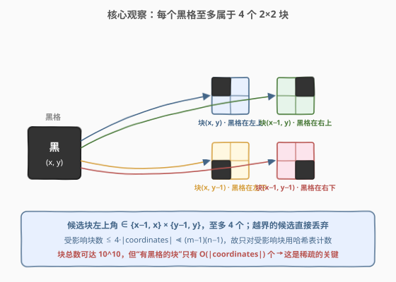
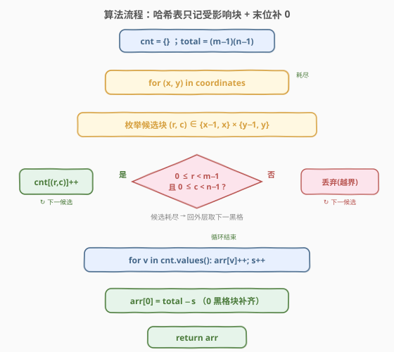
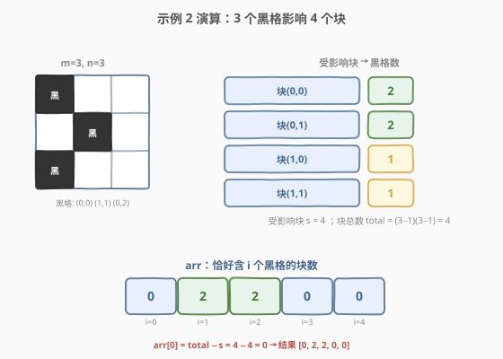

# LeetCode 黑格子的数目 题解

## 1. 题目概述

- **标题 / 题号**：黑格子的数目（#2768，medium）
- **链接**：https://leetcode.cn/problems/number-of-black-blocks/
- **难度**：中等
- **标签**：数组、哈希表、枚举

**题意**：给你两个整数 $m$ 和 $n$，表示一个下标从 **0** 开始的 $m \times n$ 网格图。再给你一个下标从 **0** 开始的二维整数矩阵 `coordinates`，其中 `coordinates[i] = [x, y]` 表示坐标为 $[x, y]$ 的格子是**黑色的**，所有未出现在 `coordinates` 中的格子都是**白色的**。

一个**块**定义为网格图中 $2 \times 2$ 的一个子矩阵。更正式地，对于左上角格子为 $[x, y]$ 的块（其中 $0 \le x < m - 1$ 且 $0 \le y < n - 1$），它包含坐标为 $[x, y]$、$[x+1, y]$、$[x, y+1]$、$[x+1, y+1]$ 的四个格子。

请你返回一个下标从 **0** 开始、长度为 $5$ 的整数数组 `arr`，其中 `arr[i]` 表示恰好包含 $i$ 个**黑色**格子的块的数量。

**示例 1**：

```text
输入：m = 3, n = 3, coordinates = [[0,0]]
输出：[3,1,0,0,0]
解释：网格图如下（仅左上角 [0,0] 为黑格）。
只有 1 个块有一个黑色格子，即左上角为 [0,0] 的块。
其余 3 个左上角分别为 [0,1]、[1,0]、[1,1] 的块都有 0 个黑格子。
因此返回 [3,1,0,0,0]。
```

**示例 2**：

```text
输入：m = 3, n = 3, coordinates = [[0,0],[1,1],[0,2]]
输出：[0,2,2,0,0]
解释：网格图如下（[0,0]、[1,1]、[0,2] 为黑格）。
有 2 个块含 2 个黑格（左上角分别为 [0,0] 和 [0,1]）。
左上角为 [1,0] 和 [1,1] 的两个块各含 1 个黑格。
因此返回 [0,2,2,0,0]。
```

**约束**：

- $2 \le m \le 10^5$
- $2 \le n \le 10^5$
- $0 \le \text{coordinates.length} \le 10^4$
- `coordinates[i].length == 2`
- $0 \le \text{coordinates}[i][0] < m$
- $0 \le \text{coordinates}[i][1] < n$
- `coordinates` 中的坐标对**两两互不相同**

> 💡 **关键张力**：网格规模 $m \times n$ 可达 $10^{10}$、块数 $(m-1)(n-1)$ 也约 $10^{10}$，**不可能**遍历所有格子或所有块。但黑格数 $|\text{coordinates}| \le 10^4$ 极小——**稀疏性**是破题的钥匙。

## 2. 解题思路

### 2.1 暴力思路：遍历所有块

最朴素的方案是遍历每一个块（共 $(m-1)(n-1)$ 个），对每个块数其 4 个格子中有几个黑格。但块数可达 $\sim 10^{10}$，且判定每个块需查黑格集合，总耗时 $O((m-1)(n-1))$ 起步，**直接超时**（即使 $O(1)$ 单块也要 $10^{10}$ 次）。

### 2.2 核心观察：每个黑格至多属于 4 个块，哈希表只记受影响块



换一个视角——不问“每个块里有几个黑格”，而问“**每个黑格影响了哪些块**”。一个黑格 $[x, y]$ 作为 $2 \times 2$ 块的某个角落，最多被 4 个块覆盖，这些块的左上角坐标恰为 $\{x-1, x\} \times \{y-1, y\}$（共 4 个组合，越界的丢弃）：

| 黑格在块中的位置 | 块左上角 |
|------|------|
| 左上角 | $(x, y)$ |
| 右上角 | $(x-1, y)$ |
| 左下角 | $(x, y-1)$ |
| 右下角 | $(x-1, y-1)$ |

于是：

- 用一张**哈希表** `cnt`，键为块左上角坐标，值为该块的黑格数。
- 对每个黑格，把它对应的至多 4 个候选块在 `cnt` 中 `++`。
- 处理完所有黑格后，`cnt` 里只含**有黑格的块**——其条目数 $\le 4 \cdot |\text{coordinates}|$，与网格规模无关。

> ⚠️ **为什么 arr 要用 `long long`/不限大小？** 块总数 $(m-1)(n-1)$ 可达约 $10^{10}$，超过 32 位 int 上界（$\approx 2.1 \times 10^9$）。`arr[0]`（0 个黑格的块数）= 块总数 − 受影响块数，必然可能 $> 2^{31}$，故返回类型是 64 位整数。

### 2.3 算法流程图



1. 初始化 `cnt = {}`，`total = (m-1)(n-1)`。
2. 遍历每个黑格 $(x, y)$；枚举 4 个候选块左上角 $(r, c) \in \{x-1, x\} \times \{y-1, y\}$。
3. 越界（$r<0$ 或 $r \ge m-1$ 或 $c<0$ 或 $c \ge n-1$）的候选直接丢弃；合法的 `cnt[(r,c)]++`。
4. 黑格全部处理完后，遍历 `cnt` 的值统计 `arr[1..4]`，并记录受影响块数 $s$。
5. `arr[0] = total - s`（**用总数补齐未触达的“全白块”**），返回 `arr`。

> 💡 **补 0 的精髓**：哈希表永远只存“≥1 黑格的块”，其余 $(m-1)(n-1) - s$ 个块全是 0 黑格——一次性用减法补齐，无需在哈希表里为它们建条目。这正是稀疏场景的标准套路。

### 2.4 示例演算



以示例 2 `m=3, n=3, coordinates=[[0,0],[1,1],[0,2]]` 为例，块总数 $total = (3-1)(3-1) = 4$：

| 块左上角 | 包含的 4 格 | 命中的黑格 | 黑格数 |
|:---:|:---|:---|:---:|
| $(0,0)$ | $(0,0),(1,0),(0,1),(1,1)$ | $(0,0),(1,1)$ | 2 |
| $(0,1)$ | $(0,1),(1,1),(0,2),(1,2)$ | $(1,1),(0,2)$ | 2 |
| $(1,0)$ | $(1,0),(2,0),(1,1),(2,1)$ | $(1,1)$ | 1 |
| $(1,1)$ | $(1,1),(2,1),(1,2),(2,2)$ | $(1,1)$ | 1 |

受影响块 $s = 4$（恰好等于块总数），于是 `arr[0] = 4 - 4 = 0`，`arr[1] = 2`，`arr[2] = 2`，`arr[3]=arr[4]=0` → `[0,2,2,0,0]`，与示例一致。

> 💡 注意黑格 $(1,1)$ 同时命中 4 个块——它是“中心格”，每个候选块都合法，故 4 个块各 `+1`；而角格 $(0,0)$ 只命中 1 个块。

## 3. 参考代码

### C++

```cpp
class Solution {
public:
    vector<long long> countBlackBlocks(int m, int n, vector<vector<int>>& coordinates) {
        unordered_map<long long, int> cnt;
        auto key = [&](int r, int c) {
            return (long long)r * n + c;
        };
        for (auto& co : coordinates) {
            int x = co[0], y = co[1];
            for (int r = x - 1; r <= x; ++r) {
                for (int c = y - 1; c <= y; ++c) {
                    if (r >= 0 && r < m - 1 && c >= 0 && c < n - 1) {
                        cnt[key(r, c)]++;
                    }
                }
            }
        }
        vector<long long> arr(5, 0);
        long long total = (long long)(m - 1) * (n - 1);
        long long ones = 0;
        for (auto& [k, v] : cnt) {
            arr[v]++;
            ++ones;
        }
        arr[0] = total - ones;
        return arr;
    }
};
```

### Python

```python
class Solution:
    def countBlackBlocks(self, m: int, n: int, coordinates: List[List[int]]) -> List[int]:
        from collections import defaultdict
        cnt = defaultdict(int)
        for x, y in coordinates:
            for r in (x - 1, x):
                for c in (y - 1, y):
                    if 0 <= r < m - 1 and 0 <= c < n - 1:
                        cnt[(r, c)] += 1
        arr = [0] * 5
        total = (m - 1) * (n - 1)
        ones = 0
        for v in cnt.values():
            arr[v] += 1
            ones += 1
        arr[0] = total - ones
        return arr
```

> 💡 **键的编码**：C++ 中 `unordered_map` 不能直接以 `pair<int,int>` 为键（需自定义 hash），这里把二维坐标压成一个 `long long`：`r * n + c`（`n` 是列数，保证双射）。Python 直接用元组 `(r, c)` 作键即可。

## 4. 复杂度分析

| 维度 | 复杂度 | 说明 |
|------|--------|------|
| 时间复杂度 | $O(\lvert\text{coordinates}\rvert)$ | 每个黑格枚举至多 4 个候选块，哈希操作均摊 $O(1)$；遍历 `cnt` 的时间 $\le 4\lvert\text{coordinates}\rvert$，故总体与黑格数线性、与 $m,n$ 无关 |
| 空间复杂度 | $O(\lvert\text{coordinates}\rvert)$ | 哈希表至多存 $4\lvert\text{coordinates}\rvert$ 个受影响块 |

> 💡 复杂度由**稀疏量** $|\text{coordinates}| \le 10^4$ 决定，而非网格规模 $10^{10}$——这正是“稀疏 + 哈希”相对“稠密 + 前缀和”的胜利。若黑格数与 $mn$ 同阶（稠密），此法退化为 $O(mn)$，不再有优势。

## 5. 扩展：稠密网格下的二维前缀和

当黑格**稠密**（如黑格数与 $mn$ 同阶、且 $m, n$ 较小，例如 $m, n \le 10^3$）时，哈希表的常数开销与“补 0”的优势消失，更合适的是**二维前缀和**：

1. 建立 $m \times n$ 的 0/1 矩阵 `a`（黑格为 1）。
2. 预处理二维前缀和 `S`，使得 $S[i][j] = \sum_{p \le i, q \le j} a[p][q]$。
3. 每个块左上角 $(x, y)$ 的黑格数 = $S[x+1][y+1] - S[x-1][y+1] - S[x+1][y-1] + S[x-1][y-1]$（容斥，$O(1)$ 查询）。
4. 遍历所有 $(m-1)(n-1)$ 个块，按黑格数分桶计数。

预处理 $O(mn)$、查询 $O((m-1)(n-1)) = O(mn)$，总 $O(mn)$。当 $mn \le 10^6$ 时高效，但 $mn = 10^{10}$ 时不可行——所以本题只能走稀疏哈希路线。

> ⚠️ 选型判据：**有效信息密度**。若“有意义的点”占比极低（稀疏），用哈希只记触达项；若接近满图（稠密），用前缀和批量预处理。两法互补，按数据形态选其一。

## 6. 面试要点

1. **为什么不能直接遍历所有块？**

   > 块数 $(m-1)(n-1)$ 可达约 $10^{10}$，即便每块 $O(1)$ 判定也远超时限。必须利用“黑格极少（$\le 10^4$）”的稀疏性，把复杂度从“块数”降到“黑格数”。

2. **为什么是“每个黑格 → 4 个块”而不是别的数量？**

   > 一个格子作为 $2 \times 2$ 块的某个角落，可处于 4 种位置（左上/右上/左下/右下），分别对应 4 个不同块，其左上角恰为 $\{x-1,x\} \times \{y-1,y\}$。边界处部分候选越界被丢弃，故“至多 4 个”。

3. **`arr[0]` 怎么来的？为什么要用 64 位？**

   > 哈希表只存有黑格的块，其余全是 0 黑格。`arr[0] = total - ones`，其中 `total = (m-1)(n-1)`、`ones` 为哈希表条目数。`total` 可达 $10^{10} > 2^{31}$，故返回类型为 64 位整数，C++ 用 `vector<long long>`。

4. **C++ 中哈希表的键为什么不用 `pair`？**

   > `unordered_map<pair<int,int>, ...>` 需自定义哈希函数，较繁琐。把坐标压成 `long long`（`r * n + c`）后用内置哈希，简洁且高效。注意用 `n`（列数）做乘子保证双射；用 `m` 则在矩形非方阵时也可，只要统一即可。

5. **坐标会重复吗？候选块会重复计数吗？**

   > 题目保证 `coordinates` 两两不同，故同一黑格不会处理两次。但**不同黑格可能命中同一块**（如示例 2 中块 $(0,0)$ 被黑格 $(0,0)$ 和 $(1,1)$ 各命中一次），这正是 `cnt` 值可能为 2/3/4 的来源——`++` 自然累加，正确反映该块的黑格数。

## 同类练习题

| # | 题目 | 与本题的关联 |
|---|------|-------------|
| 2257 | [统计网格图中未被保卫的格子数](https://leetcode.cn/problems/count-unguarded-cells-in-the-grid/) | 稀疏网格上放守卫/墙，统计未被覆盖的格子——同为“网格稀疏点 + 计数”，体会稠密模拟与稀疏处理的取舍 |
| 3070 | [元素和小于等于 k 的子矩阵数目](https://leetcode.cn/problems/count-submatrices-with-top-left-element-and-sum-less-than-k/) | 稠密小网格用二维前缀和 $O(1)$ 查询子矩阵和，与本题的“稀疏哈希”形成对偶选型 |
| 1277 | [统计全为 1 的正方形子矩阵](https://leetcode.cn/problems/count-square-submatrices-with-all-ones/) | DP 计数各类子矩阵，承接“按子矩阵特征分桶计数”的思路 |
| 454 | [四数相加 II](https://leetcode.cn/problems/4sum-ii/) | 分组 + 哈希计数，体现“贡献法 + 哈希只记触达项”的通用范式 |
| 149 | [直线上最多的点数](https://leetcode.cn/problems/max-points-on-a-line/) | 用 GCD 化简的分数作哈希键，与本题“坐标编码为哈希键”同属“计算键 + 哈希聚合”套路 |
