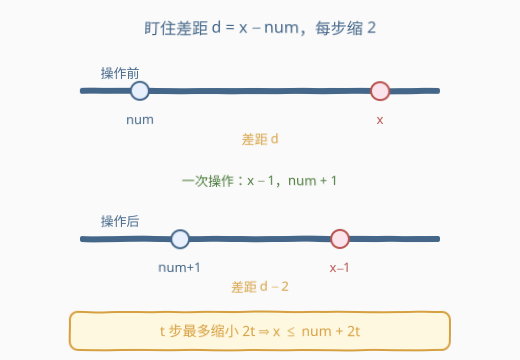
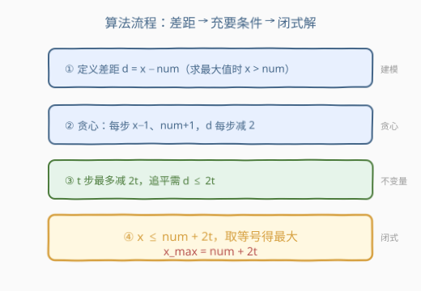
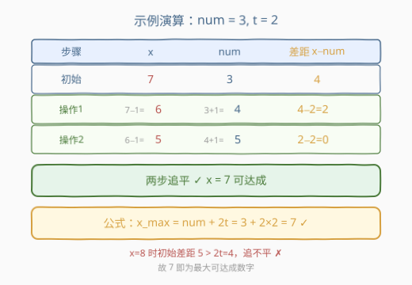

# LeetCode 找出最大的可达成数字 题解

## 1. 题目概述

- **标题 / 题号**：找出最大的可达成数字（#2769，easy）
- **链接**：https://leetcode.cn/problems/find-the-maximum-achievable-number/
- **难度**：简单
- **标签**：数学

**题意**：给你两个整数 `num` 和 `t`。如果整数 `x` 可以在执行下述操作**不超过 `t` 次**的情况下变为与 `num` 相等，则称其为**可达成数字**：

- 每次操作将 `x` 的值增加或减少 `1`，**同时**将 `num` 的值增加或减少 `1`。

返回所有可达成数字中的**最大**值 `x`。

**示例 1**：

```text
输入：num = 4, t = 1
输出：6
解释：最大可达成数字减少 1，同时 num 增加 1，一次操作后两者都变为 5。
```

**示例 2**：

```text
输入：num = 3, t = 2
输出：7
解释：两次「x 减 1、num 加 1」后两者都变为 5。
```

**约束**：

- `1 <= num, t <= 50`

## 2. 解题思路

### 2.1 暴力思路：枚举 x

`t` 和 `num` 都不超过 50，最大答案不超过 $50 + 2 \times 50 = 150$。可以**从大到小枚举 `x`**，对每个 `x` 检查「能否在 `t` 步内追平」——每次操作贪心地选「`x` 朝 `num` 走、`num` 朝 `x` 走」，看 `t` 步内差距能否归零。这种枚举 $O(\text{ans} \cdot t)$ 完全可行，但完全没用到数学结构。

### 2.2 核心观察：每次操作让「差距」缩小 2



关键在于盯住**差距** $d = x - \text{num}$（设 $x > \text{num}$，求最大值时必然如此）。一次操作里 `x` 和 `num` **同时**各动 1：

- 选「`x` 减 1、`num` 加 1」：$d$ 变为 $(x-1) - (\text{num}+1) = d - 2$；
- 选「`x` 加 1、`num` 减 1」：$d$ 变为 $d + 2$（背离，不会用来收敛）；
- 两个同向动：$d$ **不变**。

要**最快追平**，每一步都让 $d$ 减 2。因此 `t` 步内差距最多能缩小 $2t$。`x` 可达成的充要条件是初始差距能被 `t` 步消掉：

$$x - \text{num} \le 2t \quad\Longleftrightarrow\quad x \le \text{num} + 2t.$$

于是**最大可达成数字**就是上界本身：

$$\boxed{\;x_{\max} = \text{num} + 2t\;}$$

> 💡 一句话：每步把差距减 2，`t` 步最多减 $2t$，所以 $x$ 最多比 `num` 大 $2t$。

### 2.3 算法流程图



### 2.4 示例演算

以 `num = 3, t = 2` 为例，套公式 $x_{\max} = 3 + 2 \times 2 = 7$，逐步验证：



| 步骤 | x | num | 差距 x − num |
|------|---|-----|-------------|
| 初始 | 7 | 3 | 4 |
| 操作 1（x−1, num+1） | 6 | 4 | 2 |
| 操作 2（x−1, num+1） | 5 | 5 | 0 ✓ |

两步恰好追平，$7$ 可达成；而 $8$ 初始差距 $5 > 2t = 4$，无论怎么走都追不平，故最大值确为 $7$。✅

## 3. 参考代码

### C++

```cpp
// 数学 O(1)
class Solution {
public:
    int theMaximumAchievableX(int num, int t) {
        return num + 2 * t;
    }
};
```

### Python

```python
class Solution:
    def theMaximumAchievableX(self, num: int, t: int) -> int:
        return num + 2 * t
```

## 4. 复杂度分析

| 维度 | 复杂度 | 说明 |
|------|--------|------|
| 时间复杂度 | $O(1)$ | 一次乘加 |
| 空间复杂度 | $O(1)$ | 仅用常数变量 |

## 5. 扩展：为什么「同时动」是关键

本题的精髓在于 `x` 和 `num` **同步**变化。若改成「每次只能动 `x`」（`num` 不变），则一步只能把差距减 1，最大 `x = num + t`；正因为 `num` 也跟着动，一步能减 2，答案才翻倍为 `num + 2t`。这揭示了**耦合变量**对收敛速度的放大效应——建模时盯住「差距」这一不变量，比盯单个变量更本质。

## 6. 面试要点

1. **为什么每步选「x 减 1、num 加 1」而不是其他组合？**
   - 目标是缩小差距 $d = x - \text{num}$。该组合让 $d$ 减 2，是所有四种操作里缩减最快的；同向动不改变 $d$，反向动反而增大 $d$。

2. **`x < num` 的情况需要考虑吗？**
   - 不需要。题目求**最大** `x`，答案必然 $x \ge \text{num}$（取 $t=0$ 时 $x=\text{num}$ 即可达），故只需分析 $x > \text{num}$ 的方向。

3. **公式 `num + 2t` 会越界吗？**
   - 本题约束 `num, t ≤ 50`，结果最大 $150$，远在 `int` 范围内；即便约束放大到 $10^9$，`2t` 也不溢出 `int64`。

4. **如何快速判断某个 `x` 是否可达？**
   - 直接看 $x - \text{num} \le 2t$ 是否成立，等价于 $x \le \text{num} + 2t$，$O(1)$ 判定。

5. **本题属于哪类套路？**
   - 「**操作最优化 → 求不变量每步最大变化 → 建立充要条件**」的数学题，与 Nim 游戏、阶乘尾零这类「过程抽象成闭式解」一脉相承。

## 同类练习题

| # | 题目 | 与本题的关联 |
|---|------|-------------|
| 292 | [Nim 游戏](https://leetcode.cn/problems/nim-game/) | 博弈过程 → $n \bmod 4 \ne 0$ 一行公式，同为「操作最优化抽象成充要条件」。 |
| 172 | [阶乘后的零](https://leetcode.cn/problems/factorial-trailing-zeroes/) | 逐个乘 → $O(\log n)$ 勒让德公式，数学化简找闭式解。 |
| 258 | [各位相加](https://leetcode.cn/problems/add-digits/) | 逐位模拟 → $O(1)$ 数根公式，模拟找规律后化简。 |
| 2739 | [总行驶距离](https://leetcode.cn/problems/total-distance-traveled/) | 「烧 5 回 1」一轮净消耗 4 → 闭式距离公式，同为盯住净变化建模。 |
