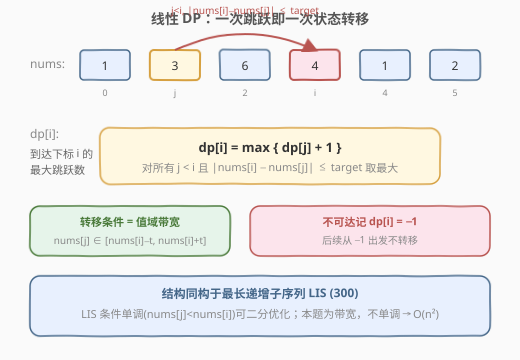
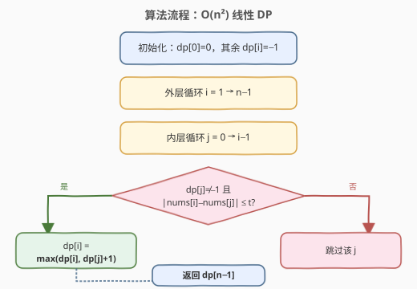
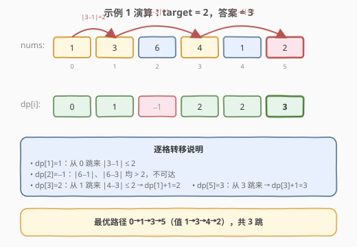

# 达到末尾下标所需的最大跳跃次数

- **题目名称**：达到末尾下标所需的最大跳跃次数
- **链接**：[2770. 达到末尾下标所需的最大跳跃次数](https://leetcode.cn/problems/maximum-number-of-jumps-to-reach-the-last-index/)
- **难度**：中等
- **标签**：数组、动态规划

## 1. 题目概述

给你一个下标从 0 开始、由 $n$ 个整数组成的数组 `nums` 和一个整数 `target`。

初始位置在下标 0。在一步操作中，你可以从下标 $i$ 跳跃到任意满足下述条件的下标 $j$：

- $0 \le i < j < n$
- $-target \le nums[j] - nums[i] \le target$

返回到达下标 $n - 1$ 处所需的 **最大跳跃次数**。如果无法到达下标 $n - 1$，返回 $-1$。

**示例 1**：

```text
输入：nums = [1,3,6,4,1,2], target = 2
输出：3
解释：从 0 到 n-1 的最长跳跃序列为 0 → 1 → 3 → 5（值 1→3→4→2），共 3 跳。
```

**示例 2**：

```text
输入：nums = [1,3,6,4,1,2], target = 3
输出：5
解释：target 放宽后可逐格跳跃 0→1→2→3→4→5，共 5 跳（即 n-1）。
```

**示例 3**：

```text
输入：nums = [1,3,6,4,1,2], target = 0
输出：-1
解释：target=0 要求相邻值相等，本例不存在这样的跳跃序列。
```

**约束条件**：

- $2 \le nums.length = n \le 1000$
- $-10^9 \le nums[i] \le 10^9$
- $0 \le target \le 2 \times 10^9$

---

## 2. 解题思路

### 2.1 暴力思路

枚举所有跳跃序列：从 0 出发每一步可跳到任意右侧满足条件的点，方案数最坏为指数级，朴素 DFS 会爆。需要找到**具有最优子结构**的刻画方式，用 DP 求解。

### 2.2 核心观察：线性 DP，与 LIS 同构



> 💡 **关键观察一**：跳跃必须严格向右（$i < j$），因此**不存在环**，整个跳跃关系是一张有向无环图（DAG）。求"最大跳跃次数"等价于求 DAG 上的 **最长路径**，天然适用 DP。

设 $dp[i]$ 为到达下标 $i$ 的最大跳跃次数，转移方程：

$$
dp[i] = \max_{\substack{j < i \\ |nums[i] - nums[j]| \le target \\ dp[j] \ne -1}} \{ dp[j] + 1 \}
$$

不可达的点记 $dp[i] = -1$，且不作为后续转移的来源（$dp[j] = -1$ 时跳过）。

> 💡 **关键观察二**：该结构与 **最长递增子序列 LIS（300）** 完全同构——都是 $dp[i] = \max(dp[j]+1)$ 的"最长链"DP。差异在转移条件：
> - LIS 条件 $nums[j] < nums[i]$ 关于值**单调**，可用"各长度最小尾元素"二分优化到 $O(n \log n)$；
> - 本题条件 $|nums[i]-nums[j]| \le target$ 是**值域带宽**，关于下标不单调，贪心尾元素失效 → 只能朴素 $O(n^2)$（或上权值树，见第 5 节）。

### 2.3 算法流程图



### 2.4 示例演算



以示例 1 `nums = [1,3,6,4,1,2], target = 2` 为例：

1. $dp[0] = 0$（起点，0 跳）；
2. $dp[1] = 1$：从 0 跳来，$|3-1|=2 \le 2$，$dp[0]+1=1$；
3. $dp[2] = -1$：$|6-1|=5$、$|6-3|=3$ 均 $> 2$，不可达；
4. $dp[3] = 2$：从 1 跳来，$|4-3|=1 \le 2$，$dp[1]+1=2$；
5. $dp[4] = 2$：从 0 或 1 跳来，最大 $dp[1]+1=2$；
6. $dp[5] = 3$：从 3 跳来，$|2-4|=2 \le 2$，$dp[3]+1=3$。

最优路径 $0 \to 1 \to 3 \to 5$，答案 $dp[5] = 3$。

---

## 3. 参考代码

### C++

```cpp
class Solution {
  public:
    int maximumJumps(vector<int>& nums, int target) {
        int n = nums.size();
        vector<int> dp(n, -1);
        dp[0] = 0;
        for (int i = 1; i < n; i++) {
            for (int j = 0; j < i; j++) {
                if (dp[j] != -1 &&
                    abs((long long)nums[i] - nums[j]) <= target) {
                    dp[i] = max(dp[i], dp[j] + 1);
                }
            }
        }
        return dp[n - 1];
    }
};
```

### Python

```python
class Solution:
    def maximumJumps(self, nums: List[int], target: int) -> int:
        n = len(nums)
        dp = [-1] * n
        dp[0] = 0
        for i in range(1, n):
            for j in range(i):
                if dp[j] != -1 and abs(nums[i] - nums[j]) <= target:
                    dp[i] = max(dp[i], dp[j] + 1)
        return dp[-1]
```

---

## 4. 复杂度分析

| 维度 | 复杂度 | 说明 |
|------|--------|------|
| 时间复杂度 | $O(n^2)$ | 双重循环枚举所有 $(i, j)$ 对（$j < i$），每对 $O(1)$ 判定带宽与转移 |
| 空间复杂度 | $O(n)$ | 一维 $dp$ 数组 |

$n \le 1000$ 时 $n^2 = 10^6$，远在时限内，朴素解法即为正解。

---

## 5. 扩展：权值数据结构优化到 $O(n \log n)$

本题转移可改述为：**对已处理且下标 $< i$ 的位置，在值域区间 $[nums[i]-target,\ nums[i]+target]$ 内取 $dp[j]$ 最大值再加 1**。若 $n$ 更大，可按 $nums$ 值离散化后建**权值线段树 / 树状数组**维护"区间最大值"：

- 每处理一个 $i$：先查询值域区间 $\max$（若存在则 $dp[i] = \text{mx} + 1$，否则 $-1$）；
- 再把 $dp[i]$ 以 $nums[i]$ 为键插入数据结构，供后续下标查询。

复杂度 $O(n \log n)$。本题 $n \le 1000$ 无需引入，朴素 $O(n^2)$ 更简洁、常数更小。

---

## 6. 面试要点

1. **为什么是求最长路径？为什么 DP 可行？**
   - 题目要"最大跳跃次数"；跳跃严格向右 $\Rightarrow$ 无环 $\Rightarrow$ DAG，最长路径具有最优子结构与无后效性，DP 可解。

2. **dp[i] 为什么存"最大"而非"最小"？到达同一节点的较短路径会丢机会吗？**
   - 会丢。在 DAG 上前驱更长则后续可更长，故必须存最大；这与最短路（存最小）恰好相反。

3. **不可达用 $-1$ 标记有何作用？**
   - $dp[j] = -1$ 时跳过该转移来源，阻止非法状态蔓延；最终 $dp[n-1] = -1$ 即输出答案。

4. **为什么不能像 LIS 那样二分优化到 $O(n \log n)$？**
   - LIS 条件单调（值升序），可用"各长度最小尾元素"贪心 + 二分；本题条件是带宽 $|nums[i]-nums[j]| \le target$，关于下标不单调，尾元素失效，只能 $O(n^2)$（或权值树，见第 5 节）。

5. **`abs` 会溢出吗？**
   - $nums[i] \in [-10^9, 10^9]$，差值 $\in [-2 \times 10^9,\ 2 \times 10^9]$，$abs$ 后 $\le 2 \times 10^9 < INT\text{\_}MAX$，本例安全；C++ 仍以 `(long long)` 强转规避边界未定义行为。

---

## 7. 同类练习题

- [300. 最长递增子序列](https://leetcode.cn/problems/longest-increasing-subsequence/)：本题的结构母题，$dp[i]=\max(dp[j]+1)$ 的"最长链"DP，单调条件可二分优化，与本题带宽条件形成对照
- [45. 跳跃游戏 II](https://leetcode.cn/problems/jump-game-ii/)：跳跃家族但求**最小**步数（贪心/DP），与本题求最大形成正反对照
- [1696. 跳跃游戏 VI](https://leetcode.cn/problems/jump-game-vi/)：跳跃 + 求最大和 DP，固定步长窗口用单调队列优化，对比本题值域带宽条件
- [1871. 跳跃游戏 VII](https://leetcode.cn/problems/jump-game-vii/)：跳跃条件为下标区间，可用差分/线段树优化，与本题值域区间条件互为参照
