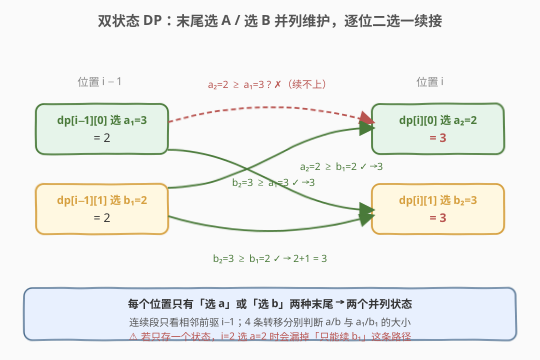
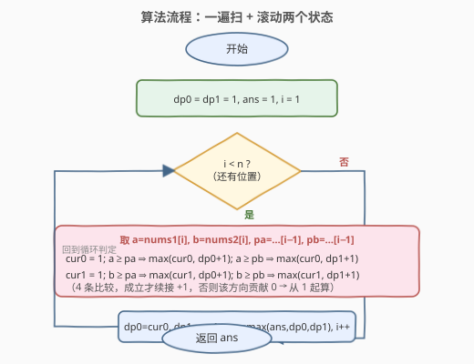
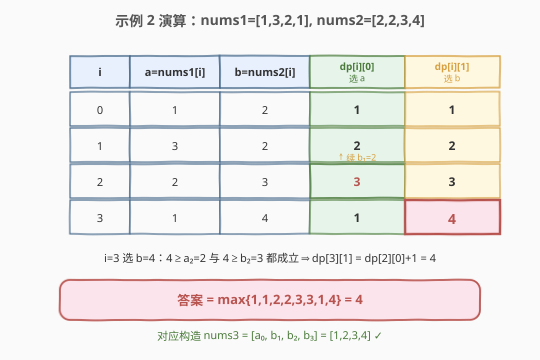

# LeetCode 构造最长非递减子数组 题解

## 1. 题目概述

- **标题 / 题号**：构造最长非递减子数组（#2771，medium）
- **链接**：https://leetcode.cn/problems/longest-non-decreasing-subarray-from-two-arrays/
- **难度**：中等
- **标签**：数组、动态规划

**题意**：给定两个下标从 **0** 开始、长度均为 `n` 的整数数组 `nums1` 和 `nums2`。定义新数组 `nums3`：对每个下标 `i`，你可以把 `nums1[i]` 或 `nums2[i]` 的值赋给 `nums3[i]`（即每个位置二选一）。

要求用**最优策略**为 `nums3` 赋值，使 `nums3` 中**最长非递减子数组**的长度最大，返回该长度。

> **非递减**：`nums3[i] <= nums3[i+1]`；**子数组**：连续非空元素序列。

**示例 1**：

```text
输入：nums1 = [2,3,1], nums2 = [1,2,1]
输出：2
解释：取 nums3 = [nums1[0], nums2[1], nums2[2]] = [2,2,1]
      下标 0→1 的 [2,2] 是长度为 2 的非递减子数组，2 为最大可达长度。
```

**示例 2**：

```text
输入：nums1 = [1,3,2,1], nums2 = [2,2,3,4]
输出：4
解释：取 nums3 = [nums1[0], nums2[1], nums2[2], nums2[3]] = [1,2,3,4]
      整个数组都是非递减的，长度 4。
```

**示例 3**：

```text
输入：nums1 = [1,1], nums2 = [2,2]
输出：2
解释：取 nums3 = [nums1[0], nums1[1]] = [1,1]，整个数组非递减。
```

**约束**：

- `1 <= n == nums1.length == nums2.length <= 10^5`
- `1 <= nums1[i], nums2[i] <= 10^9`

> 💡 这是一道**逐位构造型 DP**：每个位置有「选 A」或「选 B」两个决策，要求最终序列的「最长非递减连续段」最大化。它与 [674. 最长连续递增序列](https://leetcode.cn/problems/longest-continuous-increasing-subsequence/) 是同一个「以 i 结尾的最长长度」骨架——只是单数组变成了「双数组逐位二选一」，状态从一维扩成两个并列状态。

## 2. 解题思路

### 2.1 暴力思路：枚举所有构造方案

每个位置 `i` 有「取 `nums1[i]`」或「取 `nums2[i]`」两种选择，共 $2^n$ 种 `nums3` 构造方案。对每种方案再扫一遍求最长非递减子数组，总复杂度 $O(2^n \cdot n)$。当 $n=10^5$ 时完全不可行。瓶颈在于：**「前缀怎么选」和「末尾选了哪个值」之间存在大量重叠子问题**——只要「以 i 结尾、末尾值 = 某个具体数」的最长长度固定，后面怎么续接只看这个末尾值，与更早的历史无关。

### 2.2 核心观察：双状态 DP（末尾值只有两种可能）



关键观察：在**最优构造**下，位置 `i` 的末尾值**只可能是 `nums1[i]` 或 `nums2[i]` 之一**——不存在第三个候选。于是我们可以把「以 i 结尾的最长非递减子数组长度」按「末尾选了哪个」拆成两个并列状态：

- `dp[i][0]`：`nums3[i]` 取 `nums1[i]` 时，以 `i` 结尾的最长非递减子数组长度；
- `dp[i][1]`：`nums3[i]` 取 `nums2[i]` 时，以 `i` 结尾的最长非递减子数组长度。

每个状态从 `i-1` 的两个状态转移而来，只要「当前值 $\ge$ 上一个末尾值」就能续接 +1，否则该方向只能从 1 重新起算：

$$
\begin{aligned}
dp[i][0] &= 1 + \max\big(\, \mathbb{1}[a_i \ge a_{i-1}]\cdot dp[i\!-\!1][0],\ \ \mathbb{1}[a_i \ge b_{i-1}]\cdot dp[i\!-\!1][1] \,\big) \\
dp[i][1] &= 1 + \max\big(\, \mathbb{1}[b_i \ge a_{i-1}]\cdot dp[i\!-\!1][0],\ \ \mathbb{1}[b_i \ge b_{i-1}]\cdot dp[i\!-\!1][1] \,\big)
\end{aligned}
$$

其中 $a_i=\text{nums1}[i],\ b_i=\text{nums2}[i]$，$\mathbb{1}[\cdot]$ 在条件成立时取 1、否则取 0（即条件不成立时那条转移贡献为 0，`max(0, …)` 保证至少从 1 起算）。边界 `dp[0][0] = dp[0][1] = 1`（首元素必属某个非递减段，长度为 1）。答案为 $\max_{i, k} dp[i][k]$。

> 💡 **为什么只看 `i-1` 一个前驱？** 因为「非递减子数组」要求**连续**——以 `i` 结尾的连续段，前一位只能是 `i-1`。这与子序列型 DP（如 [300. LIS](https://leetcode.cn/problems/longest-increasing-subsequence/)，要枚举所有 `j<i`）的根本区别就在这里：**连续 → 只看相邻前驱；可断 → 枚举所有前驱**。所以本题只需 $O(n)$ 一遍扫。

> ⚠️ **常见坑：只维护「一个 dp」会丢解**。若贪心地只记 `dp[i] = 以 i 结尾的最长长度`，丢掉了「末尾到底选了 A 还是 B」这个信息，就无法正确判断 `i→i+1` 能否续接——因为 `i` 选 A 能续而选 B 不能（或反之）时，单状态会把「不该续的」也续上。**两个状态必须并列维护**，这正是本题相对 [674](https://leetcode.cn/problems/longest-continuous-increasing-subsequence/) 的唯一升级点。

### 2.3 算法流程图



### 2.4 示例演算



以**示例 2**（`nums1 = [1,3,2,1]`, `nums2 = [2,2,3,4]`）为例，逐位填两行 dp（绿色续接自 A 行，橙色续接自 B 行，加粗为该格最优值）：

| i | nums1[i]=a | nums2[i]=b | dp[i][0]（选 a） | dp[i][1]（选 b） |
|---|------------|------------|------------------|------------------|
| 0 | 1          | 2          | 1                | 1                |
| 1 | 3          | 2          | 3≥1→2；3≥2→2 ⇒ **2** | 2≥1→2；2≥2→2 ⇒ **2** |
| 2 | 2          | 3          | 2≥3✗；2≥2→3 ⇒ **3** | 3≥3→3；3≥2→3 ⇒ **3** |
| 3 | 1          | 4          | 1≥2✗；1≥3✗ ⇒ 1 | 4≥2→4；4≥3→4 ⇒ **4** |

- **i=1**：选 a=3，3≥a₀=1 取 dp[0][0]+1=2，3≥b₀=2 取 dp[0][1]+1=2，`dp[1][0]=2`；选 b=2 同理得 2。
- **i=2**：选 a=2，2≥a₁=3 不成立（✗），2≥b₁=2 成立 → `dp[1][1]+1=3`，`dp[2][0]=3`（**这条续接来自 B 行**，单状态会漏）；选 b=3，3≥a₁=3 与 3≥b₁=2 都成立 → 3。
- **i=3**：选 a=1 两个前驱都接不上，重新起算为 1；选 b=4，4≥a₂=2 → `dp[2][0]+1=4`，`dp[3][1]=4`。

答案 = $\max\{2,2,3,3,1,4\} = 4$，对应构造 `nums3 = [1,2,3,4]`（即 `[a₀, b₁, b₂, b₃]`）。✓

> 💡 注意 `i=2` 选 a=2 时只能续上 **B 行**（`dp[1][1]`），而非 A 行——这正是必须并列维护两个状态的原因：若只存一个 `dp[1]` 而不知末尾是 3(a) 还是 2(b)，就无法判断 `2 ≥ ?` 是否成立。

## 3. 参考代码

### C++

```cpp
class Solution {
public:
    int maxNonDecreasingLength(vector<int>& nums1, vector<int>& nums2) {
        int n = nums1.size();
        int dp0 = 1, dp1 = 1;          // dp[i-1][0], dp[i-1][1]
        int ans = 1;
        for (int i = 1; i < n; i++) {
            int a = nums1[i], b = nums2[i];
            int pa = nums1[i - 1], pb = nums2[i - 1];
            int cur0 = 1, cur1 = 1;    // 至少从本位起算 1
            if (a >= pa) cur0 = max(cur0, dp0 + 1);
            if (a >= pb) cur0 = max(cur0, dp1 + 1);
            if (b >= pa) cur1 = max(cur1, dp0 + 1);
            if (b >= pb) cur1 = max(cur1, dp1 + 1);
            dp0 = cur0;
            dp1 = cur1;
            ans = max(ans, max(dp0, dp1));
        }
        return ans;
    }
};
```

### Python

```python
class Solution:
    def maxNonDecreasingLength(self, nums1: List[int], nums2: List[int]) -> int:
        dp0 = dp1 = 1          # 以 i-1 结尾、末尾选 nums1 / nums2 的最长长度
        ans = 1
        for i in range(1, len(nums1)):
            a, b = nums1[i], nums2[i]
            pa, pb = nums1[i - 1], nums2[i - 1]
            cur0 = 1 + max((a >= pa) * dp0, (a >= pb) * dp1)
            cur1 = 1 + max((b >= pa) * dp0, (b >= pb) * dp1)
            dp0, dp1 = cur0, cur1
            ans = max(ans, dp0, dp1)
        return ans
```

> 💡 Python 版用 `(cond)` 是布尔值、在算术语境下 `True=1/False=0`，把「条件成立取 dp，不成立取 0」一行写完，等价于 C++ 里的 `if` 四连。`1 + max(...)` 自然保证条件全不成立时回到 1。

## 4. 复杂度分析

| 维度 | 复杂度 | 说明 |
|------|--------|------|
| 时间复杂度 | $O(n)$ | 一次遍历，每个位置做 4 次比较 + 2 次加法，均为 $O(1)$ |
| 空间复杂度 | $O(1)$ | 只用 `dp0/dp1/ans` 三个滚动变量；若保留整张表则为 $O(n)$ |

> 💡 「以 i 结尾的最长连续段」型 DP 的标志特征：**转移只依赖相邻前驱 i-1**，因此天然支持滚动数组降到 $O(1)$。这与 [53. 最大子数组和](https://leetcode.cn/problems/maximum-subarray/)（Kadane）、[674. 最长连续递增序列](https://leetcode.cn/problems/longest-continuous-increasing-subsequence/) 同构——凡是「连续段」就只看邻居，凡是「子序列」才需枚举所有前驱。

## 5. 扩展：滚动数组与「合并单数组」写法

**为什么能滚动到 $O(1)$？** 因为 `dp[i]` 只依赖 `dp[i-1]`，没有更远的回看。两个变量 `dp0/dp1` 滚动即可，无需整张 `dp` 表，这也是「连续段 DP」相对「子序列 DP」的空间优势（子序列型如 [300](https://leetcode.cn/problems/longest-increasing-subsequence/) 至少要 $O(n)$ 表，甚至需二分优化到 $O(n)$ 时间）。

**能否把两数组合成一个再 DP？** 有一个等价但更省心的视角：把每个位置的两个候选「合并」成一个「本位可能取的最小/最大值」近似处理是**错的**——例如 `a=3,b=2`，取最小 2 不一定最优（取 3 反而更容易被后位续接）。正确做法仍是显式维护两个状态。本扩展提示读者：**双数组二选一问题，不要贪心合并，要并列维护分支**。

## 6. 面试要点

1. **状态为什么是二维 `dp[i][0/1]` 而非一维 `dp[i]`？**

   - 因为「以 i 结尾能否续接到 i+1」取决于 `i` 末尾**具体取了哪个值**（a 还是 b）。单状态 `dp[i]` 丢失了末尾值信息，遇到「选 a 能续、选 b 不能续」时会误判。必须把「末尾选 A / 选 B」拆成两个并列状态，转移时分别判断 `a_{i+1} ≥ a_i`、`a_{i+1} ≥ b_i` 等四个条件。

2. **本题与 [674. 最长连续递增序列](https://leetcode.cn/problems/longest-continuous-increasing-subsequence/) 的关系？**

   - 674 是单数组「以 i 结尾的最长连续递增段」，状态 `dp[i] = dp[i-1]+1 if a[i]>a[i-1] else 1`。本题把单数组升级为「逐位二选一双数组」，状态从 1 个扩成 2 个并列、转移从 1 次比较扩成 4 次，但骨架完全一致：**以 i 结尾、只看 i-1、滚动到 $O(1)$**。

3. **为什么转移只看 `i-1`，不像 [300. LIS](https://leetcode.cn/problems/longest-increasing-subsequence/) 那样枚举所有 `j<i`？**

   - 关键在「**子数组 vs 子序列**」。子数组要求**连续**，以 i 结尾的连续段前一位必是 i-1，故只看一个前驱；子序列允许跳跃，以 i 结尾的递增子序列前驱可以是任意 `j<i`，故需枚举全部。这是判定「连续 DP 还是子序列 DP」的第一判据。

4. **边界和初值怎么设？为什么 `dp[0][0]=dp[0][1]=1`？**

   - 首元素无论选 a 还是 b，自身就是一个长度为 1 的非递减段。后续每位的 `cur0/cur1` 先置 1（本位单独成段），再用 4 个条件尝试 `+1` 续接，`max` 保证取更优。这样写天然兼容「前驱都接不上」的情况，无需特判 `i=0`。

5. **数据范围 $n \le 10^5$ 给了什么提示？**

   - 必须是 $O(n)$ 或 $O(n \log n)$，排除 $2^n$ 枚举和 $O(n^2)$ 子序列 DP。结合「只看相邻前驱」的连续性质，$O(n)$ 一遍扫 + $O(1)$ 滚动空间是标准解法，常数极小，实际跑飞快。

## 同类练习题

| # | 题目 | 与本题的关联 |
|---|------|-------------|
| 674 | [最长连续递增序列](https://leetcode.cn/problems/longest-continuous-increasing-subsequence/) | 本题的单数组原型，「以 i 结尾、只看 i-1」连续 DP 的母题，理解它再套双状态即可 |
| 53 | [最大子数组和](https://leetcode.cn/problems/maximum-subarray/) | Kadane 经典「以 i 结尾的最长/最大连续段」DP，同属只看相邻前驱的滚动范式 |
| 300 | [最长递增子序列](https://leetcode.cn/problems/longest-increasing-subsequence/) | 对比题，**子序列**型需枚举所有 `j<i`，凸显「连续 → 单前驱」与「可断 → 全前驱」的分野 |
| 1567 | [乘积为正数的最大子数组长度](https://leetcode.cn/problems/maximum-length-of-subarray-with-positive-product/) | 同为「以 i 结尾、两个并列状态（正/负）」的连续段 DP，状态并列维护的思路与本题的 A/B 双状态同构 |
| 2407 | [最长递增子序列 II](https://leetcode.cn/problems/longest-increasing-subsequence-ii/) | LIS 的线段树优化版，体会「子序列 DP 为何需 $O(n \log n)$」，与本题的 $O(n)$ 连续 DP 形成对照 |
