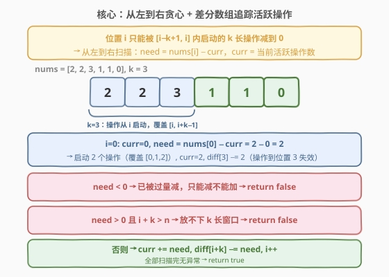
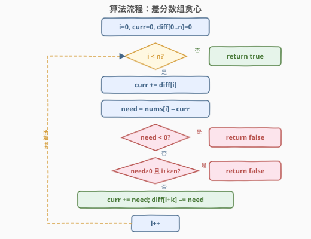
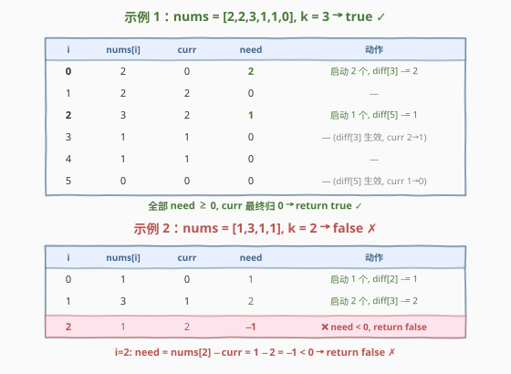

# 使数组中的所有元素都等于零

- **题目名称**：使数组中的所有元素都等于零
- **链接**：[2772. 使数组中的所有元素都等于零](https://leetcode.cn/problems/apply-operations-to-make-all-array-elements-equal-to-zero/)
- **难度**：中等
- **标签**：数组、前缀和、差分数组、贪心

## 1. 题目概述

给你一个下标从 **0** 开始的整数数组 `nums` 和一个正整数 `k`。你可以对数组执行下述操作 **任意次**：

- 从数组中选出长度为 `k` 的 **任意** 子数组，并将子数组中每个元素都 **减去** `1`。

如果你可以使数组中的所有元素都等于 `0`，返回 `true`；否则返回 `false`。子数组是数组中的一个非空连续元素序列。

**示例 1**：

```text
输入：nums = [2,2,3,1,1,0], k = 3
输出：true
解释：可以执行下述操作：
- 选出子数组 [2,2,3]，操作后 nums = [1,1,2,1,1,0]。
- 选出子数组 [2,1,1]，操作后 nums = [1,1,1,0,0,0]。
- 选出子数组 [1,1,1]，操作后 nums = [0,0,0,0,0,0]。
```

**示例 2**：

```text
输入：nums = [1,3,1,1], k = 2
输出：false
解释：无法使数组中的所有元素等于 0。
```

**约束条件**：

- $1 \le k \le \text{nums.length} \le 10^5$
- $0 \le \text{nums}[i] \le 10^6$

> 💡 本题的核心是**差分数组 + 从左到右贪心**。每个位置 `i` 的值只能被从 `[i−k+1, i]` 范围内启动的 `k` 长操作减到 0，因此必须从左到右逐位确定需要启动多少操作——这就是 [3355. 零数组变换 I](https://leetcode.cn/problems/zero-array-transformation-i/) 的姊妹题，二者同标 `Array, Prefix Sum`，思路完全一致；而贪心"逆推操作"的范式又承接 [1526. 形成目标数组的子数组最少增加次数](https://leetcode.cn/problems/minimum-number-of-increments-on-subarrays-to-form-a-target-array/)。

---

## 2. 解题思路

### 2.1 暴力思路：枚举操作

最直接的思路是暴力模拟：每次尝试所有可能的长度为 `k` 的子数组，减 1，递归搜索是否能全归零。但操作总数可达 $10^6 \times 10^5$ 量级，子数组选择又有指数级分支，完全不可行。

> ⚠️ 暴力的浪费在于：没有意识到**每个位置需要启动多少操作是唯一确定的**——一旦从左到右扫描，当前位置的 `need` 可以从前面的状态直接算出，无需搜索。

### 2.2 核心观察：从左到右贪心 + 差分数组追踪活跃操作



三个关键观察叠加，把指数搜索压到 $O(n)$：

**观察一（窗口约束）**：位置 `i` 的值只能被从 `[i−k+1, i]` 范围内启动的操作减到 0。因为每个操作的覆盖范围是 `[start, start+k−1]`，要覆盖位置 `i`，必须满足 `start ≤ i ≤ start+k−1`，即 `start ∈ [i−k+1, i]`。操作启动早于 `i−k+1` 的已经过期（覆盖范围到不了 `i`），晚于 `i` 的还没开始。

**观察二（贪心确定性）**：从左到右扫描时，到达位置 `i` 之前，`[0, i−1]` 范围内启动的操作数已经全部确定。这些操作中仍活跃的（即启动位置在 `[i−k+1, i−1]`）对位置 `i` 的减量已知，记为 `curr`。因此位置 `i` 还需减 `need = nums[i] − curr`，这个值是**唯一确定**的——必须在位置 `i` 启动 `need` 个操作，没有选择空间。

**观察三（差分数组维护 curr）**：`curr` 是"当前活跃操作数"。每次在位置 `i` 启动 `need` 个操作，它们覆盖 `[i, i+k−1]`，到位置 `i+k` 失效。用差分数组 `diff` 记录：`diff[i+k] −= need`（操作到期，`curr` 自动减少）。每步只需 `curr += diff[i]` 即可更新，$O(1)$ 维护。

> ⚠️ **为什么必须从左到右？** 因为位置 `i` 的 `need` 依赖于 `[i−k+1, i−1]` 内启动的操作数（即 `curr`）。如果从右到左或乱序处理，`curr` 无法确定——你不知道前面的操作启动了多少。hint 也明确指出："The order of the chosen subarrays should be from the left to the right of the array"。

**两条失败条件**：

| 条件 | 含义 | 返回 |
|------|------|------|
| `need < 0` | `curr > nums[i]`，前面的操作已过量减，**只能减不能加**，无法回退 | `false` |
| `need > 0` 且 `i + k > n` | 需要启动新操作但位置 `i` 到末尾不足 `k` 个元素，放不下 `k` 长窗口 | `false` |

> 💡 **curr 的一个优雅性质**：成功处理位置 `i` 后，`curr` 恒等于 `nums[i]`。因为 `curr = (curr + diff[i]) + need = (curr + diff[i]) + (nums[i] − (curr + diff[i])) = nums[i]`。这意味着 `curr` 始终被 `max(nums[i]) ≤ 10^6` 上界约束，`int` 不会溢出。

### 2.3 算法流程图



整体只有一个循环，每轮：更新 `curr` → 计算 `need` → 两条剪枝 → 启动操作并更新 `diff` → `i++`。循环正常结束即 `true`，任一剪枝命中即 `false`。

### 2.4 示例演算



**示例 1**（`nums = [2,2,3,1,1,0], k = 3`，返回 `true`）：

| i | nums[i] | curr | need | 动作 |
|---|---------|------|------|------|
| 0 | 2 | 0 | **2** | 启动 2 个操作, `diff[3] −= 2` |
| 1 | 2 | 2 | 0 | — |
| 2 | 3 | 2 | **1** | 启动 1 个操作, `diff[5] −= 1` |
| 3 | 1 | 1 | 0 | — (`diff[3]` 生效, curr 2→1) |
| 4 | 1 | 1 | 0 | — |
| 5 | 0 | 0 | 0 | — (`diff[5]` 生效, curr 1→0) |

全部 `need ≥ 0`，`curr` 最终归 0 → `true` ✓

**示例 2**（`nums = [1,3,1,1], k = 2`，返回 `false`）：

| i | nums[i] | curr | need | 动作 |
|---|---------|------|------|------|
| 0 | 1 | 0 | **1** | 启动 1 个, `diff[2] −= 1` |
| 1 | 3 | 1 | **2** | 启动 2 个, `diff[3] −= 2` |
| 2 | 1 | 2 | **−1** | ❌ `need < 0` → `false` |

`i=2` 时 `curr = 2 > nums[2] = 1`，前面的操作已经把位置 2 过量减了 1，无法回退 → `false` ✗

---

## 3. 参考代码

### C++

```cpp
class Solution {
public:
    bool checkArray(vector<int>& nums, int k) {
        int n = nums.size();
        vector<int> diff(n + 1, 0);
        int curr = 0;
        for (int i = 0; i < n; i++) {
            curr += diff[i];
            int need = nums[i] - curr;
            if (need < 0) return false;
            if (need > 0) {
                if (i + k > n) return false;
                curr += need;
                diff[i + k] -= need;
            }
        }
        return true;
    }
};
```

### Python

```python
class Solution:
    def checkArray(self, nums: List[int], k: int) -> bool:
        n = len(nums)
        diff = [0] * (n + 1)
        curr = 0
        for i in range(n):
            curr += diff[i]
            need = nums[i] - curr
            if need < 0:
                return False
            if need > 0:
                if i + k > n:
                    return False
                curr += need
                diff[i + k] -= need
        return True
```

> 💡 **diff 数组大小为 `n + 1`**：因为 `diff[i + k]` 的下标最大为 `n − 1 + k`... 不对——`i` 最大为 `n − 1`，但 `need > 0` 时已检查 `i + k ≤ n`，所以 `i + k` 的上界是 `n`。`diff[n]` 用于记录最后一批操作的到期，虽然循环不再读取它（循环只到 `n − 1`），但写入不越界即可。

---

## 4. 复杂度分析

| 维度 | 复杂度 | 说明 |
|------|--------|------|
| 时间复杂度 | $O(n)$ | 单次遍历，每步 $O(1)$（差分数组更新 + 贪心判定） |
| 空间复杂度 | $O(n)$ | 差分数组 `diff` 长度 $n + 1$；可优化至 $O(k)$（见扩展） |

> ⚠️ `need` 的计算和 `curr` 的更新都是 $O(1)$，没有排序或嵌套循环。差分数组是空间换时间的经典手法：把"滑动窗口内活跃操作数"的维护从 $O(k)$ 降到 $O(1)$。

---

## 5. 扩展：与 1526 的联系及空间优化

### 5.1 与 1526 的联系

[1526. 形成目标数组的子数组最少增加次数](https://leetcode.cn/problems/minimum-number-of-increments-on-subarrays-to-form-a-target-array/) 是本题的"增运算镜像"：每次对任意长度子数组全部加 1，问最少几次能把全零数组变成 `target`。答案为 $\sum \max(0, \text{nums}[i] - \text{nums}[i-1])$（正差之和），同样是差分数组 + 贪心。

二者的区别：

| | 1526 | 2772 |
|---|------|------|
| 操作方向 | 加 1 | 减 1 |
| 子数组长度 | **任意** | 固定 `k` |
| 求解目标 | 最少操作数 | 可行性（true/false） |
| 额外约束 | 无（总能成功） | `i + k ≤ n`（可能失败） |

1526 子数组长度任意，故每个位置都能独立启动操作，贪心永远成功，只需计数。2772 固定 `k`，位置 `i ≥ n − k + 1` 无法启动新操作（放不下窗口），多了可行性判断。两题共用"差分数组追踪活跃操作"的内核，1526 是其无约束版，2772 是其有约束版。

### 5.2 空间优化：差分数组 → 滑动窗口

差分数组 `diff` 长度 $n+1$，但实际只有 $[i, i+k]$ 范围内的值有意义（窗口大小 `k`）。可用循环缓冲数组（`diff[(i+k) % (k+1)]`）或双端队列把空间压到 $O(k)$。当 $k \ll n$ 时有收益，但 $k$ 最大为 $n$，最坏仍是 $O(n)$。对于 $n \le 10^5$ 的约束，$O(n)$ 空间完全够用，优化非必要。

---

## 6. 面试要点

1. **为什么必须从左到右处理？**

   > 位置 `i` 的 `need` 依赖于 `[i−k+1, i−1]` 范围内已启动的操作数（即 `curr`）。只有从左到右，到达 `i` 时前面的操作已全部确定，`curr` 才是已知的。从右到左或乱序处理时，无法确定前面启动了多少操作，`need` 无法计算。hint 也明确指出操作顺序应从左到右。

2. **差分数组 `diff` 在这里的作用是什么？**

   > `diff` 追踪操作的"生命周期"。在位置 `i` 启动 `need` 个操作，它们覆盖 `[i, i+k−1]`，到位置 `i+k` 失效。`diff[i+k] −= need` 记录这个"到期事件"。每步只需 `curr += diff[i]` 就能 $O(1)$ 更新活跃操作数，避免遍历整个窗口。

3. **什么情况下返回 `false`？**

   > 两种情况：(1) `need < 0`：`curr > nums[i]`，前面的操作已过量减，由于只能减不能加，无法回退；(2) `need > 0` 且 `i + k > n`：需要启动新操作但位置 `i` 到末尾不足 `k` 个元素，放不下 `k` 长子数组。

4. **`curr` 有溢出风险吗？**

   > 没有。成功处理位置 `i` 后 `curr` 恒等于 `nums[i]`（因为 `curr = (curr + diff[i]) + need = nums[i]`），而 `nums[i] ≤ 10^6`，远在 `int` 范围内。即使中间步骤 `curr` 可能因 `diff[i]` 暂时偏离，也在 `[-10^6, 2×10^6]` 范围内，`int` 足够。

5. **与 3355（零数组变换 I）的联系和区别？**

   > 3355 给定一组查询（每个查询是一个 `[l, r]` 区间减 1），问能否全归零——是"给定操作序列，验证可行性"。2772 不给定操作序列，要自行判断"是否存在一组 `k` 长操作使全归零"——是"逆推操作、判断可行性"。二者共用差分数组 + 贪心框架，但 2772 多了"确定每个位置启动多少操作"这一步。

---

## 7. 同类练习题

- [3355. 零数组变换 I](https://leetcode.cn/problems/zero-array-transformation-i/)：给定区间操作序列，验证能否全归零——本题的"给定操作版"，共用差分数组框架，巩固 `curr += diff[i]` 的维护
- [3356. 零数组变换 II](https://leetcode.cn/problems/zero-array-transformation-ii/)：3355 升级版，操作带减量 `val`，需二分找最少操作数——差分数组 + 二分答案的组合
- [1526. 形成目标数组的子数组最少增加次数](https://leetcode.cn/problems/minimum-number-of-increments-on-subarrays-to-form-a-target-array/)：增运算镜像，子数组长度任意，答案 = 正差之和——同为"逆推操作"贪心，无 `k` 约束版
- [1109. 航班预订统计](https://leetcode.cn/problems/corporate-flight-bookings/)：给定区间加操作，还原最终数组——差分数组的正向应用（操作 → 数组），与本题（数组 → 操作）互为逆过程
- [1094. 拼车](https://leetcode.cn/problems/car-pooling/)：差分数组 + 容量检查——同一差分框架的另一变体，从"能否归零"换成"是否超载"
