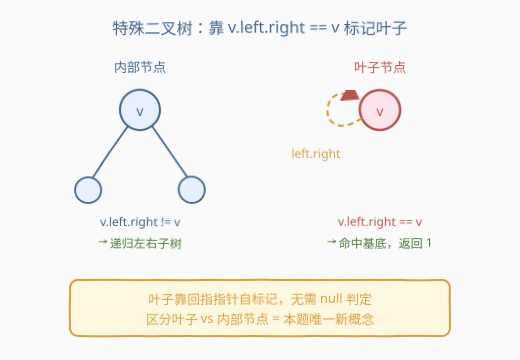
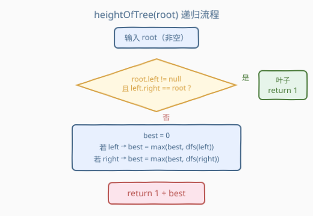
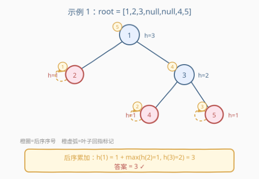

# 特殊二叉树的高度

- **题目名称**：特殊二叉树的高度
- **链接**：[2773. 特殊二叉树的高度](https://leetcode.cn/problems/height-of-special-binary-tree/)
- **难度**：中等
- **标签**：树、二叉树、深度优先搜索、广度优先搜索

## 1. 题目概述

> ⚠️ 本题为 LeetCode 付费题，题意描述根据官方示例用例与 hints 重建，可能与官方题面有出入。

给定一棵「特殊二叉树」的根节点 `root`，返回这棵树的**高度**（从根到最远叶子路径上的节点数；单个叶子高度为 `1`，与 [104. 二叉树的最大深度](https://leetcode.cn/problems/maximum-depth-of-binary-tree/) 的约定一致）。

这棵树的特殊之处在于**叶子的判定方式**——不能再用「左右孩子都为 `null`」来认叶子。题目给出一套指针规则：

> - 对任意节点 `v`，若 `v.left == null` 或 `v.right == null`，则 `v` **不是**叶子；
> - 若上一条不成立（即 `v.left != null` 且 `v.right != null`），且 `v.left.right == v`，则 `v` **是**叶子。

换句话说，**叶子节点的左孩子指针所指节点的右指针，会回指到该叶子自身**——这条「回指」就是叶子的自标记。内部节点的左右指针都指向真实子树，不满足回指条件。

> 💡 直觉上可把它理解为一棵「线索化」的二叉树：真实叶子的空指针位被改写成回指向自身的线索，用来标记「我到这就到底了」。也正因如此，**绝不能无脑递归 `v.left` / `v.right`**——一旦撞上一个回指叶子，顺着它的左孩子走下去就会绕回自身，陷入死循环。先识别叶子、再递归，是本题唯一的新概念。

**示例 1**：

```text
输入：root = [1,2,3,null,null,4,5]
输出：3

        1
       / \
      2   3
         / \
        4   5
```

`2`、`4`、`5` 为叶子（高度 `1`）；`3 = 1 + max(1, 1) = 2`；`1 = 1 + max(1, 2) = 3`。

**示例 2**：

```text
输入：root = [1,2]
输出：2

    1
   /
  2
```

`2` 为叶子（高度 `1`）；`1` 的右子为空但非叶子（左不满足回指），`1 = 1 + max(1, 0) = 2`。

**示例 3**：

```text
输入：root = [1,2,3,null,null,4,null,5,6]
输出：4

        1
       / \
      2   3
         /
        4
       / \
      5   6
```

`2`、`5`、`6` 为叶子（高度 `1`）；`4 = 1 + max(1, 1) = 2`；`3` 右子空但非叶子，`3 = 1 + max(2, 0) = 3`；`1 = 1 + max(1, 3) = 4`。

**约束条件**（题目付费，具体数值上界未公开，下述按官方 hints 与示例重建）：

- 树中节点数目 `n ≥ 1`（根节点非空）；
- 输入保证为合法的「特殊二叉树」：每个真实叶子都由 `v.left.right == v` 自标记；
- 节点值范围与上界按 LeetCode 惯例（通常 `n ≤ 10^4`），对本解法复杂度无影响。

---

## 2. 解题思路

### 2.1 暴力思路：当普通图做带环 DFS/BFS

最朴素的念头：既然叶子有回指指针会成环，那就把它当**带环图**处理——用一个 `visited` 集合记录已访问节点，做 DFS 或 BFS 求从根出发的最长路径深度。

```python
from collections import deque

def heightOfTree(root):
    visited = {root}
    q = deque([(root, 1)])
    ans = 1
    while q:
        node, depth = q.popleft()
        ans = max(ans, depth)
        for child in (node.left, node.right):
            if child and child not in visited:
                visited.add(child)
                q.append((child, depth + 1))
    return ans
```

时间 $O(n)$，能过；但**空间 $O(n)$**（`visited` 集合 + 队列）。问题在于它**完全无视了「回指指针」里编码的语义**——那条回指明明在喊「我是叶子，别再往下走了」，暴力法却靠一个额外集合把环硬掰断，相当于把题目给的线索当噪音丢掉。

### 2.2 核心观察：靠 `v.left.right == v` 即时识别叶子



**关键洞察**：叶子不是「没有孩子」，而是「左孩子的右指针回指自身」。这个判定是 $O(1)$ 的本地操作——只看 `v.left` 与 `v.left.right`，无需任何全局状态。

> **叶子判定**：`v` 是叶子 ⟺ `v.left != null` 且 `v.left.right == v`

一旦命中叶子，直接返回 `1`（高度基底），**不再碰它的孩子**——这就从根上切断了回指导致的环。非叶子节点才递归左右子树，取最大高度加 `1`。

> ⚠️ **为什么必须先判叶子再递归？** 真实叶子的左/右指针不是 `null`，而是回指向量；若先无脑递归 `height(v.left)`，会顺着回指绕回 `v`，再绕回 `v`……死循环。叶子判定就是那个「到此为止」的刹车片。

> 💡 **退化节点怎么办？** 题目还规定「`v.left == null` 或 `v.right == null` 时 `v` 非叶子」。这种节点（如示例 3 的节点 `3`，右子为空）既非叶子、又少一个孩子——递归时只走存在的那一侧即可（`if child:` 守卫）。它的高度仍按 `1 + max(孩子高度, 0)` 计算，逻辑自洽。

### 2.3 算法流程图



**`heightOfTree(root)` 完整步骤**：

1. **叶子判定**：若 `root.left != null` 且 `root.left.right == root`，返回 `1`（叶子，高度基底）；
2. **否则为内部 / 退化节点**：置 `best = 0`；
   - 若 `root.left` 存在：`best = max(best, heightOfTree(root.left))`；
   - 若 `root.right` 存在：`best = max(best, heightOfTree(root.right))`；
3. **返回** `1 + best`。

> 💡 **叶子判定的顺序很关键**：必须**先**判叶子、**后**递归。若把递归写在前、叶子判定写在后，照样会先一步踩进回指环。下面参考代码严格遵循「判定 → 基底返回 / 否则递归」的先后。

### 2.4 示例演算

以 `root = [1,2,3,null,null,4,5]`（示例 1）为例，后序计算顺序与各节点高度：



| 后序访问 | 节点类型 | 左子高度 | 右子高度 | 计算 | 高度 |
|---------|---------|---------|---------|------|------|
| ① 叶 `2` | 叶子（回指标记） | — | — | 命中基底 | `1` |
| ② 叶 `4` | 叶子（回指标记） | — | — | 命中基底 | `1` |
| ③ 叶 `5` | 叶子（回指标记） | — | — | 命中基底 | `1` |
| ④ `3` | 内部 | `1`(②) | `1`(③) | `1 + max(1, 1)` | `2` |
| ⑤ 根 `1` | 内部 | `1`(①) | `2`(④) | `1 + max(1, 2)` | `3` |

最终高度 `= 3` ✓。注意 ①②③ 三个叶子均由 `v.left.right == v` 命中基底、**未触碰**它们回指的孩子——这正是避免死循环的关键。

---

## 3. 参考代码

### C++

```cpp
/**
 * Definition for a binary tree node.
 * struct TreeNode {
 *     int val;
 *     TreeNode *left;
 *     TreeNode *right;
 *     TreeNode() : val(0), left(nullptr), right(nullptr) {}
 *     TreeNode(int x) : val(x), left(nullptr), right(nullptr) {}
 *     TreeNode(int x, TreeNode *left, TreeNode *right) : val(x), left(left), right(right) {}
 * };
 */
class Solution {
public:
    int heightOfTree(TreeNode* root) {
        // 叶子：左孩子非空，且其右指针回指自身 → 命中基底
        if (root->left && root->left->right == root) {
            return 1;
        }
        int best = 0;
        if (root->left)  best = max(best, heightOfTree(root->left));
        if (root->right) best = max(best, heightOfTree(root->right));
        return 1 + best;
    }
};
```

### Python

```python
# Definition for a binary tree node.
# class TreeNode:
#     def __init__(self, val=0, left=None, right=None):
#         self.val = val
#         self.left = left
#         self.right = right
class Solution:
    def heightOfTree(self, root: Optional[TreeNode]) -> int:
        # 叶子：左孩子非空，且其右指针回指自身 → 命中基底
        if root.left and root.left.right is root:
            return 1
        best = 0
        if root.left:
            best = max(best, self.heightOfTree(root.left))
        if root.right:
            best = max(best, self.heightOfTree(root.right))
        return 1 + best
```

> 💡 两版等价。叶子判定用指针/对象身份比较（C++ `==` 比指针、Python `is` 比身份），**不要**写成值比较 `root->val == ...`——回指标记是结构性的，与节点值无关。根节点保证非空，故无需 `null` 守卫；若你的变体允许空树，在入口补一句 `if not root: return 0` 即可。

---

## 4. 复杂度分析

| 维度 | 复杂度 | 说明 |
|------|--------|------|
| 时间复杂度 | $O(n)$ | 每个节点只访问一次，叶子判定为 $O(1)$ 本地操作 |
| 空间复杂度 | $O(h)$ | 仅递归栈深度 = 树高 $h$；平衡树 $O(\log n)$，退化链状 $O(n)$ |
| 对比暴力法 | 少 $O(n)$ 额外空间 | 暴力法需 `visited` 集合 + 队列/栈共 $O(n)$，本解法靠指针语义零额外空间 |

> ⚠️ 暴力法 $O(n)$ 空间的浪费在于：把题目精心编码的「回指 = 叶子标记」当噪声丢掉，再额外造一个集合把环掰断。最优法把这条线索读出来当作刹车信号——同样是 $O(n)$ 时间，却省掉一整个集合。这是「**读懂输入里自带的语义、避免重复造轮子**」的典型范式。

---

## 5. 扩展：迭代版后序求高

递归直观，但树极深时有栈溢出风险。可用显式栈做后序遍历，难点在于「拿到孩子高度后再算当前高度」——栈里存 `(node, visited)` 状态，用一张 `height` 表缓存孩子结果。

```python
class Solution:
    def heightOfTree(self, root: Optional[TreeNode]) -> int:
        stack = [(root, False)]
        height = {}                 # id(node) -> 子树高度
        while stack:
            node, visited = stack.pop()
            # 叶子判定（与递归版一致）
            if node.left and node.left.right is node:
                height[id(node)] = 1
                continue
            if visited:
                best = 0
                if node.left:  best = max(best, height.get(id(node.left), 0))
                if node.right: best = max(best, height.get(id(node.right), 0))
                height[id(node)] = 1 + best
            else:
                stack.append((node, True))     # 根最后处理
                if node.right: stack.append((node.right, False))
                if node.left:  stack.append((node.left, False))
        return height[id(root)]
```

> 💡 迭代版用 `visited` 标记模拟「先左右后根」，用 `height` 字典替代递归返回值传递。时间同样 $O(n)$，空间 $O(n)$（栈 + 字典，退化情况）。逻辑更繁，**面试推荐递归版**——简洁且能体现对「指针语义即叶子标记」的理解。迭代版仅在树极深（递归栈溢出风险）时才有实际优势。

---

## 6. 面试要点

1. **为什么不能直接把叶子定义成「左右都为 `null`」？**

   > 因为这棵「特殊二叉树」把真实叶子的空指针位改写成了**回指线索**（`v.left.right == v`），所以叶子的左/右指针不是 `null`，而是指向某处（最终绕回自身）。若再用「左右为 `null`」认叶子，会漏掉所有真实叶子；而顺着回指指针递归下去又会绕成环。题目用回指线索**同时承担**「我是叶子」和「到此为止」两个信号。

2. **叶子判定为什么是先判 `v.left != null` 再判 `v.left.right == v`，顺序能换吗？**

   > 必须先确认 `v.left` 非空，再解引用 `v.left.right`。C++ 中若 `v.left == nullptr` 还去取 `v.left->right` 就是未定义行为。Python 虽有短路求值保平安，但逻辑上也应是「先有左孩子、再看它的右指针指谁」。顺序不能反。

3. **退化节点（一个孩子为 `null` 但非叶子）怎么处理？**

   > 题目规定 `v.left == null` 或 `v.right == null` 时 `v` 非叶子。这种节点（如示例 3 的节点 `3`，右子空）按内部节点处理：只递归存在的那一侧孩子，缺失一侧记高度 `0`，最终 `1 + max(存在侧, 0)`。参考代码用 `if child:` 守卫实现，逻辑自洽、不会误入回指环。

4. **暴力 `visited` 集合法和最优指针法的本质区别是什么？**

   > 暴力法把回指指针当成「需要被集合掰断的环」，额外造 $O(n)$ 空间。最优法读懂回指线索的语义——它不是 bug 而是特性，是题目塞进来的「叶子刹车」。把信号读出来用，就不用再造集合。同属「**输入里自带语义，别当噪声丢**」的范式，类比 [958. 二叉树的完全性检验](https://leetcode.cn/problems/check-completeness-of-a-binary-tree/) 里「层序首次遇空后不应再有非空」的结构信号。

5. **若题目改成「统计叶子数量」或「最长根到叶路径的节点值和」怎么扩展？**

   > 骨架不变，只换聚合操作：叶子判定命中基底后，从「返回 `1`」改成「计数 `+1`」或「返回该叶子自身 `val`」即可。内部节点处把 `max(best, dfs(child))` 换成对应的聚合（求和 / 取最大）。这套「**叶子指针判定基底 + 内部节点聚合**」的模板可平滑迁移到任何「特殊树形 + 自底向上聚合」的变体。

> 💡 **一句话总结**：2773 的灵魂是「**用指针结构性质识别叶子，再走普通树高递归**」——回指指针 `v.left.right == v` 既是叶子标记又是递归刹车，$O(1)$ 本地判定取代 $O(n)$ 全局 `visited` 集合，时间 $O(n)$、空间 $O(h)$。

---

## 7. 同类练习题

- [104. 二叉树的最大深度](https://leetcode.cn/problems/maximum-depth-of-binary-tree/)：树高递归母题，叶子基底 `return 1`、内部 `1 + max(左右)`——本题去掉「特殊叶子判定」后就是它
- [111. 二叉树的最小深度](https://leetcode.cn/problems/minimum-depth-of-binary-tree/)：同样要先识别叶子（最小深度只算到第一个叶子），与本题「靠结构性质识别叶子」的思路延伸
- [222. 完全二叉树的节点个数](https://leetcode.cn/problems/count-complete-tree-nodes/)：利用完全二叉树的结构性质剪枝 $O(\log^2 n)$，同属「读懂树的结构性质简化递归」范式
- [958. 二叉树的完全性检验](https://leetcode.cn/problems/check-completeness-of-a-binary-tree/)：层序靠「首次遇空后不再有非空」的结构信号判定完全性，与本题「靠指针性质识别叶子」互为表里
- [662. 二叉树最大宽度](https://leetcode.cn/problems/maximum-width-of-binary-tree/)：给节点编号 + 利用满/完全树的结构性质算宽度，同属「结构性质驱动的树形题」
