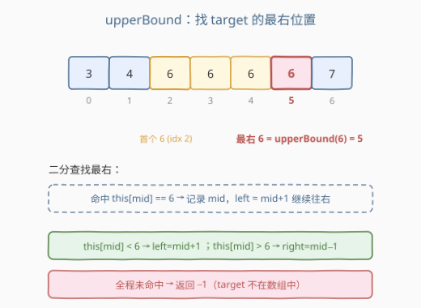
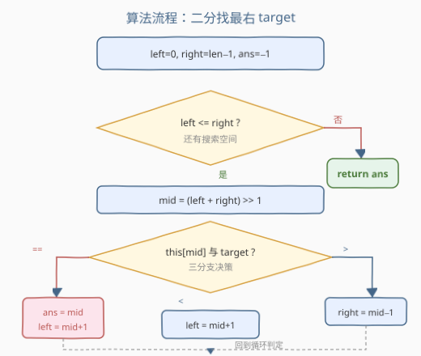
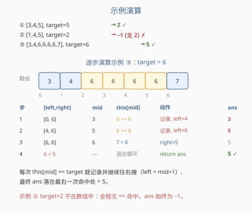

# LeetCode 数组的上界 题解

## 1. 题目概述

- **标题 / 题号**：数组的上界（#2774，easy）
- **链接**：https://leetcode.cn/problems/array-upper-bound/
- **难度**：简单
- **标签**：JavaScript、二分查找、数组原型

> ⚠️ 本题为 LeetCode 付费题，题意描述根据官方示例用例与 hints 重建，可能与官方题面有出入。

**题意**：给定一个**升序数组**，请你在 `Array.prototype` 上挂载一个方法 `upperBound(target)`，返回 `target` 在数组中出现的**最右位置（下标）**；若 `target` 不在数组中则返回 `-1`。

在方法内部，你可以通过 `this` 访问当前数组——例如 `this[0]`、`this.length`、`this.map()` 等。

**示例 1**：

```text
输入：[3,4,5], target = 5
输出：2
解释：5 出现在下标 2（唯一一处），故上界为 2。
```

**示例 2**：

```text
输入：[1,4,5], target = 2
输出：-1
解释：2 不在数组中，返回 -1。
```

**示例 3**：

```text
输入：[3,4,6,6,6,6,7], target = 6
输出：5
解释：6 出现在下标 2、3、4、5，最右位置（上界）为 5。
```

**约束**：

- 数组长度 $1 \le n \le 10^5$
- 数组按升序排列
- 返回值是一个整数下标

> 💡 这是一道 **JavaScript 原型方法 + 二分查找** 题：核心算法是最经典的「有序数组中找 `target` 的最右一次出现」，考点在于把二分模板的「命中后继续往右搜」这一点想清楚。它与 C++ 的 `std::upper_bound`（首个**严格大于** target 的位置）**不是一回事**——本题要的是**等于 target 的最右位置**。

## 2. 解题思路

### 2.1 暴力思路：从右往左线性扫

最直白的做法：从 `this.length - 1` 往左遍历，第一个等于 `target` 的下标就是答案；扫完都没有则返回 `-1`。时间 $O(n)$，空间 $O(1)$。

这能通过测试，但完全没有利用「升序」这一性质。一旦 $n$ 到 $10^5$ 级别且查询密集，$O(n)$ 就不可接受。

### 2.2 核心观察：升序数组 → 二分找最右命中



关键性质：数组**升序**，所以所有等于 `target` 的元素**连续**排在一起（如 `[3,4,6,6,6,6,7]` 中四个 `6` 连续）。我们要的是这段连续区间的**右端点**。

二分查找天然适合在有序序列里定位，但常规二分（命中即返回）只能找到**任意一个** `target`，无法保证是最右的。核心改造点是：**命中 `this[mid] == target` 后不立即返回，而是记录 `mid` 并把搜索空间往右推**（`left = mid + 1`），继续看右边还有没有更靠后的 `target`。

三分支决策：

| `this[mid]` 与 `target` | 动作 | 直觉 |
|--------------------------|------|------|
| `== target` | `ans = mid`，`left = mid + 1` | 记下这个位置，但右边可能还有，继续往右搜 |
| `< target` | `left = mid + 1` | 太小，`target` 一定在更右边 |
| `> target` | `right = mid - 1` | 太大，`target` 一定在更左边 |

循环条件用 `left <= right`（闭区间写法）。循环结束时 `ans` 持有的就是最后一次命中的下标；若从未命中，`ans` 保持初始值 `-1`。

> 💡 **为什么命中后不直接返回？** 因为命中点未必是最右的——升序保证了「往右还可能再有 `target`」。直接返回只会给你**任意一个**命中位，丢掉了「最右」的语义。继续 `left = mid + 1` 才能把区间收缩到命中段的右端。

### 2.3 算法流程图



### 2.4 示例演算



以**示例 3** `[3,4,6,6,6,6,7]`、`target = 6` 为例，逐步演算：

| 步 | `[left, right]` | mid | `this[mid]` | 动作 | ans |
|----|----------------|-----|-------------|------|-----|
| 1 | `[0, 6]` | 3 | `6 == 6` | 记录，`left = 4` | 3 |
| 2 | `[4, 6]` | 5 | `6 == 6` | 记录，`left = 6` | 5 |
| 3 | `[6, 6]` | 6 | `7 > 6` | `right = 5` | 5 |
| 4 | `6 > 5` | — | 退出循环 | `return ans` | **5 ✓** |

三步搜索即锁定最右的 `6`（下标 5），共只看了 3 个中点，远优于线性扫 7 个。

**示例 2**（`[1,4,5]`、`target = 2`）：全程没有 `this[mid] == 2` 的命中，`ans` 始终保持初始值 `-1`，最终返回 `-1`。

> ⚠️ **区分「上界」与 C++ 的 `std::upper_bound`**。C++ 的 `upper_bound` 返回「首个严格大于 target 的迭代器」，等价于本题里命中段的**右端 +1**；而本题的 `upperBound` 返回命中段的右端本身（且 target 不存在时返回 `-1` 而非插入位置）。二者差一，不要混用。

## 3. 参考代码

### JavaScript / TypeScript（提交语言）

```javascript
/**
 * @param {number} target
 * @return {number}
 */
Array.prototype.upperBound = function(target) {
    let left = 0, right = this.length - 1;
    let ans = -1;
    while (left <= right) {
        const mid = (left + right) >> 1;
        if (this[mid] === target) {
            ans = mid;
            left = mid + 1;       // 命中但继续往右搜
        } else if (this[mid] < target) {
            left = mid + 1;
        } else {
            right = mid - 1;
        }
    }
    return ans;
};
```

TypeScript 版：

```typescript
declare global {
    interface Array<T> {
        upperBound(target: T): number;
    }
}

Array.prototype.upperBound = function<T>(this: Array<T>, target: T): number {
    let left = 0, right = this.length - 1;
    let ans = -1;
    while (left <= right) {
        const mid = (left + right) >> 1;
        if (this[mid] === target) {
            ans = mid;
            left = mid + 1;
        } else if (this[mid] < target) {
            left = mid + 1;
        } else {
            right = mid - 1;
        }
    }
    return ans;
};
```

> 💡 **`this` 从哪来？** `Array.prototype.upperBound` 是挂在数组原型上的方法，调用 `[3,4,5].upperBound(5)` 时，`this` 指向调用者 `[3,4,5]`，因此函数体内直接用 `this[mid]`、`this.length` 即可访问数组元素与长度。

### Python（概念等价）

> 本题 LeetCode 仅开放 JS / TS，Python 版作概念对照。把 `this` 换成显式参数 `arr` 即是同一个二分。

```python
class Solution:
    def upperBound(self, arr: list[int], target: int) -> int:
        left, right = 0, len(arr) - 1
        ans = -1
        while left <= right:
            mid = (left + right) >> 1
            if arr[mid] == target:
                ans = mid
                left = mid + 1
            elif arr[mid] < target:
                left = mid + 1
            else:
                right = mid - 1
        return ans
```

### C++（概念等价）

> C++ 概念对照。注意它返回**最右命中下标**而非 `std::upper_bound` 的「首个大于」位置。

```cpp
class Solution {
public:
    int upperBound(vector<int>& arr, int target) {
        int left = 0, right = (int)arr.size() - 1, ans = -1;
        while (left <= right) {
            int mid = left + (right - left) / 2;
            if (arr[mid] == target) {
                ans = mid;
                left = mid + 1;
            } else if (arr[mid] < target) {
                left = mid + 1;
            } else {
                right = mid - 1;
            }
        }
        return ans;
    }
};
```

## 4. 复杂度分析

| 维度 | 复杂度 | 说明 |
|------|--------|------|
| 时间复杂度 | $O(\log n)$ | 每轮把搜索空间折半，至多 $\lceil\log_2 n\rceil$ 轮 |
| 空间复杂度 | $O(1)$ | 仅用 `left` / `right` / `mid` / `ans` 四个变量 |

## 5. 扩展：与「找第一个 / 最后一个」二分家族的关系

本题是二分查找家族里「**找最右命中**」这一支的代表。把命中后的指针推方向翻转，就能得到一族变体：

| 变体 | 命中后动作 | 等价标准库 |
|------|-----------|-----------|
| **找任意一个** target | 命中即返回 `mid` | C++ `std::binary_search`、Java `Arrays.binarySearch` |
| **找第一个** target（最左命中） | `right = mid - 1` 往左推 | C++ `std::lower_bound` |
| **找最后一个** target（最右命中，**本题**） | `left = mid + 1` 往右推 | 无直接对应，`upper_bound - 1` 后需判等 |
| **首个严格大于** target | 不命中分支 + 边界 | C++ `std::upper_bound` |
| **插入位置** | `lower_bound` 的下界 | Python `bisect.bisect_left` |

记忆口诀：**「命中后想去哪边，就把另一边的指针推过去」**。想找最右，命中后继续往右推 `left`；想找最左，命中后继续往左推 `right`。循环结束后，记录变量里存的就是你想要的端点。

> 💡 **能否用 `upper_bound - 1` 一步到位？** 可以，但要注意空命中。`std::upper_bound` 返回首个大于 `target` 的位置 `p`，则 `p - 1` 就是最右的 `target`——**前提是 `arr[p-1] == target`**（即 `target` 真的存在）。若不存在，`p - 1` 会指向一个不等于 `target` 的元素，需要额外判等。本题直接用「记录 + 往右推」的写法，把判等隐含进 `ans` 初值 `-1` 里，更不易错。

## 6. 面试要点

1. **为什么命中 `target` 后不直接返回，而要继续往右搜？**

   - 因为升序数组中所有 `target` 连续排布，命中点可能是这段区间的**任意**位置，未必是最右。直接返回只能拿到「某一个」命中下标，丢掉了「最右」语义。继续 `left = mid + 1` 把搜索空间推到命中段右端，才能保证 `ans` 最终落最右。

2. **循环条件为什么用 `left <= right` 而不是 `left < right`？**

   - 闭区间写法下 `[left, right]` 是有效搜索范围。当 `left == right` 时还有一个元素没看，必须进循环检查；用 `<=` 才会覆盖 `left == right` 这一格。若改用 `<`，单元素数组会漏判。

3. **`target` 不在数组中时，怎么保证返回 `-1`？**

   - `ans` 初值设为 `-1`，只有命中 `this[mid] == target` 时才被覆写。不存在的 `target` 全程不会触发 `==` 分支，`ans` 保持 `-1` 到循环结束。这就是把「未命中」语义编码进初值。

4. **本题的「上界」和 C++ `std::upper_bound` 是一回事吗？**

   - 不是。`std::upper_bound` 返回**首个严格大于** target 的位置（命中段右端 +1）；本题返回**最右等于** target 的位置（命中段右端本身），且未命中返回 `-1`。两者差一个位置，且对未命中的处理不同。

5. **`Array.prototype.upperBound` 里 `this` 是什么？为什么能直接 `this[mid]`？**

   - 方法挂在 `Array.prototype` 上，通过 `[...].upperBound(t)` 调用时，`this` 绑定到调用者数组本身，是一个类数组对象，支持下标访问和 `.length`。所以 `this[mid]` 取元素、`this.length` 取长度都和普通数组一样。

> 💡 **一句话总结**：2774 = 「升序数组 + 二分找最右命中」。命中后 `ans = mid; left = mid + 1` 继续往右推，循环结束 `ans` 即最右位置，未命中则保持初值 `-1`。$O(\log n)$ / $O(1)$。

## 同类练习题

| # | 题目 | 与本题的关联 |
|---|------|-------------|
| 34 | [在排序数组中查找元素的第一个和最后一个位置](https://leetcode.cn/problems/find-first-and-last-position-of-element-in-sorted-array/)（[站内题解](../0001-0100/34_在排序数组中查找元素的第一个和最后一个位置.md)） | 左端 + 右端两次二分，右端那一次正是本题写法 |
| 704 | [二分查找](https://leetcode.cn/problems/binary-search/)（[站内题解](../0701-0800/704_二分查找.md)） | 二分母题，命中即返回的「找任意一个」版，对照本题的「找最右」改造 |
| 35 | [搜索插入位置](https://leetcode.cn/problems/search-insert-position/)（[站内题解](../0001-0100/35_搜索插入位置.md)） | `lower_bound` 找首个大于等于，对照本题找最右等于 |
| 278 | [第一个错误的版本](https://leetcode.cn/problems/first-bad-version/)（[站内题解](../0201-0300/278_第一个错误的版本.md)） | 找首个 true，是「往左推」的对称题，对照本题「往右推」 |
| 744 | [寻找比目标字母大的最小字母](https://leetcode.cn/problems/find-smallest-letter-greater-than-target/)（[站内题解](../0701-0800/744_寻找比目标字母大的最小字母.md)） | `upper_bound` 找首个严格大于，即「命中段右端 +1」 |
