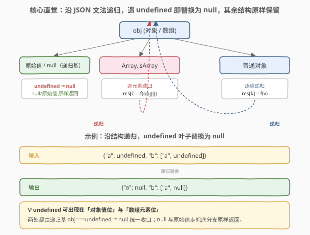
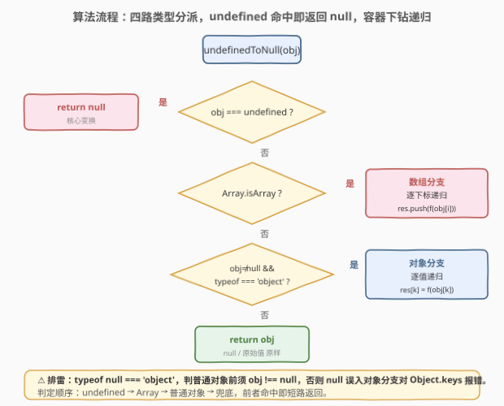

# LeetCode 将 undefined 转为 null 题解

## 1. 题目概述

- **标题 / 题号**：将 undefined 转为 null（#2775，medium）
- **链接**：https://leetcode.cn/problems/undefined-to-null/
- **难度**：中等
- **标签**：递归、JSON、类型分派、深度优先

> ⚠️ 本题为 LeetCode 付费题（Plus 会员专享），题意描述根据官方示例用例与同系列姊妹题（[2705. 精简对象](2705_精简对象.md)）信息重建，可能与官方题面有出入。

**题意**：给定一个对象或数组 `obj`（可嵌套），返回一个**新结构**：将其在**任意深度**上出现的所有 `undefined` 值**替换为 `null`**，其余键、下标与取值原样保留。

- `undefined` 出现在**对象值位**（如 `{"a": undefined}`）→ 该值变 `null`，键保留；
- `undefined` 出现在**数组元素位**（如 `["a", undefined]`）→ 该元素变 `null`，下标保留；
- 嵌套的对象 / 数组需**递归**处理，直到所有叶子都被遍历。

**示例 1**：

```text
输入：obj = {"a": undefined, "b": 3}
输出：{"a": null, "b": 3}
解释：对象值位的 undefined 被替换为 null，键 a 保留；b 为原始值原样保留。
```

**示例 2**：

```text
输入：obj = {"a": undefined, "b": ["a", undefined]}
输出：{"a": null, "b": ["a", null]}
解释：a 的 undefined → null；b 是数组，其 idx1 的 undefined → null，idx0 的 "a" 原样。
```

**约束**：

- `obj` 为对象或数组（结构同构于 `JSON.parse` 的输出，但值位允许出现 `undefined`）；
- 嵌套深度有限、无循环引用；
- 键 / 元素总数不超过 $10^5$（递归栈深度可控）。

> 💡 本题是 LeetCode「30 天 JavaScript」系列题目，**仅提供 JavaScript / TypeScript 提交入口**，核心考察**递归 + 类型分派 + 哨兵值替换**。它与 [2705. 精简对象](2705_精简对象.md)、[2628. 完全相等的 JSON 对象](2628_完全相等的JSON对象.md) 同属「沿 JSON 文法递归」一族——同一套类型分派骨架，换个动作：2705 递归**精简**一棵树（删假值），2628 递归**比对**两棵树，本题递归**替换**一棵树中的哨兵值。本文以 JS 为提交语言，并给出 Python 概念等价实现。

## 2. 解题思路

### 2.1 取巧思路：`JSON.stringify` + replacer 一行流

JS 的 `JSON.stringify` 接受一个 `replacer`，能在序列化时对每个值"过一遍"。直觉上 `JSON.parse(JSON.stringify(obj, (k, v) => v === undefined ? null : v))` 就能把 `undefined` 改写成 `null`：

- 对象值位 `undefined`：replacer 把它返回成 `null`（非 `undefined`），键得以**保留**为 `"k": null`（若 replacer 仍返回 `undefined`，键会被 `JSON.stringify` 丢弃）；
- 数组元素位 `undefined`：replacer 返回 `null`，元素变 `null`，下标保留。

这行确实能跑通两个示例，但它有两个**隐性问题**：

1. **依赖 `JSON` 往返的隐式语义**：把"结构变换"寄托在"序列化→解析"的字符串中转上，可读性差、易踩坑（多数人并不清楚 replacer 返回 `null` 能"救回"会被丢弃的 `undefined` 键）；
2. **`undefined` 根值会崩**：若输入根值本身是 `undefined`，`JSON.stringify(undefined, replacer)` 返回 `undefined`（不是字符串），`JSON.parse(undefined)` 直接抛错——边界处理脆弱。

> ⚠️ 更本质的问题：**哨兵值替换与结构的递归是同构的**——必须先下钻到子结构替换、再在当前层组装。靠字符串中转绕不开这层递归，还把"类型分派"的信息（对象按键、数组按下标）丢失在序列化文本里。与 [2705](2705_精简对象.md) 中"先 stringify 再正则删假值"的取巧思路同源——都试图绕开递归，但递归才是这道题的骨架。

### 2.2 核心观察：递归 + 类型分派 + 哨兵替换



JSON 值的文法本身是**递归**的——数组的元素、对象的值又都是 JSON 值（本题还允许 `undefined`）。"把 `undefined` 换成 `null`"这一操作天然沿文法递归：先钻到子结构把它的 `undefined` 替换掉，再在当前层组装出新结构。

按类型分四条分支：

| 分支 | 判定条件 | 动作 | 递归？ |
|------|----------|------|--------|
| **undefined** | `obj === undefined` | 返回 `null`（核心变换，递归基） | 否 |
| **数组** | `Array.isArray(obj)` | 逐下标递归，组装新数组 | 是 |
| **普通对象** | `obj !== null && typeof obj === "object"` | 逐键递归，组装新对象 | 是 |
| **其余** | `null` / 布尔 / 数字 / 字符串 | 原样返回（递归基） | 否 |

**关键直觉：变换只发生在 `undefined` 叶子，容器只负责"逐元素/逐值下钻"。** 数组的下标和对象的键都不动，只有值位的 `undefined` 被改写成 `null`；其余原始值（含 `null`）原样透传。这意味着输出结构与输入**同构**——不删键、不重排下标，仅替换叶子。

> 💡 **为什么 `undefined` 和"原始值"分属两个递归基却放一起排雷？** 二者都是"无子结构、不再下钻"的叶子：`undefined` 命中后**变换**为 `null`，其余原始值**不变换**直接返回。把 `obj === undefined` 放在最前单独判定，既短路了最常见的变换目标，又避免 `undefined` 误入后续分支——`typeof undefined === "undefined"`，与对象/数组的 `"object"` 不同型，理论上不会误入，但显式前置判定让意图最清晰。

> ⚠️ **排雷要点：判普通对象前先拦 `null`。** `typeof null === "object"` 是 JS 历史遗留设计。若用 `typeof obj === "object"` 判定"对象"，则 `null` 会误入对象分支，对 `null` 调 `Object.keys` 直接报错。本解法用 `Array.isArray` 先分流数组，再用 `obj !== null && typeof obj === "object"` 兜底普通对象，使 `null`（与原始值一起）自然落到第四分支原样返回——与 [2705](2705_精简对象.md) 中"先拦 `null` 排雷、再分派"的思路同构。

### 2.3 算法流程图



决策是**自顶向下判定、自底向上组装**的：

1. 先判 `obj === undefined`（命中即返回 `null`，核心变换落地）；
2. 否则判 `Array.isArray`（数组分支：逐下标递归、`push` 组装新数组）；
3. 否则判"普通对象"（对象分支：逐键递归、写入新对象）；
4. 兜底为 `null` / 原始值——原样返回，由父层组装。

第 2、3 步会**递归**调用自身，把子结构逐层替换，直到撞上 `undefined` 或原始值这两个递归基。

> 💡 **判定顺序不能反**：必须先判 `undefined`、再判数组、再判普通对象、最后兜底。因为数组也是 `typeof === "object"`，若先判"普通对象"且未排除数组，数组会被错分流。`Array.isArray` 是最可靠的数组判定（跨 iframe、跨原型链安全），放 `undefined` 之后；而 `null` 必须在"普通对象"判定里显式排除。

### 2.4 示例演算

![示例演算：{a: undefined, b:["a",undefined]} 的递归调用树](../images/p2775_undef_to_null_walkthrough.svg)

以**示例 2** `obj = {"a": undefined, "b": ["a", undefined]}` 为例，递归调用树逐层展开：

| 节点 | 类型分派 | 动作 | 结果 |
|------|----------|------|------|
| `f({a:undefined, b:[...]})` | 普通对象 | 逐键递归 | 组装对象 |
| `f(undefined)` ← key a | **undefined** | 返回 `null` | `null` |
| `f(["a", undefined])` ← key b | 数组 | 逐元素递归 | 组装数组 |
| `f("a")` ← idx0 | 原始值 | 原样返回 | `"a"` |
| `f(undefined)` ← idx1 | **undefined** | 返回 `null` | `null` |

自底向上组装：idx0→`"a"`、idx1→`null` 拼成 `b = ["a", null]`；key a→`null`、key b→`["a", null]` 拼成根对象 `{"a": null, "b": ["a", null]}`。

> 💡 **嵌套下钻细节**：两处 `undefined`——一处在**对象值位**（`a`）、一处在**数组元素位**（`b[1]`）——都由同一个递归基 `obj === undefined → null` 收口。数组/对象本身**不变换值**，只把子节点"递归后的结果"按原下标/原键组装回去，因此输出结构与输入同构，仅 `undefined` 叶子被改写。

## 3. 参考代码

### JavaScript / TypeScript（提交语言）

```javascript
/**
 * @param {Object|Array} obj
 * @return {Object|Array}
 */
function undefinedToNull(obj) {
    // 1. undefined → null（核心变换，递归基）
    if (obj === undefined) return null;
    // 2. 数组：逐下标递归，组装新数组（holes 读取为 undefined 也会被转成 null）
    if (Array.isArray(obj)) {
        const result = [];
        for (let i = 0; i < obj.length; i++) {
            result.push(undefinedToNull(obj[i]));
        }
        return result;
    }
    // 3. 普通对象（非 null）：逐键递归，组装新对象
    if (obj !== null && typeof obj === "object") {
        const result = {};
        for (const key of Object.keys(obj)) {
            result[key] = undefinedToNull(obj[key]);
        }
        return result;
    }
    // 4. 其余（null / 布尔 / 数字 / 字符串）：原样返回
    return obj;
}
```

TypeScript 版（带类型标注）：

```typescript
type JSONValue = null | boolean | number | string | JSONValue[] | { [key: string]: JSONValue };

function undefinedToNull(obj: JSONValue | undefined): JSONValue {
    if (obj === undefined) return null;
    if (Array.isArray(obj)) {
        const result: JSONValue[] = [];
        for (const i of obj.keys()) {
            result.push(undefinedToNull(obj[i] as JSONValue | undefined));
        }
        return result;
    }
    if (obj !== null && typeof obj === "object") {
        const src = obj as { [key: string]: JSONValue | undefined };
        const result: { [key: string]: JSONValue } = {};
        for (const key of Object.keys(src)) {
            result[key] = undefinedToNull(src[key]);
        }
        return result;
    }
    return obj;
}
```

> 💡 **数组用显式 `for + push` 而非 `map`**：`Array.prototype.map` 会**跳过稀疏数组的空洞**（hole），导致空洞处的 `undefined` 不被调用、不被替换。显式按下标遍历读取 `obj[i]`，空洞读取得到 `undefined`，也会被递归基转成 `null`——与"数组元素位的 undefined → null"语义一致。若输入保证无空洞（如官方示例用字面量 `["a", undefined]`），`obj.map(undefinedToNull)` 同样可行且更简洁。

> ⚠️ **`Object.keys` vs `for...in`**：用 `Object.keys(obj)` 只遍历**自身可枚举属性**，不沿原型链爬升，安全且可预测。若误用 `for...in`（无 `hasOwnProperty` 守卫），会带上原型链上的键，把继承属性也写入 `result`——这是处理"普通对象"时的通用排雷点（与 [2705](2705_精简对象.md) 同）。

### Python（概念等价）

> 本题 LeetCode 仅开放 JS/TS，Python 版作概念对照。⚠️ **核心差异**：Python 没有 `undefined`，只有 `None`（`null` 与 `undefined` 在 Python 合二为一）。故 Python 版用**哨兵对象** `UNDEFINED` 模拟 JS 的 `undefined`，演示"递归 + 类型分派 + 哨兵替换"的通用骨架——它对任何"沿嵌套结构把某哨兵值替换成目标值"的需求都适用（如把 `None` 换成默认值、把占位符换成真实值）。

```python
UNDEFINED = object()  # 哨兵，模拟 JS 的 undefined


def undefined_to_null(obj):
    # 1. 哨兵 → 目标值（核心变换，递归基）
    if obj is UNDEFINED:
        return None
    # 2. 列表（数组）：逐下标递归
    if isinstance(obj, list):
        return [undefined_to_null(x) for x in obj]
    # 3. 字典（普通对象）：逐值递归
    if isinstance(obj, dict):
        return {k: undefined_to_null(v) for k, v in obj.items()}
    # 4. 其余（None / 布尔 / 数字 / 字符串）：原样返回
    return obj
```

> ⚠️ **Python 的 `isinstance` 判定天然排除 `None`**：`isinstance(None, dict)` 与 `isinstance(None, list)` 均为 `False`，故 Python 判普通对象无需像 JS 那样额外拦 `null`——这是两语言类型系统的差异点（与 [2705](2705_精简对象.md)、[2755](2755_深度合并两个对象.md) 中"`bool` 是 `int` 子类""`typeof null === 'object'`"的陷阱同源，都是语言历史包袱）。哨兵用 `object()` 实例保证 `is` 比较的唯一性，避免与任何真实值撞车。

## 4. 复杂度分析

| 维度 | 复杂度 | 说明 |
|------|--------|------|
| 时间复杂度 | $O(n)$ | $n$ 为所有层级的键 / 元素总数；每个节点至多被访问常数次，递归无重复下钻 |
| 空间复杂度 | $O(n)$ | 输出结构与输入同阶（同构替换，不删键）；递归栈 $O(h)$（$h$ 为嵌套深度），通常 $h \ll n$ |

> 💡 本质是**一次结构同构的遍历**：递归沿 JSON 树逐层下钻，每个节点判定类型后要么变换（`undefined`→`null`）、要么下钻（容器）、要么透传（原始值）。输出结构与输入**同构**——键集与下标都不变，仅 `undefined` 叶子被改写为 `null`，规模不超过输入，故空间 $O(n)$。

## 5. 扩展：`undefined` 与 `null` 的二元性，以及哨兵替换的通用骨架

- **JS 的 `undefined` vs `null`**：`undefined` 表示"压根没赋值"（变量未初始化、对象属性不存在、函数无返回值、缺失实参），`null` 表示"显式置空"。二者在 `==` 下相等（`undefined == null` 为 `true`），但在 `===` 下不同。本题把它们**解耦**——把"未赋值"语义统一改写成"显式置空"，让输出成为不含 `undefined` 的"干净"结构（更利于 `JSON.stringify` 保留键、跨语言序列化）。
- **`JSON.stringify` 对 `undefined` 的丢弃**：这是 2.1 取巧写法必须靠 replacer"救回"键的根因——`JSON.stringify({a: undefined})` 会**直接丢掉 `a`**（因为 `undefined` 不是合法 JSON 值），而 `JSON.stringify({a: null})` 会保留 `"a": null`。本题的"替换"恰好规避了这层丢弃：把 `undefined` 换成 `null` 后，结构可被 `JSON.stringify` 完整序列化而不丢键。这与 [2633. 将对象转换为 JSON 字符串](2633_将对象转换为JSON字符串.md) 中"序列化时 `undefined` 的处理"是同一知识点。
- **稀疏数组与空洞**：JS 中 `[1, , 3]`（中间是空洞而非 `undefined`）的 `1` 下标是 hole，`map` 会跳过它。本题用显式下标遍历，hole 读取为 `undefined` 也会被转成 `null`——若题目要求"空洞保持空洞"，则需改用 `obj.map(undefinedToNull)`（跳过 hole）。官方示例用字面量 `["a", undefined]`（显式 `undefined`，非 hole），两种写法等价。
- **哨兵替换的通用骨架**：把 `obj === undefined` 换成 `obj === SENTINEL`、把 `return null` 换成 `return TARGET`，本骨架就适用于任何"沿嵌套结构把某哨兵值替换成目标值"的需求（如深度默认值填充：把 `null`/哨兵换成 `0`、`""`、`{}`）。这是"递归 + 类型分派"骨架的又一变体——序列化（[2633](2633_将对象转换为JSON字符串.md)）、深度相等（[2628](2628_完全相等的JSON对象.md)）、精简（[2705](2705_精简对象.md)）、合并（[2755](2755_深度合并两个对象.md)）、替换（本题）都是这套骨架换不同动作。

> 💡 工程实践中，"递归 + 类型分派"是处理任意嵌套 JSON 的通用骨架——掌握它，就抓住了 JSON 操作类题目的母题。本题是该骨架最简的变体（只替换叶子、不删不增不动结构），是理解 2705/2755 这类"带结构变更"变体的最佳入门。

## 6. 面试要点

1. **为什么 `undefined` 要单独前置判定，而不是和原始值一起兜底？**

   > 因为 `undefined` 是本题唯一需要**变换**的值（→ `null`），其余原始值原样返回。前置 `obj === undefined` 判定，既短路了最常见的变换目标，又让意图最清晰。理论上 `typeof undefined === "undefined"` 不会误入对象/数组分支，但显式前置让"变换 vs 透传"的语义分界一目了然，也避免后续维护时误把 `undefined` 当原始值处理。

2. **为什么判普通对象前要先拦 `null`？**

   > 因为 `typeof null === "object"` 是 JS 历史遗留设计。若用 `typeof obj === "object"` 判定，`null` 会误入对象分支，对 `null` 调 `Object.keys` 直接报错。本解法用 `Array.isArray` 先分流数组，再用 `obj !== null && typeof obj === "object"` 兜底，使 `null` 落到第四分支原样返回——"先排雷、再分派"，与 [2705](2705_精简对象.md) 同构。

3. **数组为什么用显式 `for + push` 而不是 `map`？**

   > 因为 `Array.prototype.map` 会**跳过稀疏数组的空洞**，导致空洞处的 `undefined` 不被替换。显式按下标遍历，空洞读取为 `undefined` 也会被递归基转成 `null`，与"数组元素位的 undefined → null"语义一致。若输入保证无空洞（字面量构造），`map(undefinedToNull)` 同样可行且更简洁。

4. **2.1 的 `JSON.stringify` replacer 一行流有什么坑？**

   > 两个坑：① 它依赖 replacer 返回 `null`（而非 `undefined`）才能"救回"会被 `JSON.stringify` 丢弃的 `undefined` 键——这是一层隐式语义，可读性差；② 若输入根值是 `undefined`，`JSON.stringify(undefined)` 返回 `undefined`（非字符串），`JSON.parse(undefined)` 直接抛错，边界脆弱。递归版则对 `undefined` 根值也安全返回 `null`。

5. **递归的终止条件是什么？会不会无限递归？**

   > 终止条件是撞上**无子结构的叶子**——`undefined`（变换为 `null`）或原始值（原样返回）。数组和对象的元素 / 值才是 JSON 值，会触发递归。题目保证输入无环、有限深度，故递归必然在有限深度内终止于叶子。

> 💡 **一句话总结**：2775 = 「沿 JSON 文法递归 + 四分支类型分派 + undefined→null 哨兵替换」。`undefined` 命中返回 `null`、数组逐下标递归、对象逐值递归、`null`/原始值原样透传。先判 `undefined`、再判数组、再判普通对象（排除 `null`）、最后兜底；数组用显式 `for+push` 处理空洞——一次遍历 $O(n)$ 搞定，输出与输入同构。

## 同类练习题

| # | 题目 | 与本题的关联 |
|---|------|-------------|
| 2705 | [精简对象](https://leetcode.cn/problems/compact-object/)（[题解](2705_精简对象.md)） | 沿 JSON 文法**递归精简**一棵树（删假值），与本题**递归替换**共用同一套类型分派骨架，一删一换 |
| 2628 | [完全相等的 JSON 对象](https://leetcode.cn/problems/json-deep-equal/)（[题解](2628_完全相等的JSON对象.md)） | 沿 JSON 文法**递归比对**两棵树，复用"先拦 `null`"排雷与类型分派骨架，一判等一替换 |
| 2633 | [将对象转换为 JSON 字符串](https://leetcode.cn/problems/convert-object-to-json-string/)（[题解](2633_将对象转换为JSON字符串.md)） | 沿 JSON 文法**递归序列化**，揭示 `JSON.stringify` 对 `undefined` 的丢弃语义——正是本题"替换"要规避的坑 |
| 2755 | [深度合并两个对象](https://leetcode.cn/problems/deep-merge-of-two-objects/)（[题解](2755_深度合并两个对象.md)） | 沿 JSON 文法**递归合并**两棵树，同属 30 天 JS 系列姊妹题，对照"配对后者优先 vs 哨兵替换"的边界 |
| 2625 | [扁平化嵌套数组](https://leetcode.cn/problems/flatten-deeply-nested-array/)（[题解](2625_扁平化嵌套数组.md)） | 递归遍历嵌套数组按深度剪枝，同属"JSON 文法递归"家族，巩固对数组/对象递归的运用 |
