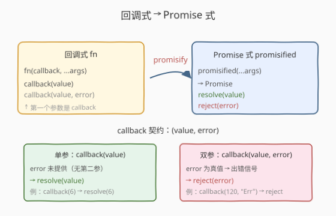
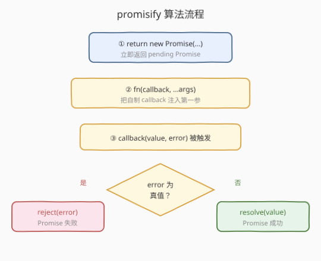
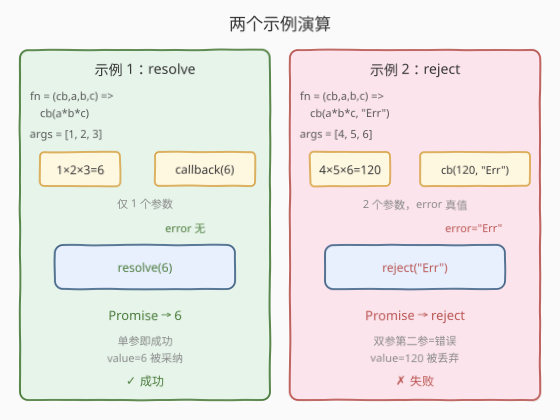

# 转换回调函数为 Promise 函数

- **题目名称**：转换回调函数为 Promise 函数
- **链接**：[2776. Convert Callback Based Function to Promise Based Function](https://leetcode.cn/problems/convert-callback-based-function-to-promise-based-function/)
- **难度**：中等
- **标签**：Promise、回调函数、闭包、`util.promisify`

## 1. 题目概述

> ⚠️ 本题为 LeetCode 付费题，题意描述根据官方示例用例与 hints 重建，可能与官方题面有出入。

给定一个**回调式异步函数** `fn`，它的签名是 `fn(callback, ...args)`：第一个参数是回调函数 `callback`，其余参数是业务参数 `...args`。函数内部会**同步或异步**地调用 `callback` 来通知结果。

请你实现一个 `promisify(fn)`，它返回一个**新的函数**：新函数接受同样的业务参数 `...args`，但**不再需要 callback**，而是返回一个 `Promise`。该 Promise 的 resolve / reject 由 `callback` 的调用方式决定：

- 当 `callback` 只被调用一个参数 `callback(value)` 时，Promise **resolve** 为 `value`；
- 当 `callback` 被调用两个参数 `callback(value, error)` 且 `error` 为真值时，Promise **reject** 为 `error`。

即 callback 的契约是 **「值在前、错误在后」**：`callback(value, error)`。一个参数表示成功、两个参数表示出错（第二个参数是错误原因）。

**示例 1**（成功路径）：

```text
输入：
fn = (callback, a, b, c) => { callback(a * b * c) }
args = [1, 2, 3]
输出：Promise resolved 为 6
解释：fn(callback, 1, 2, 3) 内部调用 callback(1*2*3) = callback(6)。
      callback 仅一个参数 → Promise resolve(6)。
```

**示例 2**（失败路径）：

```text
输入：
fn = (callback, a, b, c) => { callback(a * b * c, "Promise Rejected") }
args = [4, 5, 6]
输出：Promise rejected 为 "Promise Rejected"
解释：fn(callback, 4, 5, 6) 内部调用 callback(4*5*6, "Promise Rejected") = callback(120, "Promise Rejected")。
      callback 有第二个真值参数 error → Promise reject("Promise Rejected")。value=120 被丢弃。
```

**约束条件**：

- `fn` 是一个接受 `(callback, ...args)` 的函数；
- `args` 是传给原函数的业务参数数组；
- 本题仅开放 JavaScript / TypeScript 提交。

> 💡 本题是 LeetCode「30 天 JavaScript」系列的进阶题，考点不在算法复杂度，而在**回调 → Promise 的范式转换**——即 Node.js `util.promisify` 的核心思想。关键要读懂「callback 的两个参数分别表示什么」：本题采用**值在前、错误在后**（`callback(value, error)`）的契约，与 Node.js 标准的**错误在前**（`callback(err, ...results)`）恰好参数顺序相反，但判定错误的逻辑同构（「错误是否为真值」）。下文以 JS 为提交语言，并给出 Python 概念等价实现。

---

## 2. 解题思路

### 2.1 暴力思路：直接调用 `fn` 用 `.then` 串接

一种朴素想法是「先调用 `fn` 拿到结果，再包 Promise」。但这走不通——`fn` 的结果不是通过**返回值**给出的，而是通过**调用 callback** 给出的。`fn` 可能异步（如内部有 `setTimeout`），其同步返回值往往是 `undefined`，无法直接捕获结果。

因此**必须**主动构造一个 callback 注入 `fn`，在 callback 内部拿到 `(value, error)` 再决定 resolve / reject。这正是 `promisify` 的本质：**用 Promise 的 `resolve/reject` 去替换用户传入的 callback**。

### 2.2 核心观察：把 callback 嫁接成 resolve/reject



回调式与 Promise 式是**同一异步结果的两套通知机制**：

- 回调式：把「成功/失败」的逻辑写进一个 `callback` 函数，传给 `fn`，`fn` 在完成时调用它；
- Promise 式：返回一个 Promise，把「成功/失败」的逻辑写进 `resolve/reject`，完成时调用它们。

`promisify` 的工作就是**嫁接**二者：构造一个 `callback`，它的函数体只是「调用 `resolve` 或 `reject`」，再把这个 callback 作为第一个参数传给 `fn`。这样 `fn` 原本对 callback 的调用，就变成了对 `resolve/reject` 的调用。

分派规则（由 callback 契约 `(value, error)` 决定）：

| callback 被调用为 | error 状态 | Promise 行为 |
|-------------------|-----------|--------------|
| `callback(value)` | 未提供（无第二参） | `resolve(value)` |
| `callback(value, error)`，`error` 为真值 | 有错误 | `reject(error)`（`value` 丢弃） |

> 💡 **为什么用「`error` 真值」而非「参数个数」判定错误？** 本题契约是值在前、错误在后。最稳健的错误信号是「错误参数为真值」——与 Node.js `util.promisify` 的「`if (err) reject(err)`」判定完全同构（只是 Node 把 `err` 放第一参）。若改用 `arguments.length > 1`，当外部 `callback(value, undefined)` 显式传 `undefined` 表示「无错误」时会被误判为 reject；而真值判定对 `undefined`/`null`/`0` 等都视为「无错误」，语义更宽松、更鲁棒。给定测试用例两种判定等价，本文采用真值判定。

> ⚠️ **参数顺序陷阱**：本题 callback 是 `(value, error)`——**值在前**。切勿照搬 Node.js `util.promisify` 的 `(err, result)`（错误在前）模板直接套用，否则示例 1 的 `callback(6)` 会被当成「`err=6`」而错误地 reject(6)。先确认契约，再写分派。

### 2.3 算法流程图



整个 `promisify(fn)` 的执行分三步：

1. **返回 Promise**：`return new Promise((resolve, reject) => { ... })`——立即返回一个 pending 的 Promise，executor 体内的代码稍后执行；
2. **注入 callback 调用 fn**：在 executor 内构造 `callback(value, error)`，并以 `fn(callback, ...args)` 调用原函数（callback 作为第一参，业务参数透传其后）；
3. **callback 分派**：`fn` 完成时调用 callback，callback 内部据 `error` 真值调 `resolve(value)` 或 `reject(error)`，挂起的外层 Promise 随之 settle。

> 💡 **闭包捕获**：`callback` 闭包捕获了 executor 传入的 `resolve` / `reject`——即使 `fn` 异步调用 callback，这两个函数引用依然有效。这是「把异步结果桥接到 Promise」的关键机制：callback 不必关心何时被调用，只要被调用就能 settle Promise。这与 [2637. 有时间限制的 Promise 对象](../2601-2700/2637_有时间限制的Promise对象.md) 中 `Promise.race` 捕获 `resolve` 是同一手法。

### 2.4 示例演算



以两个示例对照演算：

| 示例 | fn 内部调用 | 参数个数 | error | 分派 | Promise 结果 |
|------|-------------|----------|-------|------|---------------|
| 1 | `callback(6)` | 1（无第二参） | `undefined`（无） | `resolve(6)` | fulfilled: `6` |
| 2 | `callback(120, "Promise Rejected")` | 2 | `"Promise Rejected"`（真值） | `reject("Promise Rejected")` | rejected: `"Promise Rejected"` |

> 💡 **示例 2 的关键点**：`value = 120` 被计算了（`4*5*6`），但因为有 error，它被**丢弃**——Promise 直接 reject，调用方拿到的 rejection reason 是 `"Promise Rejected"` 而非 `120`。这对应「失败时不关心成功值」的语义：error 一旦为真，整个 Promise 立即失败。

---

## 3. 参考代码

### JavaScript（提交语言）

```javascript
/**
 * @param {Function} fn  回调式函数，签名 fn(callback, ...args)
 * @return {Function}    返回 (...args) => Promise 的 Promise 式函数
 */
function promisify(fn) {
    return function (...args) {
        return new Promise((resolve, reject) => {
            // 1. 构造 callback：值在前、错误在后
            //    error 为真值 → reject(error)；否则 → resolve(value)
            function callback(value, error) {
                if (error) {
                    reject(error);
                } else {
                    resolve(value);
                }
            }
            // 2. 把 callback 作为第一参注入，业务参数透传其后
            fn(callback, ...args);
        });
    };
}
```

TypeScript 版（带类型约束）：

```typescript
type Callback = (value: any, error?: any) => void;
type Fn = (callback: Callback, ...args: any[]) => void;
type Promisified = (...args: any[]) => Promise<any>;

function promisify(fn: Fn): Promisified {
    return function (...args: any[]): Promise<any> {
        return new Promise((resolve, reject) => {
            const callback: Callback = (value, error) => {
                if (error) {
                    reject(error);
                } else {
                    resolve(value);
                }
            };
            fn(callback, ...args);
        });
    };
}
```

> 💡 **`return new Promise(...)` 而非 `async`**：本题不能用 `async/await` 简化——`fn` 不返回 Promise，结果只能通过 callback 取回，必须显式 `new Promise` 手动桥接。这与 [2723. 两个 Promise 对象相加](2723_两个Promise对象相加.md)（`async + await` 拍平）不同：2723 的输入已是 Promise，await 即可取值；本题输入是回调式，await 无从下手，必须用 callback 接力。两种范式对应 Promise 的两个面向——**消费**（await）与**构造**（`new Promise`）。

> 💡 **`fn(callback, ...args)` 而非 `fn(...args, callback)`**：注意 callback 的位置在**第一参**（题面 `fn(callback, ...args)`）。`util.promisify` 假定 callback 是**最后一参**（Node.js 惯例），本题恰好相反。故不能用 `util.promisify` 直接套，需按题面契约把 callback 放第一参。

### Python（概念等价）

> 本题 LeetCode 仅开放 JS/TS，Python 版作概念对照。Python 的 `concurrent.futures.Future` 与 JS Promise 模型同构，可用自定义 Future + 回调桥接模拟；更地道的是用 `asyncio.Future`。

```python
import asyncio


def promisify(fn):
    """把回调式 fn(callback, ...args) 转为 Promise 式 (...args) -> Future。

    callback 契约：callback(value, error)——值在前、错误在后。
    error 为真值 -> reject(error)；否则 -> resolve(value)。
    """
    def wrapper(*args):
        future = asyncio.get_event_loop().create_future()

        def callback(value, error=None):
            if error:
                if not future.done():
                    future.set_exception(Exception(error))
            else:
                if not future.done():
                    future.set_result(value)

        fn(callback, *args)
        return future

    return wrapper
```

> ⚠️ Python 中 `set_exception` 接收一个异常对象而非裸字符串，故把 `error` 包成 `Exception(error)`。同时用 `future.done()` 防护「callback 被重复调用」导致 `InvalidStateError`——JS Promise 天然忽略二次 settle（resolve/reject 只生效一次），Python Future 需手动守护。

---

## 4. 复杂度分析

| 维度 | 复杂度 | 说明 |
|------|--------|------|
| 时间复杂度 | $O(1)$（不含 `fn` 自身） | `promisify` 仅构造闭包并调用 `fn`，自身耗时常数；真正的异步耗时取决于 `fn` 内部逻辑 |
| 空间复杂度 | $O(1)$（不含 `fn` 闭包） | 仅持有 `callback` 闭包与一个 Promise 对象的引用 |

> 💡 本题复杂度不体现算法效率，而在**范式桥接的开销**：`promisify` 是一层极薄的适配器（adapter），把回调式接口适配为 Promise 式接口。适配器本身 $O(1)$，不改变底层 `fn` 的时间空间。这正是设计模式中「适配器」的精髓——不重写逻辑，只转换接口形态。

---

## 5. 扩展：Node.js `util.promisify` 与错误优先契约

### 5.1 Node.js 标准的「错误优先」回调

Node.js 的回调约定是 **`(err, ...results)`**——错误在第一参，成功结果在其余参数。判定规则：`if (err) reject(err); else resolve(results)`。`util.promisify` 即按此约定工作：

```javascript
const fs = require("fs");
const { promisify } = require("util");

const readFile = promisify(fs.readFile);   // callback 在最后一参
// readFile(path, enc) → Promise<Buffer>
```

`util.promisify` 假定：
1. callback 是**最后一参**；
2. callback 签名是 `(err, ...values)`——错误在前。

### 5.2 本题与标准 `util.promisify` 的两处差异

| 维度 | 本题契约 | Node.js `util.promisify` |
|------|----------|---------------------------|
| callback 位置 | **第一参** `fn(callback, ...args)` | **最后一参** `fn(...args, callback)` |
| 参数顺序 | **值在前** `(value, error)` | **错误在前** `(err, ...results)` |
| 错误判定 | `error`（第二参）真值 | `err`（第一参）真值 |

> 💡 **两者同构**：尽管位置与顺序相反，**「错误参数为真值则 reject」**的判定逻辑完全同构。本题是「值在前」变体——理解了标准 `util.promisify` 的「err 真值判定」，把 `err` 换到第二参即得本题解法。这种「同构不同序」的对照，正是面试官考察「是否真正理解契约而非死记模板」的切入点。

### 5.3 多结果回调

若 callback 契约是 `(value1, value2, ..., error)`（多个成功值 + 末尾 error），可把多值聚合为数组再 resolve：

```javascript
function callback(...cbArgs) {
    const error = cbArgs[cbArgs.length - 1];
    if (error) {
        reject(error);
    } else {
        resolve(cbArgs.slice(0, -1));   // 除末尾 error 外的成功值数组
    }
}
```

> 💡 标准 `util.promisify` 对多结果的处理：当 `err` 为 falsy 时，`resolve(results)` 只取**第一个** result（即 `...results` 的首元素）。若需全部，用 `util.promisify.custom` 自定义。本题仅单 value，无需此扩展。

---

## 6. 面试要点

1. **为什么不能用 `async/await` 简化本题？**

   > `async/await` 用于**消费**已有 Promise（`await promise` 取值）；而本题的 `fn` 是回调式，结果通过调用 callback 给出，**不返回 Promise**，await 无从下手。必须用 `new Promise` 手动**构造**一个 Promise，在 callback 内部调用 `resolve/reject` 把异步结果桥接进去。`async/await` 与 `new Promise` 对应 Promise 的两个面向——消费与构造，本题属后者。

2. **本题 callback 契约 `(value, error)` 与 Node.js `(err, result)` 有何不同？**

   > 顺序相反：本题**值在前、错误在后**，Node.js **错误在前、值在后**。但「错误参数为真值则 reject」的判定逻辑完全同构。故不能照搬 `util.promisify` 模板（它会取第一参为 `err`，把示例 1 的 `callback(6)` 误判为 `err=6` 而 reject）。必须先确认契约再写分派，这是面试中区分「死记模板」与「理解契约」的关键。

3. **为什么 `callback` 要作为 `fn` 的第一参而非最后一参？**

   > 因为题面明确规定 `fn` 签名是 `fn(callback, ...args)`——callback 在第一参。这与 Node.js 惯例（callback 在最后一参）相反，故 `util.promisify` 不可直接用，需按题面位置注入。注入位置错误会导致 `fn` 把 callback 当业务参数、把业务参数当 callback，运行即报错。

4. **如果 `fn` 异步调用 callback（如内部有 `setTimeout`），Promise 会怎样？**

   > Promise 一直处于 pending，直到 `fn` 异步调用 callback 触发 `resolve/reject` 才 settle。`callback` 闭包捕获的 `resolve/reject` 引用在异步调用时依然有效（闭包不随外层返回而失效）。这正是 Promise 能表达「未来才会完成的异步」的根本——executor 立即返回 pending Promise，settle 时机由 callback 决定。

5. **如果 callback 被调用多次会怎样？Promise 会变吗？**

   > JS Promise 的 `resolve/reject` **只生效一次**：首次 settle 后状态锁定，后续调用被静默忽略。故即使 `fn` 误调多次 callback，Promise 也只采纳首次结果，不会反复变更。本题示例均单次调用，但这一兜底语义是 Promise 设计的安全网。

> 💡 **一句话总结**：2776 = 「`new Promise` 内构造 `callback(value, error)`，据 `error` 真值分派 `resolve/reject`，把 callback 作为第一参注入 `fn`」。本质是把回调式接口适配为 Promise 式接口的薄适配器——`util.promisify` 的「值在前」变体。

---

## 7. 同类练习题

- [2723. 两个 Promise 对象相加](https://leetcode.cn/problems/add-two-promises/)（[题解](2723_两个Promise对象相加.md)）：`async + await` **消费**已有 Promise 取值求和，与本题 `new Promise` **构造** Promise 形成对照——Promise 的消费面 vs 构造面
- [2637. 有时间限制的 Promise 对象](https://leetcode.cn/problems/promise-time-limit/)（[题解](../2601-2700/2637_有时间限制的Promise对象.md)）：`Promise.race` 在 `fn` 与超时 Promise 间赛跑，复用「闭包捕获 resolve/reject」的桥接手法，把本题的回调嫁接升级为竞速取消
- [2721. 并行执行异步函数](https://leetcode.cn/problems/execute-asynchronous-functions-in-parallel/)（[题解](2721_并行执行异步函数.md)）：手写 `Promise.all`，在多个 Promise 间用闭包计数器桥接 resolve/reject——闭包捕获同一手法的多值并发版
- [2621. 睡眠函数](https://leetcode.cn/problems/sleep/)（[题解](../2601-2700/2621_睡眠函数.md)）：`new Promise` + `setTimeout` 回调里调 `resolve`，是最简的「回调→Promise 桥接」，承接本题的 `new Promise` 构造范式
- [2715. 执行可取消的延迟函数](https://leetcode.cn/problems/timeout-cancellation/)（[题解](2715_执行可取消的延迟函数.md)）：`setTimeout` + `clearTimeout` 的定时器生命周期管理，同属「30 天 JS」异步系列，从 Promise 构造转向回调/定时器治理
