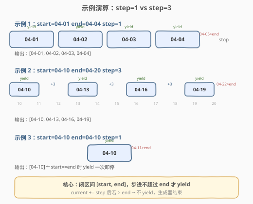

# 日期范围生成器

- **题目名称**：日期范围生成器
- **链接**：[2777. 日期范围生成器](https://leetcode.cn/problems/date-range-generator/)
- **难度**：中等
- **标签**：生成器、日期、迭代器、JavaScript

## 1. 题目概述

> ⚠️ 本题为 LeetCode 付费题，题意描述根据官方示例用例与 hints 重建，可能与官方题面有出入。

实现一个 JavaScript **生成器函数**（`function*`），给定起始日期 `startDate`、结束日期 `endDate` 和步长 `step`（天数），按 `step` 天为间隔，从 `startDate` 到 `endDate`（**含两端**）依次 **yield** 日期字符串，格式为 `YYYY-MM-DD`。

> 💡 本题考查两个知识点：**JS 生成器函数**（`function*` + `yield`）的用法，以及**日期运算与时区处理**的正确性。

**示例 1**：

```text
输入：startDate = "2023-04-01", endDate = "2023-04-04", step = 1
输出：["2023-04-01","2023-04-02","2023-04-03","2023-04-04"]
解释：从 04-01 到 04-04，步长 1 天，共 yield 4 个日期。
```

**示例 2**：

```text
输入：startDate = "2023-04-10", endDate = "2023-04-20", step = 3
输出：["2023-04-10","2023-04-13","2023-04-16","2023-04-19"]
解释：04-10 + 3 = 04-13，+ 3 = 04-16，+ 3 = 04-19，再 + 3 = 04-22 > 04-20，停止。
```

**示例 3**：

```text
输入：startDate = "2023-04-10", endDate = "2023-04-10", step = 1
输出：["2023-04-10"]
解释：起点等于终点，yield 一次后 current 已超过 end，生成器结束。
```

**约束条件**（根据示例推断）：

- `startDate`、`endDate` 为合法的 `YYYY-MM-DD` 格式日期字符串（或 `Date` 对象）
- `step` 为正整数
- `startDate <= endDate`

---

## 2. 解题思路

### 2.1 暴力思路

最直觉的做法是循环 `setDate` / `getDate`，每次加 `step` 天后 yield。但 JavaScript 的 `Date` 对象有一个经典陷阱：**`setDate` 和 `getDate` 基于本地时区**，而纯日期字符串 `"2023-04-01"` 被 `new Date()` 解析为 **UTC 午夜**。在 UTC 偏移为负的时区（如美东 UTC-5），`getDate()` 会返回前一天，导致日期错位。

```javascript
// ❌ 有时区陷阱的写法
function* dateRangeGenerator(startDate, endDate, step) {
    let current = new Date(startDate);
    const end = new Date(endDate);
    while (current <= end) {
        yield current.toISOString().slice(0, 10); // 可能错一天
        current.setDate(current.getDate() + step); // getDate() 受本地时区影响
    }
}
```

### 2.2 核心观察：时间戳算术避开时区


两个关键观察：

1. **日期-only 字符串按 UTC 解析**：`new Date("2023-04-01")` 创建的是 UTC 午夜的 Date 对象。在 UTC 时间下，每一天恰好是 $86400000$ 毫秒（24 × 60 × 60 × 1000），**不存在 DST（夏令时）跳变**——DST 只影响本地时间，不影响 UTC 时间戳的连续性。

2. **用时间戳做加减法**：将 `startDate` 和 `endDate` 都转为毫秒时间戳，循环中直接 `current += step × 86400000`。比较用 `current <= end`，输出用 `new Date(current).toISOString().slice(0, 10)`。全程不调用 `getDate()`/`setDate()`，彻底绕开时区问题。

> 💡 **为什么不直接用 `setDate`？** `setDate(d.getDate() + step)` 在本地时区操作。如果 Date 对象是 UTC 午夜但本地时区是 UTC-5，`getDate()` 返回的是前一天的日期号（如 3 月 31 日而非 4 月 1 日），`setDate` 后日期偏移一天。时间戳法在 UTC 域做算术，结果可预测且不受运行环境时区影响。

### 2.3 算法流程图


### 2.4 示例演算



以**示例 2**（`step=3`）为例，逐步追踪 `current`（毫秒时间戳）：

| 迭代 | current（日期） | current ≤ end? | 动作 |
|------|------------------|----------------|------|
| ① | 04-10 | $04\text{-}10 \le 04\text{-}20$ ✓ | yield `"2023-04-10"`，current += $3 \times 86400000$ |
| ② | 04-13 | $04\text{-}13 \le 04\text{-}20$ ✓ | yield `"2023-04-13"`，current += $3 \times 86400000$ |
| ③ | 04-16 | $04\text{-}16 \le 04\text{-}20$ ✓ | yield `"2023-04-16"`，current += $3 \times 86400000$ |
| ④ | 04-19 | $04\text{-}19 \le 04\text{-}20$ ✓ | yield `"2023-04-19"`，current += $3 \times 86400000$ |
| ⑤ | 04-22 | $04\text{-}22 \le 04\text{-}20$ ✗ | 不 yield，生成器结束 |

> 💡 关键：`04-19 + 3 = 04-22` 已超过 `end=04-20`，所以最后一次 yield 的是 `04-19` 而非 `04-20`——**不是总能 yield 到 end**，取决于步长能否恰好踩到 end。

---

## 3. 参考代码

### JavaScript

```javascript
function* dateRangeGenerator(startDate, endDate, step) {
    const DAY_MS = 86400000; // 24 * 60 * 60 * 1000
    let current = new Date(startDate).getTime();
    const end = new Date(endDate).getTime();
    while (current <= end) {
        yield new Date(current).toISOString().slice(0, 10);
        current += step * DAY_MS;
    }
}
```

> 💡 `new Date(startDate)` 同时兼容字符串和 Date 对象输入。`toISOString()` 返回 `"2023-04-01T00:00:00.000Z"`，`.slice(0, 10)` 截取日期部分。

### TypeScript

```typescript
function* dateRangeGenerator(
    startDate: string | Date,
    endDate: string | Date,
    step: number
): Generator<string, void, unknown> {
    const DAY_MS = 86400000;
    let current = new Date(startDate).getTime();
    const end = new Date(endDate).getTime();
    while (current <= end) {
        yield new Date(current).toISOString().slice(0, 10);
        current += step * DAY_MS;
    }
}
```

### Python（概念等价）

```python
from datetime import datetime, timedelta
from typing import Generator

def date_range_generator(start_date: str, end_date: str, step: int) -> Generator[str, None, None]:
    current = datetime.strptime(start_date, "%Y-%m-%d")
    end = datetime.strptime(end_date, "%Y-%m-%d")
    while current <= end:
        yield current.strftime("%Y-%m-%d")
        current += timedelta(days=step)
```

> ⚠️ Python 的 `datetime` + `timedelta` 天然处理了闰年和各月天数，无需手动进位。这是 Python 处理日期问题的推荐方式。

---

## 4. 复杂度分析

| 维度 | 复杂度 | 说明 |
|------|--------|------|
| **时间** | $O\!\left(\dfrac{D}{\text{step}}\right)$ | $D$ 为 start 到 end 的天数差，每次迭代 yield 一个日期并步进 step 天，总迭代次数 $\lceil D/\text{step} \rceil + 1$ |
| **空间** | $O(1)$ | 生成器是惰性的，每次只保存 `current` 和 `end` 两个时间戳，不预存全部结果 |

> 💡 生成器的核心优势是**惰性求值**：调用方按需 `for...of` 或 `.next()` 消费，不在内存中构建整个日期数组。当日期跨度很大（如 10 年按天步进）时，生成器比返回数组的方案省内存。

---

## 5. 扩展：`setUTCDate` 替代方案

若不想用时间戳算术，也可以用 **UTC 系列方法** 保证时区一致性：

```javascript
function* dateRangeGenerator(startDate, endDate, step) {
    let current = new Date(startDate);
    const end = new Date(endDate);
    while (current.getTime() <= end.getTime()) {
        yield current.toISOString().slice(0, 10);
        current.setUTCDate(current.getUTCDate() + step);
    }
}
```

`getUTCDate()` / `setUTCDate()` 始终在 UTC 域操作，不受本地时区影响。与时间戳方案等价，但多了一次 `setUTCDate` 的进位计算（自动处理跨月跨年），代码可读性略好。

> ⚠️ 不能混用 `getDate()`（本地时区）和 `toISOString()`（UTC 格式化），两者时区不一致会导致日期错位。要么全用本地时区方法，要么全用 UTC 方法，**不可混用**。

---

## 6. 面试要点

**Q1：为什么用时间戳（`getTime()`）而不是 `setDate`/`getDate`？**
> 纯日期字符串 `"2023-04-01"` 被 `new Date()` 解析为 UTC 午夜，但 `getDate()` 返回的是本地时区的日期号。在 UTC 偏移为负的时区，UTC 午夜会被本地时间回退到前一天，导致 `getDate()` 返回 31 而非 1。用 `getTime()` 获取 UTC 时间戳后直接做加减法，完全在 UTC 域操作，不受运行环境时区影响。

**Q2：生成器函数 `function*` 和普通函数有什么区别？**
> `function*` 声明的函数调用后不立即执行函数体，而是返回一个**迭代器**（Generator 对象）。每次调用 `.next()` 执行到 `yield` 处暂停并返回 `{ value, done }`，下一次 `.next()` 从上次暂停处恢复。这实现了**惰性求值**——值按需产生，不预先计算全部。

**Q3：`86400000` 这个魔数是什么？能不能用更可读的写法？**
> $86400000 = 24 \times 60 \times 60 \times 1000$，即一天的毫秒数。可读性更好的写法：`const DAY_MS = 24 * 60 * 60 * 1000;` 或用常量表达式让计算器在编译期求值。注意：这个值只在 **UTC 域** 恰好等于一天——本地时间域因 DST 存在 23 或 25 小时的天，不能直接用此魔数。

**Q4：如果 `startDate > endDate` 会怎样？**
> `while` 条件 `current <= end` 首次即为 `false`，生成器不 yield 任何值，直接结束。调用方拿到空序列，行为符合预期（空区间无日期可生成）。

**Q5：生成器能用于 `for...of` 和展开运算符吗？**
> 可以。生成器对象实现了 `Symbol.iterator`，`for (const d of dateRangeGenerator(...))` 可直接遍历。`[...dateRangeGenerator(...)]` 会消费全部 yield 值并转为数组。但后者会失去惰性优势，仅在需要数组时使用。

---

## 7. 同类练习题

- [2758. 下一天](https://leetcode.cn/problems/next-day/)（[题解](../2701-2800/2758_下一天.md)）：日期进一位的核心单元，本题的 `step` 递增是它的循环版
- [1360. 日期之间隔几天](https://leetcode.cn/problems/number-of-days-between-two-dates/)：计算两个日期的天数差，与本题的步进计数互补
- [1154. 一年中的第几天](https://leetcode.cn/problems/day-of-the-year/)：给定日期返回一年中第几天，复用月天数表与闰年判定
- [2754. 将函数绑定到上下文](https://leetcode.cn/problems/bind-function-to-context/)（[题解](../2701-2800/2754_将函数绑定到上下文.md)）：同为 JS 函数式编程题，闭包捕获与生成器的惰性求值是两类"返回函数/迭代器"的设计模式
- [2694. 事件发射器](https://leetcode.cn/problems/event-emitter/)（[题解](../2601-2700/2694_事件发射器.md)）：JS 设计模式题，`subscribe`/`emit` 与生成器的 `yield`/`next` 都是"生产-消费"通信模型
