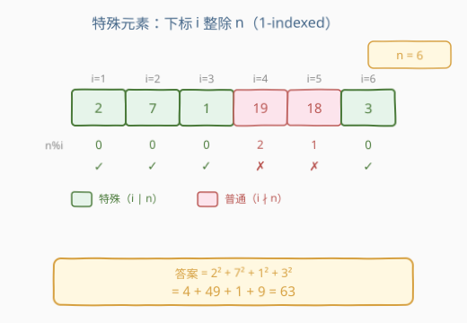
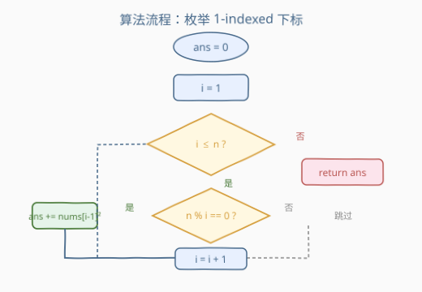
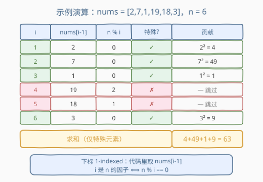

# LeetCode 特殊元素平方和 题解

## 1. 题目概述

- **标题 / 题号**：特殊元素平方和（#2778，easy）
- **链接**：https://leetcode.cn/problems/sum-of-squares-of-special-elements/
- **难度**：简单
- **标签**：数组、枚举

**题意**：给你一个下标从 **1** 开始、长度为 `n` 的整数数组 `nums`。

对 `nums` 中的元素 `nums[i]` 而言，如果 `n` 能够被 `i` 整除，即 $n \bmod i = 0$，则认为 `nums[i]` 是一个 **特殊元素**。

返回 `nums` 中所有 **特殊元素** 的 **平方和**。

**示例 1**：

```text
输入：nums = [1,2,3,4]
输出：21
解释：n = 4。i=1 时 4%1=0，i=2 时 4%2=0，i=4 时 4%4=0，均为特殊元素。
     平方和 = 1² + 2² + 4² = 1 + 4 + 16 = 21。
```

**示例 2**：

```text
输入：nums = [2,7,1,19,18,3]
输出：63
解释：n = 6。特殊下标为 1、2、3、6（均为 6 的因子）。
     平方和 = 2² + 7² + 1² + 3² = 4 + 49 + 1 + 9 = 63。
```

**约束**：

- $1 \le \text{nums.length} = n \le 50$
- $1 \le \text{nums}[i] \le 50$

## 2. 解题思路

### 2.1 暴力思路：逐下标枚举

最直观的做法：用一个循环 `i` 从 $1$ 到 $n$，对每个下标判断 $n \bmod i$ 是否为 $0$，若是就把 `nums[i-1]` 的平方累加进答案（注意题目是 **1-indexed**，而代码数组是 0-indexed，故取 `nums[i-1]`）。该做法 $O(n)$ 时间、$O(1)$ 空间，在 $n \le 50$ 的约束下完全够用。

### 2.2 核心观察：特殊下标 = n 的因子



关键在于把「$n \bmod i = 0$」翻译成熟悉的语言——$i$ 是 $n$ 的**因子**（$i \mid n$）。于是「特殊元素」就是「下标恰为 $n$ 的某个因子」的元素。$n = 6$ 的因子是 $\{1,2,3,6\}$，正好对应示例 2 的四个特殊下标。

这给了我们一个优化视角：不必枚举到 $n$，只需枚举到 $\sqrt{n}$。每发现一个因子 $d$，**成对**收获 $d$ 与 $n/d$ 两个特殊下标，将枚举量从 $O(n)$ 降到 $O(\sqrt{n})$：

$$\text{对每个 } d \in [1,\lfloor\sqrt{n}\rfloor],\ \text{若 } n \bmod d = 0 \Rightarrow i=d \text{ 与 } i=n/d \text{ 均特殊}$$

> ⚠️ 当 $n$ 是完全平方数时会出现 $d = n/d$（如 $n=4, d=2$），此时两个下标重合，**只加一次**，避免重复计入。

> 💡 一句话：$n \bmod i = 0$ 即 $i$ 是 $n$ 的因子；枚举到 $\sqrt{n}$ 成对取因子，是数论枚举的经典套路。

### 2.3 算法流程图



### 2.4 示例演算

以 `nums = [2,7,1,19,18,3], n = 6` 为例，逐下标演算：



| i | nums[i-1] | n % i | 特殊? | 贡献 |
|---|-----------|-------|-------|------|
| 1 | 2  | 0 | ✓ | 2² = 4 |
| 2 | 7  | 0 | ✓ | 7² = 49 |
| 3 | 1  | 0 | ✓ | 1² = 1 |
| 4 | 19 | 2 | ✗ | — 跳过 |
| 5 | 18 | 1 | ✗ | — 跳过 |
| 6 | 3  | 0 | ✓ | 3² = 9 |

对四个特殊元素求和：$4 + 49 + 1 + 9 = 63$。✅

## 3. 参考代码

### C++

```cpp
// O(n) 逐下标枚举
class Solution {
public:
    int sumOfSquares(vector<int>& nums) {
        int n = nums.size(), ans = 0;
        for (int i = 1; i <= n; ++i) {
            if (n % i == 0) {
                ans += nums[i - 1] * nums[i - 1];
            }
        }
        return ans;
    }
};
```

### Python

```python
class Solution:
    def sumOfSquares(self, nums: List[int]) -> int:
        n = len(nums)
        return sum(x * x for i, x in enumerate(nums, 1) if n % i == 0)
```

## 4. 复杂度分析

| 维度 | 复杂度 | 说明 |
|------|--------|------|
| 时间复杂度 | $O(n)$ | 循环 $n$ 次，每次 $O(1)$ 取模判断 |
| 空间复杂度 | $O(1)$ | 仅用常数变量 `ans` |

## 5. 扩展：成对取因子，优化到 $O(\sqrt{n})$

利用 2.2 的观察，只枚举到 $\lfloor\sqrt{n}\rfloor$，每命中一个因子 $d$ 就成对累加 `nums[d-1]` 与 `nums[n/d-1]` 的平方，并特判 $d = n/d$ 的重合情况：

```cpp
// O(sqrt(n)) 成对取因子
class Solution {
public:
    int sumOfSquares(vector<int>& nums) {
        int n = nums.size(), ans = 0;
        for (int d = 1; d * d <= n; ++d) {
            if (n % d == 0) {
                ans += nums[d - 1] * nums[d - 1];
                int other = n / d;
                if (other != d) {            // 完全平方数避免重复
                    ans += nums[other - 1] * nums[other - 1];
                }
            }
        }
        return ans;
    }
};
```

| 维度 | 复杂度 | 说明 |
|------|--------|------|
| 时间复杂度 | $O(\sqrt{n})$ | 只枚举到 $\sqrt{n}$，成对取因子 |
| 空间复杂度 | $O(1)$ | 仅用常数变量 |

> 💡 本题 $n \le 50$，$O(n)$ 已极快，$O(\sqrt{n})$ 的收益微乎其微；但「枚举到 $\sqrt{n}$ 成对取因子」是判断因子/枚举约数时的通用范式，在 $n$ 较大（如 $10^9$）时是必须的优化。

## 6. 面试要点

1. **题目是 1-indexed，代码怎么对应？**
   - 题目下标从 1 开始，代码数组从 0 开始，故下标 `i` 对应元素 `nums[i-1]`，平方累加时务必减 1，这是本题最常见的越界坑点。

2. **$n \bmod i = 0$ 的等价说法是什么？**
   - 即 $i$ 是 $n$ 的因子（$i \mid n$）。识别出这一点，才能自然联想到「枚举约数」的 $O(\sqrt{n})$ 范式。

3. **$n = 1$ 时答案是什么？**
   - $i = 1$，$1 \bmod 1 = 0$，唯一特殊元素是 `nums[0]`，答案即 `nums[0]²`；不会越界。

4. **优化到 $O(\sqrt{n})$ 时，完全平方数 $n$ 的坑是什么？**
   - 当 $d = n/d$（如 $n = 4, d = 2$）时两个下标重合，必须 `if (other != d)` 判重，否则会把同一元素的平方加两次。

5. **本题属于哪类套路？**
   - 「**枚举 + 条件筛选 + 累加**」的简单模拟题，核心是把题面条件翻译成可计算的判据（取模/因子），再决定枚举范围。识别因子关系后可套用 $O(\sqrt{n})$ 约数枚举范式。

## 同类练习题

| # | 题目 | 与本题的关联 |
|---|------|-------------|
| 2176 | [统计数组中相等且可以被整除的数对](https://leetcode.cn/problems/count-equal-and-divisible-pairs-in-an-array/) | 统计满足 `nums[i]==nums[j]` 且 `i*j` 被 `k` 整除的下标对，同为「下标层面做整除判定」。 |
| 1394 | [找出数组中的幸运数](https://leetcode.cn/problems/find-lucky-integer-in-an-array/) | 幸运数 = 值等于其出现次数的元素，与本题同为「按条件定义特殊元素后求最值/求和」。 |
| 1742 | [盒子中小球的最大数量](https://leetcode.cn/problems/maximum-number-of-balls-in-a-box/) | 按数位和映射到盒子编号再求最大数量，同为「枚举 + 简单映射 + 聚合」。 |
| 1941 | [检查是否所有字符出现次数相同](https://leetcode.cn/problems/check-if-all-characters-have-equal-number-of-occurrences/) | 统计频率后做条件判定，枚举与频次聚合的入门练习。 |
