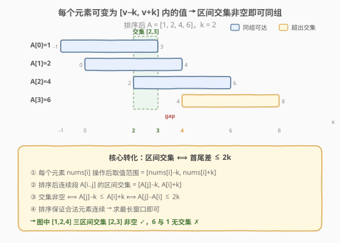
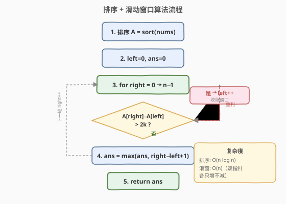

# LeetCode 数组的最大美丽值 题解

## 1. 题目概述

- **标题 / 题号**：数组的最大美丽值（#2779，medium）
- **链接**：https://leetcode.cn/problems/maximum-beauty-of-an-array-after-applying-operation/
- **难度**：中等
- **标签**：数组、排序、滑动窗口、二分查找

**题意**：给你一个下标从 **0** 开始的整数数组 `nums` 和一个**非负**整数 `k`。在一步操作中，你可以执行下述指令：

- 在范围 `[0, nums.length - 1]` 中选择一个**此前没有选过**的下标 `i`。
- 将 `nums[i]` 替换为范围 `[nums[i] - k, nums[i] + k]` 内的任意整数。

数组的**美丽值**定义为数组中由相等元素组成的最长子序列的长度。

对数组 `nums` 执行上述操作任意次后，返回数组可能取得的**最大**美丽值。

> ⚠️ 你**只**能对每个下标执行**一次**此操作。子序列可由原数组删除一些元素（也可不删）得到，剩余元素顺序不变。

**示例 1**：

```text
输入：nums = [4,6,1,2], k = 2
输出：3
解释：执行下述操作：
- 选择下标 1，将其替换为 4（从范围 [4,8] 中选出），此时 nums = [4,4,1,2]。
- 选择下标 3，将其替换为 4（从范围 [0,4] 中选出），此时 nums = [4,4,1,4]。
执行上述操作后，数组的美丽值是 3（子序列由下标 0、1、3 对应的元素组成）。
```

**示例 2**：

```text
输入：nums = [1,1,1,1], k = 10
输出：4
解释：无需执行任何操作，整个数组本身就是 4 个相等元素。
```

**约束**：

- `1 <= nums.length <= 10^5`
- `0 <= nums[i], k <= 10^5`

## 2. 解题思路

### 2.1 暴力思路

枚举最终所有相等元素的目标值 $x$，再对每个元素判断 $x$ 是否落在 $[\text{nums}[i]-k, \text{nums}[i]+k]$ 内，统计能变为 $x$ 的元素个数。但目标值 $x$ 的取值范围是 $[-10^5, 2\times10^5]$，逐个枚举加上逐元素检查是 $O(n \cdot V)$，会超时。

### 2.2 核心观察：排序 + 区间交集 ⟺ 最长窗口（差值 ≤ 2k）



每个元素 $\text{nums}[i]$ 经过操作后可取值的范围是一个闭区间 $[\text{nums}[i]-k, \text{nums}[i]+k]$。一组元素能**全部变为同一个值** $x$，当且仅当这些区间的**交集非空**。

对于排序后的一段连续子数组 $A[i..j]$（$A[i]$ 最小、$A[j]$ 最大），各区间交集为：

$$\bigcap_{t=i}^{j} [A[t]-k,\; A[t]+k] = [A[j]-k,\; A[i]+k]$$

该交集非空的条件是 $A[j]-k \le A[i]+k$，即：

$$A[j] - A[i] \le 2k$$

> 💡 **为什么排序后合法元素一定连续？** 排序后，若 $A[i]$ 和 $A[j]$ 的区间有交集（$A[j]-A[i]\le 2k$），则夹在中间的任何 $A[t]$（$i<t<j$）满足 $A[i]\le A[t]\le A[j]$，其区间 $[A[t]-k, A[t]+k]$ 一定与交集 $[A[j]-k, A[i]+k]$ 有重叠，因此也属于同一组。所以排序后**合法组就是一段连续子数组**，求最长即可——子序列在排序后天然变为子数组。

于是问题转化为：**排序后，找最长的子数组使其首尾差值 $\le 2k$**，这正是经典滑动窗口。

### 2.3 算法流程图



`right` 每轮右扩一格，当 $A[\text{right}] - A[\text{left}] > 2k$ 时不断收缩 `left`，窗口内始终满足差值约束。`right` 和 `left` 都只增不减，合计最多各推进 $n$ 次。

### 2.4 示例演算

![示例演算：[4,6,1,2], k=2](../images/p2779_example_walkthrough.svg)

以 `nums = [4,6,1,2], k = 2` 为例，排序后 $A = [1,2,4,6]$，阈值 $2k = 4$：

- `right=0`：窗口 $[1]$，$1-1=0\le4$ ✓，`ans=1`
- `right=1`：窗口 $[1,2]$，$2-1=1\le4$ ✓，`ans=2`
- `right=2`：窗口 $[1,2,4]$，$4-1=3\le4$ ✓，`ans=3`
- `right=3`：$6-1=5>4$ ✗，收缩 `left` → $6-2=4\le4$ ✓，窗口 $[2,4,6]$，`ans=3`

最终答案为 **3**。三个值 $1,2,4$ 可全部变为 $[2,3]$ 内的任意值（如 $3$）。

## 3. 参考代码

### C++（排序 + 滑动窗口）

```cpp
class Solution {
public:
    int maximumBeauty(vector<int>& nums, int k) {
        sort(nums.begin(), nums.end());
        int ans = 0, left = 0;
        for (int right = 0; right < (int)nums.size(); right++) {
            while (nums[right] - nums[left] > 2 * k) {
                left++;
            }
            ans = max(ans, right - left + 1);
        }
        return ans;
    }
};
```

### Python

```python
class Solution:
    def maximumBeauty(self, nums: List[int], k: int) -> int:
        nums.sort()
        ans = 0
        left = 0
        for right in range(len(nums)):
            while nums[right] - nums[left] > 2 * k:
                left += 1
            ans = max(ans, right - left + 1)
        return ans
```

> 💡 **二分写法**：也可对每个 `i`，用 `upper_bound` 找最后一个 $\le A[i]+2k$ 的位置 `j`，`ans = max(ans, j - i)`。复杂度同为 $O(n\log n)$，但滑窗写法常数更小、无需二分。

## 4. 复杂度分析

| 维度 | 复杂度 | 说明 |
|------|--------|------|
| 时间复杂度 | $O(n \log n)$ | 排序 $O(n\log n)$ 为主项；滑窗阶段 `right`/`left` 合计最多各推进 $n$ 次，为 $O(n)$ |
| 空间复杂度 | $O(\log n)$ | 排序所需栈空间（原地排序，无额外数据结构） |

## 5. 扩展：二分查找写法

滑动窗口依赖「差值随窗口扩大单调不减」的性质，因此也可不维护 `left`，直接对每个起点二分：

```cpp
int maximumBeauty(vector<int>& nums, int k) {
    sort(nums.begin(), nums.end());
    int ans = 0;
    for (int i = 0; i < (int)nums.size(); i++) {
        int j = upper_bound(nums.begin(), nums.end(), nums[i] + 2 * k) - nums.begin();
        ans = max(ans, j - i);
    }
    return ans;
}
```

`upper_bound` 找首个 $> A[i]+2k$ 的位置，`j-i` 即以 $A[i]$ 为最小值时的最大组大小。两种写法等价，滑窗更简洁。

## 6. 面试要点

1. **为什么排序不影响答案？**

   - 题目求的是子序列（可删元素、保序），排序后选取的连续段在原数组中只需保持相对顺序即可构成子序列，因此排序只是重新排列候选集，不影响哪些元素能被选入同一组。

2. **为什么合法元素排序后一定连续？**

   - 排序后若 $A[i]$ 与 $A[j]$（$i<j$）能同组（$A[j]-A[i]\le 2k$），中间任意 $A[t]$ 满足 $A[i]\le A[t]\le A[j]$，其区间必与交集 $[A[j]-k, A[i]+k]$ 重叠，故也属于同组——连续性由此保证。

3. **为什么用 $2k$ 而不是 $k$？**

   - 每个元素可在自身 $\pm k$ 内浮动，两个元素能相遇的条件是最小者的上界 $\ge$ 最大者的下界，即 $A[i]+k \ge A[j]-k$，移项得 $A[j]-A[i]\le 2k$。$2k$ 是两个 $k$ 各贡献一个。

4. **滑窗与二分哪种更优？**

   - 排序后两者均为 $O(n\log n)$ 总复杂度，但滑窗的扫描部分是 $O(n)$ 优于二分的 $O(n\log n)$；实际中滑窗常数更小。若数组已部分有序，滑窗优势更明显。

5. **每个下标只能操作一次，会不会影响？**

   - 不会。一次操作把 $\text{nums}[i]$ 变为目标值后即为定值，不需要二次修改；题目限制「每个下标一次」恰好与「每个元素选一个目标值」一一对应，无额外约束。

## 同类练习题

| # | 题目 | 与本题的关联 |
|---|------|-------------|
| 1838 | [最高频元素的频率](https://leetcode.cn/problems/frequency-of-the-most-frequent-element/) | 同样排序 + 滑窗，可对元素「+1」操作累计代价 $\le k$，求最高频，与本题同构 |
| 2968 | [执行操作使频率分数最大](https://leetcode.cn/problems/apply-operations-to-maximize-frequency-score/) | 1838 的进阶版，可 $+1$ 或 $-1$，排序 + 滑窗 + 前缀和判定 |
| 209 | [长度最小的子数组](https://leetcode.cn/problems/minimum-size-subarray-sum/) | 同向双指针滑窗母题，正数单调性驱动收缩 |
| 1984 | [学生分数的最小差值](https://leetcode.cn/problems/minimum-difference-between-highest-and-lowest-of-k-scores/) | 排序后定长窗口取最小差值，与本题排序后窗口思维一致 |
