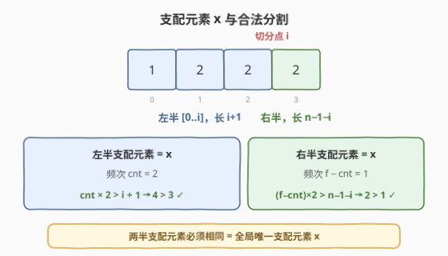
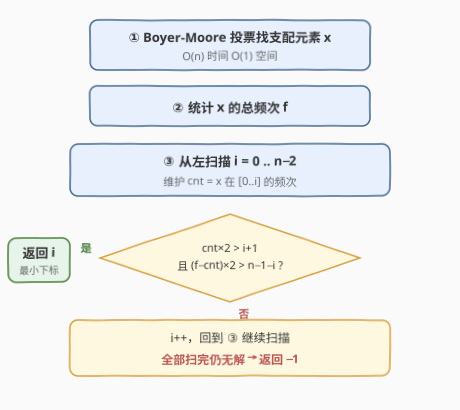
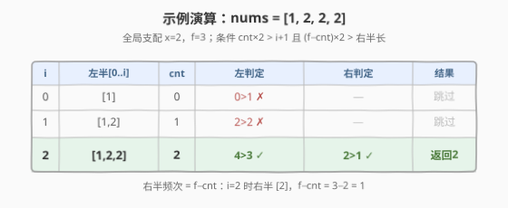

# LeetCode 合法分割的最小下标 题解

## 1. 题目概述

- **标题 / 题号**：合法分割的最小下标（#2780，medium）
- **链接**：https://leetcode.cn/problems/minimum-index-of-a-valid-split/
- **难度**：中等
- **标签**：数组、哈希表、排序

**题意**：如果长度为 $m$ 的整数数组 `arr` 中**超过一半**的元素值为 $x$，则称 $x$ 是该数组的**支配元素**。

给你一个下标从 **0** 开始、长度为 $n$ 的整数数组 `nums`，数据保证它恰好含有**一个**支配元素。

你需要在下标 $i$ 处将 `nums` 分割成两个数组 `nums[0, ..., i]` 和 `nums[i + 1, ..., n - 1]`，若满足以下条件则称该分割**合法**：

- $0 \le i < n - 1$
- `nums[0, ..., i]` 和 `nums[i + 1, ..., n - 1]` 的支配元素**相同**。

返回一个**合法**分割的**最小**下标。若不存在合法分割，返回 $-1$。

**示例 1**：

```text
输入：nums = [1,2,2,2]
输出：2
解释：在下标 2 处分割，得到 [1,2,2] 和 [2]。
[1,2,2] 中元素 2 出现 2 次，2×2 > 3，是支配元素；
[2] 中元素 2 出现 1 次，1×2 > 1，是支配元素。
两半支配元素相同（均为 2），故合法，2 为最小下标。
```

**示例 2**：

```text
输入：nums = [2,1,3,1,1,1,7,1,2,1]
输出：4
解释：在下标 4 处分割，得到 [2,1,3,1,1] 和 [1,7,1,2,1]。
左半 1 出现 3 次，3×2 > 5；右半 1 出现 3 次，3×2 > 5。
两半支配元素均为 1，合法，4 为最小下标。
```

**示例 3**：

```text
输入：nums = [3,3,3,3,7,2,2]
输出：-1
解释：不存在合法分割。
```

**约束**：

- $1 \le \text{nums.length} \le 10^5$
- $1 \le \text{nums}[i] \le 10^9$
- `nums` 有且只有一个支配元素。

## 2. 解题思路

### 2.1 暴力思路

枚举每个分割点 $i$（共 $n-1$ 个），对左右两半分别用哈希表统计频次、找出支配元素并比较是否相同。每个分割点需 $O(n)$ 重建统计，总计 $O(n^2)$，在 $n=10^5$ 下超时。

### 2.2 核心观察：两半支配元素必然等于全局支配元素



**关键引理**：若某个分割合法，则两半的支配元素一定等于整个数组 `nums` 的支配元素 $x$。

> 💡 **证明**：设两半的支配元素同为 $y$，则 $y$ 在左半出现 $> \frac{i+1}{2}$ 次、在右半出现 $> \frac{n-1-i}{2}$ 次。两者相加，$y$ 的总出现次数 $> \frac{n}{2}$，即 $y$ 是 `nums` 的支配元素。由于支配元素**唯一**，故 $y = x$。

由此，问题分两步：

1. **找全局支配元素 $x$**：用 **Boyer-Moore 投票**一次遍历锁定，$O(n)$ 时间 $O(1)$ 空间——题目保证存在出现 $>n/2$ 的元素，故投票候选即为 $x$。
2. **前缀扫描找最小分割**：从左到右遍历 $i=0..n-2$，维护 $cnt$ = $x$ 在 `nums[0..i]` 中的累计出现次数。右半的 $x$ 频次为 $f - cnt$（$f$ 为 $x$ 的总频次）。只需检查：

$$cnt \times 2 > i + 1 \quad \text{且} \quad (f - cnt) \times 2 > n - 1 - i$$

第一个满足条件的 $i$ 即为答案。

### 2.3 算法流程图



投票找 $x$ → 统计总频次 $f$ → 从左扫描维护 $cnt$ → 判定双半是否均支配 → 命中即返回 $i$，扫完无解返回 $-1$。

### 2.4 示例演算



以 `nums = [1,2,2,2]` 为例，全局支配 $x=2$，总频次 $f=3$：

- $i=0$：左半 `[1]`，$cnt=0$，$0\times2 > 1$？否 → 跳过
- $i=1$：左半 `[1,2]`，$cnt=1$，$1\times2 > 2$？否 → 跳过
- $i=2$：左半 `[1,2,2]`，$cnt=2$，$2\times2 > 3$？是；右半 `[2]`，$f-cnt=1$，$1\times2 > 1$？是 → **返回 2**

## 3. 参考代码

### C++

```cpp
class Solution {
public:
    int minimumIndex(vector<int>& nums) {
        int candidate = 0, vote = 0;
        for (int x : nums) {
            if (vote == 0) candidate = x;
            vote += (x == candidate) ? 1 : -1;
        }
        int total = 0;
        for (int x : nums) if (x == candidate) total++;
        int cnt = 0, n = nums.size();
        for (int i = 0; i < n - 1; i++) {
            if (nums[i] == candidate) cnt++;
            if (cnt * 2 > i + 1 && (total - cnt) * 2 > n - 1 - i) return i;
        }
        return -1;
    }
};
```

### Python

```python
class Solution:
    def minimumIndex(self, nums: List[int]) -> int:
        candidate, vote = 0, 0
        for x in nums:
            if vote == 0:
                candidate = x
            vote += 1 if x == candidate else -1
        total = sum(1 for x in nums if x == candidate)
        cnt, n = 0, len(nums)
        for i in range(n - 1):
            if nums[i] == candidate:
                cnt += 1
            if cnt * 2 > i + 1 and (total - cnt) * 2 > n - 1 - i:
                return i
        return -1
```

> 💡 **哈希表写法**：若不熟 Boyer-Moore，可用 `Counter` 统计全局频次取 `max` 找 $x$，空间 $O(n)$，逻辑完全一致。投票法省去了 $O(n)$ 哈希表开销。

## 4. 复杂度分析

| 维度 | 复杂度 | 说明 |
|------|--------|------|
| 时间复杂度 | $O(n)$ | Boyer-Moore 投票 $O(n)$ + 统计频次 $O(n)$ + 前缀扫描 $O(n)$，均为线性 |
| 空间复杂度 | $O(1)$ | 仅用 `candidate`/`vote`/`total`/`cnt` 等常数变量 |

## 5. 扩展：哈希表找支配元素

不使用 Boyer-Moore 时，可用哈希表（C++ `unordered_map` / Python `Counter`）统计频次，取频次最大的元素作为 $x$：

```cpp
unordered_map<int,int> freq;
for (int x : nums) freq[x]++;
int candidate = 0, total = 0;
for (auto& [k, v] : freq)
    if (v > total) { total = v; candidate = k; }
```

时间同为 $O(n)$，但空间升至 $O(n)$。当值域较大（$10^9$）时，哈希表是稳妥选择；Boyer-Moore 在任何值域下都只需 $O(1)$ 空间，是更优的常数解。

## 6. 面试要点

1. **为什么两半的支配元素必然等于全局支配元素 $x$？**

   - 若两半支配元素同为 $y$，则 $y$ 在左半出现 $>(i+1)/2$ 次、右半 $>(n-1-i)/2$ 次，合计 $>n/2$，故 $y$ 是全局支配元素。由唯一性知 $y=x$。

2. **为什么用 Boyer-Moore 而不是哈希表？**

   - 题目保证存在出现次数 $>n/2$ 的支配元素，Boyer-Moore 一次遍历即可锁定候选且只需 $O(1)$ 空间；哈希表需 $O(n)$ 空间。两者时间均为 $O(n)$。

3. **Boyer-Moore 找到的候选一定是支配元素吗？**

   - 是。Boyer-Moore 的性质保证：若存在出现次数 $>n/2$ 的元素，它一定是最终留下的候选。题目保证支配元素存在，故候选 $=x$，无需二次验证（但仍需统计 $f$ 用于后续判定）。

4. **为什么返回的第一个 $i$ 就是最小下标？**

   - 从 $i=0$ 起从左到右扫描，第一个满足双半支配条件的 $i$ 即最小；命中后立即返回。

5. **右半频次为何不需单独扫描？**

   - 右半 $x$ 的频次 $= f - cnt$，由总频次减去左半前缀频次即可得到，因此一次从左到右的扫描同时覆盖两半判定。

## 同类练习题

| # | 题目 | 与本题的关联 |
|---|------|-------------|
| 169 | [多数元素](https://leetcode.cn/problems/majority-element/) | Boyer-Moore 投票母题，本题找全局支配元素的直接基础 |
| 229 | [多数元素 II](https://leetcode.cn/problems/majority-element-ii/) | 投票算法扩展到 $>n/3$，掌握投票的泛化形式 |
| 1287 | [有序数组中出现次数超过25%的元素](https://leetcode.cn/problems/element-appearing-more-than-25-in-sorted-array/) | 有序数组多数判定，承接"频次过半"概念 |
| 2270 | [分割数组的方案数](https://leetcode.cn/problems/number-of-ways-to-split-array/) | 前缀和 + 逐分割点判定，结构相似的分割型题目 |
