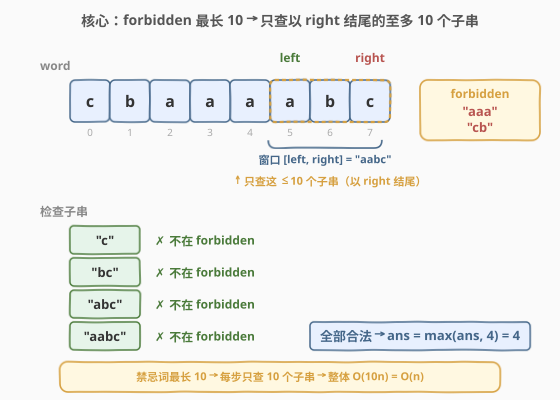
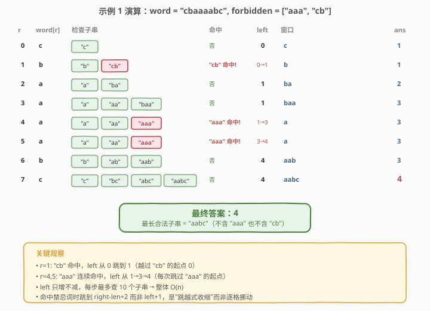

# 最长合法子字符串的长度

- **题目名称**：最长合法子字符串的长度
- **链接**：[2781. 最长合法子字符串的长度](https://leetcode.cn/problems/length-of-the-longest-valid-substring/)
- **难度**：困难
- **标签**：数组、哈希表、字符串、滑动窗口

## 1. 题目概述

给你一个字符串 `word` 和一个字符串数组 `forbidden`。

如果一个字符串不包含 `forbidden` 中的任何字符串，我们称这个字符串是**合法**的。

请你返回字符串 `word` 的一个**最长合法子字符串**的长度。

**子字符串** 指的是一个字符串中一段连续的字符，它可以为空。

**示例 1**：

```text
输入：word = "cbaaaabc", forbidden = ["aaa","cb"]
输出：4
解释：总共有 11 个合法子字符串："c", "b", "a", "ba", "aa", "bc", "baa", "aab", "ab", "abc" 和 "aabc"。
     最长合法子字符串的长度为 4。其他子字符串要么包含 "aaa"，要么包含 "cb"。
```

**示例 2**：

```text
输入：word = "leetcode", forbidden = ["de","le","e"]
输出：4
解释：总共有 11 个合法子字符串："l"，"t"，"c"，"o"，"d"，"tc"，"co"，"od"，"tco"，"cod" 和 "tcod"。
     最长合法子字符串的长度为 4。所有其他子字符串都至少包含 "de"，"le" 和 "e" 之一。
```

**约束条件**：

- `1 <= word.length <= 10^5`
- `word` 只包含小写英文字母
- `1 <= forbidden.length <= 10^5`
- `1 <= forbidden[i].length <= 10`
- `forbidden[i]` 只包含小写英文字母

> 💡 本题的题面看似简单——"找一个不含任何禁忌词的最长子串"——但暴力做是 $O(n^2)$ 级别的。突破口藏在约束里：**`forbidden[i].length <= 10`**。这个上界把"检查一个窗口是否合法"的代价从 $O(\text{窗口长度})$ 压缩到了 $O(10)$，从而把整体复杂度从 $O(n^2)$ 压到 $O(n)$。

---

## 2. 解题思路

### 2.1 暴力思路：枚举所有子串

枚举所有子串 $[l, r]$，对每个子串检查是否包含 `forbidden` 中的任意字符串。枚举子串 $O(n^2)$ 个，每个检查（朴素匹配）$O(n \cdot |\text{forbidden}|)$，总计 $O(n^3)$ 级别，必然超时。

即使把 `forbidden` 存入哈希集合，每个子串仍需枚举其所有子子串去查集合——窗口长 $L$ 的子串有 $O(L^2)$ 个子子串，总复杂度仍为 $O(n^2 \cdot L_{\max})$。

瓶颈在于：没有利用 `forbidden[i].length <= 10` 这个关键约束。

### 2.2 核心观察：forbidden 最长 10 → 只查右端结尾的 10 个子串



关键洞察分两步：

**第一步：滑动窗口的单调性。** 维护窗口 $[l, r]$，使其始终合法（不含任何禁忌词）。`right` 每右移一格，窗口可能变得不合法。但此时，**新出现的不合法子串必定经过 `right`**——因为窗口在 `right` 移动前是合法的，不合法只可能由新字符 `word[right]` 引入。

**第二步：forbidden 最长 10 的红利。** 既然新不合法子串必定经过 `right`，而每个禁忌词最长 10，那么**任何进入窗口的禁忌词必然以 `right` 结尾**（否则它在前一步就已存在，矛盾）。因此只需检查以 `right` 结尾、长度 $1 \sim 10$ 的至多 10 个子串：

$$\text{word}[right - len + 1 \;..\; right], \quad len = 1, 2, \ldots, \min(10,\; right - l + 1)$$

若某个长度为 `len` 的子串在禁忌集合中，就把 `left` 跳到 $right - len + 2$（越过该禁忌词的起点），使其不再完整出现在窗口中。

> ⚠️ **为什么只查"以 right 结尾"的就够了？** 假设窗口 $[l, r]$ 在 $r$ 右移后变得不合法，则存在某个禁忌词 $f$ 出现在 $\text{word}[l..r]$ 中。若 $f$ 不以 $r$ 结尾，则 $f$ 完全包含在 $\text{word}[l..r-1]$ 中——但后者在上一步是合法的，矛盾。因此 $f$ 必以 $r$ 结尾。而 $|f| \le 10$，故只需查 10 个子串。

> 💡 **left 只增不减**：每次发现禁忌词，`left` 只会向右跳（`max(left, ...)`），保证窗口不会"倒退"——这是滑动窗口 $O(n)$ 复杂度的根基。

### 2.3 算法流程图


### 2.4 示例演算



以 `word = "cbaaaabc"`, `forbidden = ["aaa", "cb"]` 为例逐步演算：

| right | word[right] | 检查子串（以 right 结尾, len 1~min(10,right-left+1)） | 命中? | left | 窗口 | ans |
|-------|-------------|--------------------------------------------------------|-------|------|------|-----|
| 0 | c | `"c"` | 否 | 0 | `c` | 1 |
| 1 | b | `"b"`, `"cb"` | `"cb"`命中! left←1-2+2=1 | 1 | `b` | 1 |
| 2 | a | `"a"`, `"ba"` | 否 | 1 | `ba` | 2 |
| 3 | a | `"a"`, `"aa"`, `"baa"` | 否 | 1 | `baa` | 3 |
| 4 | a | `"a"`, `"aa"`, `"aaa"` | `"aaa"`命中! left←4-3+2=3 | 3 | `a` | 3 |
| 5 | a | `"a"`, `"aa"`, `"aaa"` | `"aaa"`命中! left←5-3+2=4 | 4 | `a` | 3 |
| 6 | b | `"b"`, `"ab"`, `"aab"` | 否 | 4 | `aab` | 3 |
| 7 | c | `"c"`, `"bc"`, `"abc"`, `"aabc"` | 否 | 4 | `aabc` | **4** |

最终答案 **4** $\checkmark$（最长合法子串 `"aabc"`）。

> 💡 注意 right=1 时 `"cb"`（len=2）命中，`left` 从 0 跳到 1；right=4 和 right=5 时 `"aaa"`（len=3）连续命中，`left` 分别跳到 3 和 4。`left` 每次只跳到禁忌词起点之后，不会跳过头。

---

## 3. 参考代码

### C++

```cpp
class Solution {
public:
    int longestValidSubstring(string word, vector<string>& forbidden) {
        unordered_set<string> ban(forbidden.begin(), forbidden.end());
        int n = word.size(), ans = 0, left = 0;
        for (int right = 0; right < n; right++) {
            for (int len = 1; len <= min(10, right - left + 1); len++) {
                if (ban.count(word.substr(right - len + 1, len)))
                    left = max(left, right - len + 2);
            }
            ans = max(ans, right - left + 1);
        }
        return ans;
    }
};
```

### Python

```python
class Solution:
    def longestValidSubstring(self, word: str, forbidden: List[str]) -> int:
        ban = set(forbidden)
        left = ans = 0
        for right in range(len(word)):
            for length in range(1, min(10, right - left + 1) + 1):
                if word[right - length + 1 : right + 1] in ban:
                    left = max(left, right - length + 2)
            ans = max(ans, right - left + 1)
        return ans
```

> ⚠️ **内层循环修改 `left` 后的边界处理**：C++ 中 `len <= min(10, right - left + 1)` 每轮重新求值——`left` 跳大后上界缩小，可能提前退出循环。这是**正确**的：更长的子串起点在新的 `left` 之前（因为以 `right` 结尾、长度更大 = 起点更靠左），已不在窗口内，无需检查。Python 中 `range()` 上界只求值一次，多检查的子串起点在 `left` 之前，`max(left, ...)` 不会让 `left` 变小，同样无害。

---

## 4. 复杂度分析

| 维度 | 复杂度 | 说明 |
|------|--------|------|
| 时间复杂度 | $O(n \cdot L_{\max})$ | `right` 遍历 $n$ 个位置，每个位置内层至多检查 $\min(10, \text{窗口长度})$ 个子串，每个子串哈希查找 $O(L_{\max})$；$L_{\max} = 10$，总计 $O(10n) = O(n)$ |
| 空间复杂度 | $O(\sum |f_i|)$ | 哈希集合存储所有禁忌词，总字符数 $\le 10^5 \times 10 = 10^6$ |

> 💡 瓶颈在 `forbidden[i].length <= 10` 这个约束上。若无此约束（禁忌词可以任意长），则每步需检查 $O(\text{窗口长度})$ 个子串，整体退化为 $O(n^2)$。约束题面的数字往往是解题的钥匙。

---

## 5. 扩展：Trie 优化与多模式匹配

### 5.1 用 Trie 替代哈希集合

当禁忌词数量极大（$10^5$）且大量共享前缀时，哈希集合的字符串构造开销不可忽视。可把禁忌词建一棵 **Trie**，检查时从 `right` 向左逐字符走 Trie——一旦走到终止节点就命中。好处是不需构造子串对象，且共享前缀的词只需走一次路径。

但本题 $L_{\max} = 10$，每步最多构造 10 个长度 $\le 10$ 的子串，哈希集合的常数已足够小，Trie 的优化收益有限。面试中可提及作为优化方向。

### 5.2 与多模式匹配（AC 自动机）的关联

"在文本中查找多个模式串是否出现"是多模式匹配问题。若不用滑动窗口，可用 **AC 自动机**（Aho-Corasick）一次性把所有禁忌词建自动机，然后扫描 `word` 一遍——但本题只需判断"窗口内是否含禁忌词"并维护最长窗口，滑动窗口 + 有限长度检查更直接、更简单。

---

## 6. 面试要点

1. **为什么只检查以 `right` 结尾的子串就够了？**

   > 窗口在 `right` 右移前是合法的。若右移后窗口不合法，则新出现的禁忌词必定包含 `word[right]`。而禁忌词是连续子串，若它包含 `word[right]` 但不以 `right` 结尾，它就会完全落在 $\text{word}[l..right-1]$ 中，与上一步合法矛盾。故禁忌词必以 `right` 结尾。

2. **为什么 `left` 用 `max` 而不是直接赋值？**

   > 内层循环可能命中多个禁忌词。较短的那个起点更靠右，要求 `left` 跳得更远。直接赋值可能被较长的词（起点更靠左）拉回，导致较短词仍残留在窗口中。`max` 确保取所有命中里最靠右的起点 $+1$。

3. **内层循环在 C++ 中修改 `left` 后提前退出，会漏检吗？**

   > 不会。以 `right` 结尾的子串，长度越大起点越靠左。`left` 跳大后，更长（起点更左）的子串起点已在 `left` 之前，不在窗口内。剩余更短的子串已在之前迭代中检查过。故提前退出无遗漏。

4. **如果 `forbidden[i].length` 没有上界怎么办？**

   > 每步需检查 $O(\text{窗口长度})$ 个子串，整体退化为 $O(n^2)$。此时应考虑 AC 自动机等多模式匹配算法，或利用后缀自动机 / 后缀数组等字符串结构。

5. **本题和"无重复字符的最长子串"（第 3 题）有何异同？**

   > 都是"维护合法窗口求最长"的滑动窗口。区别在于违例定义：第 3 题违例 = 字符重复，用哈希表记录最新下标、`left` 直接跳位即可；本题违例 = 含禁忌子串，需检查右端有限长子串、`left` 跳过禁忌词起点。两者的 `left` 都只增不减，故都是 $O(n)$。

> 💡 **一句话总结**：2781 = 滑动窗口 + `forbidden` 最长 10 的约束红利 → 每步只查右端 10 个子串 → 整体 $O(10n) = O(n)$。

---

## 7. 同类练习题

- [3. 无重复字符的最长子串](https://leetcode.cn/problems/longest-substring-without-repeating-characters/)：滑动窗口维护"无重复"性质，`left` 跳到重复字符上次出现 $+1$，同模式不同违例
- [424. 替换后的最长重复字符](https://leetcode.cn/problems/longest-repeating-character-replacement/)：「至多 K 个违例」型滑动窗口，违例 = 非 majority 字符数
- [30. 串联所有单词的子串](https://leetcode.cn/problems/substring-with-concatenation-of-all-words/)：单词级定长滑窗 + 词频不变式，"不含禁忌词"的对照面是"恰好包含全部词"
- [392. 判断子序列](https://leetcode.cn/problems/is-subsequence/)：双指针贪心匹配，子序列 vs 子串的边界对照
- [1044. 最长重复子串](https://leetcode.cn/problems/longest-duplicate-substring/)：二分答案 + 滚动哈希 / 后缀数组，从"不含"到"重复"的另一面
