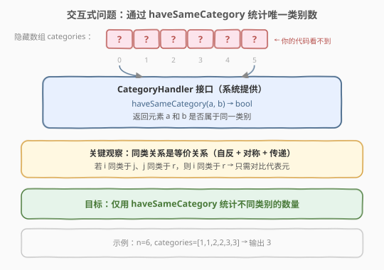
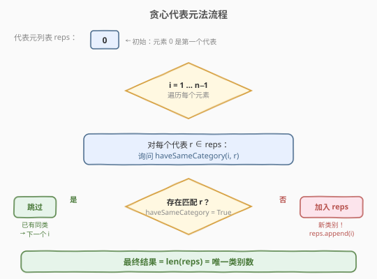
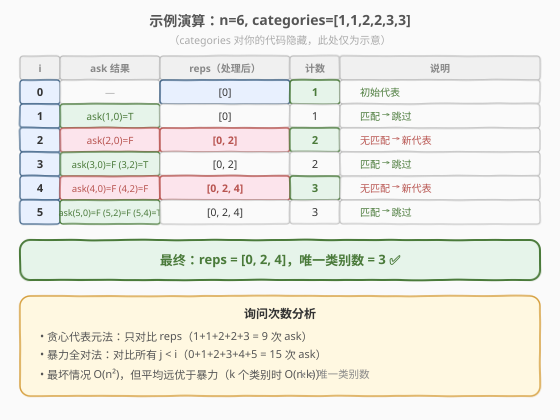

# 唯一类别的数量

- **题目名称**：唯一类别的数量
- **链接**：[2782. 唯一类别的数量](https://leetcode.cn/problems/number-of-unique-categories/)
- **难度**：中等
- **标签**：并查集、计数、交互

## 1. 题目概述

> ⚠️ 本题为 LeetCode 付费题，题意描述根据官方示例用例与 hints 重建，可能与官方题面有出入。

给定 `n` 个元素（编号 `0` 到 `n-1`），每个元素属于一个**类别**。类别信息通过一个交互式接口 `CategoryHandler` 提供——你**无法直接读取**每个元素的类别值，只能调用：

```
CategoryHandler.haveSameCategory(a, b) → bool
```

返回元素 `a` 和 `b` 是否属于**同一类别**。

请仅通过调用 `haveSameCategory`，统计出 `n` 个元素中**不同类别的数量**。

**接口定义**（系统提供，你不实现）：

```cpp
class CategoryHandler {
  public:
    CategoryHandler(vector<int>& categories);  // categories 隐藏
    bool haveSameCategory(int a, int b);       // 返回 categories[a] == categories[b]
};
```

```python
# class CategoryHandler:
#     def __init__(self, categories: List[int]):
#     def haveSameCategory(self, a: int, b: int) -> bool:
```

**示例 1**：

```text
输入：n = 6, categories = [1,1,2,2,3,3]
输出：3
解释：元素 0、1 同属类别 1；元素 2、3 同属类别 2；元素 4、5 同属类别 3。
      共 3 个不同类别。
```

**示例 2**：

```text
输入：n = 5, categories = [1,2,3,4,5]
输出：5
解释：每个元素类别不同，共 5 个类别。
```

**示例 3**：

```text
输入：n = 3, categories = [1,1,1]
输出：1
解释：三个元素同属一个类别。
```

**约束条件**：

- `1 <= n <= 100`（根据交互题规模推断）
- `1 <= categories[i] <= 100`
- `categories` 对你的代码不可见

---

## 2. 解题思路

### 2.1 暴力思路：问遍所有对

最直接的做法：对每一对 `(i, j)`（`i < j`）调用 `haveSameCategory(i, j)`，若返回 `True` 则说明二者同类。用并查集将同类的元素合并，最终数集合个数即可。

这需要 $\binom{n}{2} = \frac{n(n-1)}{2}$ 次 `ask`，时间 $O(n^2)$，空间 $O(n)$。能过，但**询问次数可以更少**。

### 2.2 核心观察：同类关系是等价关系



`haveSameCategory` 基于 `categories[a] == categories[b]`，这是一个**等价关系**——满足：

- **自反性**：`haveSameCategory(a, a) = True`
- **对称性**：`haveSameCategory(a, b) = haveSameCategory(b, a)`
- **传递性**：若 `haveSameCategory(a, b)` 且 `haveSameCategory(b, c)`，则 `haveSameCategory(a, c)`

> 💡 传递性是关键：如果元素 `i` 与某个已知代表 `r` 同类，就不需要再和 `r` 同组的其他元素逐一对比了——`r` 已经"代表"了整组。

### 2.3 贪心代表元法



维护一个**代表元列表** `reps`，每个代表元是它所在类别的"第一个元素"：

1. `reps = [0]`——元素 0 是第一个类别的代表。
2. 对每个 `i` 从 `1` 到 `n-1`：
   - 依次对每个 `r ∈ reps` 调用 `haveSameCategory(i, r)`。
   - 若某次返回 `True`：`i` 属于已有类别，**跳过**（`break`）。
   - 若全部返回 `False`：`i` 是新类别，`reps.append(i)`。
3. 返回 `len(reps)`。

> ⚠️ **为什么只对比代表元就够？** 假设 `i` 与非代表元 `j` 同类，而 `j` 的代表是 `r`（即 `haveSameCategory(j, r) = True`）。由传递性，`haveSameCategory(i, r) = True` 也成立——所以在遍历 `reps` 时一定能命中 `r`，不会漏判。

### 2.4 示例演算

以 `n = 6, categories = [1,1,2,2,3,3]` 为例（类别对代码隐藏，此处仅作示意）：



| i | ask 结果 | reps（处理后） | 计数 | 说明 |
|---|---------|--------------|------|------|
| 0 | — | [0] | 1 | 初始代表 |
| 1 | ask(1,0)=T | [0] | 1 | 匹配 → 跳过 |
| 2 | ask(2,0)=F | [0, 2] | 2 | 无匹配 → 新代表 |
| 3 | ask(3,0)=F, ask(3,2)=T | [0, 2] | 2 | 匹配 → 跳过 |
| 4 | ask(4,0)=F, ask(4,2)=F | [0, 2, 4] | 3 | 无匹配 → 新代表 |
| 5 | ask(5,0)=F, ask(5,2)=F, ask(5,4)=T | [0, 2, 4] | 3 | 匹配 → 跳过 |

最终 `reps = [0, 2, 4]`，唯一类别数 = 3。✅

共 9 次 `ask`，对比暴力全对的 15 次，节省了 40%。

---

## 3. 参考代码

### 方法一：贪心代表元法（推荐，询问次数少）

### C++

```cpp
class Solution {
  public:
    int numberOfCategories(int n, CategoryHandler* categoryHandler) {
        vector<int> reps = {0};
        for (int i = 1; i < n; i++) {
            bool found = false;
            for (int r : reps) {
                if (categoryHandler->haveSameCategory(i, r)) {
                    found = true;
                    break;
                }
            }
            if (!found) reps.push_back(i);
        }
        return reps.size();
    }
};
```

### Python

```python
class Solution:
    def numberOfCategories(self, n: int, categoryHandler: 'CategoryHandler') -> int:
        reps = [0]
        for i in range(1, n):
            for r in reps:
                if categoryHandler.haveSameCategory(i, r):
                    break
            else:
                reps.append(i)
        return len(reps)
```

> 💡 Python 的 `for...else`：`else` 在循环**未被 `break` 打断**时执行，即"全部不匹配"时才加入新代表。与手写 `found` 标志量等价，更简洁。

### 方法二：并查集（问遍所有对，O(n²) ask）

### C++

```cpp
class Solution {
  public:
    int numberOfCategories(int n, CategoryHandler* categoryHandler) {
        vector<int> parent(n);
        iota(parent.begin(), parent.end(), 0);
        int count = n;

        function<int(int)> find = [&](int x) {
            while (parent[x] != x) {
                parent[x] = parent[parent[x]];
                x = parent[x];
            }
            return x;
        };

        for (int i = 1; i < n; i++) {
            for (int j = 0; j < i; j++) {
                int ri = find(i), rj = find(j);
                if (ri != rj && categoryHandler->haveSameCategory(i, j)) {
                    parent[ri] = rj;
                    count--;
                }
            }
        }
        return count;
    }
};
```

### Python

```python
class Solution:
    def numberOfCategories(self, n: int, categoryHandler: 'CategoryHandler') -> int:
        parent = list(range(n))
        count = n

        def find(x):
            while parent[x] != x:
                parent[x] = parent[parent[x]]
                x = parent[x]
            return x

        for i in range(1, n):
            for j in range(i):
                ri, rj = find(i), find(j)
                if ri != rj and categoryHandler.haveSameCategory(i, j):
                    parent[ri] = rj
                    count -= 1
        return count
```

> ⚠️ 并查集版虽然用了路径压缩，但 `haveSameCategory` 的结果不会因 `find`/`union` 改变——它始终基于原始 `categories` 数组。因此 `find(i) != find(j)` 的前置检查只是避免重复 `union` 同组元素，不影响正确性。

---

## 4. 复杂度分析

| 维度 | 方法 | 复杂度 | 说明 |
|------|------|--------|------|
| 时间复杂度 | 贪心代表元 | $O(n \cdot k)$ | $k$ 为唯一类别数，每个元素至多与 $k$ 个代表对比 |
| 空间复杂度 | 贪心代表元 | $O(k)$ | `reps` 列表最多 $k$ 个元素 |
| 询问次数 | 贪心代表元 | $O(n \cdot k)$ | 最坏 $k = n$（全不同类）时退化为 $O(n^2)$ |
| 时间复杂度 | 并查集 | $O(n^2 \alpha(n))$ | 遍历所有 $\binom{n}{2}$ 对，每次 `union/find` 均摊 $O(\alpha(n))$ |
| 空间复杂度 | 并查集 | $O(n)$ | `parent` 数组 |
| 询问次数 | 并查集 | $\frac{n(n-1)}{2}$ | 固定问遍所有对 |

> 💡 当 $k \ll n$（类别远少于元素数）时，贪心代表元法的询问次数远优于并查集。当 $k = n$（全不同类）时两者相同。**面试首选贪心代表元法**。

---

## 5. 扩展：并查集 + 代表元剪枝

并查集版可以借鉴贪心代表元的思路，只对比已有代表而非所有 `j < i`，从而减少询问次数：

```python
class Solution:
    def numberOfCategories(self, n: int, categoryHandler: 'CategoryHandler') -> int:
        parent = list(range(n))
        reps = [0]

        def find(x):
            while parent[x] != x:
                parent[x] = parent[parent[x]]
                x = parent[x]
            return x

        for i in range(1, n):
            for r in reps:
                ri, rr = find(i), find(r)
                if ri != rr and categoryHandler.haveSameCategory(i, r):
                    parent[ri] = rr
                    break
            else:
                reps.append(i)
        return len(reps)
```

此版本兼具并查集的路径压缩与代表元剪枝，询问次数与贪心代表元法相同 $O(n \cdot k)$，同时维护了并查集结构以支持后续连通性查询。

---

## 6. 面试要点

1. **为什么只对比代表元就够？**

   - `haveSameCategory` 是等价关系，满足传递性。若 `i` 与非代表 `j` 同类，而 `j` 的代表是 `r`，则 `haveSameCategory(i, r) = True` 也成立，遍历 `reps` 时一定能命中。

2. **贪心代表元法和并查集有什么区别？**

   - 贪心代表元只维护"每组的第一个元素"列表，逻辑极简；并查集维护完整的 `parent` 树，支持后续动态查询连通性。本题只需计数，贪心代表元更轻量、询问更少。

3. **最坏情况是什么？**

   - 所有元素类别各不相同（$k = n$），每个 `i` 都要问遍所有 `j < i` 的代表，共 $\frac{n(n-1)}{2}$ 次询问，与暴力全对相同。

4. **能否用 DFS/BFS 求解？**

   - 理论上可以：把 `haveSameCategory(i, j) = True` 看作边，对每个未访问节点做 DFS 标记整组。但需要先问遍所有对来建图，询问次数固定 $O(n^2)$，不如贪心代表元灵活。

5. **为什么 `for...else` 在 Python 里适合这题？**

   - `else` 在循环**未被 `break`** 时执行——即"对比完所有代表都没匹配"时才加入新代表，语义完美贴合"全不匹配 → 新类别"的逻辑。

6. **交互题和普通题的思维方式有何不同？**

   - 交互题的核心是**最小化询问次数**（类比 [277. 搜寻名人](../0201-0300/277_搜寻名人.md) 的"每次 `knows()` 排除一人"）。暴力全对能过但不是最优；利用问题结构（本题是等价关系）减少冗余询问，是交互题的通用优化思路。

---

## 7. 同类练习题

- [547. 省份数量](https://leetcode.cn/problems/number-of-provinces/)（[题解](../0501-0600/547_省份数量.md)）：并查集统计连通分量，本题的矩阵版——邻接矩阵直接可见，无需交互
- [277. 搜寻名人](https://leetcode.cn/problems/find-the-celebrity/)（[题解](../0201-0300/277_搜寻名人.md)）：交互式问题，用 `knows()` 逐对排除，与本题同为"最小化询问 + 利用问题结构"范式
- [684. 冗余连接](https://leetcode.cn/problems/redundant-connection/)：并查集判环，加边时两端已同根即为冗余
- [721. 账户合并](https://leetcode.cn/problems/accounts-merge/)：并查集合并同名邮箱，模板进阶
- [990. 等式方程的可满足性](https://leetcode.cn/problems/satisfiability-of-equality-equations/)：先 union 等式、再查不等式是否冲突，同为等价关系分组
