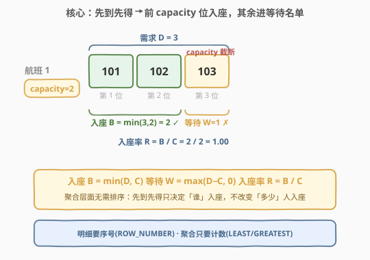
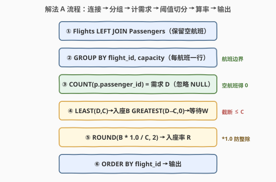
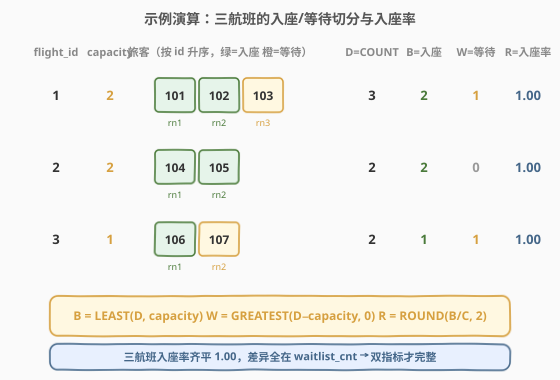

# 航班入座率和等待名单分析

- **题目名称**：航班入座率和等待名单分析
- **链接**：[2783. 航班入座率和等待名单分析](https://leetcode.cn/problems/flight-occupancy-and-waitlist-analysis/)
- **难度**：中等
- **标签**：SQL、数据库、窗口函数、`ROW_NUMBER()`、`LEAST`/`GREATEST`、`PARTITION BY`、条件聚合、`CASE WHEN`、超额订票

> ⚠️ **注意**：本题是 LeetCode 数据库（SQL）类题目，在 leetcode.cn 与 leetcode.com 上**均为 Plus/Premium 会员专享题**，官方题面不可免费查看。本文题意根据**题目标题（Flight Occupancy and Waitlist Analysis / 航班入座率和等待名单分析）+ 官方示例用例的表结构与输入数据**重建，输出格式为最自然的工程解读，**可能与官方题面的精确列名/列顺序有出入**。核心 SQL 套路（按 `passenger_id` 排序取前 `capacity` 个为入座、其余为等待名单、再分组聚合算入座率）不受题面细节影响。本文代码使用 SQL（及 pandas 对照）而非 C++/Python 算法。

## 1. 题目概述

给定 `Flights` 表与 `Passengers` 表。`Flights` 记录每个航班的座位容量 `capacity`；`Passengers` 记录每位旅客预订的航班。旅客按 `passenger_id` 升序依次入座——每个航班先到先得，**前 `capacity` 位旅客获得确认座位（booked/confirmed），超出容量的旅客进入等待名单（waitlist）**。编写 SQL 查询，对每个航班分析：入座人数、等待名单人数、入座率（occupancy rate = 入座人数 / 座位容量），结果按 `flight_id` 升序返回。

**表结构**：

```text
表: Flights
+-------------+------+
| Column Name | Type |
+-------------+------+
| flight_id   | int  |   ← 航班 id
| capacity    | int  |   ← 座位容量
+-------------+------+
flight_id 是该表的主键。
capacity 是该航班的可售座位数。

表: Passengers
+--------------+------+
| Column Name  | Type |
+--------------+------+
| passenger_id | int  |   ← 旅客 id
| flight_id    | int  |   ← 预订的航班 id
+--------------+------+
(flight_id, passenger_id) 是该表的主键（同一航班同一旅客至多一条预订）。
```

> 💡 **审题关键**：① 「按 `passenger_id` 升序入座」意味着同一航班内旅客的入座先后由 `passenger_id` 决定——这是 `ROW_NUMBER() OVER (PARTITION BY flight_id ORDER BY passenger_id)` 的来源；② 「前 `capacity` 位入座、其余等待」是一个**阈值切分**——第 $rn \le capacity$ 位入座、第 $rn > capacity$ 位等待，$rn$ 即旅客在该航班内的序号；③ 「入座率 = 入座人数 / 容量」是**航班级聚合指标**（单个旅客没有「入座率」），故最终结果是**每航班一行**的聚合，而非逐旅客明细。

**示例 1**（据官方示例用例重建）：

```text
输入：
Flights 表:
+-----------+----------+
| flight_id | capacity |
+-----------+----------+
| 1         | 2        |
| 2         | 2        |
| 3         | 1        |
+-----------+----------+

Passengers 表:
+--------------+-----------+
| passenger_id | flight_id |
+--------------+-----------+
| 101          | 1         |
| 102          | 1         |
| 103          | 1         |
| 104          | 2         |
| 105          | 2         |
| 106          | 3         |
| 107          | 3         |
+--------------+-----------+

输出:
+-----------+------------+--------------+----------------+
| flight_id | booked_cnt | waitlist_cnt | occupancy_rate |
+-----------+------------+--------------+----------------+
| 1         | 2          | 1            | 1.00           |
| 2         | 2          | 0            | 1.00           |
| 3         | 1          | 1            | 1.00           |
+-----------+------------+--------------+----------------+
```

**解释**：

| 航班 | 容量 | 旅客（按 id 升序） | 入座 | 等待 | 入座率 |
|------|------|--------------------|------|------|--------|
| 1 | 2 | 101, 102, 103 | 101, 102（前 2 位） | 103（第 3 位超出容量） | 2/2 = 1.00 |
| 2 | 2 | 104, 105 | 104, 105（前 2 位） | —（无超额） | 2/2 = 1.00 |
| 3 | 1 | 106, 107 | 106（前 1 位） | 107（第 2 位超出容量） | 1/1 = 1.00 |

> 💡 本示例三个航班的入座率均为 1.00（满座或超售），区别体现在 `waitlist_cnt`：航班 1、3 有旅客等待，航班 2 无。这说明**单看入座率不足以反映超售情况**，等待名单人数是必要的补充指标——这也是题目名为「入座率**和**等待名单分析」的用意。若想看到入座率低于 1.00 的情形，需出现「需求 < 容量」的航班（如容量 5 但只有 3 人预订），本官方示例刻意全部满座/超售以强调等待名单机制。

> ⚠️ 本题面为付费题重建，**输出列名 `booked_cnt`/`waitlist_cnt`/`occupancy_rate` 及是否含 `capacity`/`passenger_cnt` 列为推断**，以官方判定为准。但 SQL 核心逻辑（排序定入座先后 + 阈值切分 + 分组聚合）不受列名影响。

---

## 2. 解题思路

### 2.1 暴力思路：相关子查询逐旅客判定

过程式直觉：对 `Passengers` 每位旅客 `(pid, fid)`，另开子查询数出该航班中 `passenger_id <= pid` 的旅客数 `cnt`，若 `cnt <= capacity` 则该旅客入座、否则等待；最后按航班聚合。

```text
for each passenger (pid, fid) in Passengers:
    cnt = COUNT(*) in Passengers where flight_id = fid and passenger_id <= pid
    status = 'booked' if cnt <= Flights[fid].capacity else 'waitlist'
-- 再 GROUP BY flight_id 聚合 booked/waitlist 计数与入座率
```

- **正确性**：`passenger_id <= pid` 恰好覆盖该航班中序号不超过当前旅客的所有人（含自身），`cnt` 即该旅客的序号 $rn$，与 `capacity` 比较判定入座/等待，正确。
- **效率**：对每位旅客触发一次该航班的历史扫描，最坏 $O(n^2)$（$n$ = `Passengers` 行数）。且要两阶段（先逐旅客判定、再分组聚合），啰嗦。

> ⚠️ 瓶颈在于「序号」被每行重复计算。突破口：用 `ROW_NUMBER()` 一次性算出每人在航班内的序号 $rn$，再用条件聚合 `SUM(CASE WHEN rn <= capacity THEN 1 ELSE 0 END)` 一趟得到入座/等待计数。更妙的是——若**只需航班级聚合**（本题正是），连 `ROW_NUMBER` 都不必，直接 `COUNT` + `LEAST/GREATEST` 即可，因为「入座数 = min(需求, 容量)」「等待数 = max(需求−容量, 0)」与「逐旅客排序判定」在**聚合层面**等价。

### 2.2 核心观察：聚合层面无需排序，LEAST/GREATEST 一行搞定



关键洞察：题目要的是**航班级聚合**（每航班一行），不是逐旅客明细。一旦落到聚合层面，序号 $rn$ 的细节就被「压缩」掉了——

设航班 $f$ 的容量为 $C_f$、预订旅客数为 $D_f$（demand）。则：

- **入座数** $B_f = \min(D_f, C_f)$（先到先得，至多坐满容量）
- **等待数** $W_f = \max(D_f - C_f, 0)$（超出部分进等待名单）
- **入座率** $R_f = B_f / C_f$

$$\boxed{B_f = \min(D_f, C_f),\quad W_f = \max(D_f - C_f, 0),\quad R_f = \dfrac{\min(D_f, C_f)}{C_f}}$$

这是因为「按 `passenger_id` 升序前 $C_f$ 位入座」在**只关心入座人数**时，与「从 $D_f$ 人中任取 $C_f$ 位」人数相同——先到先得只决定**哪些人**入座，不改变**多少人**入座。聚合指标对排序不敏感。

> 💡 **何时需要排序、何时不需要？** 这是本题最核心的判断。若题目要「列出每位旅客的状态（入座/等待）」（逐旅客明细），**必须** `ROW_NUMBER() OVER (PARTITION BY flight_id ORDER BY passenger_id)` 算出每人在航班内的序号 $rn$，再 $rn \le \text{capacity}$ 判定。若只要「每航班的入座/等待人数」（航班级聚合），排序可省——`LEAST/GREATEST` 直接给出。本题重建为聚合型，故解法 A 用 `LEAST/GREATEST` 最简；解法 B 保留 `ROW_NUMBER` 是为了展示「逐旅客判定 → 再聚合」的通用范式，且能自然扩展到「列出等待名单旅客」的明细变体。

> ⚠️ **两种常见错解**：① 混淆「需求」与「入座」——直接用 `COUNT(*)/capacity` 当入座率，当 $D_f > C_f$ 时会得到 >1 的「超售率」而非入座率（入座最多等于容量，不超过 1）；必须先 `LEAST` 截断到容量。② 忘了 `LEFT JOIN` 而用 `JOIN`/`GROUP BY` from Passengers——**没有旅客的航班会从结果中消失**。若题目要求列出所有航班（含零预订），必须 `FROM Flights LEFT JOIN Passengers` 以保留空航班，再用 `COUNT(p.passenger_id)`（计非 NULL）得 0。

### 2.3 算法流程图



**逻辑执行步骤**（解法 A）：

| 步骤 | 表达式 | 作用 |
|------|--------|------|
| ① 连接 | `Flights f LEFT JOIN Passengers p ON p.flight_id = f.flight_id` | 保留所有航班（含零预订），旅客行挂在右侧 |
| ② 计需求 | `COUNT(p.passenger_id) AS passenger_cnt` | 每航班的需求人数 $D_f$（`COUNT` 忽略 NULL，空航班得 0） |
| ③ 切入座 | `LEAST(COUNT(p.passenger_id), f.capacity) AS booked_cnt` | 入座数 $B_f = \min(D_f, C_f)$，截断到容量 |
| ④ 切等待 | `GREATEST(COUNT(p.passenger_id) - f.capacity, 0) AS waitlist_cnt` | 等待数 $W_f = \max(D_f - C_f, 0)$，低于 0 归零 |
| ⑤ 算入座率 | `ROUND(LEAST(...) * 1.0 / f.capacity, 2) AS occupancy_rate` | 入座率 $R_f = B_f / C_f$，`*1.0` 强制浮点避免整除 |
| ⑥ 分组排序 | `GROUP BY f.flight_id, f.capacity` + `ORDER BY f.flight_id` | 每航班一行，按航班号升序输出 |

> 💡 **为什么 `GROUP BY` 里要带 `f.capacity`？** 严格 SQL 规范下，`SELECT` 中非聚合列必须出现在 `GROUP BY` 中。`f.capacity` 在 `SELECT` 多处引用，把它一起放进 `GROUP BY` 是规范写法（`flight_id` 是主键、`capacity` 函数依赖于 `flight_id`，故 MySQL 在 `ONLY_FULL_GROUP_BY` 下也允许只 `GROUP BY flight_id`，但带上 `capacity` 更稳妥且跨库兼容）。

### 2.4 示例演算

以官方示例三个航班走一遍解法 A 的 `LEFT JOIN → COUNT → LEAST/GREATEST` 链路：



**LEFT JOIN 后的中间形态**（`Flights ⟕ Passengers`）：

| flight_id | capacity | passenger_id | 说明 |
|-----------|----------|--------------|------|
| 1 | 2 | 101 | 航班 1 旅客 |
| 1 | 2 | 102 | 航班 1 旅客 |
| 1 | 2 | 103 | 航班 1 旅客 |
| 2 | 2 | 104 | 航班 2 旅客 |
| 2 | 2 | 105 | 航班 2 旅客 |
| 3 | 1 | 106 | 航班 3 旅客 |
| 3 | 1 | 107 | 航班 3 旅客 |

**按 `flight_id` 分组聚合**：

| flight_id | capacity | $D_f$ (COUNT) | $B_f$ = LEAST($D_f$, $C$) | $W_f$ = GREATEST($D_f - C$, 0) | $R_f$ = $B_f/C_f$ |
|-----------|----------|---------------|---------------------------|--------------------------------|-------------------|
| 1 | 2 | 3 | min(3,2) = **2** | max(3−2,0) = **1** | 2/2 = **1.00** |
| 2 | 2 | 2 | min(2,2) = **2** | max(2−2,0) = **0** | 2/2 = **1.00** |
| 3 | 1 | 2 | min(2,1) = **1** | max(2−1,0) = **1** | 1/1 = **1.00** |

> 💡 **三个观察要点**：① `LEAST` 把「需求超容量」截断到容量——航班 1 需求 3 但入座只算 2，避免入座率 >1 的错解；② `GREATEST(...,0)` 把「需求低于容量」的负差归零——若某航班需求 0、容量 5，则等待数 `max(0−5,0)=0` 而非 −5；③ 本例三航班均满座或超售，入座率齐平 1.00，差异全在 `waitlist_cnt`——印证「入座率 + 等待名单」双指标才完整刻画航班状态。

---

## 3. 参考代码

### SQL（解法 A：`LEAST`/`GREATEST` 聚合，推荐最简）

```sql
SELECT f.flight_id,
       LEAST(COUNT(p.passenger_id), f.capacity) AS booked_cnt,
       GREATEST(COUNT(p.passenger_id) - f.capacity, 0) AS waitlist_cnt,
       ROUND(LEAST(COUNT(p.passenger_id), f.capacity) * 1.0 / f.capacity, 2) AS occupancy_rate
FROM Flights f
LEFT JOIN Passengers p ON p.flight_id = f.flight_id
GROUP BY f.flight_id, f.capacity
ORDER BY f.flight_id;
```

> 💡 **写法要点**：
> - `LEFT JOIN`（非 `JOIN`）：保留零预订航班。若题目保证每航班至少一位旅客，可换 `JOIN`，但 `LEFT JOIN` 更稳健。
> - `COUNT(p.passenger_id)` 而非 `COUNT(*)`：`LEFT JOIN` 下空航班有一行全 NULL，`COUNT(*)` 会得 1（计了那行 NULL），`COUNT(列)` 忽略 NULL 得 0，才是真需求。
> - `LEAST(COUNT, capacity)` 截断到容量，保证入座数 ≤ 容量、入座率 ≤ 1。
> - `GREATEST(COUNT - capacity, 0)` 把「需求不足容量」的负差归零，等待数恒非负。
> - `* 1.0` 强制浮点除法。MySQL 中 `BIGINT/INT` 本就返回 DECIMAL（可省 `*1.0`），但 PostgreSQL/SQLite 对整型除法可能截断为整，加 `*1.0` 跨库安全。
> - ✓ 最简洁，无需窗口函数，一行表达式同时给出三指标，面试首推。`LEAST`/`GREATEST` 是 SQL 标准函数，MySQL/PostgreSQL/Oracle 均支持（SQL Server 用 `CASE WHEN` 模拟）。

### SQL（解法 B：`ROW_NUMBER` + 条件聚合，通用范式）

```sql
WITH ranked AS (
    SELECT passenger_id, flight_id,
           ROW_NUMBER() OVER (PARTITION BY flight_id ORDER BY passenger_id) AS rn
    FROM Passengers
)
SELECT f.flight_id,
       SUM(CASE WHEN r.rn <= f.capacity THEN 1 ELSE 0 END) AS booked_cnt,
       SUM(CASE WHEN r.rn > f.capacity THEN 1 ELSE 0 END) AS waitlist_cnt,
       ROUND(SUM(CASE WHEN r.rn <= f.capacity THEN 1 ELSE 0 END) * 1.0 / f.capacity, 2) AS occupancy_rate
FROM Flights f
LEFT JOIN ranked r ON r.flight_id = f.flight_id
GROUP BY f.flight_id, f.capacity
ORDER BY f.flight_id;
```

> 💡 **写法要点**：
> - `CTE ranked` 用 `ROW_NUMBER() OVER (PARTITION BY flight_id ORDER BY passenger_id)` 给每位旅客打上「该航班内按 id 升序的序号」$rn$——这正是「先到先得」的 SQL 表达。
> - `LEFT JOIN ranked`：空航班在 `ranked` 中无行，`LEFT JOIN` 保留之；`r.rn` 为 NULL 时 `CASE` 两分支均不命中（NULL 比较返回 UNKNOWN），`SUM` 得 0，入座/等待均为 0。
> - 条件聚合 `SUM(CASE WHEN rn <= capacity THEN 1 ELSE 0 END)` 即「数序号不超过容量的旅客」= 入座数；`rn > capacity` 即等待数。
> - ⚠️ 本聚合场景下解法 B 与解法 A 结果完全一致，但多了「排序 + 窗口」开销 $O(n \log n)$，属「杀鸡用牛刀」。其价值在**通用性**：若题目改为「列出每位旅客的入座/等待状态」或「列出等待名单上的旅客 id」，解法 B 的 `ranked` CTE 直接复用，只需去掉外层聚合、保留明细即可（见 5.1）。
> - 需 MySQL 8.0+ / PostgreSQL / SQL Server / Oracle（支持窗口函数）。

### Python（pandas）

```python
import pandas as pd
import numpy as np

def flight_occupancy_analysis(flights: pd.DataFrame, passengers: pd.DataFrame) -> pd.DataFrame:
    cnt = passengers.groupby('flight_id').size().reset_index(name='passenger_cnt')
    df = flights.merge(cnt, on='flight_id', how='left')
    df['passenger_cnt'] = df['passenger_cnt'].fillna(0).astype(int)
    df['booked_cnt'] = np.minimum(df['passenger_cnt'], df['capacity'])
    df['waitlist_cnt'] = np.maximum(df['passenger_cnt'] - df['capacity'], 0)
    df['occupancy_rate'] = (df['booked_cnt'] / df['capacity']).round(2)
    return df[['flight_id', 'booked_cnt', 'waitlist_cnt', 'occupancy_rate']].sort_values('flight_id')
```

> 💡 **pandas 对照**：
> - `groupby('flight_id').size()` 等价于 SQL 的 `COUNT(p.passenger_id)` 得每航班需求 $D_f$；`merge(..., how='left')` 等价于 `LEFT JOIN` 保留空航班。
> - `np.minimum(D, capacity)` 等价于 `LEAST(COUNT, capacity)`；`np.maximum(D - capacity, 0)` 等价于 `GREATEST(..., 0)`——pandas 的向量化 `np.minimum/maximum` 逐行对齐，无需循环。
> - `.fillna(0)` 处理空航班（`LEFT JOIN` 产生的 NaN 需求归零）。
> - ⚠️ 与 SQL 的差异：pandas 无 `LEAST`/`GREATEST` 函数，用 `np.minimum/np.maximum`；除法 `booked/capacity` 在 pandas 中天然浮点（Series 除法），无需 `*1.0`，但 `.round(2)` 控制精度对应 SQL 的 `ROUND(..., 2)`。

---

## 4. 复杂度分析

| 维度 | 解法 A（LEAST/GREATEST） | 解法 B（ROW_NUMBER + 条件聚合） |
|------|--------------------------|--------------------------------|
| **时间** | $O(n)$ | $O(n \log n)$ |
| **空间** | $O(m)$（哈希分组缓冲） | $O(n)$（窗口排序缓冲） |
| **中间行数** | $n$（连接结果） | $n$（连接结果） |
| **是否需排序** | 否 | 是（`PARTITION BY flight_id ORDER BY passenger_id`） |
| **代码量** | ★★★ 最简 | ★★ 中等 |
| **扩展到明细** | 需重写 | CTE 直接复用 |

> - $n$ = `Passengers` 行数，$m$ = `Flights` 行数（航班数），$n \ge m$。
> - **解法 A 时间**：`LEFT JOIN` 一趟扫描 $O(n)$，`COUNT` + `LEAST/GREATEST` 在分组聚合时哈希建桶 $O(n)$，无排序，总计 $O(n)$。
> - **解法 B 时间**：`ROW_NUMBER()` 需按 `(flight_id, passenger_id)` 排序，$O(n \log n)$；随后聚合 $O(n)$。由排序主导。若 `(flight_id, passenger_id)` 已建索引（主键天然有序），排序可省，降至 $O(n)$。
> - **空间**：解法 A 仅需 $O(m)$ 分组桶；解法 B 的窗口排序需 $O(n)$ 缓冲。
> - ⚠️ **选用建议**：聚合型题目首选解法 A（最简、线性）；只有需要逐旅客明细或序号参与其他计算时才上解法 B。

> ⚠️ **性能拐点**：当某航班旅客数 $D_f$ 极大时，解法 B 的排序对单航班内部 $D_f$ 个元素排序 $O(D_f \log D_f)$，而解法 A 只需 `COUNT` $O(D_f)$。生产环境千万级订票数据下差距显著，聚合指标优先解法 A。给 `(flight_id, passenger_id)` 建复合索引可同时加速解法 B 的排序与解法 A 的分组扫描。

---

## 5. 扩展

### 5.1 明细变体：列出每位旅客的入座/等待状态

若题目改为「报告每位旅客的状态（`passenger_id`, `flight_id`, `status`）」，解法 B 的 `ranked` CTE 直接复用，去掉外层聚合：

```sql
WITH ranked AS (
    SELECT passenger_id, flight_id,
           ROW_NUMBER() OVER (PARTITION BY flight_id ORDER BY passenger_id) AS rn
    FROM Passengers
)
SELECT r.passenger_id,
       r.flight_id,
       CASE WHEN r.rn <= f.capacity THEN 'Confirmed' ELSE 'Waitlist' END AS status
FROM ranked r
JOIN Flights f ON f.flight_id = r.flight_id
ORDER BY r.flight_id, r.passenger_id;
```

本变体下「按 `passenger_id` 排序」**不可省**——明细必须知道每位旅客的序号 $rn$ 才能判定，`LEAST/GREATEST` 无法给出「哪一位」入座。这正是 2.2 节「何时需要排序」的判据边界：**明细要序号、聚合只要计数**。

### 5.2 「需求满足率」与「入座率」的区分

「入座率」一词有两解：

| 指标 | 定义 | 本示例值（航班 1） | 语义 |
|------|------|-------------------|------|
| **入座率（occupancy）** | 入座数 / 容量 = $B_f/C_f$ | 2/2 = 1.00 | 航班满座程度（≤1） |
| **需求满足率（fulfillment）** | 入座数 / 需求 = $B_f/D_f$ | 2/3 ≈ 0.67 | 旅客被满足的比例（≤1） |

> 💡 本文按航空业标准「入座率 = 入座/容量」重建（occupancy rate）。若官方题面实为「需求满足率」，把分母从 `f.capacity` 换成 `COUNT(p.passenger_id)`（即 $D_f$）即可，结构不变。区分要点：分母是「座位容量」还是「旅客需求」——前者刻画航班满度，后者刻画服务满足度。

### 5.3 同构问题：阈值切分家族

`LEAST(x, cap)` + `GREATEST(x - cap, 0)` 的「阈值切分」是 SQL 常用范式，凡「总量超额部分归入另一类」均可套用：

- 库存超卖：订单量 vs 库存，超额部分为缺货；
- 限流：请求量 vs 配额，超额部分为拒绝；
- 优惠券：使用次数 vs 上限，超额部分为无效。

---

## 6. 面试要点

**Q1：为什么解法 A 不需要 `ROW_NUMBER` 排序？排序不是「先到先得」的关键吗？**

> 「先到先得」决定的是**哪些旅客**入座（明细），不是**多少旅客**入座（聚合）。本题要航班级入座人数，而入座人数 = $\min(\text{需求}, \text{容量})$ 与具体谁先谁后无关——先到先得只影响名单构成、不影响名单长度。故聚合层面 `LEAST` 即可，省去排序。若题目要逐旅客状态，则必须排序算序号。口诀：**明细要序号、聚合只要计数**。

**Q2：`LEFT JOIN` 与 `JOIN` 在此题的区别？为何用 `COUNT(p.passenger_id)` 而非 `COUNT(*)`？**

> 若某航班零预订，`JOIN`（内连接）会丢掉该航班行，结果少一行；`LEFT JOIN` 保留它，右侧旅客列全 NULL。此时 `COUNT(*)` 会得 1（数了那行 NULL），而 `COUNT(p.passenger_id)` 忽略 NULL 得 0——后者才是真需求。故保留空航班必须 `LEFT JOIN` + `COUNT(列)` 配对使用。若题目保证每航班至少一位旅客，`JOIN` + `COUNT(*)` 亦可。

**Q3：`LEAST(COUNT, capacity)` 截断的必要性？不截会怎样？**

> 不截的话，超售航班（$D_f > C_f$）的入座数会被算成 $D_f$（等于需求），入座率 $D_f/C_f > 1$——这成了「超售率」而非「入座率」，且与「座位最多 $C_f$ 个」物理矛盾。`LEAST` 把入座数钉死在容量上限，保证入座率 $\le 1$。同理 `GREATEST(差, 0)` 钉死等待数 $\ge 0$，避免「需求不足容量」时出现负等待。

**Q4：解法 B 的 `ROW_NUMBER() OVER (PARTITION BY flight_id ORDER BY passenger_id)` 三段各起什么作用？**

> `PARTITION BY flight_id`：按航班分窗，每个航班序号独立从 1 起；`ORDER BY passenger_id`：窗内按旅客 id 升序，确定「先到先得」的入座先后；`ROW_NUMBER()`：给出 1,2,3,… 序号 $rn$。三者合起来即「同一航班内按 id 升序的入座序号」。$rn \le \text{capacity}$ 即前 `capacity` 位入座。注意 `PARTITION` 只分窗不压缩行——每行都保留并附上 $rn$，与 `GROUP BY` 的压缩不同。

**Q5：为什么 `GROUP BY` 里要带上 `f.capacity`？只 `GROUP BY flight_id` 行不行？**

> 严格 SQL 规范要求 `SELECT` 中的非聚合列出现在 `GROUP BY` 中，`f.capacity` 在 `SELECT` 多处引用，带上更规范、跨库兼容。但因 `flight_id` 是 `Flights` 主键、`capacity` 函数依赖于 `flight_id`，MySQL 在 `ONLY_FULL_GROUP_BY` 模式下也允许只 `GROUP BY flight_id`（识别主键函数依赖）。PostgreSQL 同样支持主键函数依赖；更老的库则要求显式带上。带上 `capacity` 是最稳妥的写法。

> 💡 **一句话总结**：2783 是 SQL **「阈值切分 + 分组聚合」招牌题**——核心模板 `LEAST(COUNT(p.passenger_id), capacity)` 入座、`GREATEST(COUNT - capacity, 0)` 等待、`LEAST(...)/capacity` 入座率，配 `LEFT JOIN` 保留空航班。判题意先分**明细 vs 聚合**：聚合用 `LEAST/GREATEST` 最简 $O(n)$，明细才上 `ROW_NUMBER` 排序。

---

## 7. 同类练习题

- [2066. 账户余额](https://leetcode.cn/problems/account-balance/)（[站内题解](../2001-2100/2066_账户余额.md)）：`SUM() OVER (PARTITION BY ... ORDER BY ...)` 分组累计求和，与本题同为「分组 + 聚合」家族，对比「逐行滚动指标（窗口）」与「航班级静态指标（阈值切分）」的差异
- [1204. 最后一个能进入巴士的人](https://leetcode.cn/problems/last-person-to-fit-in-the-bus/)：`SUM() OVER (ORDER BY ...)` 累计求和找容量临界行，与本题「先到先得前 capacity 位入座」同源，区别是该题要找临界人、本题要航班级统计
- [596. 超过 5 名学生的课](https://leetcode.cn/problems/classes-with-at-least-5-students/)：`GROUP BY ... HAVING COUNT >= 5`，最朴素的「分组计数 + 阈值过滤」，对照本题「分组计数 + 阈值切分」
- [178. 分数排名](https://leetcode.cn/problems/rank-scores/)：`RANK()/DENSE_RANK() OVER (ORDER BY ...)`，把本题的 `ROW_NUMBER` 序号换成排名，同一套 `OVER` 骨架换窗口函数名
- [1174. 即时食物配送 II](https://leetcode.cn/problems/immediate-food-delivery-ii/)（[站内题解](../1101-1200/1174_即时食物配送II.md)）：`AVG(布尔) OVER` 配首次订单判定，窗口函数家族的「分组比率」变体，对照本题的「分组计数」
