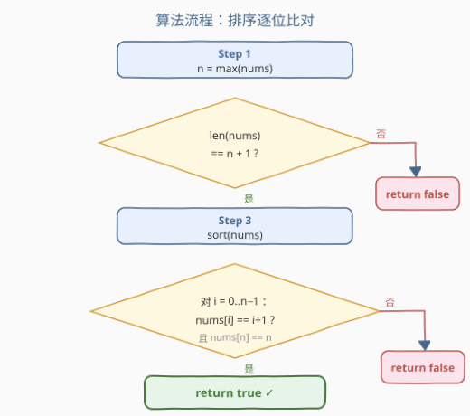
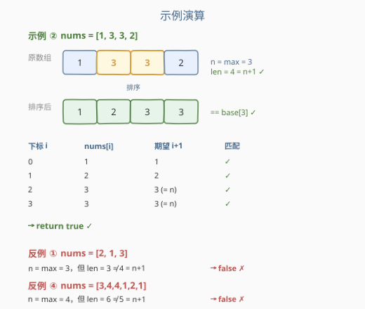

# 检查数组是否是好的

- **题目名称**：检查数组是否是好的
- **链接**：[2784. 检查数组是否是好的](https://leetcode.cn/problems/check-if-array-is-good/)
- **难度**：简单
- **标签**：数组、哈希表、排序

## 1. 题目概述

给你一个整数数组 `nums`，如果它是数组 `base[n]` 的一个排列，我们称它是个**好**数组。

$$\text{base}[n] = [1,\; 2,\; \ldots,\; n-1,\; n,\; n]$$

换句话说，`base[n]` 是一个长度为 $n+1$ 的数组，其中 $1$ 到 $n-1$ 各出现一次、$n$ 出现两次。例如 `base[1] = [1, 1]`，`base[3] = [1, 2, 3, 3]`。

如果数组是一个好数组，返回 `true`，否则返回 `false`。

> 💡 **排列**：数组元素按任意顺序重新排布后与目标数组完全相同，即「所含元素及其数量完全一致，只是顺序可以不同」。

**示例 1**：

```text
输入：nums = [2, 1, 3]
输出：false
解释：最大元素是 3，唯一可能的 n = 3。但 base[3] 有 4 个元素而 nums 只有 3 个，无法构成，返回 false。
```

**示例 2**：

```text
输入：nums = [1, 3, 3, 2]
输出：true
解释：最大元素是 3，n = 3。排序后为 [1, 2, 3, 3]，恰好是 base[3] 的排列，返回 true。
```

**示例 3**：

```text
输入：nums = [1, 1]
输出：true
解释：最大元素是 1，n = 1，base[1] = [1, 1]，与 nums 完全一致，返回 true。
```

**示例 4**：

```text
输入：nums = [3, 4, 4, 1, 2, 1]
输出：false
解释：最大元素是 4，n = 4。但 base[4] 有 5 个元素而 nums 有 6 个，返回 false。
```

**约束条件**：

- $1 \le \text{nums.length} \le 100$
- $1 \le \text{nums}[i] \le 200$

---

## 2. 解题思路

### 2.1 暴力思路

暴力地枚举所有可能的 $n$（从 $1$ 到 $200$），对每个 $n$ 构造 `base[n]`，再判断 `nums` 是否是它的排列。每次判断排列需要排序或哈希计数，总复杂度 $O(V \cdot n\log n)$，其中 $V=200$。虽然数据量小能过，但完全没必要枚举所有 $n$。

### 2.2 核心观察：n = max(nums) 唯一确定 base[n]

![base[n] 结构与核心观察](../images/p2784_concept.svg)

关键在于：**$n$ 不需要枚举，它就是 `nums` 的最大值**。

理由很简单——`base[n]` 中最大的元素就是 $n$，而 $n$ 在数组里出现且仅出现（两次）。如果 `nums` 是 `base[n]` 的排列，那么 `nums` 中的最大值一定等于 $n$；反过来，一旦确定了 $n=\max(\text{nums})$，目标数组 `base[n]` 就**唯一确定**了。

> ⚠️ 有人担心「万一 `nums` 不是好数组，最大值不等于真正的 $n$ 怎么办？」——这恰恰是判断的关键：我们**假设** $n=\max(\text{nums})$，用它构造唯一的候选 `base[n]`，再逐一核对。如果 `nums` 不是好数组，核对时自然会发现不匹配而返回 `false`。

于是只需两步检查：

1. **长度**：$\text{len}(\text{nums}) = n + 1$（`base[n]` 恰好 $n+1$ 个元素）。
2. **内容**：排序后逐位比对，$\text{sorted}(\text{nums})$ 应等于 $[1, 2, \ldots, n, n]$，即下标 $i$ 处期望值为 $i+1$（最后两位都等于 $n$）。

### 2.3 算法流程图



流程非常直接：取最大值定 $n$ → 查长度 → 排序 → 逐位比对。任何一个环节不满足就立即返回 `false`，全部通过才返回 `true`。

### 2.4 示例演算



以 `nums = [1, 3, 3, 2]` 为例：

- $n = \max = 3$，长度 $4 = n+1$ ✓
- 排序后 $[1, 2, 3, 3]$，逐位比对：`nums[0]=1=0+1` ✓、`nums[1]=2=1+1` ✓、`nums[2]=3=2+1` ✓、`nums[3]=3=n` ✓ → **return true**

反例 `nums = [2, 1, 3]`：$n=3$ 但长度 $3 \neq 4$，第一步即淘汰。

---

## 3. 参考代码

### C++（排序逐位比对）

```cpp
class Solution {
public:
    bool isGood(vector<int>& nums) {
        int n = *max_element(nums.begin(), nums.end());
        if ((int)nums.size() != n + 1) return false;
        sort(nums.begin(), nums.end());
        for (int i = 0; i < n; i++) {
            if (nums[i] != i + 1) return false;
        }
        return nums[n] == n;
    }
};
```

### Python

```python
class Solution:
    def isGood(self, nums: List[int]) -> bool:
        n = max(nums)
        if len(nums) != n + 1:
            return False
        nums.sort()
        return all(nums[i] == i + 1 for i in range(n)) and nums[n] == n
```

> 💡 循环只需跑到 $i < n$（前 $n$ 个位置期望 $1..n$），最后单独确认 `nums[n] == n`。也可写成 `nums == list(range(1, n)) + [n, n]` 直接整体比较，更简洁但多构造一个列表。

---

## 4. 复杂度分析

| 维度 | 复杂度 | 说明 |
|------|--------|------|
| 时间复杂度 | $O(n \log n)$ | `max_element` 为 $O(n)$，排序 $O(n\log n)$ 为主项，逐位比对 $O(n)$ |
| 空间复杂度 | $O(\log n)$ | 原地排序的栈空间，无额外数据结构 |

> 数据规模 $n \le 100$，任何写法都能轻松通过；复杂度分析面向一般情形。

---

## 5. 扩展：计数写法（哈希表）

排序会改变原数组，若需保持 `nums` 不变或想用 $O(n)$ 时间，可用计数数组代替排序：

```cpp
class Solution {
public:
    bool isGood(vector<int>& nums) {
        int n = *max_element(nums.begin(), nums.end());
        if ((int)nums.size() != n + 1) return false;
        vector<int> cnt(n + 1, 0);
        for (int x : nums) {
            if (x < 1 || x > n) return false;   // 越界值一定不是好数组
            if (++cnt[x] > (x == n ? 2 : 1)) return false;
        }
        return true;
    }
};
```

计数写法时间 $O(n)$、空间 $O(n)$，且**不修改原数组**。当 `nums[i] > n` 时提前返回 `false`（因为 `base[n]` 中不可能出现大于 $n$ 的值），无需处理大索引。两种写法逻辑等价，排序版代码更短、计数版效率更优。

---

## 6. 面试要点

1. **为什么 $n = \max(\text{nums})$ 就够了，不用枚举？**

   - `base[n]` 中最大元素就是 $n$，而排列不改变元素集合，因此若 `nums` 是好数组，它的最大值一定等于 $n$。用最大值作 $n$ 构造唯一候选，再核对即可——枚举所有 $n$ 是多余的。

2. **长度检查为什么是 $n+1$ 而不是 $n$？**

   - `base[n] = [1, …, n, n]` 有 $n+1$ 个元素（$n$ 重复了一次）。长度不等于 $n+1$ 直接淘汰，能在 $O(1)$ 内排除一大批反例（如示例 1、4）。

3. **排序后逐位比对，为什么期望值是 $i+1$？**

   - 排序后 `base[n]` 是 $[1, 2, \ldots, n-1, n, n]$，下标 $i$（$0 \le i < n$）处期望 $i+1$，最后一个下标 $n$ 处期望 $n$。逐位核对就是验证排列等价性的标准做法。

4. **计数写法和排序写法怎么选？**

   - 数据量 $n \le 100$ 时两者无实质差异。一般情形下计数法 $O(n)$ 优于排序 $O(n\log n)$，且不改原数组；但排序法代码更简洁、常数小、可读性强。面试中先给排序版讲清思路，再提计数版作为优化即可。

5. **`nums[i] > n` 为什么要提前判掉？**

   - `base[n]` 的元素全部在 $[1, n]$ 内，若出现越界值说明一定不是好数组。计数法中这也避免了 `cnt` 数组越界访问，是一举两得的剪枝。

---

## 7. 同类练习题

- [217. 存在重复元素](https://leetcode.cn/problems/contains-duplicate/)：哈希表/计数判重的母题，本题「$n$ 出现两次」即用到重复计数思想
- [219. 存在重复元素 II](https://leetcode.cn/problems/contains-duplicate-ii/)：在 217 基础上加距离约束，同为哈希表计数判定
- [1122. 数组的相对排序](https://leetcode.cn/problems/relative-sort-array/)：排序 + 计数对齐，与本题「排序后逐位比对」同属排序匹配类
- [1636. 按照频率将数组升序排序](https://leetcode.cn/problems/sort-array-by-increasing-frequency/)：计数 + 自定义排序，强化「先计数再排序」的组合思维
- [1331. 数组序号转换](https://leetcode.cn/problems/rank-transform-of-an-array/)：去重排序 + 映射，与本题「值域 $1..n$ 连续」的判定相关
