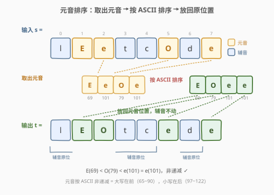
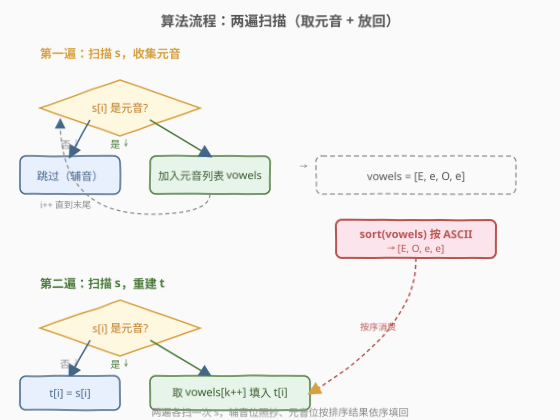
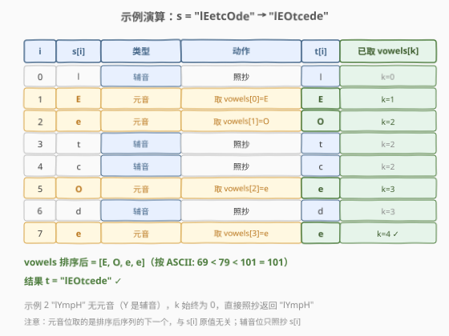
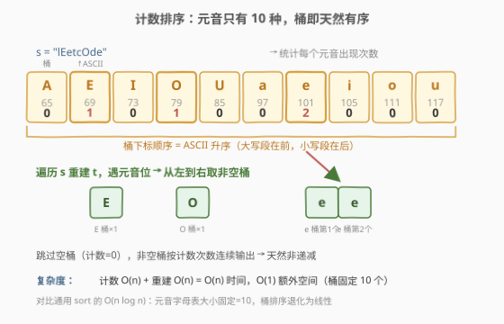

# 将字符串中的元音字母排序

- **题目名称**：将字符串中的元音字母排序
- **链接**：[2785. 将字符串中的元音字母排序](https://leetcode.cn/problems/sort-vowels-in-a-string/)
- **难度**：中等
- **标签**：字符串、排序

## 1. 题目概述

给你一个下标从 **0** 开始的字符串 `s`，将 `s` 中的元素重新**排列**得到新的字符串 `t`，它满足：

1. **所有辅音字母都在原来的位置上**。即若 `0 <= i < s.length` 处的 `s[i]` 是个辅音字母，那么 `t[i] = s[i]`。
2. **元音字母都必须以它们的 ASCII 值按非递减顺序排列**。即对于 `0 <= i < j < s.length`，若 `s[i]` 和 `s[j]` 都是元音字母，那么 `t[i]` 的 ASCII 值不能大于 `t[j]` 的 ASCII 值。

返回结果字符串 `t`。

元音字母为 `'a'`、`'e'`、`'i'`、`'o'`、`'u'`，可能小写也可能大写；辅音字母是除了这 5 个字母以外的所有字母。

**示例 1**：

```text
输入：s = "lEetcOde"
输出："lEOtcede"
解释：'E'、'O' 和 'e' 是 s 中的元音字母，'l'、't'、'c'、'd' 是所有的辅音。将元音字母按照 ASCII 值排序，辅音字母留在原位。
```

**示例 2**：

```text
输入：s = "lYmpH"
输出："lYmpH"
解释：s 中没有元音字母（s 中都为辅音字母），所以我们返回 "lYmpH"。
```

**约束条件**：

- $1 \le \text{s.length} \le 10^5$
- `s` 只包含英语字母表中的**大写**和**小写**字母。

> 💡 本题是 LeetCode 周赛 354 第三题，考查「**定点重排**」思想：辅音位锁死不动，只把元音位整体抽出、排序、再依序填回。难点不在排序本身，而在看穿「元音只有 10 种」这一结构——它能把通用 $O(n\log n)$ 排序优化到 $O(n)$ 计数排序。下文先讲通用解法，再给出线性计数排序优化，并以 C++ / Python 两种语言实现。

---

## 2. 解题思路

### 2.1 暴力思路：每个元音位都重新挑最小值

最朴素的直觉是「贪心逐位填」：从左到右扫描 `s`，每遇到一个元音位，就在剩余未用的元音里挑一个 ASCII 最小的填进去。这能保证最终非递减。

但这样每填一位都要在剩余元音中找最小值，若每次都线性扫描剩余集合，是 $O(k^2)$（$k$ 为元音个数）。可以用最小堆优化到 $O(k\log k)$，但本质仍是在「填的时候」做排序决策——不如先把元音全部取出排序好，再一次性依序填回。后者思路更清晰、更不易错。

> ⚠️ 还有人会想「能不能在原串上只交换相邻元音使整体有序」——可以，但那就是对元音子序列做**冒泡排序**，$O(k^2)$ 且实现绕，远不如「取出→排序→填回」直接。

### 2.2 核心观察：取出元音 → 排序 → 按序填回



字符串视角的本质：**辅音位是「锚点」，元音位是「插槽」**。把所有元音抽出来排好序，再从左到右逐个塞回插槽即可——辅音一个不动，元音整体非递减。

三个关键观察让这个方案直接落地：

| 观察 | 说明 |
|------|------|
| **位置无关性** | 元音最终要非递减，意味着**所有元音位上的值就是排序后的元音序列**，与哪个元音原本在哪个元音位无关——只要把排序后的序列按序填进元音位即可 |
| **辅音位是只读锚点** | 辅音位 `t[i] = s[i]` 恒成立，所以重建 `t` 时遇到辅音位直接照抄，遇到元音位才从排序后的序列取下一个 |
| **元音字母表大小固定 = 10** | 元音只有 `a/e/i/o/u` 及对应大写共 10 种，值域极小——可用计数排序（桶已天然按 ASCII 有序）把排序降到 $O(n)$ |

> 💡 **为什么元音按 ASCII 排序恰好是 `"AEIOUaeiou"`？** ASCII 表中大写字母段（65~90）整体在小写字母段（97~122）之前，且段内字母按字母表顺序递增。元音集合 $\{A,E,I,O,U,a,e,i,o,u\}$ 投影到 ASCII 上自然变成「大写五个在前、小写五个在后，段内按 A,E,I,O,u 顺序」——所以排序后的元音字母表恰好就是字符串 `"AEIOUaeiou"`。这个性质让计数排序的「桶下标」与「ASCII 顺序」天然对齐，无需额外排序桶。

> ⚠️ **注意区分「辅音位」与「辅音字母」**。题目里辅音字母定义是「非 a/e/i/o/u 的字母」，与位置无关；而「辅音位」指 `s` 中那些存的是辅音字母的下标。`s = "lEetcOde"` 中 `Y` 是辅音字母（示例 2），故 `lYmpH` 全是辅音位、零元音位，直接照抄返回。

### 2.3 算法流程图



整体是**两遍扫描**，没有复杂的分支嵌套：

**第一遍（收集 + 排序）**：
1. 遍历 `s`，遇到元音字符就加入列表 `vowels`，辅音跳过；
2. 对 `vowels` 按 ASCII 升序排序（通用 `sort`，$O(k\log k)$）。

**第二遍（重建）**：
3. 维护指针 `k = 0`，再次遍历 `s`：
   - 若 `s[i]` 是辅音 → `t[i] = s[i]`（照抄）；
   - 若 `s[i]` 是元音 → `t[i] = vowels[k++]`（取排序后序列的下一个）。
4. 返回 `t`。

> 💡 **为什么第二遍遇元音位就取下一个、不用看 `s[i]` 原值？** 因为元音位的最终值只取决于「排序后的元音序列」和「这是第几个元音位」。第 $j$ 个元音位（从 0 起数）应填排序后序列的第 $j$ 个元素。第二遍扫描时 `k` 正好记录「已填了几个元音位」，所以遇到元音位直接取 `vowels[k]` 并 `k++` 即可——这与 `s[i]` 原本是哪个元音无关。

### 2.4 示例演算



以**示例 1** `s = "lEetcOde"` 为例：

- 元音位（下标 1、2、5、7）上的字符：`E(69)`、`e(101)`、`O(79)`、`e(101)`；
- 排序后 `vowels = [E, O, e, e]`（ASCII: 69 < 79 < 101 = 101）；
- 第二遍扫描按 `k` 依序填回：

| 步 | `i` | `s[i]` | 类型 | 动作 | `t[i]` | `k` |
|----|-----|--------|------|------|--------|-----|
| ① | 0 | `l` | 辅音 | 照抄 | `l` | 0 |
| ② | 1 | `E` | 元音 | 取 `vowels[0]=E` | `E` | 1 |
| ③ | 2 | `e` | 元音 | 取 `vowels[1]=O` | `O` | 2 |
| ④ | 3 | `t` | 辅音 | 照抄 | `t` | 2 |
| ⑤ | 4 | `c` | 辅音 | 照抄 | `c` | 2 |
| ⑥ | 5 | `O` | 元音 | 取 `vowels[2]=e` | `e` | 3 |
| ⑦ | 6 | `d` | 辅音 | 照抄 | `d` | 3 |
| ⑧ | 7 | `e` | 元音 | 取 `vowels[3]=e` | `e` | 4 ✓ |

结果 `t = "lEOtcede"`，与示例一致。注意第 ③ 步：原位是 `e`，但填的是 `O`（排序后序列的第 2 个）——这正是「位置无关性」的体现，元音位的最终值只认序号、不认原值。

**示例 2** `s = "lYmpH"`：`Y`、`H` 等都是辅音字母（元音仅 a/e/i/o/u），全串零元音位，`vowels` 为空，`k` 始终为 0，直接照抄返回 `"lYmpH"`。

---

## 3. 参考代码

### C++（取出 + sort + 原地填回）

```cpp
class Solution {
public:
    string sortVowels(string s) {
        string vowels;
        for (char c : s) {
            if (isVowel(c)) vowels.push_back(c);
        }
        sort(vowels.begin(), vowels.end());   // 按 ASCII 升序
        for (int i = 0, k = 0; i < (int)s.size(); i++) {
            if (isVowel(s[i])) s[i] = vowels[k++];   // 元音位依序替换，辅音位不动
        }
        return s;
    }
private:
    static bool isVowel(char c) {
        c = tolower((unsigned char)c);
        return c == 'a' || c == 'e' || c == 'i' || c == 'o' || c == 'u';
    }
};
```

> 💡 用 `tolower` 把大小写归一后再判 5 个字母，比列 `AEIOUaeiou` 十个字符更紧凑、更不易漏。注意 `tolower` 的参数应转 `unsigned char`/`int`，避免 `char` 为负时未定义行为。原地修改 `s` 可省一份输出拷贝，额外空间仅 `vowels` 列表的 $O(k)$。

### C++（计数排序优化，$O(n)$ 时间 $O(1)$ 额外空间）

元音字母表大小固定为 10，桶天然按 ASCII 有序，可退化到线性：

```cpp
class Solution {
public:
    string sortVowels(string s) {
        // 元音按 ASCII 升序恰好为 "AEIOUaeiou"
        const string order = "AEIOUaeiou";
        int cnt[128] = {0};
        for (char c : s) if (isVowel(c)) cnt[(unsigned char)c]++;
        for (int i = 0, p = 0; i < (int)s.size(); i++) {
            if (!isVowel(s[i])) continue;
            while (cnt[(unsigned char)order[p]] == 0) p++;   // 跳过空桶
            s[i] = order[p];
            cnt[(unsigned char)order[p]]--;
        }
        return s;
    }
private:
    static bool isVowel(char c) {
        c = tolower((unsigned char)c);
        return c == 'a' || c == 'e' || c == 'i' || c == 'o' || c == 'u';
    }
};
```

> 💡 `cnt` 用 `int[128]` 以字符 ASCII 为下标计数，`order` 写死成 `"AEIOUaeiou"`。重建时指针 `p` 在 `order` 上只增不减（桶已有序），跳过空桶后取出非空桶的字符、计数减一。由于桶大小固定 10，`p` 的总移动次数不超过 10，整体仍是 $O(n)$。

### Python（取出 + sort + 生成器填回）

```python
class Solution:
    def sortVowels(self, s: str) -> str:
        vowels = sorted(c for c in s if c.lower() in "aeiou")
        it = iter(vowels)
        return "".join(next(it) if c.lower() in "aeiou" else c for c in s)
```

> 💡 `sorted` 返回排好序的元音列表，用 `iter` 包装后由生成器表达式按需取下一个。`c.lower() in "aeiou"` 同时覆盖大小写两种元音判定。`next(it)` 在元音位取值、辅音位取 `c` 本身——与 C++ 版逻辑同构，写法更紧凑。

### Python（计数排序优化，$O(n)$ 时间 $O(1)$ 额外空间）

```python
class Solution:
    def sortVowels(self, s: str) -> str:
        order = "AEIOUaeiou"
        cnt = {c: 0 for c in order}
        for c in s:
            if c in order:          # c in order 即「c 是元音」
                cnt[c] += 1
        res, p = [], 0
        for c in s:
            if c in order:
                while cnt[order[p]] == 0:
                    p += 1
                res.append(order[p])
                cnt[order[p]] -= 1
            else:
                res.append(c)
        return "".join(res)
```

> ⚠️ 这里有个巧用：`order = "AEIOUaeiou"` 同时身兼两职——既是「桶的有序排列」，又是「元音判定集合」（`c in order` 等价于 `c` 是元音）。因为 `order` 字符串恰好包含全部 10 个元音字母，字符在不在其中就是元音判定。一行字符串承担「有序桶 + 元音集合」两个角色，省下单独的元音集合定义。

---

## 4. 复杂度分析

| 维度 | 通用 sort 解法 | 计数排序优化 |
|------|----------------|--------------|
| **时间复杂度** | $O(n + k\log k)$ | $O(n)$ |
| **空间复杂度** | $O(k)$（`vowels` 列表） | $O(1)$（桶大小固定 10） |
| **排序方式** | 通用比较排序 | 桶已天然有序，只计数不比较 |

> $k$ 为元音个数，最坏 $k = n$（全元音）。通用解法两遍各扫一次 `s` 为 $O(n)$，排序 $k$ 个元音为 $O(k\log k)$，合计 $O(n + k\log k)$，最坏 $O(n\log n)$。计数排序解法利用「值域 = 10」这一常数，把排序从 $O(k\log k)$ 降到 $O(k)$，整体线性 $O(n)$，且桶数组大小固定不随 $n$ 增长，额外空间 $O(1)$。

> 💡 **本题 $n \le 10^5$**，两种解法都能轻松通过。计数排序的价值在于：(1) 体现「值域有限时排序可线性化」这一通用优化思路；(2) 额外空间从 $O(k)$ 降到 $O(1)$。当元音很密集（$k$ 接近 $n$）时，$O(n)$ 比 $O(n\log n)$ 约快 $\log n \approx 17$ 倍，对 $10^5$ 是可观的常数差。

---

## 5. 扩展：定点重排与「值域有限的排序」

### 5.1 「定点重排」问题族

本题属于「**保留部分位置、重排其余元素**」一类问题：给定一组「锁死位置」（本题是辅音位），只对「可动位置」（元音位）上的元素按某规则重排。这类问题的通用解法都是「**抽出可动元素 → 按规则处理 → 依序填回**」三步：

| 步骤 | 作用 | 本题对应 |
|------|------|----------|
| 抽出 | 把可动位置的元素收集到一个序列 | 收集所有元音到 `vowels` |
| 处理 | 按目标规则变换这个序列 | 按 ASCII 排序 |
| 填回 | 用指针在可动位置依序写回 | 元音位填 `vowels[k++]` |

> 💡 这套「抽出-处理-填回」是定点重排的母题动作。只要「锁死位」与「可动位」的判定清晰、目标规则可作用于抽出的序列，就能套用——例如「只重排奇数位的元素使其升序」「只重排数字字符、字母字符留原位」等变体。

### 5.2 值域有限 → 计数排序



通用比较排序（快排、归并等）的 $O(n\log n)$ 下界来自「值域无界、需两两比较」。当**值域大小 $\Sigma$ 是常数**（本题元音 $\Sigma = 10$），排序可降为 $O(n + \Sigma) = O(n)$ 的计数排序：

1. 用大小为 $\Sigma$ 的桶统计每个值出现次数；
2. 按值的大小顺序遍历桶，按计数次数连续输出——桶的遍历顺序即排序顺序。

本题的妙处在于：**桶的天然顺序恰好就是 ASCII 升序**（`"AEIOUaeiou"`），连「排序桶」这一步都省了，直接按 `order` 字符串遍历即可。

> ⚠️ 计数排序的代价是空间 $O(\Sigma)$。只有 $\Sigma$ 远小于 $n$ 时才划算；若 $\Sigma$ 与 $n$ 同阶（如排序 $n$ 个互异的 32 位整数，$\Sigma = 2^{32}$），桶数组会爆炸，反不如比较排序。本题 $\Sigma = 10$ 是常数，计数排序是免费午餐。

> 💡 **同类思想在哪些题出现？** 1122「数组的相对排序」（值域 0~1000，按自定义顺序排）、1365「有多少小于当前数字的数」（值域 0~100，计数前缀和）、274「H 指数」（引用次数值域有限，计数后从高到低累计）——都是「值域有限 → 计数代替比较」的范例。387「字符串中的第一个唯一字符」也用计数，但目的是查重而非排序，属计数思想的另一应用。

---

## 6. 面试要点

1. **为什么要「取出 → 排序 → 填回」，而不是在原串上交换相邻元音？**

   > 相邻交换使元音子序列有序本质是「对元音子序列做冒泡排序」，$O(k^2)$ 比较。取出再排序能用上 $O(k\log k)$ 的引擎排序，且实现更直接——「抽出-处理-填回」是定点重排的母题动作，思路与正确性都更易论证。在原串上交换还要处理「交换后辅音位是否被波及」的边界，徒增复杂度。

2. **元音按 ASCII 排序后为什么恰好是 `"AEIOUaeiou"`？**

   > ASCII 表中大写段（65~90）整体在小写段（97~122）之前，且段内字母按字母表顺序递增。元音集合 $\{A,E,I,O,U,a,e,i,o,u\}$ 投影到 ASCII 上自然变成「大写五在前、小写五在后，段内按 A,E,I,O,u 顺序」。这个性质让计数排序的桶下标天然有序，无需额外排序桶。

3. **`Y` / `y` 算元音还是辅音？**

   > 本题明确「元音仅为 a/e/i/o/u」，`Y/y` 是**辅音**。这是题目的人为界定（英语里 y 有时作半元音，但本题不考虑），示例 2 的 `"lYmpH"` 全是辅音正印证此点。实现时元音判定集合只放 a/e/i/o/u，不要自作主张加 `y`。

4. **计数排序为什么是 $O(n)$ 且额外空间 $O(1)$？**

   > 桶数组大小 $\Sigma = 10$ 是与 $n$ 无关的常数，故空间 $O(1)$；计数一遍扫 $n$ 次、填回一遍扫 $n$ 次，桶指针 `p` 总移动不超过 $\Sigma$ 次，合计 $O(n + \Sigma) = O(n)$。关键是「值域有限」让比较从「两两比」变成「按桶序取」，省掉 $\log n$ 因子。

5. **如果要求元音按「非递增」排序，或区分大小写只排小写元音，怎么改？**

   > 非递增只需把 `order` 改成 `"uoieaUOIEA"`（ASCII 降序）、或对通用解法加 `greater<>()` 比较器即可，结构不变。若只排小写元音、大写元音留原位，则「可动位」变成「存小写元音的位置」，抽出时只取小写元音、大写元音当锚点照抄——仍是同一套母题，只是「锁死位」与「可动位」的判定变了。

> 💡 **一句话总结**：2785 = 「辅音位锁死、元音位抽出排序后依序填回」。通用解法 $O(n + k\log k)$ 借力 `sort`；进阶用计数排序把元音排序降到 $O(n)$——因元音字母表大小固定为 10，桶天然按 ASCII 有序（`"AEIOUaeiou"`），排序退化为线性、空间 $O(1)$。考点在「定点重排」母题与「值域有限 → 计数排序」的优化意识。

---

## 7. 同类练习题

- [917. 仅仅反转字母](https://leetcode.cn/problems/reverse-only-letters/)：同一套「定点重排」母题——锁死非字母位、只反转字母位，用「抽出字母 + 双指针反转 + 填回」三步，与本题「抽出元音 + 排序 + 填回」同构
- [557. 反转字符串中的单词 III](https://leetcode.cn/problems/reverse-words-in-a-string-iii/)：锁死单词边界、只反转每个单词内字符，同属「部分位置锁死、其余重排」家族
- [1122. 数组的相对排序](https://leetcode.cn/problems/relative-sort-array/)：值域有限（0~1000）+ 计数排序，与本题计数优化同源——值域有限时排序可线性化
- [387. 字符串中的第一个唯一字符](https://leetcode.cn/problems/first-unique-character-in-a-string/)：值域有限（26 个字母）+ 计数，与本题同属「字母表固定 → 桶式计数」思想，但用于查重而非排序
- [1859. 将句子排序](https://leetcode.cn/problems/sorting-the-sentence/)：按单词末尾数字标记重排、移除标记，与本题同属「取出可动元素 + 按规则排 + 填回」的定点重排范式
