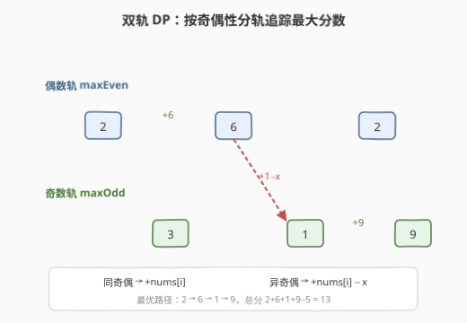
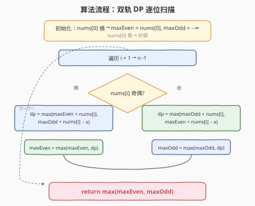
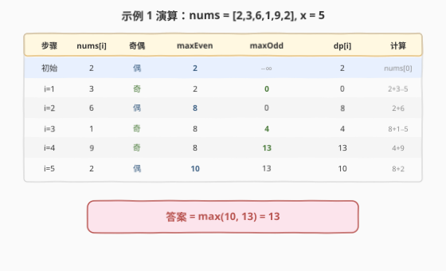

# 访问数组中的位置使分数最大

- **题目名称**：访问数组中的位置使分数最大
- **链接**：[2786. 访问数组中的位置使分数最大](https://leetcode.cn/problems/visit-array-positions-to-maximize-score/)
- **难度**：中等
- **标签**：数组、动态规划

## 1. 题目概述

给你一个下标从 **0** 开始的整数数组 `nums` 和一个正整数 $x$。你一开始在位置 $0$，可以按照下述规则访问数组中的其他位置：

- 从当前位置 $i$ 可以移动到任意满足 $i < j$ 的位置 $j$；
- 访问位置 $i$ 可获得分数 $nums[i]$；
- 若从 $i$ 移动到 $j$ 且 $nums[i]$ 与 $nums[j]$ **奇偶性不同**，则失去 $x$ 分。

返回你能得到的最大得分之和。**初始分数为 $nums[0]$**。

**示例 1**：

```text
输入：nums = [2,3,6,1,9,2], x = 5
输出：13
解释：访问 0 → 2 → 3 → 4，对应值 2,6,1,9。6 与 1 奇偶性不同，失去 x=5 分。
      总分 = 2 + 6 + 1 + 9 − 5 = 13。
```

**示例 2**：

```text
输入：nums = [2,4,6,8], x = 3
输出：20
解释：所有元素奇偶性相同，逐个访问无惩罚。总分 = 2 + 4 + 6 + 8 = 20。
```

**约束条件**：

- $2 \le nums.length \le 10^5$
- $1 \le nums[i],\ x \le 10^6$

---

## 2. 解题思路

### 2.1 暴力思路

朴素 DP：设 $dp[i]$ 为到达位置 $i$ 时的最大分数，则：

$$
dp[i] = \max_{j < i} \begin{cases} dp[j] + nums[i] & \text{若 } nums[i] \equiv nums[j] \pmod 2 \\ dp[j] + nums[i] - x & \text{否则} \end{cases}
$$

初始化 $dp[0] = nums[0]$，答案为 $\max_i dp[i]$。时间复杂度 $O(n^2)$，当 $n = 10^5$ 时 $n^2 = 10^{10}$，超时。

### 2.2 核心观察：双轨 DP，按奇偶性压缩状态



> 💡 **关键观察**：转移时唯一影响惩罚的是**前一个位置的奇偶性**——同奇偶无惩罚，异奇偶扣 $x$。因此不必逐个 $j$ 枚举，只需维护两个滚动极值：
>
> - **maxEven**：以偶数结尾的最大分数
> - **maxOdd**：以奇数结尾的最大分数

处理位置 $i$ 时，只需从这两个极值中取较优者转移：

$$
\text{若 } nums[i] \text{ 为偶：}\quad dp[i] = \max(\text{maxEven} + nums[i],\ \text{maxOdd} + nums[i] - x)
$$

$$
\text{若 } nums[i] \text{ 为奇：}\quad dp[i] = \max(\text{maxOdd} + nums[i],\ \text{maxEven} + nums[i] - x)
$$

算出 $dp[i]$ 后，用它更新对应的 maxEven 或 maxOdd。由于 $i$ 严格递增、只需前一步的极值，**两个变量滚动即可，连 dp 数组都不需要**。

### 2.3 算法流程图



### 2.4 示例演算



以示例 1 `nums = [2,3,6,1,9,2], x = 5` 为例：

1. **初始**：$nums[0]=2$（偶），maxEven $= 2$，maxOdd $= -\infty$；
2. **$i=1$**：$nums[1]=3$（奇），$dp = \max(-\infty+3,\ 2+3-5) = 0$，maxOdd $= 0$；
3. **$i=2$**：$nums[2]=6$（偶），$dp = \max(2+6,\ 0+6-5) = 8$，maxEven $= 8$；
4. **$i=3$**：$nums[3]=1$（奇），$dp = \max(0+1,\ 8+1-5) = 4$，maxOdd $= 4$；
5. **$i=4$**：$nums[4]=9$（奇），$dp = \max(4+9,\ 8+9-5) = 13$，maxOdd $= 13$；
6. **$i=5$**：$nums[5]=2$（偶），$dp = \max(8+2,\ 13+2-5) = 10$，maxEven $= 10$。

答案 $= \max(\text{maxEven}, \text{maxOdd}) = \max(10, 13) = 13$。

---

## 3. 参考代码

### C++

```cpp
class Solution {
public:
    long long maxScore(vector<int>& nums, int x) {
        long long maxEven = (nums[0] % 2 == 0) ? (long long)nums[0] : LLONG_MIN / 4;
        long long maxOdd  = (nums[0] % 2 == 1) ? (long long)nums[0] : LLONG_MIN / 4;
        for (int i = 1; i < (int)nums.size(); i++) {
            if (nums[i] % 2 == 0)
                maxEven = max(maxEven + nums[i], maxOdd + nums[i] - x);
            else
                maxOdd = max(maxOdd + nums[i], maxEven + nums[i] - x);
        }
        return max(maxEven, maxOdd);
    }
};
```

### Python

```python
class Solution:
    def maxScore(self, nums: List[int], x: int) -> int:
        NEG = -10**18
        if nums[0] % 2 == 0:
            max_even, max_odd = nums[0], NEG
        else:
            max_even, max_odd = NEG, nums[0]
        for i in range(1, len(nums)):
            if nums[i] % 2 == 0:
                max_even = max(max_even + nums[i], max_odd + nums[i] - x)
            else:
                max_odd = max(max_odd + nums[i], max_even + nums[i] - x)
        return max(max_even, max_odd)
```

---

## 4. 复杂度分析

| 维度 | 复杂度 | 说明 |
|------|--------|------|
| 时间复杂度 | $O(n)$ | 单次遍历，每个位置 $O(1)$ 转移 |
| 空间复杂度 | $O(1)$ | 仅维护 maxEven / maxOdd 两个变量 |

$n = 10^5$ 时 $O(n)$ 远在时限内，无压力。

---

## 5. 扩展：从 $O(n^2)$ 到 $O(n)$ 的状态压缩

朴素 DP 的转移方程需要枚举所有 $j < i$，复杂度 $O(n^2)$。关键在于转移条件只依赖**奇偶性**这一二元属性——在 $[0, i)$ 的所有前驱中，同奇偶的前驱共享相同的惩罚结构（无惩罚），异奇偶的前驱共享相同的惩罚结构（扣 $x$）。因此只需分别维护两类前驱的 $dp$ 最大值，将"在 $O(n)$ 个前驱中取 max"压缩为"在 $2$ 个极值中取 max"。

这种**按转移条件分组取极值**的技巧在 DP 优化中很常见：

- 当转移条件是**值域区间**时 → 用权值线段树/树状数组维护区间 max（如 [2770](../2701-2800/2770_达到末尾下标所需的最大跳跃次数.md)）；
- 当转移条件是**离散类别**（如奇偶、正负号）时 → 每类维护一个标量极值即可（如 [152. 乘积最大子数组](https://leetcode.cn/problems/maximum-product-subarray/)）。

---

## 6. 面试要点

1. **为什么只需两个变量就能替代整个 dp 数组？**
   - 转移只依赖前驱的奇偶性，同奇偶的前驱等效（都 +nums[i]），异奇偶的前驱等效（都 +nums[i]−x）。每类只关心最大值，故 maxEven/maxOdd 两个标量即可。

2. **为什么 −∞ 用 `LLONG_MIN / 4` 而非 `LLONG_MIN`？**
   - `LLONG_MIN + nums[i] − x` 会溢出（下溢）。除以 4 留出足够余量，加减 $10^6$ 级别的值后仍不溢出。

3. **初始化时 maxOdd 或 maxEven 为什么设为 −∞？**
   - $nums[0]$ 只有一种奇偶性，另一轨尚无合法前驱，设为 $-\infty$ 保证首次跨轨转移不会成为最优选择（除非同轨转移更差，但同轨无惩罚必更优）。

4. **答案为什么是 max(maxEven, maxOdd) 而非 dp[n−1]？**
   - 题目要求最大得分之和，不要求必须到达最后一个位置。最优序列可能终止于任意位置，故取两轨的最终最大值。

5. **所有元素奇偶性相同时会发生什么？**
   - 跨轨转移分支恒被 −∞ 抑制，等价于逐个累加 $nums[i]$，无任何惩罚。这正是示例 2 的情形。

---

## 7. 同类练习题

- [152. 乘积最大子数组](https://leetcode.cn/problems/maximum-product-subarray/)：同样用两个滚动极值（max/min）处理正负号翻转，与本题按奇偶分轨取极值结构同构
- [198. 打家劫舍](https://leetcode.cn/problems/house-robber/)：经典一维 DP + O(1) 空间滚动优化，对照本题的状态压缩思路
- [740. 删除并获得点数](https://leetcode.cn/problems/delete-and-earn/)：值域建桶后转化为线性 DP，与本题"按属性分组后取极值"的思路呼应
- [2708. 一个小组的最大实力值](https://leetcode.cn/problems/maximum-strength-of-a-group/)：追踪正/负两个极值（乘法版），与本题追踪偶/奇两个极值（加法版）形成对照
