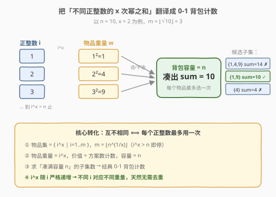
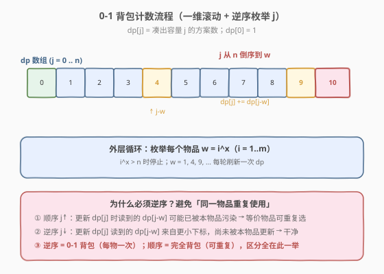
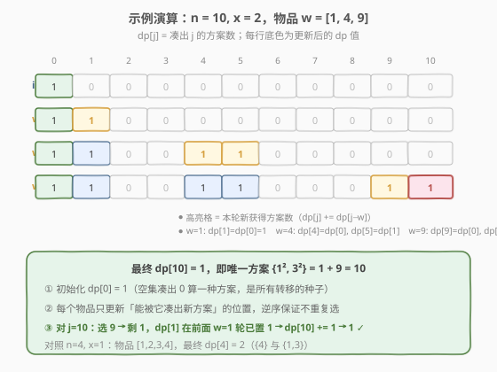

# 将一个数字表示成幂的和的方案数

- **题目名称**：将一个数字表示成幂的和的方案数
- **链接**：[2787. 将一个数字表示成幂的和的方案数](https://leetcode.cn/problems/ways-to-express-an-integer-as-sum-of-powers/)
- **难度**：中等
- **标签**：动态规划、背包

## 1. 题目概述

给你两个**正**整数 `n` 和 `x`。请你返回将 `n` 表示成一些**互不相同**正整数的 `x` 次幂之和的方案数。换句话说，你需要返回互不相同整数 `[n1, n2, ..., nk]` 的集合数目，满足 $n = n_1^x + n_2^x + \dots + n_k^x$。

由于答案可能非常大，将它对 $10^9 + 7$ 取余后返回。

比方说，$n = 160$ 且 $x = 3$，一个表示 $n$ 的方法是 $n = 2^3 + 3^3 + 5^3$。

**示例 1**：

```text
输入：n = 10, x = 2
输出：1
解释：我们可以将 n 表示为：n = 3^2 + 1^2 = 10。
这是唯一将 10 表达成不同整数 2 次方之和的方案。
```

**示例 2**：

```text
输入：n = 4, x = 1
输出：2
解释：我们可以将 n 按以下方案表示：
- n = 4^1 = 4。
- n = 3^1 + 1^1 = 4。
```

**约束条件**：

- $1 \le n \le 300$
- $1 \le x \le 5$

---

## 2. 解题思路

### 2.1 暴力思路

把候选正整数 $1, 2, \dots, m$（其中 $m = \lfloor n^{1/x} \rfloor$，即 $x$ 次幂不超过 $n$ 的最大正整数）的 $x$ 次幂作为可选数字，枚举所有子集，检查哪些子集之和恰为 $n$。但子集数为 $2^m$：当 $x = 1$ 时 $m$ 可达 $n = 300$，$2^{300}$ 远超时间限制；即便 $x = 2$ 时 $m \le 17$、$2^{17}$ 勉强可行，仍无法应对 $x = 1$ 的情况，必须改用动态规划。

### 2.2 核心观察：0-1 背包计数



把每个正整数 $i$ 看作一个**物品**：它的「重量」是 $w = i^x$，「选它」就对总和贡献 $w$。题目要求选出的正整数**互不相同**，等价于「每个物品最多选一次」——这正是经典的 **0-1 背包**。所求为「凑满容量 $n$ 的子集数」，即背包计数问题。

> 💡 **为什么天然不用去重？** 正整数 $i$ 的 $x$ 次幂 $i^x$ 随 $i$ 严格递增，因此不同的正整数对应不同的「重量」，物品天然两两不同，无需像普通多重背包那样处理同重物品。

设 $dp[j]$ 表示「凑出总和为 $j$ 的方案数」，初始化 $dp[0] = 1$（空集凑出 $0$ 算一种方案，是所有转移的种子）。对每个物品 $w = i^x$（$i = 1, 2, \dots$ 直到 $i^x > n$），执行 0-1 背包转移：

$$dp[j] \gets dp[j] + dp[j - w] \quad (j \text{ 从 } n \text{ 倒序到 } w)$$

含义：凑出 $j$ 的方案数 = 不选 $w$ 的方案数（$dp[j]$ 原值）+ 选 $w$ 的方案数（$dp[j-w]$）。最终答案为 $dp[n]$。

### 2.3 算法流程图



外层枚举每个物品 $w = i^x$（$i^x > n$ 即停止）；内层让 $j$ 从 $n$ **倒序**到 $w$，保证每个物品只被使用一次。

> ⚠️ **顺序方向是 0-1 背包与完全背包的唯一区别**：若 $j$ 正序枚举，更新 $dp[j]$ 时读到的 $dp[j-w]$ 可能已被本物品污染，等价于允许同一物品重复选取（完全背包）。逆序枚举则保证读到的 $dp[j-w]$ 来自更小下标、尚未被本物品更新，仍是「上一物品」的旧值，故每个物品只贡献一次。

### 2.4 示例演算



以 $n = 10,\ x = 2$ 为例，$m = \lfloor\sqrt{10}\rfloor = 3$，物品重量依次为 $1, 4, 9$：

- **init**：$dp = [1,0,0,0,0,0,0,0,0,0,0]$（下标 $0\sim10$）
- **$w=1$**：$j$ 从 $10$ 到 $1$，$dp[1]\mathrel{+}=dp[0]=1$ → $dp = [1,1,0,0,0,0,0,0,0,0,0]$
- **$w=4$**：$dp[4]\mathrel{+}=dp[0]=1\to1$；$dp[5]\mathrel{+}=dp[1]=1\to1$ → $dp = [1,1,0,0,1,1,0,0,0,0,0]$
- **$w=9$**：$dp[9]\mathrel{+}=dp[0]=1\to1$；$dp[10]\mathrel{+}=dp[1]=1\to1$ → $dp[10] = 1$

最终答案为 **$1$**，对应唯一方案 $\{1^2, 3^2\} = 1 + 9 = 10$。

> 💡 **对照 $n = 4,\ x = 1$**：物品 $[1,2,3,4]$，最终 $dp[4] = 2$，对应方案 $\{4\}$ 与 $\{1, 3\}$。

---

## 3. 参考代码

### C++（一维滚动 0-1 背包）

```cpp
class Solution {
public:
    int numberOfWays(int n, int x) {
        const int MOD = 1e9 + 7;
        vector<int> dp(n + 1, 0);
        dp[0] = 1;
        for (int i = 1; ; i++) {
            long long w = 1;
            bool over = false;
            for (int t = 0; t < x; t++) {
                w *= i;
                if (w > n) { over = true; break; }
            }
            if (over) break;                 // i^x > n，后续只会更大，停止
            for (int j = n; j >= w; j--) {   // 倒序：0-1 背包，每个物品只选一次
                dp[j] = (dp[j] + dp[j - w]) % MOD;
            }
        }
        return dp[n];
    }
};
```

### Python

```python
class Solution:
    def numberOfWays(self, n: int, x: int) -> int:
        MOD = 10 ** 9 + 7
        dp = [0] * (n + 1)
        dp[0] = 1
        i = 1
        while True:
            w = i ** x
            if w > n:
                break                       # i^x > n，停止枚举
            for j in range(n, w - 1, -1):   # 倒序：0-1 背包
                dp[j] = (dp[j] + dp[j - w]) % MOD
            i += 1
        return dp[n]
```

> 💡 **物品上界**：因为 $i^x$ 关于 $i$ 单调递增，一旦 $i^x > n$ 即可立即 `break`，无需预先算 $m$。最坏情况 $x = 1$ 时 $m = n = 300$。

---

## 4. 复杂度分析

| 维度 | 复杂度 | 说明 |
|------|--------|------|
| 时间复杂度 | $O(m \cdot n)$，其中 $m = \lfloor n^{1/x}\rfloor$ | 每个物品遍历至多 $n$ 个容量；$x=1$ 时 $m=n$ 退化到 $O(n^2) = O(300^2) \approx 9\times10^4$，远低于时限 |
| 空间复杂度 | $O(n)$ | 一维滚动数组，长度 $n+1 \le 301$ |

---

## 5. 扩展：二维 DP 与滚动数组的等价性

官方提示给出了二维定义：$dp[k][j]$ 表示「只使用正整数 $1\sim k$、凑出和为 $j$」的方案数。转移按「第 $k$ 个数选或不选」分两支：

$$dp[k][j] = dp[k-1][j] + dp[k-1][j - k^x]$$

边界 $dp[k][0] = 1$。这正是把外层「物品」显式编号后的二维形式。由于 $dp[k][*]$ 只依赖 $dp[k-1][*]$，可压掉 $k$ 维得到本文的一维滚动版本——而「逆序枚举 $j$」恰好对应「用旧值 $dp[k-1]$ 更新新值 $dp[k]$」：

- **正序** $j\uparrow$：$dp[j-w]$ 已被本物品（第 $k$ 轮）改写，等价于允许重复选用 $k$ → 退化为完全背包。
- **逆序** $j\downarrow$：$dp[j-w]$ 仍是第 $k-1$ 轮的旧值 → 严格对应 $dp[k-1][j-k^x]$，即 0-1 背包。

两种写法数学等价，一维写法空间更省、常数更小，是面试首选。

---

## 6. 面试要点

1. **为什么是 0-1 背包而非完全背包？**

   - 题目要求正整数「互不相同」，即每个正整数 $i$ 至多出现一次，对应「每个物品最多选一次」的 0-1 背包；若允许重复选就是完全背包（如 279 完全平方数）。

2. **为什么内层 $j$ 要倒序枚举？**

   - 0-1 背包用一维滚动数组时，倒序保证更新 $dp[j]$ 时读到的 $dp[j-w]$ 是「上一物品」的旧值，避免同一物品被重复计入；正序则会用上本物品刚写入的新值，等价于允许重复选取。

3. **物品集合和上界 $m$ 怎么定？**

   - 候选为 $i^x\ (i=1,2,\dots)$，只要 $i^x \le n$ 就是合法物品；由于 $i^x$ 单调递增，循环到 $i^x > n$ 直接 `break` 即可，无需预先精确计算 $m=\lfloor n^{1/x}\rfloor$。

4. **最坏规模有多大？**

   - $n \le 300$，物品数 $m \le n$（当 $x=1$），内层至多 $n$ 步，总计 $O(n^2) \approx 9\times10^4$，完全在时限内；$x \ge 2$ 时 $m \le \lfloor\sqrt{300}\rfloor = 17$，更轻松。

5. **为什么不用去重？**

   - $i^x$ 随 $i$ 严格递增，不同正整数对应不同「重量」，物品天然互不相同，无需任何去重逻辑。

---

## 7. 同类练习题

- [494. 目标和](https://leetcode.cn/problems/target-sum/)：同为 0-1 背包求方案数（凑目标值的子集数），把符号选择转成容量偏移后与本题几乎同构
- [416. 分割等和子集](https://leetcode.cn/problems/partition-equal-subset-sum/)：0-1 背包判定型（能否凑出一半），熟悉背包框架后再看本题计数版
- [279. 完全平方数](https://leetcode.cn/problems/perfect-squares/)：完全背包（物品可重复用），与本题对比内层正序 vs 逆序的差异
- [322. 零钱兑换](https://leetcode.cn/problems/coin-change/)：完全背包求最少硬币数，进一步巩固两类背包的顺序区别
