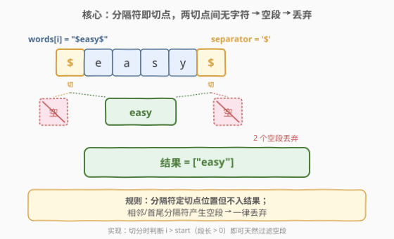
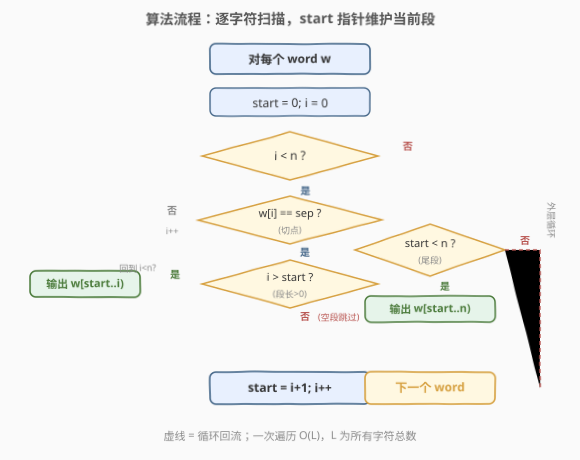

# 按分隔符拆分字符串

- **题目名称**：按分隔符拆分字符串
- **链接**：[2788. 按分隔符拆分字符串](https://leetcode.cn/problems/split-strings-by-separator/)
- **难度**：简单
- **标签**：数组、字符串

## 1. 题目概述

给你一个字符串数组 `words` 和一个字符 `separator`，请你按 `separator` 拆分 `words` 中的每个字符串。

返回一个由拆分后的新字符串组成的字符串数组，**不包括空字符串**。

**注意**

- `separator` 用于决定拆分发生的位置，但它不包含在结果字符串中。
- 拆分可能形成两个以上的字符串。
- 结果字符串必须保持初始相同的先后顺序。

**示例 1**：

```text
输入：words = ["one.two.three","four.five","six"], separator = "."
输出：["one","two","three","four","five","six"]
解释：在本示例中，我们进行下述拆分：
"one.two.three" 拆分为 "one", "two", "three"
"four.five" 拆分为 "four", "five"
"six" 拆分为 "six"
因此，结果数组为 ["one","two","three","four","five","six"] 。
```

**示例 2**：

```text
输入：words = ["$easy$","$problem$"], separator = "$"
输出：["easy","problem"]
解释：在本示例中，我们进行下述拆分：
"$easy$" 拆分为 "easy"（不包括空字符串）
"$problem$" 拆分为 "problem"（不包括空字符串）
因此，结果数组为 ["easy","problem"] 。
```

**示例 3**：

```text
输入：words = ["|||"], separator = "|"
输出：[]
解释：在本示例中，"|||" 的拆分结果将只包含一些空字符串，所以我们返回一个空数组 [] 。
```

**约束条件**：

- `1 <= words.length <= 100`
- `1 <= words[i].length <= 20`
- `words[i]` 中的字符要么是小写英文字母，要么是字符串 `".,|$#@"` 中的字符（不包括引号）
- `separator` 是字符串 `".,|$#@"` 中的某个字符（不包括引号）

> 💡 本题是周赛 355 第一题。看似只是"调 split 函数"，唯一的坑藏在**空字符串**上：相邻分隔符、首尾分隔符都会切出空段，题面要求一律丢弃。看清这一点，剩下的就是一次遍历。

---

## 2. 解题思路

### 2.1 暴力思路：直接调语言 split

最朴素的直觉是调用语言自带的字符串切分函数，把所有 token 拼起来。这条路完全可行，但有一个隐藏陷阱：

| 陷阱 | 说明 |
|------|------|
| **空 token 未过滤** | 多数语言的 `split(sep)`（带显式分隔符）**保留空串**。如 Python 的 `"$easy$".split("$")` 返回 `['', 'easy', '']`；C++ 的 `getline` 也会吐出空 `token`。若直接收集，会把首尾/相邻分隔符产生的空段也塞进结果，与题意相违 |
| **语义易混** | Python 的 `str.split()`（不带参数）会按任意空白切分并**自动丢弃空串**，但本题分隔符是特定字符、不能省略 `sep`，故不能依赖这个"自动清理"行为 |

因此暴力解的正确姿势是：**切分后逐一判断非空再加入结果**。这已经是最优复杂度，本就没有更"高级"的算法可挖——考点全在"空段处理"这一细节上。

### 2.2 核心观察：分隔符即切点，段长 > 0 才输出



把题意抽象一下：每个 `word` 是一条字符序列，`separator` 出现的位置就是**切点**。把序列在所有切点处断开，得到若干**段**；每段若含有至少一个非分隔符字符，即为一个有效 token，否则丢弃。

> 💡 **关键不变量**：一次操作（在切点处断开）只会把序列切成更小的段，**不会改变段内字符的相对顺序**，所以遍历一次即可按出现顺序产出所有非空段——天然保序，无需额外排序。

> ⚠️ **唯一易错点：空段**。下表穷举了空段的来源：

| 情形 | 示例（`sep='|'`） | split 结果 | 丢弃空段后 |
|------|------------------|-----------|-----------|
| 首分隔符 | `"|a"` | `["", "a"]` | `["a"]` |
| 尾分隔符 | `"a|"` | `["a", ""]` | `["a"]` |
| 相邻分隔符 | `"a||b"` | `["a", "", "b"]` | `["a", "b"]` |
| 全分隔符 | `"|||"` | `["", "", "", ""]` | `[]` |
| 无分隔符 | `"abc"` | `["abc"]` | `["abc"]` |

一句话：**只要判断"段长 > 0"再输出，所有空段就自动被过滤**。这正是手写扫描法的天然行为。

### 2.3 算法流程图



手写扫描用一对指针维护"当前正在生长的段"：

- **`start`**：当前段的起点（含），初始为 `0`；
- **`i`**：扫描游标，从 `0` 递增到 `n-1`。

扫描逻辑只有三步：

1. 若 `w[i] == separator`（遇到切点）：当 `i > start` 时（段长为正），把 `w[start..i)` 作为 token 输出；随后令 `start = i + 1`（下一段从这里开始）；
2. 否则（非切点）：`i++` 继续；
3. 扫到串尾后：若 `start < n`，输出最后的尾段 `w[start..n)`。

`i > start` 这一判断正是"段长 > 0"的等价表达——连续分隔符或首尾分隔符时 `i == start`，段长为 `0`，不输出，空段被天然丢弃。无需任何额外的"过滤空串"后处理。

> 💡 也可直接用语言 split + 过滤空串，逻辑等价。手写扫描的好处是**一步到位**：切分与过滤合二为一，少一次遍历、少一次中间容器。

### 2.4 示例演算

![示例演算：words=["one.two.three","four.five","six"], sep='.'](../images/p2788_walkthrough.svg)

以**示例 1**（`words = ["one.two.three","four.five","six"]`，`sep = '.'`）为例，逐词扫描：

| 词 | 切点位置 | 切出的段（顺序产出） |
|----|---------|---------------------|
| `"one.two.three"` | 下标 3、7 处的 `.` | `one` → `two` → `three` |
| `"four.five"` | 下标 4 处的 `.` | `four` → `five` |
| `"six"` | 无切点 | `six`（整串作为尾段） |

三个词产出 6 个非空 token，按产出顺序拼接，结果 `["one","two","three","four","five","six"]` ✓。

以**示例 2**（`words = ["$easy$","$problem$"]`，`sep = '$'`）为例：每个词首尾都是 `$`，切出 `["", "easy", ""]` 与 `["", "problem", ""]`，首尾空段全部丢弃，得 `["easy","problem"]` ✓。

以**示例 3**（`words = ["|||"]`，`sep = '|'`）为例：三个 `|` 切出四个空段，全部丢弃，得 `[]` ✓。

---

## 3. 参考代码

### C++（手写扫描，切分与过滤合一）

```cpp
class Solution {
public:
    vector<string> splitWordsBySeparator(vector<string>& words, char separator) {
        vector<string> res;
        for (const string& w : words) {
            int start = 0, n = w.size();
            for (int i = 0; i < n; i++) {
                if (w[i] == separator) {
                    if (i > start) res.push_back(w.substr(start, i - start));
                    start = i + 1;
                }
            }
            if (start < n) res.push_back(w.substr(start));
        }
        return res;
    }
};
```

### C++（getline + 过滤空串）

```cpp
class Solution {
public:
    vector<string> splitWordsBySeparator(vector<string>& words, char separator) {
        vector<string> res;
        for (const string& w : words) {
            stringstream ss(w);
            string token;
            while (getline(ss, token, separator)) {
                if (!token.empty()) res.push_back(token);
            }
        }
        return res;
    }
};
```

> ⚠️ 注意 `getline(ss, token, sep)` 对相邻/首尾分隔符会产出**空 `token`**（如 `"|||"` 产出 3 个空串），必须 `if (!token.empty())` 过滤，否则会 WA。手写扫描版用 `i > start` 把这步省掉了。

### Python

```python
class Solution:
    def splitWordsBySeparator(self, words: List[str], separator: str) -> List[str]:
        res = []
        for w in words:
            for token in w.split(separator):
                if token:
                    res.append(token)
        return res
```

> 💡 Python 一行等价写法：`return [t for w in words for t in w.split(separator) if t]`。`str.split(sep)` 带显式分隔符时**保留空串**，故同样要 `if t` 过滤；切勿误用无参 `split()`（它只按空白切分，与本题无关）。

---

## 4. 复杂度分析

| 维度 | 复杂度 | 说明 |
|------|--------|------|
| 时间复杂度 | $O(L)$ | $L = \sum_i \text{words}[i].\text{length}$ 为所有字符总数。每个字符至多被扫描一次、拷贝一次 |
| 空间复杂度 | $O(L)$ | 结果数组存储所有非空 token，总长不超过 $L$；手写扫描只额外维护 `start/i` 两指针，$O(1)$ 额外开销 |

> 💡 数据规模很小（$L \le 100 \times 20 = 2000$），任何合理写法都能轻松通过。复杂度讨论的意义在于说明"无需排序、无需额外数据结构、一次扫描即可"。

---

## 5. 扩展：为什么 split 保留空串？

理解语言 split 的语义，有助于在面试中讲清"为什么要过滤"。以 `"$easy$".split("$")` 为例：

- 第一个 `$` 之前是空串 `""` → 保留为首个元素；
- 两个 `$` 之间是 `"easy"` → 保留；
- 最后一个 `$` 之后到串尾又是空串 `""` → 保留为末个元素。

即 split 把分隔符视为"分隔两个子串"的标记，**即使某一侧为空也照实产出**。这是为了让 `split` 的语义可逆（`sep.join(s.split(sep)) == s` 对带首尾分隔符的串也成立），属于设计上的"无损切分"。本题要求"有损切分"（丢弃空段），所以在 split 之上再叠一层过滤即可。

> 💡 **对比 `split()`（无参）**：Python 的无参 `str.split()` 按任意长度的连续空白切分并**自动丢弃空串**，这是因为空白切分常用于"词法分析"，空 token 无意义。但显式 `split(sep)` 面向"结构化切分"（如 CSV、路径），需保留空字段以反映结构，故语义相反。本题 `separator` 是具体字符，必须用显式 `split(sep)` + 过滤。

---

## 6. 面试要点

1. **为什么结果天然保序？**

   > 手写扫描按 `i` 从左到右推进，遇到切点就把已积累的段输出，再开始下一段；split 也按从左到右产出 token。两种方式都是单次顺序遍历，产出顺序与字符在原串中的顺序一致，无需额外排序。

2. **哪些情况会产生空段？如何处理？**

   > 首分隔符、尾分隔符、相邻分隔符都会产生空段（全分隔符串则全是空段）。处理方式：手写扫描用 `i > start`（等价于段长 > 0）判断后才输出；split 版用 `if !token.empty()` / `if token` 过滤。二者等价，都是"段长为正才保留"。

3. **手写扫描为什么优于直接 split？**

   > 复杂度同为 $O(L)$，但手写扫描把"切分"与"过滤空段"合在一步完成，少一次中间容器、少一次遍历；且不依赖语言 split 的空串语义（不同语言行为不一，易踩坑）。面试中能手写这版扫描，说明对边界（首/尾/连续分隔符）理解到位。

4. **`getline(ss, token, sep)` 对 `"a..b"` 会产出什么？**

   > 产出 `["a", "", "b"]`：第一个 `.` 切出 `"a"`，两个 `.` 之间切出空串 `""`，第二个 `.` 后切出 `"b"`。必须过滤空串，否则会把空段塞进结果导致 WA。

5. **若分隔符是字符串而非单字符，算法还成立吗？**

   > 完全成立。只需把"逐字符比对 `w[i] == sep`"改为"在当前位置匹配 `sep` 子串"（如 KMP 或直接 `w.find(sep, i)`），命中则输出段并令 `start = i + len(sep)`、`i += len(sep)`。逻辑骨架不变，复杂度仍为 $O(L)$（朴素匹配）或 $O(L + |sep|)$（KMP）。

> 💡 **一句话总结**：2788 = "分隔符即切点 + 段长 > 0 才输出"。考点不在算法本身而在**空段处理**——看清相邻/首尾分隔符产生空串这一边界，手写扫描用 `i > start` 一步过滤，$O(L)$ 一次遍历即终局。

---

## 7. 同类练习题

- [71. 简化路径](https://leetcode.cn/problems/simplify-path/)：按 `/` 切分路径后用栈处理 `.`/`..`/空段，与本题"切分 + 过滤空段"同构，体会 split 后的结构化处理
- [165. 比较版本号](https://leetcode.cn/problems/compare-version-numbers/)：按 `.` 切分版本号逐段比较，同为"显式分隔符切分 + 逐段处理"家族
- [819. 最常见的单词](https://leetcode.cn/problems/most-common-word/)：按标点分隔符切分文本后统计词频，与本题共享"切分 + 过滤"骨架，只是过滤目标不同（空串 vs 停用词）
- [2114. 句子中的最多单词数](https://leetcode.cn/problems/maximum-number-of-words-found-in-sentences/)：按空格切分句子数单词数，同为简单字符串切分题，对照 split 的直接应用
