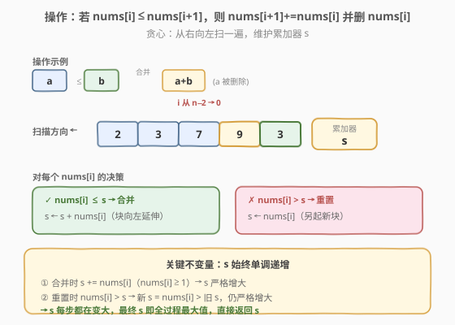
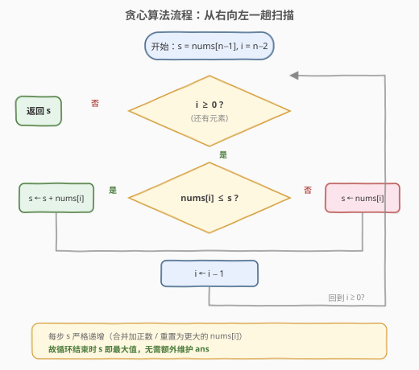

# LeetCode 合并后数组中的最大元素 题解

## 1. 题目概述

- **标题 / 题号**：合并后数组中的最大元素（#2789，medium）
- **链接**：https://leetcode.cn/problems/largest-element-in-an-array-after-merge-operations/
- **难度**：中等
- **标签**：贪心、数组

**题意**：给你一个下标从 **0** 开始、由**正整数**组成的数组 `nums`。你可以在数组上执行下述操作**任意次**：

- 选中一个同时满足 `0 <= i < nums.length - 1` 且 `nums[i] <= nums[i + 1]` 的下标 `i`；
- 将 `nums[i + 1]` 替换为 `nums[i] + nums[i + 1]`，并从数组中**删除** `nums[i]`。

返回你从最终数组中可以获得的**最大**元素的值。

> 💡 一句话理解：每次把一个**不大**的左邻居 `nums[i]`「吞」进右邻居 `nums[i+1]`（前提 `nums[i] ≤ nums[i+1]`），左邻居消失、右邻居变大。问无限次操作后，数组里能出现的最大值。

**示例 1**：

```text
输入：nums = [2,3,7,9,3]
输出：21
解释：可执行下述操作：
- 选中 i = 0，得到数组 [5,7,9,3]
- 选中 i = 1，得到数组 [5,16,3]
- 选中 i = 0，得到数组 [21,3]
最终数组中的最大元素是 21。可以证明无法获得更大的元素。
```

**示例 2**：

```text
输入：nums = [5,3,3]
输出：11
解释：可执行下述操作：
- 选中 i = 1，得到数组 [5,6]
- 选中 i = 0，得到数组 [11]
最终数组中只有一个元素，即 11。
```

**约束**：

- `1 <= nums.length <= 10^5`
- `1 <= nums[i] <= 10^6`

> ⚠️ `n` 可达 $10^5$、元素可达 $10^6$，全部相加的和可达 $10^{11}$，**超出 32 位 int 范围**，C++ 必须用 `long long`。

## 2. 解题思路

### 2.1 暴力思路

最朴素的暴力是**枚举所有合法的操作序列**：每一步在所有满足 `nums[i] ≤ nums[i+1]` 的位置中选一个执行，搜索到不能再操作为止，记录过程中出现的最大值。但每一步可选项最多有 $O(n)$ 个、操作链长度可达 $O(n)$，组合数是指数级，$n=10^5$ 必然超时。

也可尝试区间 DP：令 $f(l,r)$ 表示子数组 `nums[l..r]` 能塌缩成的最大元素。但「最大元素」目标与塌缩顺序强耦合，子问题结构不闭合——塌缩左半的某值依赖右半塌缩出的值是否足够大，状态难以独立，转移复杂且仍需枚举合并点，$O(n^3)$ 同样不可接受。

我们需要一个**单调性**来消去搜索分支。

### 2.2 核心观察：从右向左贪心合并，累加器单调递增



官方 hint 给出关键提示：**从数组末尾开始，不断把元素合并到一起，直到无法再合并为止**。据此设计一趟从右向左的贪心：

- 维护一个**累加器** $s$，初始为最右端元素 `nums[n-1]`，表示「当前从右端连续塌缩成的一个值」；
- 从 $i = n-2$ 向左扫描，对每个 `nums[i]` 做一次决策：

| 条件 | 动作 | 含义 |
|------|------|------|
| `nums[i] ≤ s` | $s \leftarrow s + \text{nums}[i]$ | 把 `nums[i]` 并入右块，块向左延伸一格 |
| `nums[i] > s` | $s \leftarrow \text{nums}[i]$ | 无法并入（操作要求左 ≤ 右），`nums[i]` 另起新块 |

> 💡 **为什么「能并就并」是最优的？** 合并让 $s$ 变成 $s + \text{nums}[i] \ge s$，候选值不降；而且更大的 $s$ 会让**左边**下一个元素更易满足 `nums[i-1] ≤ s`，从而**更可能继续吞并**。所以合并是**弱占优**的——不合并绝不会更好。而 `nums[i] > s` 时，操作的前提 `nums[i] ≤ 右值` 已被破坏，`nums[i]` 没法并进当前右块，只能另起新块，此时旧块的 $s$ 已是它这辈子能达到的最大值。

**关键不变量**：$s$ 在整个过程中**单调递增**（严格递增）：

- **合并**时 $s \mathrel{+}= \text{nums}[i]$，而 $\text{nums}[i] \ge 1$，故 $s$ 增大；
- **重置**时触发条件是 $\text{nums}[i] > s$，新 $s = \text{nums}[i] >$ 旧 $s$，仍增大。

既然 $s$ 每步都在变大，**最终 $s$（处理完 $i=0$ 后）就是全过程的最大值**，无需额外维护一个 `ans`，循环结束直接返回 $s$。

### 2.3 算法流程图



只需一趟从右向左的线性扫描，每个元素访问一次、做一次比较与赋值，无回溯、无排序。

### 2.4 示例演算

![示例演算：[2,3,7,9,3] → 21](../images/p2789_example_walkthrough.svg)

以 `nums = [2,3,7,9,3]` 为例，$s$ 初值取最右的 $3$，逐个向左处理：

1. `i=3, nums[3]=9`：$9 > 3$ ✗，**重置** $s = 9$（右端 `[3]` 这一块到此为止，值 $3$）；
2. `i=2, nums[2]=7`：$7 \le 9$ ✓，**合并** $s = 9+7 = 16$（块向左吞下 $7$）；
3. `i=1, nums[1]=3`：$3 \le 16$ ✓，**合并** $s = 16+3 = 19$；
4. `i=0, nums[0]=2`：$2 \le 19$ ✓，**合并** $s = 19+2 = 21$。

$s$ 全程递增 $3 \to 9 \to 16 \to 19 \to 21$，最终返回 **21**，与示例 1 一致。

> 💡 这也对应示例给出的的一种操作序列：先把 `2,3` 并成 `5`（得到 `[5,7,9,3]`），再把 `5,7` 并成 `16`，最后 `5,16`（即 `21,3`）。贪心从右并的「吞并顺序」虽与示例不同，但因合并满足结合性，得到的最大值一致。

## 3. 参考代码

### C++

```cpp
class Solution {
public:
    long long maxArrayValue(vector<int>& nums) {
        long long s = nums.back();
        for (int i = (int)nums.size() - 2; i >= 0; --i) {
            if (nums[i] <= s) s += nums[i];
            else              s  = nums[i];
        }
        return s;
    }
};
```

### Python

```python
class Solution:
    def maxArrayValue(self, nums: List[int]) -> int:
        s = nums[-1]
        for i in range(len(nums) - 2, -1, -1):
            if nums[i] <= s:
                s += nums[i]
            else:
                s = nums[i]
        return s
```

> 💡 若担心「重置时丢弃了旧 $s$」会丢答案——不会。重置恰好发生在 `nums[i] > s` 时，新 $s$ 已大于旧 $s$；而 $s$ 全程递增，所以任何被「舍弃」的旧块值都已被后续更大的 $s$ 覆盖。若追求与多数题解一致、显式保留最大值，可加一句 `ans = max(ans, s)` 并返回 `ans`，结果相同。

## 4. 复杂度分析

| 维度 | 复杂度 | 说明 |
|------|--------|------|
| 时间复杂度 | $O(n)$ | 从右向左单趟扫描，每元素一次比较 + 一次赋值，无排序无回溯 |
| 空间复杂度 | $O(1)$ | 仅用一个累加器 $s$（原地处理，不开额外数组） |

## 5. 扩展：为什么方向必须是「从右向左」？

操作的定义是「左吞进右、左消失、右变大」，所以一个被塌缩的块总是落在其**右侧**位置。若从左向右扫，当前块在左、要判断能否吞掉右边的 `nums[i+1]`，但 `nums[i+1]` 后面还连着一长串未知，能否吞、吞多少依赖后续，无法贪心判定。

而从右向左扫时，累加器 $s$ 始终代表**当前块在右、待并入的元素在左**，恰好匹配操作「左 ≤ 右才能并」的方向；且 $s$ 单调递增保证了「能并就并」一定最优。这是本题贪心能成立的**方向性根源**。

> ⚠️ 若把题面改成「右吞进左」或允许两侧合并，方向与不变量都要重新论证，不可直接套用本模板。

## 6. 面试要点

1. **为什么从右往左扫？**

   - 操作语义是「左元素并入右元素、左元素消失」，被塌缩出的块总落在右侧。从右起扫能让累加器 $s$ 始终处于「待并入元素的右邻」位置，与判定 `nums[i] ≤ s` 方向一致；从左起扫则右侧未知、无法贪心判定。

2. **为什么「能并就并」不会让答案变差？**

   - 合并后 $s' = s + \text{nums}[i] \ge s$，候选最大值不降；且 $s'$ 更大，让左邻 `nums[i-1] ≤ s'` 更易成立，更利于后续吞并。故合并**弱占优**，不合并绝不会更好。

3. **`nums[i] > s` 时为什么要丢掉旧 $s$？不丢会不会更优？**

   - 此时操作前提 `nums[i] ≤ 右值` 被破坏，`nums[i]` 无法并入当前右块，只能另起新块。但触发重置的条件就是 $\text{nums}[i] > s$，新 $s = \text{nums}[i] >$ 旧 $s$——旧块值已被更大的新 $s$ 覆盖，所以「丢」而不损。这也正是 $s$ 单调递增的来源。

4. **为什么不用维护 `ans = max(ans, s)`？**

   - 因为 $s$ 每步严格递增（合并加正数、重置为更大的值），最终 $s$ 即全局最大。加 `ans` 也对、但多余；面试中写出加 `ans` 的版本同样正确，可作保守写法。

5. **数据范围有什么坑？**

   - $n \le 10^5$、$\text{nums}[i] \le 10^6$，极端情况全部合并得到 $\sim 10^{11}$，远超 32 位 int 上界（$\approx 2.1\times10^9$）。C++ 必须用 `long long`，否则会溢出得到错误答案；Python 的 `int` 无界无需操心。

## 同类练习题

| # | 题目 | 与本题的关联 |
|---|------|-------------|
| 55 | [跳跃游戏](https://leetcode.cn/problems/jump-game/) | 从左向右维护「最远可达」并贪心扩展，方向性与本题「维护一个可扩展的累加量」同构 |
| 45 | [跳跃游戏 II](https://leetcode.cn/problems/jump-game-ii/) | 贪心维护当前段终点与下一跳最远点，单趟扫描 $O(n)$，与本题一趟扫描贪心同思路 |
| 134 | [加油站](https://leetcode.cn/problems/gas-station/) | 从某点起维护累加「油量−消耗」单调判定能否走完一圈，贪心选起点，累加器判定模式相似 |
| 918 | [环形子数组的最大和](https://leetcode.cn/problems/maximum-sum-circular-subarray/) | 用累加和 + 单调性（total − min_sum）求最大，累加器思维与本题一脉相承 |
| 321 | [拼接最大数](https://leetcode.cn/problems/create-maximum-number/) | 通过「合并/选取」操作使结果最大，方向性贪心与单调栈结合，是「合并型贪心」的进阶版 |
