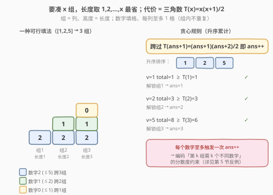
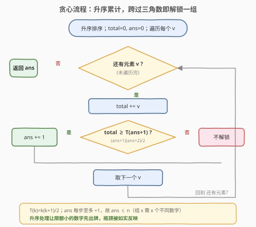
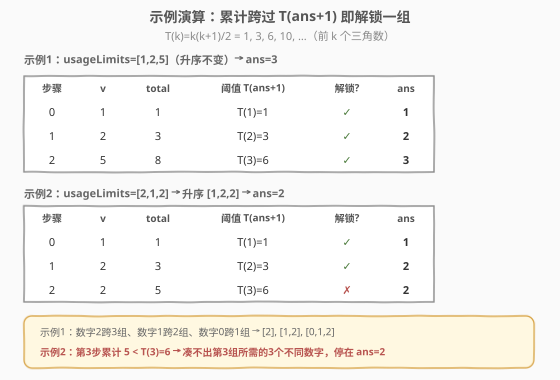

# 长度递增组的最大数目

- **题目名称**：长度递增组的最大数目
- **链接**：[2790. 长度递增组的最大数目](https://leetcode.cn/problems/maximum-number-of-groups-with-increasing-length/)
- **难度**：困难
- **标签**：贪心、数组、数学、二分查找、排序

## 1. 题目概述

给你一个下标从 **0** 开始、长度为 `n` 的数组 `usageLimits`。用 `0` 到 `n - 1` 的数字创建若干组，需同时满足：

- 每个数字 `i` 在**所有组**中累计使用次数不超过 `usageLimits[i]`；
- **同一组内数字互不相同**（组内无重复数字）；
- 除第一组外，每个组的长度**严格大于**前一个组。

返回可以创建的**最大组数**。

> 💡 一句话理解：数字 `i` 手里有 `usageLimits[i]` 张"配额券"，每往一个组里放一次就花一张；同组不能放同一个数字两次；组要越往后越长。问最多能排出多少组。

**示例 1**：

```text
输入：usageLimits = [1,2,5]
输出：3
解释：组1 = [2]，组2 = [1,2]，组3 = [0,1,2]。
      数字0用1次(≤1)、数字1用2次(≤2)、数字2用3次(≤5)，均未超限。
```

**示例 2**：

```text
输入：usageLimits = [2,1,2]
输出：2
解释：组1 = [0]，组2 = [1,2]。数字0/1/2各用1次，均未超限，无法再排出长度3的组。
```

**示例 3**：

```text
输入：usageLimits = [1,1]
输出：1
解释：组1 = [0]。只有两个数字、各限1次，凑不出长度为2的第二组。
```

**约束条件**：

- $1 \le \text{usageLimits.length} \le 10^5$
- $1 \le \text{usageLimits[i]} \le 10^9$

> ⚠️ $n$ 可达 $10^5$、单项可达 $10^9$，总和最高约 $10^{14}$，**远超 32 位 int**（$\approx 2.1 \times 10^9$）。C++ 中累加器 `total` 与阈值 $(ans+1)(ans+2)/2$ 都要用 `long long`；Python 的 `int` 无界，无需操心。

---

## 2. 解题思路

### 2.1 暴力思路

从大到小枚举组数 $x$，对每个 $x$ 判定"能否排出 $x$ 组"。但可行性判定本身并不简单：它等价于"把 $n$ 个数字分配到容量为 $1, 2, \dots, x$ 的 $x$ 个组、每个数字有用量上限、组内不重复"——这是**二分图度序列 / 可行流**问题，单次判定就需网络流或二分图匹配，远超时限；而 $x$ 的范围可达 $n \approx 10^5$，逐个判定更不可行。我们需要找到能**一趟直接求出最大 $x$** 的贪心结构。

### 2.2 核心观察：组长度取 $1,2,\dots,x$ + 升序累计凑三角数



**第一步：组长度取 $1,2,\dots,x$ 最省。** 若能排出 $x$ 组，其长度是某个严格递增正整数列 $l_1 < l_2 < \dots < l_x$，则 $\sum l_i \ge 1 + 2 + \dots + x = T(x) = \dfrac{x(x+1)}{2}$，等号当且仅当 $l_i = i$。把任意可行方案的每组都"砍短"到长度 $i$（删掉多余元素），只会让各数字用量更少、仍满足组内不重复。因此：

> **$x$ 组可行 $\iff$ 能排出长度恰为 $1, 2, \dots, x$ 的 $x$ 组。**

问题归约为：求最大 $x$，使长度 $1 \dots x$ 的 $x$ 组可排出。

**第二步：必要条件——总配额 $\ge$ 三角形面积。** $x$ 组共需 $T(x)$ 次放置，故 $\sum \text{usageLimits}[i] \ge T(x)$。但这**不充分**：组 $x$ 要 $x$ 个**不同**数字。如 `usageLimits = [3,3]` 时 $T(3) = 6$、总和也 $= 6$，却只有 2 个数字、凑不出长度为 3 的组。可见还受"分散度"约束。

**第三步：升序累计 + 跨过三角数即解锁。** 关键贪心（官方做法）：

1. 将 `usageLimits` **升序排序**；
2. 维护累计和 `total` 与已解锁组数 `ans`；
3. 顺序遍历每个 $v$：`total += v`，一旦 $\text{total} \ge T(\text{ans}+1) = \dfrac{(\text{ans}+1)(\text{ans}+2)}{2}$，就让 `ans += 1`（解锁下一组）；
4. 扫描结束，`ans` 即答案。

直觉（对照概念图）：把 $x$ 组看成 $x$ 列、高度为 $1 \dots x$ 的**阶梯三角形**。数字 $i$ 至多填 $\text{usageLimits}[i]$ 格、且**每列至多 1 格**（组内不重复）。**限额小的数字是瓶颈**——它跨不了几列；升序处理正是先让最紧的数字"出牌"。每凑满 $T(k)$ 就解锁第 $k$ 组，而**每个数字至多触发一次 `ans++`**——这恰好编码了"第 $k$ 组需 $k$ 个不同数字"的分散度约束。单纯比总和或比个数都会被反例骗过（详见第 5 节）。

> 💡 **一句话记忆**：升序累计，**累计和一跨过第 `ans+1` 个三角数 $T(\text{ans}+1)$ 就 `ans++`**，扫完即得答案。

> ⚠️ 顺序必须是**升序**。降序会让大限额数字先到、过早凑满阈值、虚高解锁组数，结果错误。以 `[1,2,5]` 为例，升序累计依次跨过 $T(1)=1, T(2)=3, T(3)=6$ 得 3 组；若降序 `[5,2,1]` 则第一步 `total=5` 就跨过 $T(1)$、紧接着跨过 $T(2)=3$，两个大数虚解锁，最终也能到 3 但**对 `[1,1,5,5]` 这类输入会错误地给出 4**。

### 2.3 算法流程图



只需一趟升序扫描：每个元素做一次累加 + 一次阈值比较，无回溯。`ans` 每步至多 +1，天然不超过元素个数 $n$（对应"组 $x$ 需 $x$ 个不同数字"）。

### 2.4 示例演算



**示例 1**：`usageLimits = [1,2,5]`，升序后仍为 `[1,2,5]`：

| 步骤 | $v$ | `total` | 阈值 $T(\text{ans}+1)$ | 解锁? | `ans` |
|------|-----|---------|------------------------|-------|-------|
| 0 | 1 | 1 | $T(1)=1$ | ✓ | 1 |
| 1 | 2 | 3 | $T(2)=3$ | ✓ | 2 |
| 2 | 5 | 8 | $T(3)=6$ | ✓ | 3 |

最终 `ans = 3`。对应一种可行填法：限额最大的数字2横跨 3 组、数字1跨 2 组、数字0跨 1 组，得 `组1=[2]`、`组2=[1,2]`、`组3=[0,1,2]`。

**示例 2**：`usageLimits = [2,1,2]`，升序 `[1,2,2]`：

| 步骤 | $v$ | `total` | 阈值 $T(\text{ans}+1)$ | 解锁? | `ans` |
|------|-----|---------|------------------------|-------|-------|
| 0 | 1 | 1 | $T(1)=1$ | ✓ | 1 |
| 1 | 2 | 3 | $T(2)=3$ | ✓ | 2 |
| 2 | 2 | 5 | $T(3)=6$ | ✗ ($5<6$) | 2 |

第三步累计仅 5，凑不满 $T(3)=6$，无法解锁第 3 组，最终 `ans = 2`。

---

## 3. 参考代码

### C++

```cpp
class Solution {
public:
    int maxIncreasingGroups(vector<int>& usageLimits) {
        sort(usageLimits.begin(), usageLimits.end());   // 升序排序
        long long total = 0;
        int ans = 0;
        for (int v : usageLimits) {
            total += v;
            long long need = (long long)(ans + 1) * (ans + 2) / 2;  // T(ans+1)
            if (total >= need) ++ans;                  // 跨过三角数即解锁一组
        }
        return ans;
    }
};
```

### Python

```python
class Solution:
    def maxIncreasingGroups(self, usageLimits: List[int]) -> int:
        usageLimits.sort()                  # 升序排序
        total = 0
        ans = 0
        for v in usageLimits:
            total += v
            if total >= (ans + 1) * (ans + 2) // 2:   # T(ans+1)
                ans += 1                   # 跨过三角数即解锁一组
        return ans
```

> ⚠️ **两个易错点**：
> 1. **升序不是降序**：必须 `sort()` 升序。降序会让大限额数字抢先凑满阈值，对 `[1,1,5,5]` 等输入会虚高解锁、答案错误。
> 2. **C++ 溢出**：`total` 累加可达 $\sim 10^{14}$，`(ans+1)*(ans+2)/2` 在 $ans$ 接近 $10^5$ 时约 $5 \times 10^9$，均已超 `int`。必须先乘再除、且类型至少一侧为 `long long`（写成 `(long long)(ans + 1) * (ans + 2) / 2`）。

---

## 4. 复杂度分析

| 维度 | 复杂度 | 说明 |
|------|--------|------|
| 时间复杂度 | $O(n \log n)$ | 排序 $O(n \log n)$ + 单趟扫描 $O(n)$，扫描部分每元素一次累加一次比较 |
| 空间复杂度 | $O(\log n)$ | 原地排序的栈空间；额外只用 `total`、`ans` 两个变量 $O(1)$ |

> 💡 $n \le 10^5$，$O(n \log n)$ 约 $1.7 \times 10^6$ 次运算，远低于时限。比起"二分答案 $x$ + 每次贪心验证"的 $O(n \log n \log n)$，单趟贪心更优且更简洁。

---

## 5. 扩展：为什么"总和够 / 个数够"还不够

可行性受**双重约束**：① 总配额 $\ge T(x)$；② 分散度——每 $k$ 组需 $k$ 个不同数字，且小限额数字无法跨多组。单看任一条件都会误判：

**反例：`usageLimits = [1,1,5,5]`，考察 $x = 4$。**

- 总和 $= 12 \ge T(4) = 10$ ✓；不同数字个数 $n = 4 \ge 4$ ✓——两个朴素条件都通过。
- 但 4 组**排不出**：第 4 组要 4 个不同数字，只能 $\{0,1,2,3\}$ 全用上。数字 0、1 限额仅 1，被第 4 组耗尽后再无余量；剩下的第 1、2、3 组（共 6 格）只能由数字 2、3 填，而第 3 组要 3 个不同数字、却只剩 2 个可用 → 不可行。
- 贪心在此升序累计只解锁到 3 组：`[1,1,5,5]` → `total` 依次 $1,2,7,12$，因前两个 1 把累计压在 $2 < T(2)=3$，第三步才跨 $T(2)$、第四步跨 $T(3)$，停在第 3 组，**正确反映**了上述瓶颈。

**再如 `[3,3]` 考察 $x = 3`**：总和 $6 = T(3)$，但只有 2 个数字、第 3 组要 3 个不同数字 → 不可行。贪心因只有 2 个元素（至多 2 次 `ans++`）正确停在 2。

> 💡 **贪心的精妙之处**：升序 + "每数至多解锁一组"把"三角数阈值"与"分散度"两套约束合并到一趟扫描里。前期的瓶颈元素会**拖慢**累计跨过后续三角数的节奏，恰好对应"它们无法跨足多组"的事实；这正是单看末态总和无法捕捉的。

---

## 6. 面试要点

1. **为什么组长度取 $1,2,\dots,x$？**

   - 严格递增正整数列之和 $\ge T(x)$，等号仅当 $l_i = i$。砍短到 $1\dots x$ 只减用量、不破不重复，故 $x$ 组可行 $\iff$ 长度 $1\dots x$ 可行。这让"求最大组数"有了统一的代价度量 $T(x)$。

2. **"总和 $\ge T(x)$" 为何不够？**

   - 组 $x$ 要 $x$ 个**不同**数字。如 `[3,3]` 总和 $=T(3)$ 但仅 2 个数字；`[1,1,5,5]` 总和与个数都够却因小限额数字被大组耗尽、小组填不满。需引入分散度约束。

3. **为什么必须升序？**

   - 小限额数字是瓶颈，先处理它们能让累计"诚实地"反映它们跨不了几列的事实。降序则大限额数字抢先凑满阈值，虚高解锁组数（`[1,1,5,5]` 降序会错判 4 组）。

4. **"每个数字至多触发一次 `ans++`" 意味着什么？**

   - $n$ 个数字至多解锁 $n$ 组，即 $\text{ans} \le n$——这正是"组 $x$ 需 $x$ 个不同数字"。这一规则把分散度约束编进了算法，无需额外检查。

5. **能不能二分答案？**

   - 能。官方 hint 即"排序 + 二分组数 $x$，贪心分配使各组得 $1,2,\dots,x$ 个数"判定。但单趟升序贪心已 $O(n\log n)$ 直接出答案，比"二分 + 每次验证"更优、更简，故主推贪心。

6. **数据范围有什么坑？**

   - 总和可达 $10^{14}$、阈值可达 $\sim 5\times10^9$，均超 `int`。C++ 必须用 `long long`，且乘法要在 `long long` 下进行（先强转一侧再乘），否则中间结果溢出。

---

## 7. 同类练习题

- [659. 分割数组为连续子序列](https://leetcode.cn/problems/split-array-into-consecutive-subsequences/)：贪心 + 哈希，在频次/长度约束下贪心构造若干"连续序列"，与本题"在用量上限下贪心构造若干递增组"同构
- [767. 重构字符串](https://leetcode.cn/problems/reorganize-string/)：贪心 + 堆，按频次上限安排元素位置避免相邻重复，"受限安排元素"的贪心范式相似
- [410. 分割数组的最大值](https://leetcode.cn/problems/split-array-largest-sum/)：二分答案 + 贪心验证（最小化最大段和），与本题官方 hint 的"排序 + 二分 $x$"同属二分答案家族
- [875. 爱吃香蕉的珂珂](https://leetcode.cn/problems/koko-eating-bananas/)：二分答案 + 单调验证，二分答案模板题，可与本题的二分视角对照
- [502. IPO](https://leetcode.cn/problems/ipo/)：贪心 + 堆，在资本约束下逐步选取利润最大项，贪心选取思想相通
