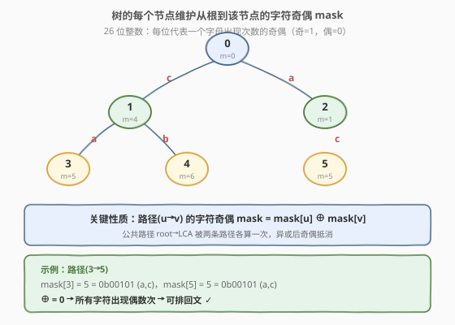
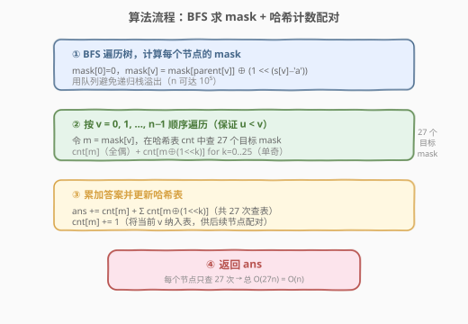
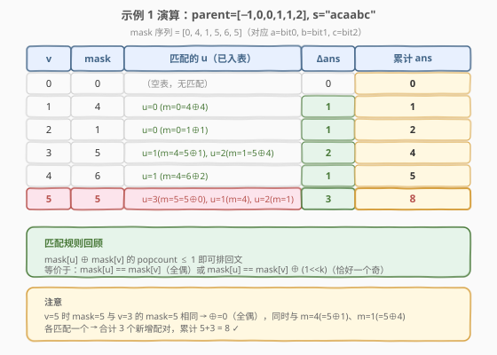

# 树中可以形成回文的路径数

- **题目名称**：树中可以形成回文的路径数
- **链接**：[2791. 树中可以形成回文的路径数](https://leetcode.cn/problems/count-paths-that-can-form-a-palindrome-in-a-tree/)
- **难度**：困难
- **标签**：位运算、树、深度优先搜索、哈希表

## 1. 题目概述

给你一棵**树**（连通、无向、无环），根节点为 `0`，由编号 `0` 到 `n-1` 的 `n` 个节点组成。树用一个数组 `parent` 表示，`parent[i]` 为节点 `i` 的父节点，`parent[0] == -1`。

另给你一个字符串 `s`，其中 `s[i]` 是分配给节点 `i` 与 `parent[i]` 之间边的字符（`s[0]` 可忽略）。

找出满足 `u < v`，且从 `u` 到 `v` 路径上分配的字符可以**重新排列**形成**回文**的所有节点对 `(u, v)`，返回节点对的数目。

> 💡 一句话理解：树上每条边带一个小写字母，问有多少对节点 `(u,v)`（`u<v`）之间的路径字符能重排成回文串。回文的充要条件是**至多一个字符出现奇数次**。

**示例 1**：

```text
输入：parent = [-1,0,0,1,1,2], s = "acaabc"
输出：8
解释：符合要求的节点对：
(0,1)、(0,2)、(1,3)、(1,4)、(2,5) — 路径上只有一个字符
(2,3) — "aca"          (1,5) — "cac"
(3,5) — "acac"→重排 "acca"
```

**示例 2**：

```text
输入：parent = [-1,0,0,0,0], s = "aaaaa"
输出：10
解释：任意满足 u < v 的节点对都符合要求（C(5,2)=10）。
```

**约束条件**：

- `n == parent.length == s.length`
- $1 \le n \le 10^5$
- 对所有 $i \ge 1$，$0 \le parent[i] \le n-1$
- `parent[0] == -1`，`parent` 表示一棵有效的树
- `s` 仅由小写英文字母组成

> ⚠️ $n$ 可达 $10^5$，节点对数上限为 $\binom{10^5}{2} \approx 5 \times 10^9$，**远超 32 位 int 上界**，C++ 必须用 `long long`。

---

## 2. 解题思路

### 2.1 暴力思路

最朴素的暴力是枚举所有 $\binom{n}{2}$ 个节点对 `(u, v)`，对每对沿路径收集字符、统计奇偶、判断是否至多一个奇数。但路径长度可达 $O(n)$，总时间 $O(n^3)$（或 $O(n^2)$ 若用 LCA 加速路径查询），$n=10^5$ 必然超时。

核心瓶颈在于「逐对统计字符频率」。我们需要一种方式，将路径字符的奇偶信息**压缩到一个整数**中，从而 $O(1)$ 判断回文条件。

### 2.2 核心观察：位掩码 + 异或路径



**观察 1：回文的充要条件**

一个字符串能重排成回文，当且仅当**至多一个字符出现奇数次**（奇数长度串允许一个中心字符）。由于只有 26 个小写字母，我们只需记录每个字母出现次数的**奇偶性**——用一个 26 位整数 `mask` 即可：第 `k` 位为 1 表示字母 `k` 出现奇数次。

**观察 2：路径 = 两段根路径的异或**

树中任意两点 `u`、`v` 的路径经过它们的最近公共祖先 LCA。该路径可以分解为 `root→u` 和 `root→v` 两条「根路径」的拼接，其中 `root→LCA` 这段公共路径被走了两遍。

由于我们只关心奇偶性，走两遍同一路径会让每个字符的奇偶**抵消**（偶数次 = 0）。因此：

$$\text{path}(u \to v) \text{ 的奇偶 mask} = \text{mask}[u] \oplus \text{mask}[v]$$

其中 $\text{mask}[v]$ 是从根 `0` 到 `v` 路径上字符的奇偶 mask，$\oplus$ 为按位异或。

> 💡 这与**前缀和 + 同余**的思想同构：路径上字符的奇偶等于两个「前缀奇偶」的异或，公共前缀自动抵消。对比 [974. 和可被 K 整除的子数组]用前缀和同余做子数组和判定，本题用前缀异或做路径奇偶判定。

**观察 3：回文条件转化为 mask 关系**

路径 `u→v` 可排回文 $\Leftrightarrow$ $\text{mask}[u] \oplus \text{mask}[v]$ 的二进制中 **1 的个数 $\le 1$**，即：

- $\text{mask}[u] = \text{mask}[v]$（异或为 0，所有字符偶数次）
- 或 $\text{mask}[u] = \text{mask}[v] \oplus (1 \ll k)$，$k \in [0,25]$（恰好一个字符奇数次）

因此对每个节点 `v`，只需在哈希表中查找 mask 值为 `mask[v]` 或 `mask[v] ^ (1<<k)` 的**已处理节点**数量，共 **27 次查表**。

### 2.3 算法流程图



整体分为两阶段：

1. **BFS 求 mask**：从根出发广度优先遍历，`mask[v] = mask[parent[v]] ^ (1 << (s[v]-'a'))`。用 BFS 而非递归 DFS 是因为 $n$ 可达 $10^5$，递归可能栈溢出。
2. **哈希计数配对**：按 `v = 0, 1, ..., n-1` 顺序遍历（保证 `u < v`）。对每个 `v`，查 27 个目标 mask 的已有计数并累加到答案，然后将 `mask[v]` 纳入哈希表。

### 2.4 示例演算



以示例 1 为例，`parent = [-1,0,0,1,1,2]`，`s = "acaabc"`（`s[0]` 忽略）：

| v | s[v] | parent[v] | mask[v] 计算 | mask[v] |
|---|------|-----------|-------------|---------|
| 0 | — | −1 | 基准 | 0 |
| 1 | c | 0 | 0 ⊕ (1<<2) | 4 |
| 2 | a | 0 | 0 ⊕ (1<<0) | 1 |
| 3 | a | 1 | 4 ⊕ (1<<0) | 5 |
| 4 | b | 1 | 4 ⊕ (1<<1) | 6 |
| 5 | c | 2 | 1 ⊕ (1<<2) | 5 |

按 `v = 0..5` 遍历，哈希表逐步填充：

| v | mask[v] | 匹配的 u | Δans | 累计 ans |
|---|---------|---------|------|---------|
| 0 | 0 | 无 | 0 | 0 |
| 1 | 4 | u=0 (m=0=4⊕4) | 1 | 1 |
| 2 | 1 | u=0 (m=0=1⊕1) | 1 | 2 |
| 3 | 5 | u=1 (m=4=5⊕1), u=2 (m=1=5⊕4) | 2 | 4 |
| 4 | 6 | u=1 (m=4=6⊕2) | 1 | 5 |
| 5 | 5 | u=3 (m=5=5⊕0), u=1 (m=4), u=2 (m=1) | 3 | **8** |

最终答案 **8**，与示例一致。

> 💡 `v=5` 时 `mask[5]=5` 与 `mask[3]=5` 相同，异或为 0（全偶）；同时 `5⊕1=4` 命中 `mask[1]`，`5⊕4=1` 命中 `mask[2]`，合计 3 个新增配对。

---

## 3. 参考代码

### C++

```cpp
class Solution {
public:
    long long countPalindromePaths(vector<int>& parent, string s) {
        int n = parent.size();
        vector<vector<pair<int, int>>> g(n);
        for (int i = 1; i < n; i++) {
            g[parent[i]].push_back({i, s[i] - 'a'});
        }
        vector<int> mask(n, 0);
        queue<int> q;
        q.push(0);
        while (!q.empty()) {
            int u = q.front(); q.pop();
            for (auto& [v, c] : g[u]) {
                mask[v] = mask[u] ^ (1 << c);
                q.push(v);
            }
        }
        unordered_map<int, int> cnt;
        long long ans = 0;
        for (int v = 0; v < n; v++) {
            int m = mask[v];
            ans += cnt[m];
            for (int k = 0; k < 26; k++) {
                ans += cnt[m ^ (1 << k)];
            }
            cnt[m]++;
        }
        return ans;
    }
};
```

### Python

```python
class Solution:
    def countPalindromePaths(self, parent: List[int], s: str) -> int:
        n = len(parent)
        g = [[] for _ in range(n)]
        for i in range(1, n):
            g[parent[i]].append((i, ord(s[i]) - 97))
        mask = [0] * n
        from collections import deque
        dq = deque([0])
        while dq:
            u = dq.popleft()
            for v, c in g[u]:
                mask[v] = mask[u] ^ (1 << c)
                dq.append(v)
        from collections import Counter
        cnt = Counter()
        ans = 0
        for v in range(n):
            m = mask[v]
            ans += cnt[m]
            for k in range(26):
                ans += cnt[m ^ (1 << k)]
            cnt[m] += 1
        return ans
```

> 💡 BFS 用队列而非递归 DFS，避免 $n = 10^5$ 时的栈溢出风险。Python 中 `ord(s[i]) - 97` 比 `ord(s[i]) - ord('a')` 略快但等价。

---

## 4. 复杂度分析

| 维度 | 复杂度 | 说明 |
|------|--------|------|
| 时间复杂度 | $O(n)$ | BFS 遍历 $O(n)$；哈希计数阶段每节点查 27 次，共 $O(27n) = O(n)$ |
| 空间复杂度 | $O(n)$ | 邻接表 $O(n)$、mask 数组 $O(n)$、哈希表最多 $n$ 个不同 mask |

> ⚠️ 哈希表最多有 $n$ 个条目，但不同 mask 的取值范围仅 $2^{26}$，故实际空间上限 $O(\min(n, 2^{26}))$。

---

## 5. 扩展：为什么不需要显式求 LCA？

很多树路径问题需要 LCA 来定义路径。本题之所以能绕过 LCA，是因为**异或的代数性质**让公共路径自动抵消：

$$\text{mask}[u] \oplus \text{mask}[v] = (\text{root→u}) \oplus (\text{root→v}) = (\text{root→LCA}) \oplus (\text{root→LCA}) \oplus (\text{LCA→u}) \oplus (\text{LCA→v})$$

中间两项相同、异或为 0，剩下 `LCA→u` 和 `LCA→v` 拼接即为路径 `u→v`。这本质上与**前缀异或**求子数组异或和（如 [1310. 子数组异或查询]）是同一思想：前缀异或的差即为区间异或。

---

## 6. 面试要点

1. **为什么用位掩码而不是计数数组？**

   - 26 个字母的奇偶性恰好对应 26 个比特位，一个 `int` 即可编码全部信息。判断「至多一个奇数」等价于判断 `popcount(mask) ≤ 1`，位运算 $O(1)$ 完成，无需遍历 26 个计数。

2. **路径奇偶为什么等于两个根路径 mask 的异或？**

   - 路径 `u→v` = `root→u` + `root→v` − 2 × `root→LCA`。在奇偶意义下，「减 2 倍」等价于「异或两次」= 抵消为 0，剩下 `LCA→u` 和 `LCA→v` 的拼接即路径本身。

3. **为什么按 `v = 0..n-1` 顺序遍历就能保证 `u < v`？**

   - 对节点 `v`，哈希表 `cnt` 中只包含下标 `0..v-1` 的节点。查表得到的匹配数即为满足 `u < v` 的合法对数。由于异或可交换，`mask[u]⊕mask[v] = mask[v]⊕mask[u]`，每个无序对恰被计数一次。

4. **每个节点查 27 个 mask 会不会太多？**

   - 26 个字母，加上「自身」共 27 个目标。$27n \approx 2.7 \times 10^6$ 次哈希查询，常数极小，远在时限内。这是位掩码题目的典型常数。

5. **数据范围有什么坑？**

   - 节点对数可达 $\binom{10^5}{2} \approx 5 \times 10^9$，超出 `int` 上界（$\approx 2.1 \times 10^9$），C++ 必须用 `long long`。Python 的 `int` 无界无需操心。BFS 替代递归避免栈溢出。

---

## 7. 同类练习题

- [1544. 整理字符串](https://leetcode.cn/problems/make-the-string-great/)：利用字符奇偶/相邻抵消的思路，与异或抵消公共路径异曲同工
- [1371. 每个元音包含偶数次的最长子字符串](https://leetcode.cn/problems/find-the-longest-substring-containing-vowels-in-even-counts/)：位掩码记录元音奇偶 + 哈希表查首次出现，与本题「mask + 哈希计数」完全同构
- [1310. 子数组异或查询](https://leetcode.cn/problems/xor-queries-of-a-subarray/)：前缀异或求区间异或和，验证了「路径异或 = 两端 mask 异或」的代数基础
- [974. 和可被 K 整除的子数组](https://leetcode.cn/problems/subarray-sums-divisible-by-k/)：前缀和 + 同余 + 哈希计数配对，结构上与本题一一对应（前缀差 → 子数组，前缀异或差 → 路径）
- [437. 路径总和 III](https://leetcode.cn/problems/path-sum-iii/)：树上前缀和 + 哈希计数，将「路径和等于目标」转化为前缀差，与本题的树上前缀异或思路同源
