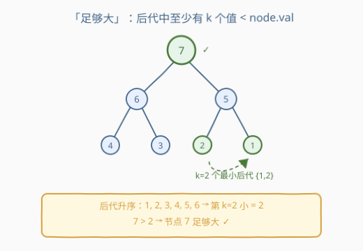
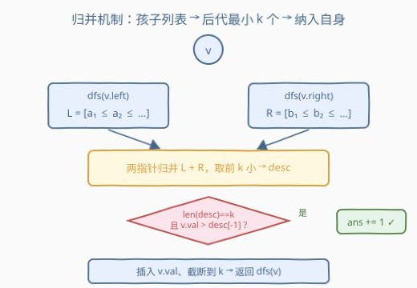
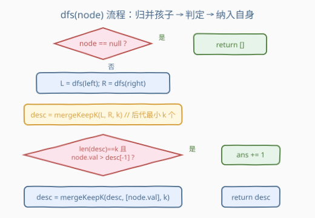

# 计算足够大的节点数

- **题目名称**：计算足够大的节点数
- **链接**：[2792. 计算足够大的节点数](https://leetcode.cn/problems/count-nodes-that-are-great-enough/)
- **难度**：困难
- **标签**：树、二叉树、深度优先搜索、分治

## 1. 题目概述

> ⚠️ 本题为 LeetCode **付费题**（Plus 会员专享），官方题面在 GraphQL 接口中 `translatedContent` 返回 `null`。以下题意描述根据官方示例用例（`jsonExampleTestcases`）与三条 hints 重建，可能与官方题面有出入；**核心判定语义已用全部三个示例自洽验证**，可信度较高。

给定一棵二叉树的根节点 `root` 和一个正整数 `k`。我们称一个节点**「足够大（great enough）」**，当且仅当：

- 该节点的子树中**不含自身**（即全部后代）至少有 `k` 个节点；
- 且该节点的值**严格大于**这 `k` 个最小后代值中的最大者。

换一种等价说法：**节点 `v` 足够大 ⟺ `v` 的后代中至少有 `k` 个节点的值严格小于 `v.val`。**

> 💡 一句话理解：把 `v` 的所有后代值排个升序，看第 `k` 小的那个；若 `v.val` 比它还大，就说明后代里至少有 `k` 个比 `v` 小，`v` 就「足够大」。题目让数整棵树里这样的节点有多少个。

官方三条 hints 完整对应了上述判定：

1. 对每个节点，维护其**子树（含自身）最小的 `k` 个值**组成的列表；
2. 判定某节点是否足够大时，把它**左右孩子**各自的上述列表归并、取前 `k` 小，得到「后代中最小的 `k` 个值」；
3. 若归并后恰好有 `k` 个值，且当前节点值**严格大于**列表中最大者，则该节点足够大。

**示例 1**：

```text
输入：root = [7,6,5,4,3,2,1], k = 2
输出：3

        7
       / \
      6   5
     /\  /\
    4 3 2 1
```

- 节点 `7`：后代 `{6,5,4,3,2,1}`，最小 2 个为 `{1,2}`，第 2 小 = 2，`7 > 2` ✓ 足够大；
- 节点 `6`：后代 `{4,3}`，最小 2 个 `{3,4}`，`6 > 4` ✓ 足够大；
- 节点 `5`：后代 `{2,1}`，最小 2 个 `{1,2}`，`5 > 2` ✓ 足够大；
- 叶子 `4,3,2,1` 无后代，不够。共 **3** 个。

**示例 2**：

```text
输入：root = [1,2,3], k = 1
输出：0

    1
   / \
  2   3
```

- 节点 `1`：后代 `{2,3}`，第 1 小 = 2，`1 > 2` ✗ 不够；
- 叶子 `2,3` 无后代。共 **0** 个。

**示例 3**：

```text
输入：root = [3,1,2], k = 2
输出：1

    3
   / \
  1   2
```

- 节点 `3`：后代 `{1,2}`，第 2 小 = 2，`3 > 2` ✓ 足够大；
- 叶子 `1,2` 无后代。共 **1** 个。

**约束条件**（付费题，精确数值上界未公开，下述按官方 hints 与 LeetCode 树题惯例重建）：

- 二叉树节点数 `n ≥ 1`（根节点非空）；
- 节点值 `node.val` 为整数；
- `k` 为正整数，`1 ≤ k ≤ n` 量级，具体上界以官方为准。

> ⚠️ 本解法复杂度与 `n`、`k` 的乘积相关（见第 4 节）。当 `n·k` 较大时，改用第 5 节的「平衡树 + 启发式合并」优化版可将时间降到 $O(n \log n \log k)$。

---

## 2. 解题思路

### 2.1 暴力思路：逐节点重扫后代

最直观的暴力：对每个节点 `v`，DFS 遍历它的整棵子树收集所有后代值，排序后看第 `k` 小，再与 `v.val` 比较。单节点代价 $O(\text{子树大小} \log)$，全局 $O(n^2 \log n)$——每个后代会被它的所有祖先反复重扫，`n` 一大必超时。

也可不排序、只数「后代中 $< v.\text{val}$ 的个数」是否 $\ge k$，但仍需对每个节点整棵子树遍历一遍，$O(n^2)$，同样不可接受。

我们需要一种**避免重复计算**的结构：让信息自底向上只传一次。

### 2.2 核心观察：后序 + 每节点维护「子树最小 k 个值」



关键洞察有两条：

**① 只关心最小的 `k` 个后代值，不必知道全部后代。** 判定 `v` 是否足够大，只需比较 `v.val` 与「后代中第 `k` 小的值」。而第 `k` 小 = 最小的 `k` 个值里的最大者。所以每个节点只需向上传递一个**长度 ≤ `k` 的升序列表**——子树（含自身）最小的 `k` 个值。

**② 子树信息可由孩子归并得到（分治）。** `v` 的后代 = 左子树后代 ∪ 右子树后代 ∪ {左孩子, 右孩子}，恰好等于「左孩子子树」∪「右孩子子树」。而每个孩子已向上传递了「该孩子子树最小的 `k` 个值」（含孩子自身）。把两个孩子的列表**两指针归并、只取前 `k` 小**，就得到 `v` 的「后代中最小 `k` 个值」。



> 💡 **为什么「孩子的列表」能代表「后代」？** 孩子列表里装的是「该孩子子树最小的 `k` 个值」——含孩子自身。两个孩子子树的并集正是 `v` 的全部后代。而由 `v` 后代组成的「最小 `k` 个」一定落在「两个孩子列表的并集」里：任何没进孩子列表的值都 ≥ 该孩子列表的最大值（即 ≥ 该孩子第 `k` 小），也就 ≥ `v` 的第 `k` 小后代，不会进入 `v` 的前 `k` 小。所以归并两个孩子的列表、取前 `k` 小，就是 `v` 后代的最小 `k` 个，**无遗漏**。

由此得到自底向上的递归（后序），每个节点只向上传一个长度 ≤ `k` 的列表，避免了对后代的反复重扫：

- `dfs(v)` 返回：以 `v` 为根的子树（**含 `v` 自身**）中最小的 `k` 个值，升序排列；
- 处理 `v` 时：先 `L = dfs(v.left)`、`R = dfs(v.right)`；
  1. **归并** `L`、`R` 取前 `k` 小 → `desc`（`v` 后代的最小 `k` 个值）；
  2. **判定**：若 `len(desc) == k` 且 `v.val > desc[-1]`（第 `k` 小后代），则 `ans += 1`；
  3. **纳入自身**：把 `v.val` 插入 `desc` 并截断到长度 `k`，作为 `dfs(v)` 的返回值（供父节点当「后代」用）。

> ⚠️ **顺序敏感：先判定、再纳入自身。** 判定用的是「后代」的最小 `k` 个（不含 `v`）；若先纳入自身再判定，会把 `v.val` 自己算进后代，当 `v.val` 较小时会把自己误算作「比自己小的后代」，逻辑就错了。

### 2.3 算法流程图



`dfs(node)` 完整步骤：

1. `node == null` → 返回空列表 `[]`；
2. `L = dfs(node.left)`，`R = dfs(node.right)`；
3. `desc = mergeKeepK(L, R, k)`（两指针归并，仅取前 `k` 小）；
4. 若 `len(desc) == k` 且 `node.val > desc[-1]` → `ans += 1`；
5. `desc = mergeKeepK(desc, [node.val], k)`（插入自身，截断到 `k`）；
6. 返回 `desc`。

其中 `mergeKeepK(A, B, k)`：`A`、`B` 均升序，用两指针取合并序列的前 `k` 个（不足 `k` 则全取）。

### 2.4 示例演算

以示例 1 `root = [7,6,5,4,3,2,1]`、`k = 2` 为例，后序自底向上，每个节点的「后代最小 2 个 / 是否足够大 / 返回列表（含自身）」：

![示例演算：[7,6,5,4,3,2,1] 后序归并](../images/p2792_example_walkthrough.svg)

| 后序 | 节点 | 后代 | 后代最小 2 个 | 判定（&gt; 末位?） | 返回（含自身，≤2） |
|------|------|------|--------------|---------------------|---------------------|
| ① | 叶 `4` | `{}` | `{}` | — | `{4}` |
| ② | 叶 `3` | `{}` | `{}` | — | `{3}` |
| ③ | 叶 `2` | `{}` | `{}` | — | `{2}` |
| ④ | 叶 `1` | `{}` | `{}` | — | `{1}` |
| ⑤ | `6` | `{4,3}` | `{3,4}` | `6 > 4` ✓ | `{3,4}`（6 落选） |
| ⑥ | `5` | `{2,1}` | `{1,2}` | `5 > 2` ✓ | `{1,2}`（5 落选） |
| ⑦ | `7` | `{6,5,4,3,2,1}` | `{1,2}` | `7 > 2` ✓ | `{1,2}`（7 落选） |

> 💡 注意节点 `6`：它的子树含自身为 `{6,4,3}`，最小 2 个是 `{3,4}`，所以 `6` 自身**被自己的返回列表挤出**——返回 `{3,4}`。这正合需要：对父节点 `7` 而言 `6` 是后代，但 `6` 不在 `7` 后代的前 2 小里（前 2 小是 `{1,2}`），所以漏掉 `6` 不影响 `7` 的判定。归并机制天然保证了「该传的传、该丢的丢」。

最终足够大节点数 = 3（`7,6,5`）✓。

---

## 3. 参考代码

### C++

```cpp
/**
 * Definition for a binary tree node.
 * struct TreeNode {
 *     int val;
 *     TreeNode *left;
 *     TreeNode *right;
 * };
 */
class Solution {
    int k = 0, ans = 0;

    // 两指针归并两个升序列表，只保留最小的 k 个（返回新列表）
    vector<int> mergeKeepK(const vector<int>& A, const vector<int>& B) {
        vector<int> r;
        r.reserve(min((size_t)k, A.size() + B.size()));
        int i = 0, j = 0, n = (int)A.size(), m = (int)B.size();
        while (i < n && j < m && (int)r.size() < k)
            r.push_back(A[i] <= B[j] ? A[i++] : B[j++]);
        while (i < n && (int)r.size() < k) r.push_back(A[i++]);
        while (j < m && (int)r.size() < k) r.push_back(B[j++]);
        return r;
    }

    vector<int> dfs(TreeNode* node) {
        if (!node) return {};
        vector<int> L = dfs(node->left);
        vector<int> R = dfs(node->right);
        vector<int> desc = mergeKeepK(L, R);          // 后代中最小 k 个
        if ((int)desc.size() == k && node->val > desc.back()) ans++;
        desc = mergeKeepK(desc, {node->val});         // 纳入自身，截断到 k
        return desc;
    }
public:
    int countGreatNodes(TreeNode* root, int k) {
        this->k = k; ans = 0;
        dfs(root);
        return ans;
    }
};
```

### Python

```python
# Definition for a binary tree node.
# class TreeNode:
#     def __init__(self, val=0, left=None, right=None):
#         self.val = val
#         self.left = left
#         self.right = right
class Solution:
    def countGreatNodes(self, root: Optional[TreeNode], k: int) -> int:
        ans = 0

        def merge_keep_k(a, b):
            # a, b 升序；返回合并后最小的 k 个（升序）
            res, i, j, n, m = [], 0, 0, len(a), len(b)
            while i < n and j < m and len(res) < k:
                if a[i] <= b[j]:
                    res.append(a[i]); i += 1
                else:
                    res.append(b[j]); j += 1
            while i < n and len(res) < k:
                res.append(a[i]); i += 1
            while j < m and len(res) < k:
                res.append(b[j]); j += 1
            return res

        def dfs(node):
            nonlocal ans
            if not node:
                return []
            left = dfs(node.left)
            right = dfs(node.right)
            desc = merge_keep_k(left, right)          # 后代中最小 k 个
            if len(desc) == k and node.val > desc[-1]:
                ans += 1
            desc = merge_keep_k(desc, [node.val])     # 纳入自身，截断到 k
            return desc

        dfs(root)
        return ans
```

> 💡 函数签名 `countGreatNodes(root, k)` 为据题意与官方 hints 推断（付费题无代码骨架），提交时以官方实际签名为准。`TreeNode` 采用 LeetCode 标准定义（`val` / `left` / `right`）。两版逻辑等价：`mergeKeepK` 是升序两指针归并 + 容量截断；`desc.back()` / `desc[-1]` 即「后代第 `k` 小」。

---

## 4. 复杂度分析

| 维度 | 复杂度 | 说明 |
|------|--------|------|
| 时间复杂度 | $O(n \cdot k)$ | 每个节点一次 `mergeKeepK`，两指针归并代价 $O(k)$；共 $n$ 个节点 |
| 空间复杂度 | $O(k \cdot h)$ | 递归栈深 $h$（树高），每帧持有一个长度 $\le k$ 的列表；平衡树 $O(k\log n)$，退化链状 $O(k\cdot n)$ |

> ⚠️ 当 `n`、`k` 都很大（如均达 $10^5$）时，$O(nk)$ 时间与 $O(k\cdot n)$ 退化空间均不可接受。此时改用第 5 节「平衡树 + 启发式合并」版，时间 $O(n\log n\log k)$。官方三条 hints 描述的正是本节的「`k` 小值列表 + 归并」框架，在 `n·k` 适中时即为预期解法。

---

## 5. 扩展：平衡树 + 启发式合并（大 `k` 优化版）

当 `k` 很大时，每个节点维护长度 $k$ 的有序列表、且每帧都沿递归栈持有，开销过大。改用**平衡搜索树（C++ `std::multiset`）+ 启发式合并（小集并入大集）**：每个节点持有子树最小 `k` 个值的 `multiset`（容量 $\le k$，`*prev(end())` 即第 `k` 小）；合并时把较小的孩子集合逐个插入较大的孩子集合，再把自身插入。

```cpp
class Solution {
    int k = 0, ans = 0;

    // 把 val 插入 s，保持 s 只存「子树最小 k 个」（容量 ≤ k）
    void addCapped(multiset<int>& s, int val) {
        if ((int)s.size() < k) s.insert(val);
        else if (val < *prev(s.end())) {            // 严格小于当前第 k 小才纳入
            s.erase(prev(s.end()));
            s.insert(val);
        }
    }

    multiset<int> dfs(TreeNode* node) {
        if (!node) return {};
        auto L = dfs(node->left);
        auto R = dfs(node->right);
        if (L.size() < R.size()) L.swap(R);         // 启发式：小集并入大集
        for (int x : R) addCapped(L, x);            // R 逐个并入 L
        if ((int)L.size() == k && node->val > *prev(L.end())) ans++;
        addCapped(L, node->val);                    // 纳入自身
        return L;
    }
public:
    int countGreatNodes(TreeNode* root, int k) {
        this->k = k; ans = 0;
        dfs(root);
        return ans;
    }
};
```

| 维度 | 复杂度 | 说明 |
|------|--------|------|
| 时间 | $O(n\log n\log k)$ | 启发式合并下每个值被重插入 $O(\log n)$ 次，每次 `multiset` 插入/删除 $O(\log k)$ |
| 空间 | $O(n)$ 量级 | `multiset` 以移动语义沿递归传递，同层只留两份（随即合并成一份） |

> 💡 Python 标准库无平衡搜索树；可用第三方 `sortedcontainers.SortedList`（插入 $O(\log k)$）平移替换 `multiset`，或退回第 3 节的列表归并版（`n·k` 适中时已够用）。

---

## 6. 面试要点

1. **「足够大」为什么等价于「后代中至少 `k` 个值严格小于 `v.val`」？**

   > 后代值升序排序，第 `k` 小 = `desc[-1]`。`v.val > desc[-1]` 意味着最小的 `k` 个后代全都 $< v.\text{val}$，即至少 `k` 个后代 $< v.\text{val}$。反之亦然。两者等价，面试时任选一种表述。

2. **为什么只维护「最小 `k` 个」而不是全部后代？**

   > 判定只需第 `k` 小后代值，更大的后代值永远不会进入前 `k` 小，对判定无影响。维护全量是 $O(n)$ 每节点、$O(n^2)$ 总体；只留 `k` 个降到 $O(nk)$（甚至 $O(n\log n\log k)$）。这是「**只留必要信息、剪掉冗余**」的经典降维。

3. **归并两个孩子的列表就能得到「后代最小 `k` 个」，会漏吗？**

   > 不会。任何没进孩子列表的值都 $\ge$ 该孩子列表的最大值（$\ge$ 该孩子第 `k` 小），也就 $\ge$ `v` 的第 `k` 小后代，不可能进 `v` 的前 `k` 小。所以「两个孩子列表并集」的前 `k` 小 = `v` 全部后代的前 `k` 小，无遗漏。

4. **为什么必须「先判定、再纳入自身」？**

   > 判定用的是「后代」的最小 `k` 个，后代**不含** `v` 自身。若先 `mergeKeepK(desc, [node.val])` 再判定，`v.val` 就混进了「后代列表」，当 `v.val` 较小时会把自己算作「比自己小的后代」，导致错判。顺序固定为：归并孩子 → 判定 → 纳入自身。

5. **叶子节点怎么处理？**

   > 叶子无孩子，`L = R = []`，`desc = []`，`len(desc) == k` 不成立（`k ≥ 1`），不会被判为足够大，符合「无后代」的语义。随后纳入自身返回 `[val]`，供父节点归并使用。叶子天然是递归基底，无需特判。

> 💡 **一句话总结**：2792 的灵魂是「**后序分治 + 每节点只向上传 `k` 个最小值**」——把「逐节点重扫后代」的 $O(n^2)$ 压成 $O(nk)$（启发式合并再降到 $O(n\log n\log k)$），核心是读懂三条 hints 里的「`k` 小值列表 + 归并」框架，并严格遵循「归并孩子 → 判定 → 纳入自身」的顺序。

---

## 7. 同类练习题

- [236. 二叉树的最近公共祖先](https://leetcode.cn/problems/lowest-common-ancestor-of-a-binary-tree/)：后序 DFS 自底向上聚合子树信息，骨架与本题「孩子信息归并到父」一致
- [508. 出现次数最多的子树元素和](https://leetcode.cn/problems/most-frequent-subtree-sum/)：后序聚合子树和并统计频次，与本题「后序聚合子树信息」同思路
- [958. 二叉树的完全性检验](https://leetcode.cn/problems/check-completeness-of-a-binary-tree/)：层序靠结构信号判定，同属「读懂树结构性质简化递归」范式
- [971. 翻转二叉树以匹配前序序列](https://leetcode.cn/problems/flip-binary-tree-to-match-preorder-traversal/)：自底向上决策 + 孩子信息回传，分治树题代表
- [2471. 逐层排序二叉树所需的最少操作次数](https://leetcode.cn/problems/minimum-number-of-operations-to-sort-a-binary-tree-by-level/)：按层聚合后排序计算，与本题「聚合子树信息再处理」的层级思维相通
