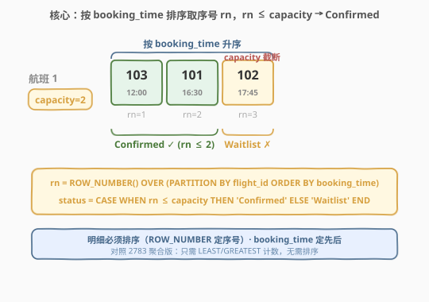
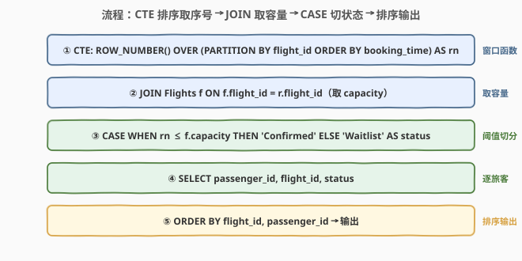
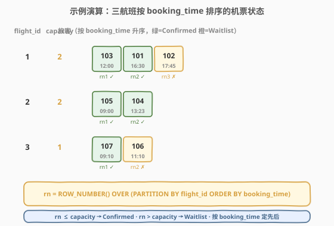

# LeetCode 航班机票状态 题解

> ⚠️ **注意**：本题是 LeetCode 数据库（SQL）类题目，在 leetcode.cn 上为 Plus/Premium 会员专享题，官方题面不可免费查看。本文题意根据**题目标题（Status of Flight Tickets / 航班机票状态）+ 官方示例用例的表结构与输入数据**重建，输出格式为最自然的工程解读，**可能与官方题面的精确列名/列顺序有出入**。核心 SQL 套路（按 `booking_time` 排序取前 `capacity` 位确认、其余等待）不受题面细节影响。本文代码使用 SQL（及 pandas 对照）而非 C++/Python 算法。

## 1. 题目概述

- **标题 / 题号**：航班机票状态（#2793，hard）
- **链接**：https://leetcode.cn/problems/status-of-flight-tickets/
- **难度**：困难
- **标签**：SQL、数据库、窗口函数、`ROW_NUMBER()`、`PARTITION BY`、`CASE WHEN`、先到先得

**题意**：给定 `Flights` 表与 `Passengers` 表。`Flights` 记录每个航班的座位容量 `capacity`；`Passengers` 记录每位旅客预订的航班及预订时间 `booking_time`。旅客按 `booking_time` 升序依次入座——每个航班先到先得，**前 `capacity` 位旅客获得确认状态（Confirmed），超出容量的旅客进入等待名单（Waitlist）**。编写 SQL 查询，报告每位旅客的机票状态，结果按 `flight_id` 升序、`passenger_id` 升序返回。

**表结构**：

```text
表: Flights
+-------------+----------+
| Column Name | Type     |
+-------------+----------+
| flight_id   | int      |   ← 航班 id
| capacity    | int      |   ← 座位容量
+-------------+----------+
flight_id 是该表的主键。
capacity 是该航班的可售座位数。

表: Passengers
+--------------+----------+
| Column Name  | Type     |
+--------------+----------+
| passenger_id | int      |   ← 旅客 id
| flight_id    | int      |   ← 预订的航班 id
| booking_time | datetime |   ← 预订时间
+--------------+----------+
(passenger_id) 是该表的主键。
```

> 💡 **审题关键**：① 「按 `booking_time` 升序入座」意味着同一航班内旅客的入座先后由预订时间决定——这是 `ROW_NUMBER() OVER (PARTITION BY flight_id ORDER BY booking_time)` 的来源；② 「前 `capacity` 位确认、其余等待」是一个**阈值切分**——第 $rn \le \text{capacity}$ 位确认、第 $rn > \text{capacity}$ 位等待；③ 本题要求**逐旅客明细**（每旅客一行），不是航班级聚合，故必须排序算序号，不能用 `LEAST/GREATEST` 取巧。

**示例 1**（据官方示例用例重建）：

```text
输入：
Flights 表:
+-----------+----------+
| flight_id | capacity |
+-----------+----------+
| 1         | 2        |
| 2         | 2        |
| 3         | 1        |
+-----------+----------+

Passengers 表:
+--------------+-----------+---------------------+
| passenger_id | flight_id | booking_time        |
+--------------+-----------+---------------------+
| 101          | 1         | 2023-07-10 16:30:00 |
| 102          | 1         | 2023-07-10 17:45:00 |
| 103          | 1         | 2023-07-10 12:00:00 |
| 104          | 2         | 2023-07-05 13:23:00 |
| 105          | 2         | 2023-07-05 09:00:00 |
| 106          | 3         | 2023-07-08 11:10:00 |
| 107          | 3         | 2023-07-08 09:10:00 |
+--------------+-----------+---------------------+

输出:
+--------------+-----------+------------+
| passenger_id | flight_id | status     |
+--------------+-----------+------------+
| 101          | 1         | Confirmed  |
| 102          | 1         | Waitlist   |
| 103          | 1         | Confirmed  |
| 104          | 2         | Confirmed  |
| 105          | 2         | Confirmed  |
| 106          | 3         | Waitlist   |
| 107          | 3         | Confirmed  |
+--------------+-----------+------------+
```

**解释**：

| 航班 | 容量 | 旅客（按 booking_time 升序） | 确认 | 等待 |
|------|------|------------------------------|------|------|
| 1 | 2 | 103(12:00), 101(16:30), 102(17:45) | 103, 101（前 2 位） | 102（第 3 位超出容量） |
| 2 | 2 | 105(09:00), 104(13:23) | 105, 104（前 2 位） | —（无超额） |
| 3 | 1 | 107(09:10), 106(11:10) | 107（前 1 位） | 106（第 2 位超出容量） |

> 💡 注意 `booking_time` 决定的排序与 `passenger_id` 的自然序**不同**——航班 1 中旅客 103 的 id 最大但预订时间最早（12:00），因此 $rn=1$ 最先入座。这是本题与 2783 的关键区别：2783 按 `passenger_id` 排序（简化假设），本题按 `booking_time` 排序（真实时间先后）。

> ⚠️ 本题面为付费题重建，**输出列名 `status` 及状态字符串 `Confirmed`/`Waitlist` 为推断**，以官方判定为准。但 SQL 核心逻辑（排序定入座先后 + 阈值切分）不受列名影响。

## 2. 解题思路

### 2.1 暴力思路：相关子查询逐旅客判定

过程式直觉：对 `Passengers` 每位旅客 `(pid, fid, bt)`，另开子查询数出该航班中 `booking_time <= bt` 的旅客数 `cnt`，若 `cnt <= capacity` 则该旅客确认、否则等待。

```text
for each passenger (pid, fid, bt) in Passengers:
    cnt = COUNT(*) in Passengers where flight_id = fid and booking_time <= bt
    status = 'Confirmed' if cnt <= Flights[fid].capacity else 'Waitlist'
```

- **正确性**：`booking_time <= bt` 恰好覆盖该航班中预订时间不晚于当前旅客的所有人（含自身），`cnt` 即该旅客的序号 $rn$，与 `capacity` 比较判定确认/等待，正确。
- **效率**：对每位旅客触发一次该航班的时间扫描，最坏 $O(n^2)$（$n$ = `Passengers` 行数）。当某航班旅客多时退化严重。

> ⚠️ 瓶颈在于「序号」被每行重复计算。突破口：用 `ROW_NUMBER()` 一次性算出每人在航班内的序号 $rn$，再用 `CASE WHEN` 一趟切分状态。

### 2.2 核心观察：ROW_NUMBER 窗口函数一次性定序号



关键洞察：本题要求**逐旅客明细**（每旅客一行 status），必须知道每位旅客在其航班内的序号 $rn$。`ROW_NUMBER()` 窗口函数恰好提供这个能力——按 `flight_id` 分窗、按 `booking_time` 升序，一次性给每人打上序号：

$$\boxed{rn \le \text{capacity} \Rightarrow \text{'Confirmed'}, \quad rn > \text{capacity} \Rightarrow \text{'Waitlist'}}$$

> 💡 **与 2783 的关系**：2783 是本题的**聚合版**——按 `passenger_id` 排序，输出航班级入座/等待人数，只需 `LEAST/GREATEST` 计数（$O(n)$，无需排序）。本题是**明细版**——按 `booking_time` 排序，输出逐旅客状态，必须 `ROW_NUMBER` 排序算序号（$O(n \log n)$）。口诀：**明细要序号、聚合只要计数**。

> ⚠️ **为什么不能用 `LEAST/GREATEST` 取巧？** `LEAST(COUNT, capacity)` 只能给出航班级的入座人数，无法回答「**哪位**旅客确认、**哪位**等待」——明细需要逐旅客的序号 $rn$，而 $rn$ 必须通过排序获得。这是 2783（聚合）与 2793（明细）的分水岭。

### 2.3 算法流程图



**逻辑执行步骤**：

| 步骤 | 表达式 | 作用 |
|------|--------|------|
| ① CTE 排序 | `ROW_NUMBER() OVER (PARTITION BY flight_id ORDER BY booking_time) AS rn` | 给每位旅客打上航班内按预订时间的序号 $rn$ |
| ② JOIN 取容量 | `JOIN Flights f ON f.flight_id = r.flight_id` | 关联航班容量 $C_f$，供后续阈值比较 |
| ③ CASE 切状态 | `CASE WHEN r.rn <= f.capacity THEN 'Confirmed' ELSE 'Waitlist' END` | $rn \le C_f$ 确认，$rn > C_f$ 等待 |
| ④ 排序输出 | `ORDER BY r.flight_id, r.passenger_id` | 按航班号、旅客号升序输出 |

> 💡 **`PARTITION BY` 三段各起什么作用？** `PARTITION BY flight_id` 按航班分窗，每个航班序号独立从 1 起；`ORDER BY booking_time` 窗内按预订时间升序，确定先到先得的入座先后；`ROW_NUMBER()` 给出 1, 2, 3, … 序号 $rn$。三者合起来即「同一航班内按预订时间的入座序号」。

### 2.4 示例演算

以官方示例三个航班走一遍 `ROW_NUMBER → CASE WHEN` 链路：



**CTE ranked 中间结果**（按 `booking_time` 升序排列）：

| flight_id | capacity | passenger_id | booking_time | rn | status |
|-----------|----------|--------------|--------------|----|--------|
| 1 | 2 | 103 | 2023-07-10 12:00:00 | 1 | Confirmed |
| 1 | 2 | 101 | 2023-07-10 16:30:00 | 2 | Confirmed |
| 1 | 2 | 102 | 2023-07-10 17:45:00 | 3 | Waitlist |
| 2 | 2 | 105 | 2023-07-05 09:00:00 | 1 | Confirmed |
| 2 | 2 | 104 | 2023-07-05 13:23:00 | 2 | Confirmed |
| 3 | 1 | 107 | 2023-07-08 09:10:00 | 1 | Confirmed |
| 3 | 1 | 106 | 2023-07-08 11:10:00 | 2 | Waitlist |

> 💡 **三个观察要点**：① 航班 1 中旅客 103 的 id 最大但预订时间最早（12:00），故 $rn=1$ 最先入座——印证「排序键是 `booking_time` 而非 `passenger_id`」；② 航班 2 只有 2 位旅客、容量 2，全部确认（$rn=1,2 \le 2$），无等待名单；③ 航班 3 容量仅 1，$rn=1$ 的 107 确认、$rn=2$ 的 106 等待——最小容量的边界用例。

## 3. 参考代码

### SQL（`ROW_NUMBER` + `CASE WHEN`，推荐）

```sql
WITH ranked AS (
    SELECT passenger_id, flight_id, booking_time,
           ROW_NUMBER() OVER (PARTITION BY flight_id ORDER BY booking_time) AS rn
    FROM Passengers
)
SELECT r.passenger_id,
       r.flight_id,
       CASE WHEN r.rn <= f.capacity THEN 'Confirmed' ELSE 'Waitlist' END AS status
FROM ranked r
JOIN Flights f ON f.flight_id = r.flight_id
ORDER BY r.flight_id, r.passenger_id;
```

> 💡 **写法要点**：
> - `CTE ranked` 用 `ROW_NUMBER() OVER (PARTITION BY flight_id ORDER BY booking_time)` 给每位旅客打上「该航班内按预订时间升序的序号」$rn$——这正是「先到先得」的 SQL 表达。
> - `JOIN Flights`（非 `LEFT JOIN`）：每位旅客都有有效 `flight_id`，内连接即可获取 `capacity`。若需保留无旅客的航班（本题不要求），可换 `FROM Flights LEFT JOIN ranked`。
> - `CASE WHEN r.rn <= f.capacity THEN 'Confirmed' ELSE 'Waitlist'`：阈值切分，$rn \le C_f$ 确认、$rn > C_f$ 等待。
> - `ORDER BY flight_id, passenger_id`：按航班号、旅客号升序输出，与题目要求一致。
> - 需 MySQL 8.0+ / PostgreSQL / SQL Server / Oracle（支持窗口函数）。

### Python（pandas）

```python
import pandas as pd
import numpy as np

def status_of_flight_tickets(flights: pd.DataFrame, passengers: pd.DataFrame) -> pd.DataFrame:
    passengers = passengers.sort_values(['flight_id', 'booking_time'])
    passengers['rn'] = passengers.groupby('flight_id').cumcount() + 1
    df = passengers.merge(flights, on='flight_id')
    df['status'] = np.where(df['rn'] <= df['capacity'], 'Confirmed', 'Waitlist')
    return df[['passenger_id', 'flight_id', 'status']].sort_values(['flight_id', 'passenger_id'])
```

> 💡 **pandas 对照**：
> - `sort_values(['flight_id', 'booking_time'])` + `groupby('flight_id').cumcount() + 1` 等价于 SQL 的 `ROW_NUMBER() OVER (PARTITION BY flight_id ORDER BY booking_time)`——`cumcount()` 在已排序的 DataFrame 上按组计数（从 0 起），`+1` 对齐 `ROW_NUMBER` 的 1-indexed。
> - `merge(flights, on='flight_id')` 等价于 `JOIN Flights` 获取容量。
> - `np.where(rn <= capacity, 'Confirmed', 'Waitlist')` 等价于 `CASE WHEN`——向量化条件，无需逐行 `apply`。
> - ⚠️ 与 SQL 的差异：`cumcount()` 依赖 DataFrame 的行序，必须先 `sort_values` 再 `groupby`；SQL 的 `ROW_NUMBER` 在窗口定义中内嵌排序，不依赖表物理序。

## 4. 复杂度分析

| 维度 | 复杂度 | 说明 |
|------|--------|------|
| **时间** | $O(n \log n)$ | `ROW_NUMBER()` 需按 `(flight_id, booking_time)` 排序 |
| **空间** | $O(n)$ | 窗口排序缓冲 + CTE 物化 |
| **中间行数** | $n$ | CTE ranked 不压缩行，每行附 $rn$ |
| **是否需排序** | 是 | `PARTITION BY flight_id ORDER BY booking_time` |
| **JOIN 类型** | INNER JOIN | 每位旅客有有效航班，内连接即可 |

> - $n$ = `Passengers` 行数。
> - **时间**：`ROW_NUMBER()` 按 `(flight_id, booking_time)` 排序，$O(n \log n)$；随后 `JOIN` + `CASE` 线性 $O(n)$。由排序主导。若 `(flight_id, booking_time)` 已建索引，排序可省，降至 $O(n)$。
> - **空间**：CTE `ranked` 物化 $n$ 行（含 $rn$ 列），窗口排序需 $O(n)$ 缓冲。
> - ⚠️ **对比暴力相关子查询 $O(n^2)$**：窗口函数将「每旅客一次子查询扫描」压缩为「一次排序 + 一次线性扫描」，从平方降到对数线性，是 SQL 性能优化的经典范式。

> ⚠️ **性能拐点**：当某航班旅客数 $D_f$ 极大时，单航班内部排序 $O(D_f \log D_f)$。若仅需航班级聚合（如 2783），可省排序用 `LEAST/GREATEST` $O(D_f)$；但明细题必须排序。给 `(flight_id, booking_time)` 建复合索引可加速排序。

## 5. 扩展

### 5.1 与 2783 的关系：明细 vs 聚合

本题（2793）与 [2783. 航班入座率和等待名单分析](2783_航班入座率和等待名单分析.md) 是**同一场景的两种问法**：

| 维度 | 2783（聚合版） | 2793（明细版，本题） |
|------|---------------|---------------------|
| **排序键** | `passenger_id` | `booking_time` |
| **输出粒度** | 航班级（每航班一行） | 旅客级（每旅客一行） |
| **核心函数** | `LEAST`/`GREATEST` | `ROW_NUMBER()` + `CASE WHEN` |
| **是否需排序** | 否（$O(n)$） | 是（$O(n \log n)$） |
| **输出列** | `flight_id, booked_cnt, waitlist_cnt, occupancy_rate` | `passenger_id, flight_id, status` |

> 💡 2783 的解法 B（`ROW_NUMBER` + 条件聚合）排序键是 `passenger_id`，将其改为 `booking_time` 即可得到本题的 CTE——两题共享同一套窗口函数骨架，仅排序键和输出粒度不同。

### 5.2 booking_time 并列时的处理

若两位旅客在同一航班的 `booking_time` 完全相同（同一秒预订），`ROW_NUMBER()` 仍会给它们分配**不同的**序号（1, 2），但谁排在前由实现决定（不保证确定）。此时有三种策略：

| 策略 | 写法 | 效果 |
|------|------|------|
| **不处理**（默认） | `ORDER BY booking_time` | 并列时序号不确定，但 capacity 截断仍严格 |
| **加 tiebreaker** | `ORDER BY booking_time, passenger_id` | 并列时按旅客 id 升序，确定性 |
| **用 RANK** | `RANK() OVER (... ORDER BY booking_time)` | 并列同序号，可能同时确认/同时等待 |

> 💡 生产系统中通常加 `passenger_id` 作为确定性 tiebreaker，避免同一时刻预订的旅客因数据库实现不同而得到不同结果。

## 6. 面试要点

**Q1：为什么本题必须用 `ROW_NUMBER` 排序，不能像 2783 那样用 `LEAST/GREATEST` 取巧？**

> 本题要求**逐旅客明细**——输出每位旅客的状态（Confirmed/Waitlist），必须知道每位旅客在其航班内的序号 $rn$ 才能与 `capacity` 比较。`LEAST/GREATEST` 只能给出航班级的入座/等待人数，无法回答「**哪位**旅客是什么状态」。2783 是聚合版（航班级指标），排序可省；2793 是明细版（旅客级状态），排序不可省。口诀：**明细要序号、聚合只要计数**。

**Q2：`ROW_NUMBER()` 与 `RANK()`/`DENSE_RANK()` 在此题的区别？**

> `ROW_NUMBER()` 保证每人一个**唯一**序号（1, 2, 3, …），即使 `booking_time` 并列也不重复——因此 `capacity` 截断严格（恰好 `capacity` 人确认）。`RANK()` 在并列时给同序号（如两人并列第 2），可能导致超过 `capacity` 人确认（若第 2、3 位并列且 capacity=2，`RANK` 给两人都是 2，都 $\le 2$ 确认，变成 3 人确认）。本题要求严格容量切分，**必须用 `ROW_NUMBER`**。

**Q3：`PARTITION BY flight_id ORDER BY booking_time` 三段各起什么作用？**

> `PARTITION BY flight_id`：按航班分窗，每个航班序号独立从 1 起；`ORDER BY booking_time`：窗内按预订时间升序，确定先到先得的入座先后；`ROW_NUMBER()`：给出 1, 2, 3, … 序号 $rn$。三者合起来即「同一航班内按预订时间的入座序号」。注意 `PARTITION` 只分窗不压缩行——每行都保留并附上 $rn$，与 `GROUP BY` 的压缩不同。

**Q4：为什么用 `JOIN` 而不是 `LEFT JOIN`？**

> 本题从 `Passengers` 出发，每位旅客都有有效的 `flight_id`（外键约束），`JOIN Flights` 一定能匹配到容量，内连接即可。若从 `Flights` 出发且需保留无旅客的航班，才需 `LEFT JOIN`。但本题输出旅客明细，无旅客的航班不产生行，故 `JOIN` 最自然。

**Q5：`booking_time` 并列时怎么保证确定性？**

> `ORDER BY booking_time` 在并列时顺序由实现决定（不确定）。加 tiebreaker `ORDER BY booking_time, passenger_id` 可保证确定性——同一时刻预订的旅客按 id 升序排列。生产系统中应始终加 tiebreaker 避免结果因数据库实现不同而异。

> 💡 **一句话总结**：2793 是 SQL **「窗口排序 + 阈值切分」明细版招牌题**——核心模板 `ROW_NUMBER() OVER (PARTITION BY flight_id ORDER BY booking_time) AS rn` + `CASE WHEN rn <= capacity THEN 'Confirmed' ELSE 'Waitlist'`，与 2783 聚合版共享同一场景，区别在**排序键（booking_time vs passenger_id）和输出粒度（明细 vs 聚合）**。

## 同类练习题

| # | 题目 | 与本题的关联 |
|---|------|-------------|
| 2783 | [航班入座率和等待名单分析](https://leetcode.cn/problems/flight-occupancy-and-waitlist-analysis/)（[站内题解](2783_航班入座率和等待名单分析.md)） | 同一场景的**聚合版**——按 `passenger_id` 排序、输出航班级入座/等待人数，用 `LEAST/GREATEST` 无需排序 $O(n)$，对照本题明细版必须 `ROW_NUMBER` 排序 $O(n \log n)$ |
| 178 | [分数排名](https://leetcode.cn/problems/rank-scores/) | `RANK()`/`DENSE_RANK()` vs `ROW_NUMBER()` 的对照——把本题的 `ROW_NUMBER` 换成 `RANK`，观察并列时序号行为的差异 |
| 1204 | [最后一个能进入巴士的人](https://leetcode.cn/problems/last-person-to-fit-in-the-bus/) | `SUM() OVER (ORDER BY ...)` 累计求和找容量临界行，与本题「前 capacity 位确认」同源，区别是该题找临界人、本题逐人判定 |
| 1174 | [即时食物配送 II](https://leetcode.cn/problems/immediate-food-delivery-ii/)（[站内题解](../1101-1200/1174_即时食物配送II.md)） | `ROW_NUMBER()` 配首次订单判定，窗口函数家族的「分组首次」变体，对照本题的「分组排序定序号」 |
