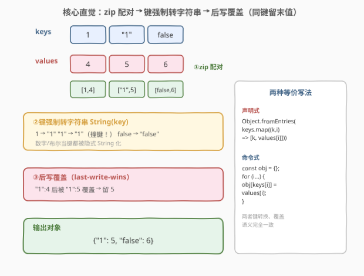
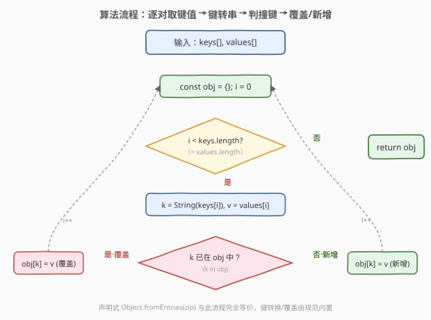

# LeetCode 从两个数组中创建对象 题解

## 1. 题目概述

- **标题 / 题号**：从两个数组中创建对象（#2794，easy）
- **链接**：https://leetcode.cn/problems/create-object-from-two-arrays/
- **难度**：简单
- **标签**：数组、对象、zip 配对、键转换

**题意**：给定两个等长数组 `keys` 与 `values`，返回一个**对象**——以 `keys[i]` 为键、`values[i]` 为对应值。若多个元素经过**键转换**后得到相同的键，则**后者覆盖前者**（保留最后一次出现的值）。

> ⚠️ 本题为 LeetCode 付费题，题意描述根据官方示例用例与「30 天 JavaScript」系列同族题目（[2755. 深度合并两个对象](2755_深度合并两个对象.md)）信息重建，可能与官方题面有出入。

**示例 1**：

```text
输入：keys = ["a","b","c"], values = [1,2,3]
输出：{"a":1,"b":2,"c":3}
解释：三个字符串键互不相同，逐位映射。
```

**示例 2**：

```text
输入：keys = [1,"1",false], values = [4,5,6]
输出：{"1":5,"false":6}
解释：数字 1 与字符串 "1" 经 String() 都得 "1" → 撞键，后者 5 覆盖前者 4；false → "false"。
```

**示例 3**：

```text
输入：keys = [], values = []
输出：{}
解释：空数组映射成空对象。
```

**约束**：

- `keys.length === values.length`；
- $0 \le \text{keys.length} \le 10^5$；
- `keys[i]`、`values[i]` 为任意 JSON 值（数字 / 字符串 / 布尔 / null / 对象 / 数组）；
- 返回结果为普通 JS 对象。

> 💡 本题是 LeetCode「30 天 JavaScript」系列题目，**仅提供 JavaScript / TypeScript 提交入口**，核心考察**两个数组 zip 配对 + 对象键的强制类型转换 + 后写覆盖语义**。它看似一行代码，真正的考点在「键会丢失类型、撞键后留末值」这条隐式规则——这也是 JS 对象与 Python `dict` 在示例 2 上行为分叉的根源。本文以 JS 为提交语言，并给出 Python 概念等价实现与语言对照。

## 2. 解题思路

### 2.1 暴力思路：手写 `for` 循环逐位赋值

最直白的写法：建空对象，按下标遍历，`obj[keys[i]] = values[i]` 一行搞定。这其实就是**正解**——本题没有比它更"巧"的算法。真正要理解的是这一行赋值背后 JS 替你做的两件事：

1. **键强制转字符串**：`obj[1]` 和 `obj["1"]` 写进的是同一个槽位，因为对象键恒为字符串；
2. **后写覆盖**：同一键被多次赋值时，**最后一次赋值生效**，前值被丢弃。

### 2.2 核心观察：zip 配对 + 键转字符串 + 后写覆盖



把两个数组沿下标**拉链式配对**成 `[key, value]` 二元组列表，再喂给 `Object.fromEntries`——后者是 `Object.entries` 的逆运算，天然把二元组列表还原成对象。整个过程可拆成三步：

| 步骤 | 动作 | 关键点 |
|------|------|--------|
| **① zip 配对** | `keys.map((k, i) => [k, values[i]])` | 按下标对齐，等价 `zip` |
| **② 键转字符串** | 写入对象时隐式 `String(key)` | 数字 `1`→`"1"`、布尔 `false`→`"false"`、`null`→`"null"` |
| **③ 后写覆盖** | 同键多次写入留末值 | `Object.fromEntries` 与手写赋值语义一致 |

**关键直觉：键会"塌缩"成字符串，撞键后留末值。** 这是示例 2 输出只有 2 个键（而非 3 个）的全部原因——`1` 与 `"1"` 塌缩成同一个字符串键 `"1"`，值被后到的 `5` 覆盖。

> ⚠️ **排雷要点：JS 对象键恒为字符串（Symbol 例外，但本题不涉及）。** 这是与 Python `dict` 最大的行为差异。Python 中 `1` 和 `"1"` 是**两个不同类型**的键、各自独立存活（结果 3 个键）；而 JS 中它们塌缩成同一个字符串键（结果 2 个键）。详见 2.4 的语言对照。

> 💡 **声明式 vs 命令式**：`Object.fromEntries(keys.map((k,i)=>[k,values[i]]))` 与 `for{obj[keys[i]]=values[i]}` **完全等价**——键转换、覆盖语义都由语言规范内置，写法只影响可读性不影响行为。面试中两版都应能随手写出，并说清它们为什么等价。

### 2.3 算法流程图



命令式视角下，循环体每轮做三件事：取 `k = String(keys[i])`、`v = values[i]`；判 `k in obj`——在则覆盖、不在则新增；`i++` 回到循环头。`Object.fromEntries` 把这个循环封装成一行，但内部的「取键→转串→覆盖/新增」流程一模一样。

> 💡 **"撞键判定"其实可省**：因为「覆盖」与「新增」对 `obj[k] = v` 这条语句而言是**同一种操作**——无论 `k` 是否已存在，赋值都会把当前值设成 `v`。所以流程图里那条 `k in obj` 分支只是**概念上**展示"覆盖 vs 新增"的语义区别，实际代码无需 `if` 判定，直接赋值即可。这也是为什么这道题能一行解：赋值语句天然 absorb 了覆盖逻辑。

### 2.4 示例演算

![示例 2 演算：keys=[1,"1",false], values=[4,5,6] 逐步推导与 JS/Python 对照](../images/p2794_example_walkthrough.svg)

以**示例 2** 逐位演算，重点看键的塌缩与覆盖：

| i | key（原） | String(key) | value | obj 状态 | 备注 |
|---|-----------|-------------|-------|----------|------|
| 0 | `1`（数字） | `"1"` | `4` | `{"1":4}` | 新增 |
| 1 | `"1"`（字符串） | `"1"` | `5` | `{"1":5}` | ⚠ 撞键！覆盖 4→5 |
| 2 | `false` | `"false"` | `6` | `{"1":5,"false":6}` | 新增 |

最终 `{"1":5,"false":6}`——**2 个键，不是 3 个**。丢失的那一个不是被"删除"，而是从头就没存在过：`1` 与 `"1"` 在写入对象那一刻就被塌缩成同一个字符串键 `"1"`，前值 `4` 被后值 `5` 覆盖。

**语言对照（关键差异）**：同样的输入交给 Python `dict`，结果是 `{1:4, "1":5, False:6}`——**3 个键**。因为 Python 用 `hash()` + `__eq__` 判同键：`1`（int）与 `"1"`（str）类型不同、哈希不同，互不撞键；而 `False` 与 `0` 因 `False == 0` 且 `hash(False) == hash(0)` 才会撞键。这意味着**「zip 两数组造映射」这件事，在 JS 与 Python 上的可观察行为并不一致**——理解键的相等性规则，才是本题的真正考点。

> 💡 **为什么这道"简单题"值得写？** 因为它用最小示例暴露了 JS 对象的一个根本设计：键的字符串化是**强制的、隐式的、不可选的**。这解释了为什么 `obj[1]` 与 `obj["1"]` 是同一个属性、为什么 `for...in` 遍历出的键都是字符串、以及为什么用对象当"任意类型→值"的映射会踩坑（数字键会塌缩）。需要任意类型键时，应改用 `Map`——`Map` 用 `SameValueZero` 判等，保留类型身份，`1` 与 `"1"` 在 `Map` 中是两个独立条目。

## 3. 参考代码

### JavaScript / TypeScript（提交语言）

```javascript
/**
 * @param {Array} keys
 * @param {Array} values
 * @return {Object}
 */
var createObject = function(keys, values) {
    return Object.fromEntries(keys.map((k, i) => [k, values[i]]));
};
```

命令式等价写法（更直观地展示「取键→赋值→覆盖」）：

```javascript
var createObject = function(keys, values) {
    const obj = {};
    for (let i = 0; i < keys.length; i++) {
        obj[keys[i]] = values[i]; // 隐式 String(key) + 后写覆盖
    }
    return obj;
};
```

TypeScript 版（带类型标注）：

```typescript
type Key = string | number | boolean;

function createObject(keys: Key[], values: any[]): Record<string, any> {
    return Object.fromEntries(keys.map((k, i) => [k, values[i]]));
}
```

> 💡 **两版为何等价？** `Object.fromEntries` 规范规定：对每个 `[k, v]`，执行 `CreateDataPropertyOrThrow(result, ToString(k), v)`——即先把键 `ToString`、再赋值，遇到重复键后者覆盖前者。这与手写 `obj[keys[i]] = values[i]`（`[[Set]]` 内部同样先 `ToPropertyKey` 即 `ToString`）走的是**同一套键转换 + 覆盖**路径，行为必然一致。理解这一点，就不必纠结"哪种写法更安全"——它们安全等级相同。

> ⚠️ **`values[i]` 不做 `String` 转换**：只有**键**会被强制转字符串，值原样保留。所以 `values` 里的对象、数组、`null` 等都能完整存进结果。若误把值也 `String()` 一遍，会把对象变成 `"[object Object]"`，彻底破坏数据。

### Python（概念等价）

> 本题 LeetCode 仅开放 JS/TS，Python 版作概念对照。注意：Python `dict` 用 `hash + __eq__` 判键，**数字 `1` 与字符串 `"1"` 不撞键**（类型不同），故示例 2 在 Python 下会得到 3 个键——这与 JS 行为分叉，是本节对照的重点。

```python
def create_object(keys, values):
    # Python 版：键保留类型身份，1 与 "1" 是两个独立键
    return {k: v for k, v in zip(keys, values)}
    # 示例 2 输入 → {1: 4, "1": 5, False: 6}（3 个键，与 JS 的 2 个键不同）
```

若要在 Python 中**复刻 JS 的塌缩语义**（把所有键先 `str()` 化再建 dict）：

```python
def create_object_js_like(keys, values):
    # 显式 str(key) 模拟 JS 的隐式 String() 转换
    obj = {}
    for k, v in zip(keys, values):
        obj[str(k)] = v          # str(1)="1", str(False)="false"
    return obj
    # 示例 2 → {"1": 5, "false": 6}（2 个键，与 JS 一致）
```

> ⚠️ **Python 的 `True`/`1` 撞键陷阱**：Python 里 `True == 1` 且 `hash(True) == hash(1)`，所以 `{1: 'a', True: 'b'}` 结果是 `{1: 'b'}`——`True` 会覆盖 `1`。这与 JS 中 `1` 与 `"1"` 撞键是**不同的撞键规则**：JS 因"键恒为字符串"而塌缩，Python 因"值相等且哈希相等"而塌缩。两者都叫"撞键"，但成因截然不同——这正是语言对照的价值。

## 4. 复杂度分析

| 维度 | 复杂度 | 说明 |
|------|--------|------|
| 时间复杂度 | $O(n)$ | $n$ 为数组长度；每个键值对至多处理常数次（zip/map/赋值各一轮），无重复扫描 |
| 空间复杂度 | $O(n)$ | 输出对象至多 $n$ 个键值对（撞键时更少）；`map` 产生的中间二元组列表亦 $O(n)$，与输出同阶 |

> 💡 **本质是一次线性 zip**：整个过程是单趟扫描——把两个并行数组的同位元素配对、写入映射。没有排序、没有嵌套循环、没有递归下钻，故时间严格 $O(n)$。空间上输出结构规模不超过输入，中间 `map` 产生的临时列表与输出同阶，常数因子内，整体 $O(n)$。即便全无撞键，输出键数也恰为 $n$，空间不会更优。

## 5. 扩展：键相等性规则与 `Map` 的对照

- **JS 对象键的"字符串化"是强制的**：`obj[1]`、`obj["1"]`、`obj[true]`、`obj["true"]` 写入的都是字符串属性名。这源于 `[[Set]]` / `[[Get]]` 内部对键调用 `ToPropertyKey` → `ToString`。结果是用对象当"任意类型键映射"时**数字键会塌缩**——这也是为何"统计出现次数"用对象存数字键时，`1` 与 `"1"` 会错误合并。
- **`Map` 保留类型身份**：`new Map([[1,'a'],["1",'b']])` 会存两个条目，因为 `Map` 用 `SameValueZero` 判等（`1 !== "1"`，类型不同即不同键）。需要任意类型键时，`Map` 才是正确工具——本题因题目限定返回"对象"，才必须接受字符串化语义。
- **后写覆盖的代数性质**：对象赋值是"幂等的覆盖"——`obj[k]=v` 无论执行几次、`k` 是否已存在，结果都把 `obj[k]` 设成 `v`。这让「判撞键」在代码中可省（2.3 的流程图注释），也是 `Object.fromEntries` 能一行封装的原因。
- **`Object.fromEntries` 是 `Object.entries` 的逆**：`Object.entries(obj)` 把对象拆成 `[key, value]` 列表，`Object.fromEntries` 把列表还原成对象。两者在"对象 ↔ 二元组列表"间互逆，但都遵循"键为字符串、后写覆盖"的规范——因此逆运算不丢信息的前提是键本就都是字符串。

> 💡 工程实践中，"两个并行数组建映射"是高频小操作：表头与行值配对、配置项 key/value 配对、枚举码与描述配对。掌握「`zip` + `fromEntries`」的声明式写法，可把这类胶水代码压成一行；但务必记得**键会被字符串化**——当键可能含数字/布尔时，先想清楚塌缩是否符合预期，否则改用 `Map`。

## 6. 面试要点

1. **示例 2 为什么输出只有 2 个键，而不是 3 个？**

   > 因为 JS 对象键**恒为字符串**。`keys[0]=1`（数字）与 `keys[1]="1"`（字符串）经 `String()` 都得到 `"1"`——它们塌缩成**同一个键**，后到的值 `5` 覆盖了先到的 `4`。`keys[2]=false` 经 `String()` 得 `"false"`，独立存活。故结果 `{"1":5,"false":6}` 只有 2 个键。根因是赋值时键被隐式 `ToString`。

2. **`Object.fromEntries(keys.map(...))` 和手写 `for { obj[keys[i]]=values[i] }` 行为是否一致？为什么？**

   > 完全一致。两者走同一条"键转换 + 后写覆盖"路径：`Object.fromEntries` 规范对每个 `[k,v]` 执行 `CreateDataPropertyOrThrow(result, ToString(k), v)`；手写赋值走 `[[Set]]`，内部同样先 `ToPropertyKey`（即 `ToString`）。两者都先字符串化键、遇到重复键后者覆盖前者，故行为必然相同，只是命令式 vs 声明式的风格差异。

3. **同样的输入，Python `dict` 会得到几个键？为什么与 JS 不同？**

   > Python 得到 **3 个键** `{1:4, "1":5, False:6}`。因为 Python 用 `hash()` + `__eq__` 判同键：`1`（int）与 `"1"`（str）类型不同、哈希不同，互不撞键；而 `False` 与 `0` 因 `False == 0` 且 `hash(False) == hash(0)` 才会撞键。JS 则因"键恒为字符串"而塌缩。两者"撞键"成因不同：JS 是类型塌缩，Python 是值相等且哈希相等。

4. **为什么代码里不需要显式 `if (k in obj)` 判撞键？**

   > 因为"覆盖"与"新增"对 `obj[k] = v` 是**同一种操作**——无论 `k` 是否已存在，赋值都把当前值设成 `v`。所以赋值语句天然 absorb 了覆盖逻辑，判撞键是多余的。`Object.fromEntries` 同理：它逐个 `CreateDataPropertyOrThrow`，遇到重复键直接覆盖，不先判存在性。这是本题能一行解的根本原因。

5. **如果键可能是任意类型且需要保留类型身份，该用什么数据结构？**

   > 用 `Map`。`Map` 用 `SameValueZero` 判等（`1 !== "1"`，类型不同即不同键），保留类型身份；而普通对象键恒为字符串，数字/布尔会塌缩。本题因题目限定返回"对象"才接受字符串化；实际工程中"任意类型键映射"应首选 `Map`，避免键塌缩导致的隐性 bug。

> 💡 **一句话总结**：2794 = 「zip 两数组配对 + `Object.fromEntries` + 键隐式 `String()` 塌缩 + 后写覆盖」。正解一行 `Object.fromEntries(keys.map((k,i)=>[k,values[i]]))`，考点不在写法而在理解：JS 对象键恒为字符串，`1` 与 `"1"` 撞键后留末值——这与 Python `dict` 保留类型身份、得 3 个键的行为分叉，是本系列「沿 JSON 文法」题目里揭示语言键相等性差异的最小范例。

## 同类练习题

| # | 题目 | 与本题的关联 |
|---|------|-------------|
| 2675 | [数组中的相似元素](https://leetcode.cn/problems/array-of-objects-to-matrix/) | 将对象数组按列归并为矩阵，同属「30 天 JS」系列，巩固对对象键遍历与分组的运用 |
| 2625 | [扁平化嵌套数组](https://leetcode.cn/problems/flatten-deeply-nested-array/)（[题解](2625_扁平化嵌套数组.md)） | 沿数组递归扁平化，同属「30 天 JS」家族，对照"数组下标 vs 对象键"两种索引维度 |
| 2755 | [深度合并两个对象](https://leetcode.cn/problems/deep-merge-of-two-objects/)（[题解](2755_深度合并两个对象.md)） | 沿 JSON 文法递归合并，同族姊妹题，对照"键转换 vs 递归合并"的边界 |
| 2705 | [精简对象](https://leetcode.cn/problems/compact-object/)（[题解](2705_精简对象.md)） | 沿 JSON 文法递归精简，同族姊妹题，巩固对象/数组的键与下标语义 |
