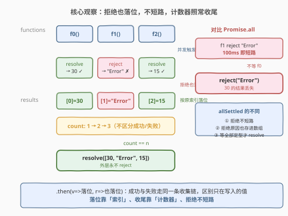
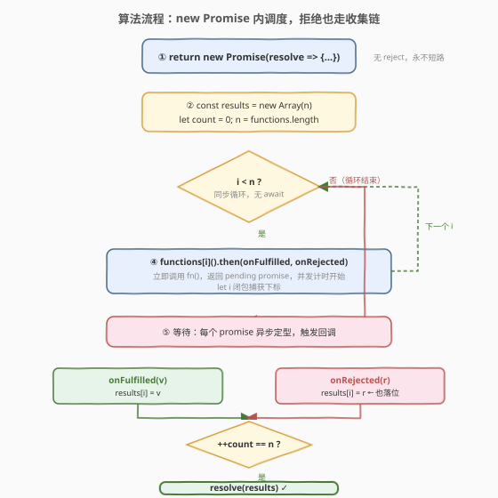
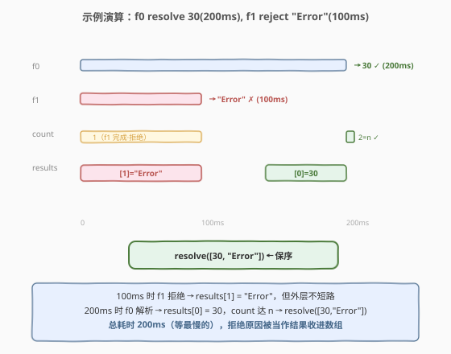

# LeetCode 并行执行 Promise 以获取独有的结果 题解

## 1. 题目概述

- **标题 / 题号**：并行执行 Promise 以获取独有的结果（#2795，medium）
- **链接**：https://leetcode.cn/problems/parallel-execution-of-promises-for-individual-results-retrieval/
- **难度**：中等
- **标签**：Promise、并发、`Promise.allSettled` 手写、闭包、计数器

> ⚠️ 本题为 LeetCode 付费题，题意描述根据官方示例用例与 hints 重建，可能与官方题面有出入。

**题意**：给定一个异步函数数组 `functions`，返回一个新的 promise 对象 `promise`。数组中的每个函数都不接受参数并返回一个 promise。所有的 promise 都应该**并行执行**。

与「首拒即拒」的 `Promise.all` 不同，本题要求**逐个收集每个 promise 的独立结果**：

- 当某个 promise 成功解析（resolve）时，把它的解析值放到结果数组对应下标处；
- 当某个 promise 被拒绝（reject）时，**不短路**，把拒绝原因（reason）放到结果数组对应下标处。

`promise` **resolve** 条件：

- 当所有从 `functions` 返回的 promise 都定型（不论成功或失败）时，`promise` 以一个数组解析，数组中第 `i` 个元素是第 `i` 个 promise 的解析值或拒绝原因，顺序与 `functions` 保持一致。

`promise` **永不 reject**：即使有 promise 被拒绝，拒绝原因只是作为结果的一项被收进数组，外层依然 resolve。

**请在不使用内置的 `Promise.allSettled` 函数的情况下解决。**

**示例 1**：

```text
输入：functions = [
  () => new Promise(resolve => setTimeout(() => resolve(15), 100))
]
输出：{"t": 100, "resolved": [15]}
解释：单个函数在 100 毫秒后以值 15 解析，结果数组为 [15]。
```

**示例 2**：

```text
输入：functions = [
  () => new Promise(resolve => setTimeout(() => resolve(20), 100)),
  () => new Promise(resolve => setTimeout(() => resolve(15), 100))
]
输出：{"t": 100, "resolved": [20, 15]}
解释：两个 promise 并行执行，均在 100 毫秒后解析，结果按原顺序排列。
```

**示例 3**：

```text
输入：functions = [
  () => new Promise(resolve => setTimeout(() => resolve(30), 200)),
  () => new Promise((resolve, reject) => setTimeout(() => reject("Error"), 100))
]
输出：{"t": 200, "resolved": [30, "Error"]}
解释：第二个 promise 在 100ms 时被拒绝，但其拒绝原因 "Error" 被收进结果数组对应位置，
     外层并不短路；200ms 时第一个 promise 解析 30，此时全部定型，外层以 [30, "Error"] 解析。
```

**约束**：

- 函数 `functions` 是一个返回 promise 的函数数组
- $1 \leq \text{functions.length} \leq 10$

> 💡 本题是 2721「并行执行异步函数」（手写 `Promise.all`）的姊妹篇：2721 是「首拒即拒、短路」，本题是「拒绝也收、不短路」——也就是手写 `Promise.allSettled`。考点在于理解「拒绝原因也能落位」与「计数器不区分成败」两点。

## 2. 解题思路

### 2.1 暴力思路：直接用 `Promise.all`（会丢失拒绝结果）

最直觉的写法是套用 2721 的 `Promise.all` 模板：

```text
async function promiseAllSettled(functions) {
    return Promise.all(functions.map(fn => fn()));
}
```

这在示例 1、2（全部 resolve）下能拿到正确结果，但在示例 3 下会**短路失败**——`Promise.all` 一旦遇到 reject 就立即 reject 外层，不仅丢掉了那个 reject 的原因，也丢掉了其它尚未完成的 promise（如 200ms 才解析的 30）的结果。本题要的是「不管成功失败，每个 promise 的结局都要进数组」，`Promise.all` 的「一败俱败」语义在这里反而是错的。

> 💡 **`Promise.all` vs `Promise.allSettled` 的本质区别**：`all` 是「全成功才成功，一败俱败」；`allSettled` 是「等全部尘埃落定，无一短路」。本题要的是后者——拒绝不是错误信号，而是一份要被收集的「结果」。

### 2.2 核心观察：并发触发 + 按索引落位 + 计数器收尾 + 拒绝也落位（不短路）



关键洞察：和 2721 一样要在一个同步循环里**并发触发**所有函数（不能用 `await` 串行），再用 `.then`/第二参数给每个 promise 挂回调收集结果。区别全在于**拒绝如何处理**——`allSettled` 把拒绝原因也当作「结果的一项」写进数组，而非触发外层 reject。四个要点：

| 要点 | 做法 | 为什么 |
|------|------|--------|
| **并发触发** | 同步 `for` 循环里调 `functions[i]()`，无 `await` | 循环同步，几微秒内全部触发，promise 同时开始计时 |
| **按索引落位** | `.then(v => { results[i] = v })` 闭包捕获 `i` | 完成先后无序，靠「原始下标」保证最终数组保序 |
| **拒绝也落位** | `.then(_, r => { results[i] = r })` 把 reason 也写到 `results[i]` | 拒绝原因不是错误信号，而是一份要收集的结果 |
| **计数器收尾** | `if (++count === n) resolve(results)` | 计数器不区分成功/失败，只要定型就 +1，全部定型时 resolve |

> 💡 **为何拒绝也走收集链是关键**：2721 里 `.catch(reject)` 让拒绝直接短路外层；本题恰恰相反——拒绝的回调（`.then` 的第二个参数）做的事和成功回调**一模一样**：把值（reason）写到 `results[i]`、计数器 +1、达 n 则 resolve。成功与失败走同一条收集链，区别只在写入的值是 `value` 还是 `reason`。这样外层就「永不 reject」，天然实现「不短路」。

> ⚠️ **不要给 `new Promise` 传 `reject`**：既然外层永不 reject，构造器里只需 `resolve` 一个参数即可。若仍写 `(resolve, reject)` 却从不调用 `reject`，虽无错但多余；更危险的是若误在拒绝回调里调 `reject(r)`，就退化回了 2721 的短路语义，示例 3 会得到 `{"rejected":"Error"}` 而非 `{"resolved":[30,"Error"]}`。

### 2.3 算法流程图



**逻辑执行步骤**：

| 步骤 | 代码 | 作用 |
|------|------|------|
| ① | `return new Promise(resolve => { ... })` | 立即返回 pending Promise，只捕获 `resolve`（外层永不 reject） |
| ② | `const results = new Array(n), count = 0` | 预分配结果槽位，计数器从 0 起步 |
| ③ | `for (let i = 0; i < n; i++)` 同步循环 | 无 `await`，几微秒内全部触发，真并发 |
| ④ | `functions[i]().then(onFulfilled, onRejected)` | 立即调用 `fn()`，并发计时开始；`let i` 闭包捕获下标 |
| ⑤ | 等待每个 promise 异步定型 | 成功触发 `onFulfilled`，失败触发 `onRejected`，都进收集链 |
| ⑥ | `onFulfilled(v)`: `results[i]=v; if(++count===n) resolve(results)` | 解析值按索引落位 |
| ⑦ | `onRejected(r)`: `results[i]=r; if(++count===n) resolve(results)` | **拒绝原因也按索引落位**，不短路 |

### 2.4 示例演算



**示例 3（resolve + reject 混合）**：$f_0 \to 30(200\text{ms})$、$f_1 \to \text{reject("Error")}(100\text{ms})$。

| 时刻 | 事件 | results | count | 动作 |
|------|------|---------|-------|------|
| 0ms | 同步循环触发全部 | `[_, _]` | 0 | 两个 promise 同时发起 |
| 100ms | $f_1$ reject "Error" | `[_, "Error"]` | 1 | `results[1]="Error"`，未达 $n=2$，**不短路** |
| 200ms | $f_0$ resolve 30 | `[30, "Error"]` | 2 | `count===n` → `resolve([30,"Error"])` |

> 💡 **总耗时 200ms 而非 100ms**：与 2721 的「首拒即短路」截然相反——本题在 100ms 时 $f_1$ 拒绝了，但外层不 reject，只把原因写进 `results[1]`；一直等到 200ms 时 $f_0$ 也定型、count 达 n，才 resolve 整个数组。拒绝原因 `"Error"` 与解析值 `30` 在最终数组里和平共处。

**示例 2（全部 resolve）**：$f_0 \to 20(100\text{ms})$、$f_1 \to 15(100\text{ms})$。

| 时刻 | 事件 | results | count | 动作 |
|------|------|---------|-------|------|
| 0ms | 同步循环触发全部 | `[_, _]` | 0 | 两个 promise 同时发起 |
| 100ms | $f_0$ resolve 20 | `[20, _]` | 1 | `results[0]=20`，未达 2 |
| 100ms | $f_1$ resolve 15 | `[20, 15]` | 2 | `count===n` → `resolve([20,15])` |

> 💡 全部成功时，本题与 2721 行为一致——差别只在「若有拒绝」时是否短路。可把本题视作 2721 的「容错加强版」。

## 3. 参考代码

### JavaScript（提交语言：计数器手写版，推荐）

```javascript
/**
 * @param {Array<Function>} functions
 * @return {Promise<Array>}
 */
var promiseAllSettled = function (functions) {
    return new Promise((resolve) => {
        const n = functions.length;
        const results = new Array(n);
        let count = 0;

        for (let i = 0; i < n; i++) {
            functions[i]().then(
                (v) => {
                    results[i] = v;
                    if (++count === n) {
                        resolve(results);
                    }
                },
                (r) => {
                    results[i] = r;
                    if (++count === n) {
                        resolve(results);
                    }
                }
            );
        }
    });
};
```

> 💡 **写法要点**：
> - **`return new Promise(resolve => …)`**：只传 `resolve`，不传 `reject`——外层永不 reject 是本题的灵魂。不用 `async`，因为不能 `await`（一 await 就串行）。
> - **`let i` + `results[i] = …`**：闭包捕获循环下标，按索引落位保序；若用 `var i` 或 `push` 都会出错（`var` 无块级作用域，回调执行时 `i` 已是终值；`push` 会按完成先后乱序）。
> - **`.then(onFulfilled, onRejected)` 两个回调几乎一样**：唯一区别是写入 `results[i]` 的是 `v` 还是 `r`。这正是「拒绝也走收集链」的体现。
> - **`++count === n`**：先自增再比较，最后一个定型的 promise（不论成功失败）触发 `resolve(results)`。
> - **空数组边界**：若 `functions` 为空（本题约束 $n \geq 1$ 不触发），`count` 永远到不了 $n$，需在循环外补 `if (n === 0) resolve([])`；本题 $n \geq 1$ 可省。

**TypeScript 版本**（带类型约束）：

```typescript
type Fn<T> = () => Promise<T>;

function promiseAllSettled<T>(functions: Fn<T>[]): Promise<T[]> {
    return new Promise<T[]>((resolve) => {
        const n = functions.length;
        const results: T[] = new Array(n);
        let count = 0;

        for (let i = 0; i < n; i++) {
            functions[i]().then(
                (v: T) => {
                    results[i] = v;
                    if (++count === n) {
                        resolve(results);
                    }
                },
                (r: T) => {
                    results[i] = r;
                    if (++count === n) {
                        resolve(results);
                    }
                }
            );
        }
    });
}
```

### 内置 `Promise.allSettled` 版（一行解，了解即可）

若题目不禁止内置方法，可直接用 `Promise.allSettled` 再把 `{status, value/reason}` 拍平成裸值：

```javascript
var promiseAllSettled = async function (functions) {
    const settled = await Promise.allSettled(functions.map((fn) => fn()));
    return settled.map((s) => (s.status === "fulfilled" ? s.value : s.reason));
};
```

> 💡 内置 `Promise.allSettled` 返回的是 `{status: "fulfilled", value}` / `{status: "rejected", reason}` 对象数组，本题要的是裸值数组，所以还需 `.map` 拍平——这也从侧面说明手写版省去了中间对象，更贴合题意。

### Python（概念等价）

> 本题 LeetCode 仅开放 JS/TS，Python 版作概念对照。Python 的 `asyncio.gather(..., return_exceptions=True)` 即 `Promise.allSettled`——异常被当作结果返回而非抛出。

```python
import asyncio


async def promise_all_settled(functions):
    return await asyncio.gather(
        *(fn() for fn in functions), return_exceptions=True
    )
```

> ⚠️ Python 中 `asyncio.gather` 默认「首拒即抛」（`return_exceptions=False`），与 JS 的 `Promise.all` 一致；传 `return_exceptions=True` 后，任一协程抛出的异常不会被立刻传播，而是作为对应位置的结果返回——这与 JS 的 `Promise.allSettled` 把拒绝原因收进数组完全同构。注意：Python 会把异常**对象**放回结果列表（而非异常消息字符串），使用时按需 `.args[0]` 取消息。

## 4. 复杂度分析

| 维度 | 复杂度 | 说明 |
|------|--------|------|
| **时间** | $O(\max_i t_i)$ | 所有 promise 并发触发，总等待时间取决于最慢的那个，而非所有耗时之和；拒绝不提前结束 |
| **空间** | $O(n)$ | 预分配 `results` 数组（$n$ 个槽位）+ 计数器，$n = \text{functions.length}$ |

> 💡 **与 2721 的时间对比**：2721 在「有拒绝」时总耗时是首拒时刻（如示例 2 的 100ms），而本题即使有拒绝也要等到全部定型（如示例 3 的 200ms）。这是「短路」与「不短路」在耗时上的直接体现：不短路必等最慢者，短路可能在更早时刻结束。

## 5. 扩展：从 `Promise.all` 到 `Promise.allSettled` 的「一字之差」

`Promise.all`（2721）与 `Promise.allSettled`（2795）手写代码只差几处，却语义迥异。对照看清「短路 vs 不短路」的分歧点：

### 5.1 代码 diff：三处改动决定一切

```javascript
// 2721: Promise.all —— 首拒即拒（短路）
var promiseAll = function (functions) {
    return new Promise((resolve, reject) => {        // ① 有 reject
        const n = functions.length, results = new Array(n);
        let count = 0;
        for (let i = 0; i < n; i++) {
            functions[i]().then(
                (v) => { results[i] = v; if (++count === n) resolve(results); },
                (e) => reject(e)                      // ② 拒绝直接短路外层
            );
        }
    });
};

// 2795: Promise.allSettled —— 拒绝也收（不短路）
var promiseAllSettled = function (functions) {
    return new Promise((resolve) => {                 // ① 无 reject
        const n = functions.length, results = new Array(n);
        let count = 0;
        for (let i = 0; i < n; i++) {
            functions[i]().then(
                (v) => { results[i] = v; if (++count === n) resolve(results); },
                (r) => { results[i] = r; if (++count === n) resolve(results); }  // ② 拒绝也落位+收尾
            );
        }
    });
};
```

| 改动点 | `Promise.all`（2721） | `Promise.allSettled`（2795） |
|--------|------------------------|------------------------------|
| 构造器参数 | `(resolve, reject)` | `(resolve)` —— 永不 reject |
| 拒绝回调 | `(e) => reject(e)` 短路 | `(r) => { results[i]=r; …}` 落位 |
| 计数器语义 | 只数「成功」（首拒已短路） | 数「全部定型」（成败都 +1） |

> 💡 **一句话**：把 `.then` 第二参数里的 `reject(e)` 换成 `results[i]=r; if(++count===n) resolve(results)`，再把构造器的 `reject` 删掉——2721 就变成了 2795。

### 5.2 何时用哪个？

- 用 `Promise.all`：当「任一失败则整体失败」时（如加载多个必需资源，一个失败就放弃全部）。
- 用 `Promise.allSettled`：当「每个结果都重要、失败也要记录」时（如批量请求，部分失败不影响其余结果收集）。

## 6. 面试要点

1. **`Promise.allSettled` 和 `Promise.all` 的本质区别是什么？**

   > `all` 是「全成功才成功，一败俱败」——任一 reject 立即 reject 外层，其余结果丢弃；`allSettled` 是「等全部尘埃落定，无一短路」——reject 的原因被包成结果收进数组，外层永不为 reject。本题要的是后者，所以拒绝回调做的事和成功回调一样（落位 + 计数），而非触发 `reject`。

2. **为什么拒绝回调里也能安全地调 `resolve(results)`？**

   > `new Promise` 的 `resolve` 是「首次调用生效，后续静默忽略」的。假设成功回调比拒绝回调晚触发（如示例 3 中 200ms 的 resolve 晚于 100ms 的 reject 落位），两者都会调 `resolve`，但只有「使 count 达 n 的那次」真正定型外层，其它调用被忽略。即使都调了 `resolve`，也只是重复 resolve 同一个数组，无副作用。

3. **拒绝原因放进数组后，调用方怎么区分「值」和「拒绝原因」？**

   > 本题的设计是「拍平」——拒绝原因直接作为裸值放在对应位置（如 `[30, "Error"]`），不附带 `{status}` 标记。这意味着调用方**无法**仅凭数组内容区分某项是成功值还是拒绝原因（除非值本身有特征）。标准 `Promise.allSettled` 用 `{status, value/reason}` 对象正是为了解决这个歧义——这是本题「拍平」设计与标准 API 的取舍差异。

4. **如果某个 `fn()` 同步抛出异常（而非返回 reject 的 promise），会怎样？**

   > `functions[i]()` 抛出的同步异常会被 `.then` 的链捕获，转入 `onRejected` 回调，等价于该 promise reject 了这个异常。因此同步抛错和异步 reject 在本题里走同一条收集链，`results[i]` 会收到这个异常对象——这与 `Promise.allSettled` 对同步异常的处理一致。

5. **能否用 `async/await` + `try/catch` 改写？**

   > 可以，但要避免串行。正确写法是先用 `.map` 并发触发拿到 promise 数组，再对每个 `await` 并包 `try/catch`：`const ps = functions.map(fn => fn()); for (let i=0;i<n;i++){ try { results[i]=await ps[i]; } catch(e){ results[i]=e; } }`。关键是**先全部 `fn()` 触发再逐个 await**——若在循环里 `await fn()` 就退化成串行了。手写 `new Promise` 版更直白地体现「同步触发 + 异步收集」。

> 💡 **一句话总结**：2795 = 手写 `Promise.allSettled`——「同步循环并发触发 + `.then` 闭包按索引落位 + 拒绝原因也落位 + 计数器不区分成败地收尾」。与 2721 只差三处：构造器删 `reject`、拒绝回调改落位、计数器数全部定型。本质是把「拒绝」从错误信号降格为「一份要收集的结果」。

## 同类练习题

| # | 题目 | 与本题的关联 |
|---|------|-------------|
| 2721 | [并行执行异步函数](https://leetcode.cn/problems/execute-asynchronous-functions-in-parallel/) | 手写 `Promise.all`——「首拒即拒、短路」版，与本题「拒绝也收、不短路」一字之差，对照阅读效果最佳（[题解](../2701-2800/2721_并行执行异步函数.md)） |
| 2723 | [两个 Promise 对象相加](https://leetcode.cn/problems/add-two-promises/) | 两个 Promise 求和，串行 `await` 即可——`await` 串行语义的前置题，对照理解为何并发题不能用串行 `await`（[题解](../2701-2800/2723_两个Promise对象相加.md)） |
| 2637 | [有时间限制的 Promise 对象](https://leetcode.cn/problems/promise-time-limit/) | `Promise.race` 在 `fn` 与超时 promise 间赛跑——`Promise.race`（任一定型即定型）的招牌题，与本题「全部定型才定型」形成对比（[题解](../2601-2700/2637_有时间限制的Promise对象.md)） |
| 2636 | [Promise 对象池](https://leetcode.cn/problems/promise-pool/) | 控制并发池上限，手动调度 N 个 promise——承接并发调度思想，加入「限流」维度，进阶练习手动管理 promise 生命周期（[题解](../2601-2700/2636_Promise对象池.md)） |
