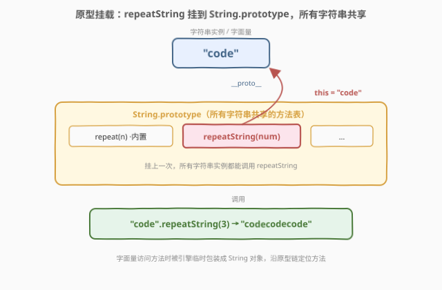
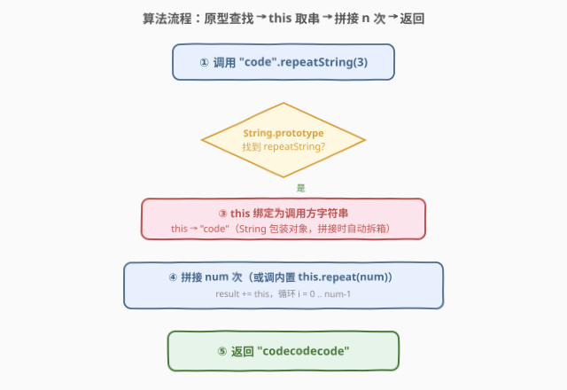
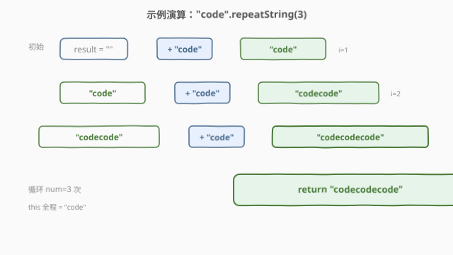

# LeetCode 重复字符串 题解

## 1. 题目概述

- **标题 / 题号**：重复字符串（#2796，easy）
- **链接**：https://leetcode.cn/problems/repeat-string/
- **难度**：简单
- **标签**：JavaScript、原型链、String.prototype、this 绑定、字符串拼接

> ⚠️ 本题为 LeetCode 付费题，题意描述根据官方示例用例与「30 天 JavaScript」系列语境重建，可能与官方题面有出入。

**题意**：请编写代码，为**所有字符串**增加一个方法 `repeatString(num)`，调用时返回将该字符串重复 `num` 次后的结果。即把方法挂到字符串原型上，使得任意字符串字面量都能写成 `"str".repeatString(num)` 的形式。

**示例 1**：

```text
输入：str = "hello", num = 2
输出："hellohello"
解释："hello".repeatString(2) 返回 "hellohello"。
```

**示例 2**：

```text
输入：str = "code", num = 3
输出："codecodecode"
解释："code".repeatString(3) 返回 "codecodecode"。
```

**示例 3**：

```text
输入：str = "js", num = 1
输出："js"
解释："js".repeatString(1) 返回 "js"。
```

**约束**：

- `1 <= str.length <= 100`
- `1 <= num <= 100`

> 💡 本题是 LeetCode「30 天 JavaScript」系列题目，考查的不是算法复杂度，而是 **JS 原型链与 `this` 绑定**的语言机制：如何给一个内置类型「打补丁」挂上自定义方法，并在方法内通过 `this` 拿到调用方字符串。下文以 JS 为提交语言，并给出 Python / C++ 概念等价实现。

## 2. 解题思路

### 2.1 暴力思路：独立函数 + 显式传串

最直觉的写法是定义一个独立函数，把字符串和次数都当参数传进去：

```javascript
function repeatString(str, num) {
    let res = "";
    for (let i = 0; i < num; i++) res += str;
    return res;
}
// 调用：repeatString("hello", 2)
```

这能算出正确结果，但**形不对**——题目要求调用形式是 `"hello".repeatString(2)`，即方法直接挂在字符串实例上调用。独立函数要求调用方先取出字符串再显式传入，与「字符串自带该方法」的语义割裂。要让任意字符串字面量都能 `.repeatString()`，必须走**原型挂载**这条路。

### 2.2 核心观察：String.prototype 挂载 + this 绑定



JS 中每个字符串字面量（`"code"`、`'hi'`）在调用方法时，会被临时包装成一个 `String` 对象，并通过**原型链** `__proto__` 找到 `String.prototype` 上的方法。因此只要把 `repeatString` 赋值给 `String.prototype.repeatString`，**全宇宙所有字符串**就立刻共享了这个方法——挂一次，处处可用。

挂上之后，调用 `"code".repeatString(3)` 时，方法体内的 `this` 会被绑定到**调用方字符串**（一个 String 包装对象），用 `this` 即可取到待重复的串：

| 步 | 动作 | 说明 |
|----|------|------|
| 挂载 | `String.prototype.repeatString = function(num){…}` | 给原型打补丁，所有字符串实例共享 |
| 调用 | `"code".repeatString(3)` | 字面量临时包装成 String 对象，沿原型链找到 `repeatString` |
| 取串 | 方法体内 `this` | `this` 绑定为调用方字符串 `"code"`，无需显式传参 |
| 重复 | `this.repeat(num)` 或手动拼接 | 利用内置 `repeat` 或循环累加 |

> 💡 **为什么字符串字面量能调用方法？** `"code"` 本身是**原始值**（primitive），并没有方法。但 JS 规定：在原始值上访问属性/方法时，引擎会临时把它**包装**成对应的对象（`new String("code")`），用完即弃。这就是为什么 `typeof "code" === "string"` 却能调用 `String.prototype` 上的方法——包装是隐式且瞬时的。

> ⚠️ **`this` 是包装对象，不是原始字符串**。方法内 `this` 是 String 包装对象（`Object`），用 `this.valueOf()` 或字符串拼接时会自动拆箱为原始字符串。本题直接 `result += this` 或调 `this.repeat()` 都能正确工作，但要知道 `this` 与字面量原始值有这一层包装差异。

### 2.3 算法流程图



整体只有一条直线：调用 → 沿原型链定位方法 → `this` 取串 → 拼接 `num` 份 → 返回。没有分支，没有回溯，没有状态机。

### 2.4 示例演算



以**示例 2**（`"code".repeatString(3)`）为例，采用「循环累加」写法逐步推演：

| 步 | result 当前值 | 动作 | 说明 |
|----|----------------|------|------|
| ① 初始 | `""` | 进入方法 | `this` 绑定为 `"code"`，`num=3` |
| ② i=1 | `""` + `"code"` = `"code"` | `result += this` | 拼上一份 `this` |
| ③ i=2 | `"code"` + `"code"` = `"codecode"` | `result += this` | 再拼一份 |
| ④ i=3 | `"codecode"` + `"code"` = `"codecodecode"` | `result += this` | 循环结束（i 到 num） |
| ⑤ 返回 | `"codecodecode"` | `return result` | 与示例一致 |

输出 `"codecodecode"`，与示例一致。

## 3. 参考代码

### JavaScript / TypeScript（提交语言）

**写法一：挂到原型 + 手动循环累加**（凸显机制本身）：

```javascript
/**
 * @param {number} num
 * @return {string}
 */
String.prototype.repeatString = function(num) {
    let result = "";
    for (let i = 0; i < num; i++) {
        result += this;          // this 是调用方字符串（包装对象，拼接时自动拆箱）
    }
    return result;
};

/**
 * "hello".repeatString(2);   // "hellohello"
 * "code".repeatString(3);    // "codecodecode"
 */
```

**写法二：直接复用内置 `String.prototype.repeat`**（最简洁）：

```javascript
String.prototype.repeatString = function(num) {
    return this.repeat(num);
};
```

> 💡 **一行解法**。其实 ES6 早已给 `String.prototype` 提供了内置的 `repeat(n)` 方法，本题只是让你以另一个名字 `repeatString` 再挂一次壳。真正的考点不在「怎么拼字符串」，而在「你会不会用 `String.prototype.x = function(){…}` 给原型打补丁、并用 `this` 取到调用方」。

**写法三：递归版**（体现分治思想，仅作思路对照）：

```javascript
String.prototype.repeatString = function(num) {
    if (num <= 0) return "";
    return this + this.repeatString(num - 1);
};
```

> ⚠️ 递归版在 `num` 较大时会有调用栈开销与重复拼接（$O(n^2 \cdot m)$ 字符拷贝），本题 $num \le 100$ 无影响，工程上仍以循环/内置 `repeat` 为准。

TypeScript 版：

```typescript
declare global {
    interface String {
        repeatString(num: number): string;
    }
}

String.prototype.repeatString = function (num: number): string {
    return this.repeat(num);
};

export {};
```

> ⚠️ **TS 需要做接口声明合并**（declaration merging）。`String` 是内置接口，直接给它加方法 TS 会报「类型上不存在该属性」，必须用 `declare global { interface String { … } }` 扩展全局 `String` 接口，编译器才认这个新方法。

### Python（概念等价）

> 本题 LeetCode 仅开放 JS / TS，Python 版作概念对照。Python **不允许给内置 `str` 类型打补丁**（`str` 是用 C 实现的内置类型，无法动态加方法），也没有原型链机制；字符串重复直接用 `*` 运算符，语义等价于 `s * n`。

```python
class Solution:
    def repeatString(self, s: str, num: int) -> str:
        return s * num
```

> 💡 Python 的 `s * n` 与 JS 的 `s.repeat(n)` 在语义上一致：`"code" * 3` 直接得到 `"codecodecode"`。区别在于 Python 是运算符重载（`str.__mul__`），JS 是原型方法；Python 无法「给所有字符串挂一个自定义方法名」。

### C++（概念等价）

> C++ 没有运行期原型机制，`std::string` 也不能动态加方法。等价手段是写一个普通函数，循环 `+=` 拼接，并提前 `reserve` 避免多次扩容。

```cpp
#include <string>
class Solution {
public:
    std::string repeatString(std::string s, int num) {
        std::string res;
        res.reserve(s.size() * num);
        for (int i = 0; i < num; ++i) res += s;
        return res;
    }
};
```

> ⚠️ `reserve` 是关键优化：不加时每次 `+=` 可能触发整体拷贝与扩容，总复杂度退化到 $O(n \cdot m^2)$（$m$ 为串长）；预分配后只剩一次拷贝，$O(n \cdot m)$。JS / Python 的字符串拼接底层（rope / 指数扩容）已隐式处理，但 C++ 需要显式 `reserve`。

## 4. 复杂度分析

| 维度 | 复杂度 | 说明 |
|------|--------|------|
| 时间复杂度 | $O(n \cdot m)$ | 重复 `num`（$n$）次、每次拷贝长 $m$ 的串，共生成 $n \cdot m$ 个字符 |
| 空间复杂度 | $O(n \cdot m)$ | 输出串本身长 $n \cdot m$；若不计输出，循环版仅 $O(1)$ 额外（JS 引擎对 `+=` 有 builder 优化） |

> 💡 本题 $n, m \le 100$，最坏 $10^4$ 个字符，开销可忽略。递归版空间额外带 $O(n)$ 调用栈，$n=100$ 安全，但工程上不推荐。

## 5. 扩展：原型污染与 `this` 拆箱

**为什么不推荐随意给 `String.prototype` 打补丁？** 把自定义方法直接挂到内置原型上，会让**所有**字符串都多出一个方法——这叫**原型扩展**，在库代码中是禁忌：

1. **命名冲突**：若多个库都挂了同名方法（如 `repeatString`），后挂的覆盖先挂的，难以排查。
2. **可枚举性**：用 `for...in` 遍历对象时，某些旧环境里原型方法可能被枚举出来（手写 `String.prototype.x = …` 默认 `enumerable` 行为不一）。
3. **可维护性**：团队中「字符串凭空多出方法」会让人困惑其来源。

更安全的做法是用**独立工具函数**或 `Object.defineProperty` 显式设 `enumerable: false`：

```javascript
Object.defineProperty(String.prototype, 'repeatString', {
    value: function (num) { return this.repeat(num); },
    enumerable: false,        // 不出现在 for...in
    writable: true,
    configurable: true,
});
```

**`this` 的拆箱。** 在严格模式下，`"code".repeatString(3)` 调用时 `this` 是 String 包装对象（`Object`），不是原始字符串。直接参与字符串拼接（`result += this`）会触发**拆箱**（`ToPrimitive`）转回原始值 `"code"`，所以拼接正确。但若想在方法里调用 `this` 的**字符串原始方法**，多数情况也能用（包装对象本身继承自 `String.prototype`），只是 `typeof this === "object"`，需留意。

> 💡 **一句话区分原始值与包装对象**：`typeof "code" === "string"`（原始值），`typeof new String("code") === "object"`（包装对象）。`.repeat()` 等方法之所以能在原始值上调用，全靠引擎「临时包装 → 调用 → 丢弃」这一隐式过程。本题正是这一机制的直接体现。

## 6. 面试要点

1. **为什么把方法挂到 `String.prototype` 上，所有字符串就能调用？**

   > 因为 JS 字符串字面量在访问属性/方法时，会被引擎临时包装成 `String` 对象，并沿原型链 `__proto__` 查找方法。`String.prototype` 是所有字符串实例共享的方法表，给它加一个方法，所有字符串实例（含字面量）就立刻拥有该方法——挂一次，处处可用。

2. **方法体内的 `this` 是什么？和字面量原始值有何区别？**

   > `this` 是调用方字符串对应的 **String 包装对象**（严格模式下也是），`typeof this === "object"`。而字面量 `"code"` 是原始值，`typeof === "string"`。参与字符串拼接时包装对象会自动拆箱为原始值，所以 `result += this` 正确；但要知道二者有这层包装差异。

3. **`"code".repeatString(3)` 中，引擎做了哪些隐式步骤？**

   > (1) 把原始值 `"code"` 临时包装成 `String` 对象；(2) 沿 `__proto__` 在 `String.prototype` 上找到 `repeatString`；(3) 以该包装对象为 `this` 调用方法；(4) 方法返回（拼接时自动拆箱）；(5) 丢弃包装对象。整个过程对调用方透明。

4. **能否用一行实现？为什么不直接 `return this`？**

   > 一行版：`String.prototype.repeatString = function(n){ return this.repeat(n); }`，直接复用 ES6 内置 `repeat`。不能 `return this`——`this` 是单份字符串，返回它只是返回原串本身，没有重复。重复要么调 `this.repeat(n)`，要么循环 `+=` 拼接。

5. **给内置原型加方法有哪些工程风险？**

   > 三点：(1) **命名冲突**——多库同名方法互相覆盖；(2) **可枚举性**——可能污染 `for...in` 遍历；(3) **可维护性**——字符串凭空多出方法，来源不明。生产代码应优先用独立工具函数，必须扩展时用 `Object.defineProperty` 并显式设 `enumerable: false`。

> 💡 **一句话总结**：2796 = 「`String.prototype.repeatString = function(num){…}` 给原型打补丁 + 方法内 `this` 取调用方串 + 拼接/复用 `repeat`」。一行 `return this.repeat(num)` 搞定，$O(nm)$ 时间。考点不在算法，而在你是否懂 **JS 原型链挂载**与 **`this` 绑定**——这正是「字符串字面量能调方法」背后的隐式包装机制。

## 同类练习题

| # | 题目 | 与本题的关联 |
|---|------|-------------|
| 2693 | [使用自定义上下文调用函数](https://leetcode.cn/problems/call-function-with-custom-context/) | 30 天 JS 系列题，考查 `this` 绑定与 `call/apply/bind`，与本题原型方法内 `this` 用法一脉相承（[站内题解](../2601-2700/2693_使用自定义上下文调用函数.md)） |
| 2703 | [返回传递的参数的长度](https://leetcode.cn/problems/return-length-of-arguments-passed/) | 30 天 JS 系列同档题，考查剩余参数 `...args`，与本题同属「JS 语言机制」考查风格（[站内题解](../2701-2800/2703_返回传递的参数的长度.md)） |
| 2634 | [过滤数组中的元素](https://leetcode.cn/problems/filter-elements-from-array/) | 30 天 JS 系列题，手写数组高阶方法，与本题「手写字符串方法」形成数组↔字符串方法对照（[站内题解](../2601-2700/2634_过滤数组中的元素.md)） |
| 2629 | [复合函数](https://leetcode.cn/problems/function-composition/) | 30 天 JS 系列题，考查高阶函数，与本题同属 JS 函数式基础（[站内题解](../2601-2700/2629_复合函数.md)） |
| 2794 | [从两个数组创建对象](https://leetcode.cn/problems/create-object-from-two-arrays/) | 30 天 JS 系列同档题，同为 2790 档，考查对象构造与迭代器，与本题共享 JS 专题语境 |
