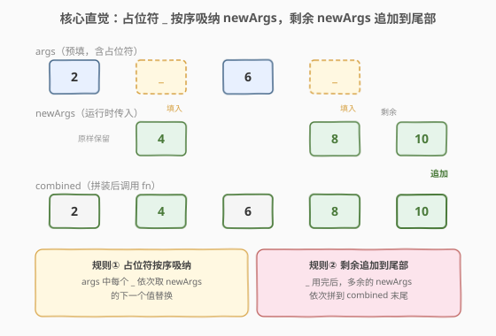
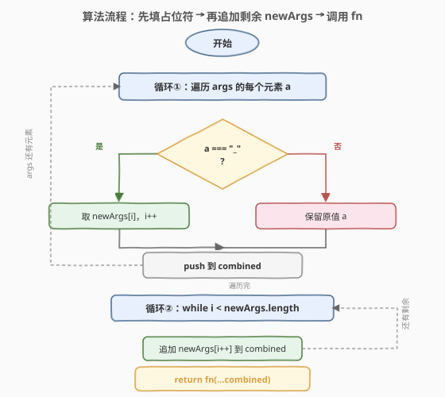
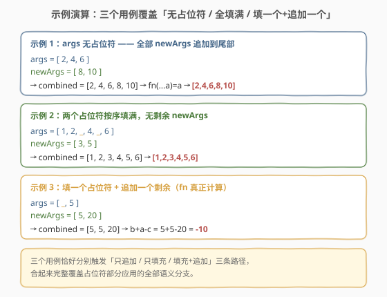

# 带有占位符的部分函数

- **题目名称**：带有占位符的部分函数
- **链接**：[2797. Partial Function with Placeholders](https://leetcode.cn/problems/partial-function-with-placeholders/)
- **难度**：简单
- **标签**：函数式编程、高阶函数、闭包、部分应用

## 1. 题目概述

> ⚠️ 本题为 LeetCode 付费题（`isPaidOnly`），官方题面需 Premium 才能查看。以下题意描述根据官方示例用例（`jsonExampleTestcases`）与「部分应用 + 占位符」的通用语义重建，可能与官方题面措辞有出入，但核心语义与三个示例完全一致。

请你实现一个函数 `partial(fn, args)`，它对 `fn` 做**部分应用（partial application）**：预先固定一部分参数 `args`，返回一个新函数。`args` 中可以包含一个特殊**占位符** `"_"`，表示「这个位置暂时留空，等调用时再填」。

返回的新函数被调用时接收任意参数 `...newArgs`，它应：

1. **按序填占位符**：从左到右遍历 `args`，每遇到一个 `"_"`，就用 `newArgs` 中**尚未用到的下一个值**替换它；`args` 中非占位符的值原样保留。
2. **追加剩余参数**：如果 `newArgs` 在填完所有占位符后还有剩余，把这些剩余值依次**追加到参数列表末尾**。
3. 用拼装好的参数列表调用 `fn(...combined)`，返回其结果。

> 💡 这正是 lodash `_.partial` 的占位符语义：`_.partial(fn, a, _, c)(b)` → `fn(a, b, c)`；多传的参数会追加到尾部。本题把占位符显式表示为字符串 `"_"`。

**示例 1**：

```text
输入：fn = (...args) => args
      args    = [2, 4, 6]
      newArgs = [8, 10]
输出：[2, 4, 6, 8, 10]
解释：args 中没有占位符，newArgs 全部作为「剩余」追加到尾部，于是 fn 被以 (2,4,6,8,10) 调用，原样返回。
```

**示例 2**：

```text
输入：fn = (...args) => args
      args    = [1, 2, "_", 4, "_", 6]
      newArgs = [3, 5]
输出：[1, 2, 3, 4, 5, 6]
解释：两个占位符分别被 3 和 5 按序填入，newArgs 恰好用完无剩余。
```

**示例 3**：

```text
输入：fn = (a, b, c) => b + a - c
      args    = ["_", 5]
      newArgs = [5, 20]
输出：-10
解释：占位符被 5 填入得 [5, 5]，剩余的 20 追加得 [5, 5, 20]，于是 a=5, b=5, c=20，b + a - c = 5 + 5 - 20 = -10。
```

**约束条件**：

- `fn` 是一个合法的 JavaScript 函数
- `args` 是一个数组，元素可为任意值，其中 `"_"` 表示占位符
- `newArgs` 是调用返回函数时传入的参数数组
- 本题仅开放 JavaScript / TypeScript 提交

> 💡 本题是 LeetCode「30 天 JavaScript」系列的高阶函数题，考的是**部分应用 + 占位符语义**——这是函数式编程里柯里化（curry）的「近亲」，区别在于部分应用一次固定**多个**参数，而柯里化一次只固定**一个**。下文以 JS 为提交语言，并给出 Python 的等价实现。

---

## 2. 解题思路

### 2.1 暴力思路：硬编码两阶段、用下标计数

最直白的写法是分两遍扫描：第一遍遍历 `args`，遇到 `"_"` 就从 `newArgs` 里取下一个、用一个游标 `i` 计数；第二遍把 `newArgs` 没用完的剩余部分拼到尾部。逻辑没错，但容易在「游标 `i` 是否越界」「剩余部分从哪里开始」上出错——尤其当占位符个数大于 `newArgs` 长度时，`newArgs[i]` 会取到 `undefined`。

### 2.2 核心观察：单次遍历 + 游标同步



把 `args` 和 `newArgs` 看作两条**按游标 `i` 同步推进**的流水线：

- 遍历 `args` 的每个元素 `a`：
  - 若 `a === "_"`：这是占位符，从 `newArgs` 取第 `i` 个值填入，`i++`
  - 否则：原样保留 `a`
- 遍历完 `args` 后，若 `i < newArgs.length`，说明 `newArgs` 还有剩余——把它们依次追加到结果末尾

**两要素拆解**：

| 要素 | 作用 | 本题体现 |
|------|------|----------|
| **部分应用** | 预固定部分参数，返回新函数 | `partial(fn, args)` 闭包捕获 `fn` 和 `args`，返回一个待调用函数 |
| **占位符** | 标记「留空待填」的位置 | `"_"` 在 `args` 中占位，调用时按序用 `newArgs` 填补 |
| **剩余追加** | 多传的参数不丢弃 | 填完占位符后，`newArgs` 剩余值拼到参数列表末尾 |

> 💡 **为什么剩余要追加而非忽略？** 看示例 1：`args=[2,4,6]` 无占位符，若忽略剩余 `newArgs=[8,10]`，结果会变成 `[2,4,6]`，那传入的 `[8,10]` 就成了无用数据。示例 3 更直接证明这一点：占位符填一个、剩一个追加，少追加那一个 `20`，`c` 就成了 `undefined`，`b+a-c` 变成 `NaN`。所以「剩余追加」是题意必须的语义，而非可选优化。

> ⚠️ **占位符是字符串 `"_"`**：本题用字符串字面量 `"_"` 当占位符，所以判定用 `a === "_"`（严格相等）。工程库里（如 lodash）通常用 `_.placeholder`（一个唯一对象）当占位符，避免和「恰好就是字符串 `"_"`」的真实参数冲突——本题为教学简化，直接用字符串。

### 2.3 算法流程图



流程分两个阶段，**每个阶段一个循环**：

- **循环①（填占位符）**：遍历 `args`，遇 `"_"` 取 `newArgs[i]` 并 `i++`，否则保留原值，结果 push 到 `combined`
- **循环②（追加剩余）**：`while i < newArgs.length`，把 `newArgs[i++]` 依次 push 到 `combined`
- 最后 `return fn(...combined)`

两个循环共用同一个游标 `i`——这是关键：循环①消耗了多少个 `newArgs`，循环②就从那里**接续**往后追加，不会重复也不会跳号。

### 2.4 示例演算



三个示例恰好分别触发三条路径：

| 示例 | args | newArgs | 填充后 | 追加后(combined) | 结果 |
|------|------|---------|--------|------------------|------|
| 1 | `[2,4,6]` | `[8,10]` | `[2,4,6]`（无占位符） | `[2,4,6,8,10]` | `[2,4,6,8,10]` |
| 2 | `[1,2,"_",4,"_",6]` | `[3,5]` | `[1,2,3,4,5,6]` | `[1,2,3,4,5,6]`（无剩余） | `[1,2,3,4,5,6]` |
| 3 | `["_",5]` | `[5,20]` | `[5,5]` | `[5,5,20]` | `b+a-c=-10` |

- 示例 1 → 只走循环②（追加）
- 示例 2 → 只走循环①（填充），循环②不进入
- 示例 3 → 循环① + 循环②都走

三条路径合起来**完整覆盖**占位符部分应用的全部语义分支，这也是判题器把它们作为公开示例的原因。

---

## 3. 参考代码

### JavaScript（提交语言：闭包 + 单次遍历游标）

```javascript
/**
 * @param {Function} fn
 * @param {Array} args   可能含占位符 "_"
 * @return {Function}
 */
var partial = function (fn, args) {
    return function (...newArgs) {
        let i = 0;
        // 循环①：填占位符，非占位符原样保留
        const combined = args.map((a) => (a === "_" ? newArgs[i++] : a));
        // 循环②：剩余 newArgs 追加到尾部
        for (; i < newArgs.length; i++) combined.push(newArgs[i]);
        return fn(...combined);
    };
};
```

> 💡 `fn` 和 `args` 被 `partial` 的内层函数**闭包捕获**——返回的函数即使脱离 `partial` 的作用域，仍能访问这两份私有数据。这与 2704 `expect(val)` 捕获 `val`、2620 计数器捕获 `n` 是同一套闭包封装范式。

**箭头函数简写**：

```javascript
var partial = (fn, args) => (...newArgs) => {
    let i = 0;
    const combined = args.map((a) => (a === "_" ? newArgs[i++] : a));
    while (i < newArgs.length) combined.push(newArgs[i++]);
    return fn(...combined);
};
```

> ⚠️ 箭头函数版里 `map` 的回调 `a => a === "_" ? newArgs[i++] : a` 依赖**副作用**（`i++`）来推进游标。`Array.prototype.map` 按索引顺序同步执行，副作用是安全的；但若改用 `filter` / 异步遍历则顺序无保证，游标会乱——这种写法仅适合同步顺序遍历。

### Python（概念等价）

> 本题 LeetCode 仅开放 JS/TS，Python 版作概念对照。Python 没有内建占位符部分应用，但用闭包 + 游标可等价实现。

```python
def partial(fn, args):
    """部分应用：args 中 "_" 为占位符，调用时按序用 new_args 填充，剩余追加到尾部。"""
    def g(*new_args):
        i = 0
        combined = []
        # 循环①：填占位符
        for a in args:
            if a == "_":
                combined.append(new_args[i])
                i += 1
            else:
                combined.append(a)
        # 循环②：剩余 new_args 追加
        combined.extend(new_args[i:])
        return fn(*combined)
    return g
```

> 💡 Python 版用 `combined.extend(new_args[i:])` 一次性追加剩余切片，比 JS 的 `while` 循环更地道。`new_args[i:]` 在 `i` 越界时返回空切片，天然安全，无需额外边界判断。Python 闭包对 `args` / `fn` 的捕获与 JS 完全一致（只读引用，无需 `nonlocal`，因为未重新赋值）。

---

## 4. 复杂度分析

| 维度 | 复杂度 | 说明 |
|------|--------|------|
| **时间** | $O(n + m)$ | `n = args.length`、`m = newArgs.length`；遍历 `args` 一遍（$O(n)$）+ 追加剩余 newArgs 一遍（$O(m)$），线性 |
| **空间** | $O(n + m)$ | 拼装出的 `combined` 数组长度等于「填充后长度 + 追加长度」，最坏 $n + m$ |

> 💡 本题没有「数据规模」可言，复杂度由输入数组长度线性决定。考点在**游标同步**与**闭包封装**而非性能优化——只要不写成两层嵌套循环（对每个占位符都从头扫 newArgs，退化到 $O(nm)$）即可。

---

## 5. 扩展：部分应用 vs 柯里化 vs 函数组合

### 5.1 部分应用与柯里化的区别

两者都是「预先固定一部分参数」的函数变换，但粒度不同：

| 变换 | 一次固定 | 形态 | 本题 |
|------|----------|------|------|
| **部分应用 (partial)** | 任意多个参数 | `partial(f, a, _)(b)` → `f(a, b)` | ✅ 本题 |
| **柯里化 (curry)** | 一次一个参数 | `curry(f)(a)(b)` → `f(a, b)` | 2632 柯里化 |

```javascript
// 部分应用（本题）：一次固定多个，用占位符留空
const addThen = partial((a, b, c) => a + b + c, ["_", 2]);
addThen(1, 3); // [1, 2, 3] → 6

// 柯里化（2632）：一次固定一个，逐层返回单参函数
const curriedAdd = curry((a, b, c) => a + b + c);
curriedAdd(1)(2)(3); // 6
curriedAdd(1)(2, 3); // 6（支持「一次性传完剩余」的柯里化变体）
```

> 💡 口诀：**部分应用 = 一次钉一串（用占位符留洞），柯里化 = 一串钉一个（逐层单参）**。两者可相互模拟：柯里化是部分应用每次只钉一个的特例，部分应用可用柯里化 + 占位符实现。

### 5.2 lodash 的 _.partial 与占位符

本题是 lodash `_.partial` 的最小化教学版。lodash 用 `_.placeholder`（一个唯一对象）而非字符串 `"_"`，避免和真实参数值冲突：

```javascript
const _ = _.placeholder;          // lodash 的占位符是一个唯一对象，不是字符串
const fn = (a, b, c) => [a, b, c];
const g = _.partial(fn, 1, _, 3); // 固定 a=1, c=3，b 留空
g(2);                             // [1, 2, 3]
g(2, 4, 5);                       // [1, 2, 3, 4, 5]（多传的 4,5 追加到尾部，与本题语义一致）
```

> ⚠️ **字符串占位符的陷阱**：本题用 `"_"` 当占位符，意味着你**无法把字符串 `"_"` 作为真实参数**传递——它会被当成占位符填掉。工程库里用唯一对象当占位符正是为规避此问题。这是教学题的简化，生产代码别照抄。

### 5.3 与函数组合（2629）的配合

部分应用常和**函数组合**（compose）连用，构建数据管道：

```javascript
// 2629 的 compose：右到左执行
const pipeline = compose(
    partial((x, y) => x + y, [10]),   // 加 10
    partial((x, y) => x * y, [2]),    // 乘 2
);
pipeline(5); // (5 * 2) + 10 = 20
```

部分应用把多参函数「降阶」成单参函数，使其能塞进 `compose` 的单参管道——这是函数式编程里「用 partial 适配 curry/compose 接口」的常见技巧。

---

## 6. 面试要点

1. **什么是部分应用？它和柯里化有什么区别？**

   > 部分应用是预先固定一个函数的**部分参数**，返回一个接受剩余参数的新函数。与柯里化的区别在于「一次固定几个」：部分应用一次可固定任意多个参数（用占位符标记留空位置），柯里化每次只固定一个、逐层返回单参函数。本题 `partial(fn, args)` 一次固定 `args`（含占位符），是典型的部分应用。

2. **占位符 `"_` 在本题中起什么作用？为什么需要它？**

   > 占位符标记「这个参数位置暂时留空，等调用时再填」。没有占位符，部分应用只能固定**前缀**参数（`partial(f, a, b)` 固定前两个）；有了占位符，可以固定**任意位置**的参数（`partial(f, a, _, c)` 固定第 1、3 个，第 2 个留空），灵活性大增。本题示例 3 的 `args=["_", 5]` 正是固定第 2 个参数、第 1 个留空。

3. **剩余的 `newArgs` 为什么要追加到尾部而不是丢弃？**

   > 因为部分应用的语义是「填空 + 把多传的参数也用上」。丢弃剩余会丢失调用方明确传入的参数——示例 3 中若丢弃剩余的 `20`，`c` 变成 `undefined`，结果为 `NaN`。lodash `_.partial` 同样追加剩余参数到尾部，这是事实标准语义。

4. **游标 `i` 在两个循环间如何同步？为什么不会重复或跳号？**

   > 两个循环共用同一个游标 `i`：循环①每填一个占位符就 `i++`，消耗 `newArgs` 的前若干个；循环②从**当前 `i`** 接续往后追加，`while i < newArgs.length`。因为 `i` 只增不减且两循环串行执行，`newArgs` 的每个元素恰被消费一次——循环①消费前缀，循环②消费后缀，无重复无跳号。

5. **如果占位符个数多于 `newArgs` 长度会怎样？**

   > 循环①中 `newArgs[i]` 会取到 `undefined`（`i` 越界），占位符被填成 `undefined`，循环②不进入（`i` 已等于 `newArgs.length`）。`fn` 会收到含 `undefined` 的参数。本题约束保证 `newArgs` 足够填满占位符（或设计上允许 `undefined`），实际工程中应对此做参数校验。

> 💡 **一句话总结**：2797 = 「闭包捕获 `fn`+`args`，返回函数按序用 `newArgs` 填占位符 `_`，剩余追加到尾部，再调用 `fn`」。本质是 lodash `_.partial` 占位符语义的最小化实现。

---

## 7. 同类练习题

- [2632. 柯里化](https://leetcode.cn/problems/curry/)：部分应用的「逐层单参」特例，每次只固定一个参数，对照本题「一次固定多个 + 占位符留空」的粒度差异
- [2629. 复合函数](https://leetcode.cn/problems/function-composition/)：高阶函数家族另一成员，把多个单参函数串成管道，常与部分应用配合做参数适配
- [2623. 记忆函数](https://leetcode.cn/problems/memoize/)：同为「返回新函数」的高阶函数，捕获的私有状态从「参数」变为「缓存表」，对照闭包封装的不同用法
- [2666. 只允许一次函数调用](https://leetcode.cn/problems/allow-one-function-call/)：闭包封装可变私有状态（布尔开关），对照本题的只读捕获，同属 JS 30 天系列
- [2620. 计数器](https://leetcode.cn/problems/counter/)：闭包捕获可变计数 `n` 的入门题，承接本题闭包捕获 `fn`/`args` 的只读范式
