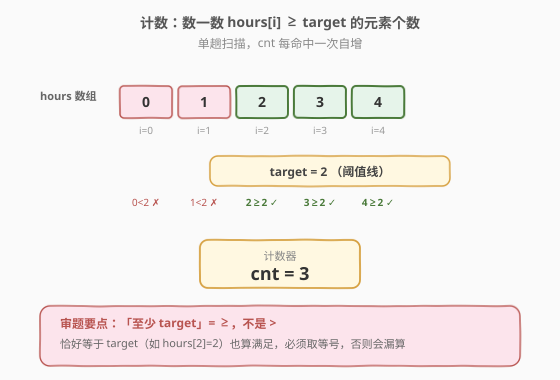
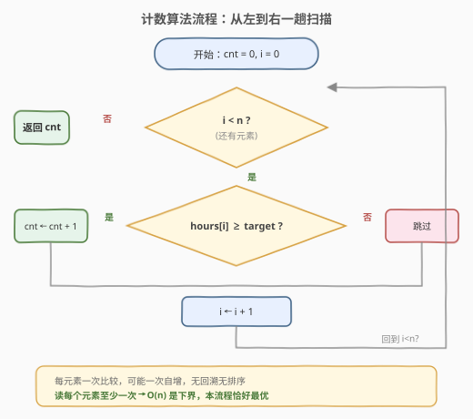

# LeetCode 满足目标工作时长的员工数目 题解

## 1. 题目概述

- **标题 / 题号**：满足目标工作时长的员工数目（#2798，easy）
- **链接**：https://leetcode.cn/problems/number-of-employees-who-met-the-target/
- **难度**：简单
- **标签**：数组

**题意**：公司里共有 $n$ 名员工，按 $0$ 到 $n-1$ 编号。每位员工 $i$ 已工作 $\text{hours}[i]$ 小时。公司要求每人工作**至少** $\text{target}$ 小时。给定下标从 $0$ 开始、长度为 $n$ 的非负整数数组 $\text{hours}$ 和非负整数 $\text{target}$，返回工作时长**不少于** $\text{target}$ 小时的员工数。

> 💡 一句话理解：在数组里数一数有多少个元素 $\ge \text{target}$，答案就是它。

**示例 1**：

```text
输入：hours = [0,1,2,3,4], target = 2
输出：3
解释：要求每人至少工作 2 小时。
- 员工 0 工作 0 小时，不满足。
- 员工 1 工作 1 小时，不满足。
- 员工 2 工作 2 小时，满足。
- 员工 3 工作 3 小时，满足。
- 员工 4 工作 4 小时，满足。
共 3 位满足要求。
```

**示例 2**：

```text
输入：hours = [5,1,4,2,2], target = 6
输出：0
解释：要求每人至少工作 6 小时，无人满足。
```

**约束**：

- $1 \le n = \text{hours.length} \le 50$
- $0 \le \text{hours}[i], \text{target} \le 10^5$

## 2. 解题思路

### 2.1 直接思路

题目要求统计「$\text{hours}[i] \ge \text{target}$」的个数，最自然也最优的做法就是**从左到右扫一遍数组**，用一个计数器 $\text{cnt}$ 累加满足条件的元素：

```text
cnt = 0
对每个 h in hours:
    if h >= target: cnt += 1
返回 cnt
```

这是单趟线性扫描，每个元素访问一次、做一次比较与一次自增，无需排序、无需额外结构。对于 $n \le 50$ 的约束，这已远比所需快得多。

### 2.2 核心观察：单趟扫描即最优，$O(n)$ 是下界



本题看似简单，但可以追问一个更深刻的问题：**能否比 $O(n)$ 更快？** 答案是否定的，理由是**信息论下界**——

> ⚠️ 在数组**无序**的前提下，任何正确算法都必须**至少读取每一个元素一次**。否则若算法跳过了下标 $i$，对手（adversary）可以把 $\text{hours}[i]$ 在两种输入间切换：一种取 $0$（不满足）、一种取 $10^5$（满足），而这两种输入对算法已读到的所有位置完全相同，算法无法区分，必然在某一组上答错。

因此 $O(n)$ 是不可逾越的下界，单趟扫描**恰好最优**。本题的"技巧"不在算法本身，而在于把**自然语言翻译成精确的判定条件**——注意是「**至少** target」即「$\ge$」而非「$>$」。

**为什么不用排序 + 二分？** 因为只问一次。排序需 $O(n \log n)$ 预处理，比直接 $O(n)$ 扫一遍还慢，得不偿失。只有当 $\text{target}$ 会变很多次（批量查询）时排序才划算——见第 5 节扩展。

### 2.3 算法流程图



只需一趟从左到右的线性扫描，每元素一次比较、可能一次自增，无回溯、无排序。

### 2.4 示例演算

![示例演算：[0,1,2,3,4], target=2 → 3](../images/p2798_example_walkthrough.svg)

以 `hours = [0,1,2,3,4], target = 2` 为例，$\text{cnt}$ 从 $0$ 起逐个累加：

| 步 $i$ | $\text{hours}[i]$ | $\ge 2$ ? | $\text{cnt}$ |
|--------|-------------------|-----------|--------------|
| 0 | 0 | ✗ | 0 |
| 1 | 1 | ✗ | 0 |
| 2 | 2 | ✓ | 1 |
| 3 | 3 | ✓ | 2 |
| 4 | 4 | ✓ | 3 |

最终 $\text{cnt} = 3$，与示例 1 一致。示例 2 中数组最大值才 $5 < 6$，$\text{cnt}$ 全程为 $0$。

## 3. 参考代码

### C++

```cpp
class Solution {
public:
    int numberOfEmployeesWhoMetTarget(vector<int>& hours, int target) {
        int cnt = 0;
        for (int h : hours)
            if (h >= target) ++cnt;
        return cnt;
    }
};
```

### Python

```python
class Solution:
    def numberOfEmployeesWhoMetTarget(self, hours: List[int], target: int) -> int:
        return sum(h >= target for h in hours)
```

> 💡 Python 利用 `sum` 对布尔生成器求和：`True` 当 $1$、`False` 当 $0$，一行写出计数；C++ 版用显式循环更直观，等价写法还有 `count_if`：`return count_if(hours.begin(), hours.end(), [&](int h){ return h >= target; });`。

## 4. 复杂度分析

| 维度 | 复杂度 | 说明 |
|------|--------|------|
| 时间复杂度 | $O(n)$ | 单趟扫描，每元素一次比较；且 $O(n)$ 是无序数组的信息论下界，无法更优 |
| 空间复杂度 | $O(1)$ | 仅一个计数器 $\text{cnt}$，原地处理 |

## 5. 扩展：批量查询——排序 + 二分

若 $\text{target}$ 不是问一次，而是会**变很多次**（如 $q$ 次询问不同阈值），单趟扫描每次 $O(n)$ 共 $O(nq)$。这时可以**先排序** $\text{hours}$（$O(n \log n)$），之后每次查询用**二分找首个 $\ge \text{target}$ 的下标**，$[k, n)$ 即满足者：

$$\text{cnt} = n - \text{lower\_bound}(\text{hours}, \text{target})$$

每次查询 $O(\log n)$，总 $O(n \log n + q \log n)$，当 $q \gg \log n$ 时优于反复扫描。这正是 2089「找出数组排序后的目标下标」所考察的「**排序 + 阈值二分**」套路——单次查询用扫描、批量查询用二分，是同一问题的两种规模取舍。

> ⚠️ 注意「**至少 target**」对应 $\ge$，要找的是**第一个 $\ge \text{target}$ 的位置**，即 C++ `lower_bound`（不是 `upper_bound`）。`upper_bound` 找的是第一个 $> \text{target}$ 的位置，两者差一，用错会漏掉恰好等于 $\text{target}$ 的元素。

## 6. 面试要点

1. **判定条件是 $\ge$ 还是 $>$？**

   - 「**至少** target 小时」=「不少于 target」$=$ `hours[i] >= target`。题面用「至少」就要取等号，这是本题最常见的笔误点。

2. **能否比 $O(n)$ 快？为什么？**

   - 不能。无序数组下，任何正确算法都必须读每个元素至少一次（对手论证：跳过某下标，对手把该位置在 $0$ 与 $10^5$ 间切换，算法无法区分）。故 $O(n)$ 是下界，单趟扫描即最优。

3. **单次查询为什么不用排序 + 二分？**

   - 排序预处理 $O(n \log n)$ 已劣于直接扫描的 $O(n)$，且二分 $O(\log n)$ 的收益需多次查询才回本。单次场景排序是负优化。

4. **Python 一行 `sum(h >= target for h in hours)` 是 $O(n)$ 吗？**

   - 是。生成器逐元素求值比较，仍遍历一次，$O(n)$ 时间、$O(1)$ 额外空间。布尔值 `True/False` 在算术运算中作 $1/0$，故可直接 `sum`。

5. **数据范围有坑吗？**

   - $n \le 50$、值 $\le 10^5$，`int` 完全够用，无溢出风险；本题难点不在边界，而在审题——别把 $\ge$ 写成 $>$。

## 同类练习题

| # | 题目 | 与本题的关联 |
|---|------|-------------|
| 1773 | [统计匹配规则的物品数量](https://leetcode.cn/problems/count-items-matching-a-rule/) | 逐项判定是否满足给定规则并计数，与本题「扫一遍 + 条件计数」同构，最直接的同类题 |
| 1295 | [统计位数为偶数的数字](https://leetcode.cn/problems/find-numbers-with-even-number-of-digits/) | 对每个元素判断一个属性成立与否再计数，单趟扫描 + 条件自增的同一模板 |
| 1431 | [拥有最多糖果的孩子](https://leetcode.cn/problems/kids-with-the-greatest-number-of-candies/) | 阈值判定（extraCandies ≥ 当前最大），把「≥ 阈值」转为布尔数组，是本题判定条件的数组化变体 |
| 2089 | [找出数组排序后的目标下标](https://leetcode.cn/problems/find-target-indices-after-sorting-array/) | 排序后统计等于 target 的下标，承接第 5 节「排序 + 阈值二分」的批量查询思路 |
| 2114 | [句子中的最多单词数](https://leetcode.cn/problems/maximum-number-of-words-found-in-sentences/) | 逐元素（句子）计数后取最大，把「单趟条件计数」升级为「计数 + 聚合」，同属扫描计数族 |
