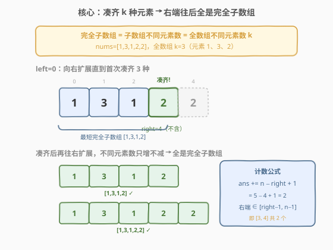
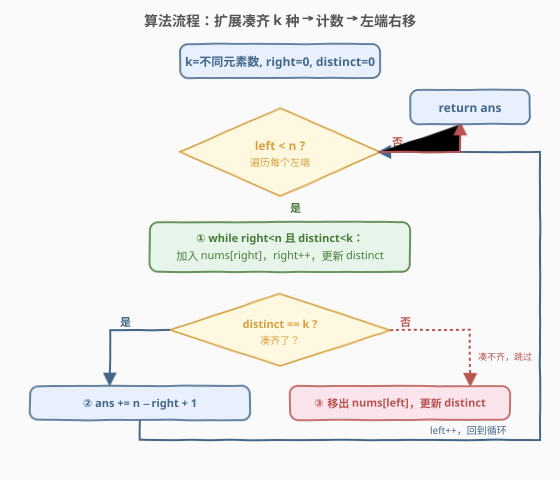

# LeetCode 统计完全子数组的数目 题解

## 1. 题目概述

- **标题 / 题号**：统计完全子数组的数目（#2799，medium）
- **链接**：https://leetcode.cn/problems/count-complete-subarrays-in-an-array/
- **难度**：中等
- **标签**：数组、哈希表、滑动窗口

**题意**：给你一个由**正**整数组成的数组 `nums`。如果数组中的某个子数组满足下述条件，则称之为**完全子数组**：

- 子数组中**不同**元素的数目等于整个数组不同元素的数目。

返回数组中**完全子数组**的数目。子数组是数组中的一个连续非空序列。

**示例 1**：

```text
输入：nums = [1,3,1,2,2]
输出：4
解释：完全子数组有：[1,3,1,2]、[1,3,1,2,2]、[3,1,2] 和 [3,1,2,2]。
```

**示例 2**：

```text
输入：nums = [5,5,5,5]
输出：10
解释：数组仅由整数 5 组成，所以任意子数组都满足完全子数组的条件。子数组的总数为 10。
```

**约束**：

- $1 \le \text{nums.length} \le 1000$
- $1 \le \text{nums}[i] \le 2000$

> 💡 **关键化简**：记全数组不同元素数为 $k$。则「完全子数组」就是「恰好含 $k$ 种不同元素的子数组」。题目本质是**计数恰好 K 种**——这是 [1248. 统计「优美子数组」](../1201-1300/1248_统计优美子数组.md) 的「恰好 K」计数家族，但本题的 $k$ 恰为「全数组不同元素数」（即最大可能值），因此能用更直接的「凑齐即终点」单趟滑窗，无需 atMost 拆解。

## 2. 解题思路

### 2.1 暴力思路：枚举所有子数组

枚举所有连续子数组 $[i, j]$，对每个子数组用哈希集合统计不同元素数，判断是否等于 $k$。共有 $O(n^2)$ 个子数组，每个统计 $O(n)$，总 $O(n^3)$（边扩展边维护频次可降到 $O(n^2)$）。$n = 1000$ 时 $O(n^2)$ 约 $10^6$ 实际能过，但存在 $O(n)$ 的滑窗解法。

> ⚠️ 暴力的浪费在于：没意识到「**完全性对右端单调**」——一旦某个窗口凑齐了 $k$ 种，往右扩展只会保持或增加不同元素数，永远不会变少。因此对每个左端，只需找到**首个**凑齐的右端，之后全部都是完全子数组，可一次性计数。

### 2.2 核心观察：凑齐即终点 + 逐左端计数



两个观察叠加，把 $O(n^3)$ 压到 $O(n)$：

**观察一（完全性对右端单调）**：若子数组 $[\text{left}, \text{right}]$ 已含 $k$ 种不同元素（完全），则它的任意右扩展 $[\text{left}, j]$（$j \ge \text{right}$）必然也完全——因为往右加元素只会让不同元素数**只增不减**，已经达到上限 $k$ 就不可能再涨，必仍为 $k$。于是「以 `left` 为起点的完全子数组」构成一段以右端为连续区间的集合。

**观察二（逐左端计数）**：对每个 `left`，找到**最小的** `right`（不含指针，即窗口 $[\text{left}, \text{right})$）使窗口凑齐 $k$ 种。此时窗口最短完全子数组以 $\text{right}-1$ 为右端（含），而所有右端 $\text{right}-1, \text{right}, \dots, n-1$ 都构成完全子数组，共 $n - \text{right} + 1$ 个。每步直接累加。

> ⚠️ 为什么不会多算也不会漏？`right` 是使窗口凑齐 $k$ 种的**最小**不含指针——再少收一个（窗口 $[\text{left}, \text{right}-1)$）只有 $k-1$ 种，不完全。所以 $\text{right}-1$ 是以 `left` 为起点的最短完全子数组的右端，从它到 $n-1$ 的每个右端都完全，恰好枚举全部以 `left` 为起点的完全子数组，不多不少。

> 💡 **为何 `right` 单调不减？** `left` 右移丢掉一个元素，要重新凑齐 $k$ 种，只需把 `right` 继续往右推找补——`right` 永不回头。这正是 [209. 长度最小的子数组](../0201-0300/209_长度最小的子数组.md) 与 [713. 乘积小于 K 的子数组](../0701-0800/713_乘积小于K的子数组.md) 共享的「双指针单调滑动」结构。

### 2.3 算法流程图



遍历 `left` 从 $0$ 到 $n-1$，每轮三动作：

1. **扩展凑齐**：`while right < n 且 distinct < k`：加入 `nums[right]`，`right++`，维护不同元素数 `distinct`（新元素频次从 0→1 时 `distinct++`）。
2. **计数**：若 `distinct == k`（凑齐了），`ans += n - right + 1`（右端从 $\text{right}-1$ 到 $n-1$ 共这么多）。
3. **左端右移**：移出 `nums[left]`（频次减 1，若归零则 `distinct--`），进入下一轮。

### 2.4 示例演算

![示例演算：nums=[1,3,1,2,2]，k=3](../images/p2799_example_walkthrough.svg)

以示例 1 `nums = [1,3,1,2,2]`（$k=3$，元素 $1,3,2$）为例：

| $\text{left}$ | 窗口 $[\text{left},\text{right})$ | $\text{distinct}$ | $\text{right}$ | 累加 | $\text{ans}$ |
|---------------|-----------------------------------|-------------------|----------------|------|--------------|
| 0 | `[1,3,1,2]` | $3=k$ ✓ | 4 | $+2$ | 2 |
| 1 | `[3,1,2]` | $3=k$ ✓ | 4 | $+2$ | 4 |
| 2 | `[1,2,2]` | $2<3$ ✗ | 5 | $+0$ | 4 |
| 3 | `[2,2]` | $1<3$ ✗ | 5 | $+0$ | 4 |
| 4 | `[2]` | $1<3$ ✗ | 5 | $+0$ | 4 |

**`left=0`（关键凑齐）**：`right` 从 0 推到 4，依次加入 `1,3,1,2`，加入 `2`（下标 3）时 `distinct` 达到 3。此时最短完全子数组以 $\text{right}-1=3$ 为右端，右端可取 $3,4$，累加 $n-\text{right}+1 = 5-4+1 = 2$（即 `[1,3,1,2]`、`[1,3,1,2,2]`）。

**`left=1`（凑齐未破）**：移出 `nums[0]=1`，但 `1` 在下标 2 还有一个，`distinct` 不减仍为 3。无需扩展 `right`，直接累加 $5-4+1=2$（即 `[3,1,2]`、`[3,1,2,2]`）。

**`left=2`（凑齐被破且无法找回）**：移出 `nums[1]=3`，`3` 全数组仅此一个，`distinct` 降到 2。把 `right` 推到 $n=5$ 也找不回 `3`，凑不齐，本轮贡献 0。此后 `left=3,4` 同理均无贡献。最终 $2+2=4$ ✓。

> 💡 **示例 2 验证**：`nums=[5,5,5,5]`，$k=1$。每个 `left` 只需 `right` 推一格即可凑齐 1 种，累加 $n-\text{right}+1$：$4,3,2,1$，合计 $10$ ✓。

## 3. 参考代码

### C++（凑齐即终点 + 逐左端计数）

```cpp
class Solution {
public:
    int countCompleteSubarrays(vector<int>& nums) {
        int k = unordered_set<int>(nums.begin(), nums.end()).size();
        int n = nums.size(), ans = 0;
        unordered_map<int, int> cnt;
        int distinct = 0, right = 0;  // right 为不含指针（下一个待加入）
        for (int left = 0; left < n; ++left) {
            // ① 扩展直到凑齐 k 种
            while (right < n && distinct < k) {
                if (cnt[nums[right]]++ == 0) distinct++;
                right++;
            }
            // ② 凑齐了：右端 right-1 .. n-1 全是完全子数组
            if (distinct == k) ans += n - right + 1;
            // ③ 左端右移，移出 nums[left]
            if (--cnt[nums[left]] == 0) distinct--;
        }
        return ans;
    }
};
```

### Python（凑齐即终点 + 逐左端计数）

```python
class Solution:
    def countCompleteSubarrays(self, nums: List[int]) -> int:
        k = len(set(nums))
        n = len(nums)
        cnt = {}
        distinct = 0
        right = 0  # 不含指针（下一个待加入）
        ans = 0
        for left in range(n):
            # ① 扩展直到凑齐 k 种
            while right < n and distinct < k:
                x = nums[right]
                cnt[x] = cnt.get(x, 0) + 1
                if cnt[x] == 1:
                    distinct += 1
                right += 1
            # ② 凑齐了：右端 right-1 .. n-1 全是完全子数组
            if distinct == k:
                ans += n - right + 1
            # ③ 左端右移，移出 nums[left]
            x = nums[left]
            cnt[x] -= 1
            if cnt[x] == 0:
                distinct -= 1
        return ans
```

> 💡 **与 713/209 的区别**：那两题是「**以右端为锚**」每步累加 `right - left + 1`（合法起点的个数）；本题因 $k$ 取最大值，改用「**以左端为锚**」每步累加 `n - right + 1`（合法右端的个数）。指针单调性一致，只是计数方向翻转——凑齐后右端任意延展都合法，故数右端而非左端。

## 4. 复杂度分析

| 维度 | 复杂度 | 说明 |
|------|--------|------|
| **时间复杂度** | $O(n)$ | `right` 全程单调不减，累计右移 $\le n$；`left` 累计右移 $\le n$；哈希表操作均摊 $O(1)$ |
| **空间复杂度** | $O(n)$ | 哈希表最坏存 $n$ 个元素（全互异时 $k=n$） |

> ⚠️ 虽然扩展用了 `while` 嵌套，但**均摊分析**：`right` 从 0 只增不减到 $n$，共右移 $n$ 次；`left` 同理 $n$ 次。每个元素至多入窗、出窗各一次，总操作 $\le 4n$，故 $O(n)$。这与 [209](../0201-0300/209_长度最小的子数组.md) 的均摊论证一致。$n=1000$ 下暴力 $O(n^2)$ 也能过，但 $O(n)$ 是正解且能推广到大 $n$。

## 5. 扩展：「至多 K」拆解法（通用恰好 K 计数）

本题因 $k$ = 全数组不同元素数（最大值），「凑齐即终点」最为直接。但若把 $k$ 换成**任意给定值**（如 [992. K 个不同整数的子数组](https://leetcode.cn/problems/subarrays-with-k-different-integers/)），「凑齐即终点」会失效——凑齐 $k$ 种后右端延展会超过 $k$ 种，不再合法。此时通用解法是 [1248](../1201-1300/1248_统计优美子数组.md) 的「至多 K」拆解：

$$
\text{exactly}(k) = \text{atMost}(k) - \text{atMost}(k-1)
$$

`atMost(K)` 用标准滑窗：对每个 `right`，收缩 `left` 使窗口不同元素数 $\le K$，累加 `right - left + 1`。本题用此法亦可得：

```cpp
// atMost 解法，O(n)，两趟滑窗
class Solution {
public:
    int atMost(vector<int>& nums, int K) {
        int n = nums.size(), left = 0, ans = 0;
        unordered_map<int, int> cnt;
        int distinct = 0;
        for (int right = 0; right < n; ++right) {
            if (cnt[nums[right]]++ == 0) distinct++;
            while (distinct > K) {
                if (--cnt[nums[left++]] == 0) distinct--;
            }
            ans += right - left + 1;
        }
        return ans;
    }
    int countCompleteSubarrays(vector<int>& nums) {
        int k = unordered_set<int>(nums.begin(), nums.end()).size();
        return atMost(nums, k) - atMost(nums, k - 1);
    }
};
```

> 💡 **两种解法如何选？** 当 $k$ 恰为「全数组不同元素数」（凑齐即上限，不会再超）时，「凑齐即终点」单趟更直观；当 $k$ 为任意值（凑齐后仍可能超标）时，必须用「至多 K」拆解。本题属前者，故主推单趟解法。

## 6. 面试要点

1. **为什么「凑齐 $k$ 种后右扩展仍完全」？**

   > 不同元素数随子数组变长**单调不减**。凑齐 $k$ 种时已达全局最大值 $k$，再扩展不会增加（已无新种类可加），故仍为 $k$，仍完全。这是「凑齐即终点」计数的前提，仅在 $k$ = 全数组不同元素数时成立。

2. **为什么每步累加 `n - right + 1` 就能不重不漏？**

   > `right` 是使 $[\text{left}, \text{right})$ 凑齐 $k$ 种的最小不含指针。最短完全子数组右端为 $\text{right}-1$，而 $\text{right}-1$ 到 $n-1$ 每个右端都完全（观察一）。共 $(n-1)-(\text{right}-1)+1 = n-\text{right}+1$ 个。按左端分组求和，每个完全子数组唯一归属其左端，无重复无遗漏。

3. **`right` 为什么单调不减？**

   > `left` 右移只会丢元素、不会增加 `distinct`。要重新凑齐 $k$ 种，只能把 `right` 继续往右找补，不可能退回——退回意味着少收元素，`distinct` 只会更低。故 `right` 不回头，每个元素至多入窗出窗各一次，保证 $O(n)$。

4. **`left=2` 时为什么扩到末尾也凑不齐？**

   > 移出 `nums[1]=3`，而 `3` 在全数组仅出现一次，`distinct` 永久降到 2。`right` 推到 $n$ 也只能反复加已有的 `2`，`distinct` 不再上升。这揭示「凑齐」依赖**每种元素至少出现一次**，丢掉唯一元素即不可逆。

5. **为什么不直接套用 1248 的「至多 K」拆解？**

   > 可以套用（见第 5 节，`atMost(k) - atMost(k-1)`），但本题 $k$ 恰为最大值，「凑齐即终点」更省：单趟滑窗 $O(n)$，而拆解法需两趟。仅当 $k$ 为任意给定值（凑齐后仍可能超 $k$）时才必须用拆解法。面试中能说清何时用哪种，体现对滑窗计数本质的理解。

> 💡 **一句话总结**：2799 = 凑齐 $k$ 种即终点 + 逐左端累加 `n - right + 1`。利用「完全性对右端单调」找到首个凑齐的 `right` 后一次性计数，双指针单调滑动整体 $O(n)$；本质是 [713](../0701-0800/713_乘积小于K的子数组.md) 计数型滑窗的「数右端」变体。

## 同类练习题

| # | 题目 | 与本题的关联 |
|---|------|-------------|
| 992 | [K 个不同整数的子数组](https://leetcode.cn/problems/subarrays-with-k-different-integers/) | 本题的「任意 K」泛化版——凑齐 K 种后仍可能超标，必须用 `atMost(K) - atMost(K-1)` 拆解；掌握 2799 的单趟解法后，对比理解为何 992 不能照搬 |
| 1248 | [统计「优美子数组」](https://leetcode.cn/problems/count-number-of-nice-subarrays/)（[站内题解](../1201-1300/1248_统计优美子数组.md)） | 「至多 K」拆解的招牌题，`exactly(K) = atMost(K) - atMost(K-1)`；第 5 节扩展解法即源于此 |
| 1358 | [包含所有三种字符的子字符串数目](https://leetcode.cn/problems/number-of-substrings-containing-all-three-characters/) | 结构与 2799 完全同构（凑齐 a/b/c 三种即终点，逐左端累加 `n - right`），只是 $k$ 固定为 3，可作为本题的简化练手 |
| 713 | [乘积小于 K 的子数组](https://leetcode.cn/problems/subarray-product-less-than-k/)（[站内题解](../0701-0800/713_乘积小于K的子数组.md)） | 计数型滑窗母题，每步累加 `right - left + 1`（数左端）；本题把计数方向翻转为数右端 |
| 209 | [长度最小的子数组](https://leetcode.cn/problems/minimum-size-subarray-sum/)（[站内题解](../0201-0300/209_长度最小的子数组.md)） | 共享「双指针单调滑动、`right` 不回头」的均摊 $O(n)$ 结构，对比求最短长度与计数的不同收尾 |
