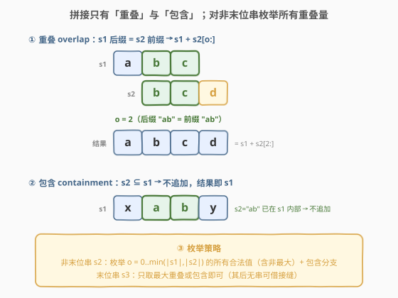
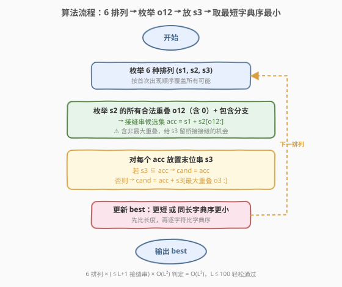
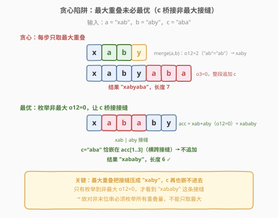

# 包含三个字符串的最短字符串

- **题目名称**：包含三个字符串的最短字符串
- **链接**：[2800. 包含三个字符串的最短字符串](https://leetcode.cn/problems/shortest-string-that-contains-three-strings/)
- **难度**：中等
- **标签**：贪心、字符串、枚举

## 1. 题目概述

给你三个字符串 `a`、`b` 和 `c`，你的任务是找到长度**最短**的字符串，且这三个字符串都是它的**子字符串**。如果有多个这样的字符串，请你返回**字典序最小**的一个。

**示例 1**：

```text
输入：a = "abc", b = "bca", c = "aaa"
输出："aaabca"
解释：字符串 "aaabca" 包含所有三个字符串：a = ans[2..4]，b = ans[3..5]，c = ans[0..2]。
      结果字符串的长度至少为 6，且 "aaabca" 是字典序最小的一个。
```

**示例 2**：

```text
输入：a = "ab", b = "ba", c = "aba"
输出："aba"
解释：字符串 "aba" 包含所有三个字符串：a = ans[0..1]，b = ans[1..2]，c = ans[0..2]。
      由于 c 的长度为 3，结果字符串的长度至少为 3。"aba" 是字典序最小的一个。
```

**约束条件**：

- $1 \le \text{a.length}, \text{b.length}, \text{c.length} \le 100$
- `a`、`b`、`c` 只包含小写英文字母。

> 💡 **关键化简**：只有 3 个串，全排列仅 $3! = 6$ 种。最短超串必然可写成「按首次出现顺序排列、相邻两串在接缝处重叠或前者包含后者」的结构。因此把问题拆成「枚举排列 + 枚举接缝重叠量」即可精确求解。

---

## 2. 解题思路

### 2.1 暴力思路

朴素地，可以把 `a + b + c` 直接拼接成一个长度 $\le 300$ 的合法超串作为上界。但要求**最短**，必须利用子串之间的重叠来压缩长度。一种直觉做法是「贪心最大重叠」：固定一个排列 $(s_1, s_2, s_3)$，先让 $s_2$ 与 $s_1$ **取最大重叠**拼成 $t$，再让 $s_3$ 与 $t$ **取最大重叠**拼出结果，对 6 种排列各做一遍取最优。

> ⚠️ 这套「每步只取最大重叠」的贪心**看似自然却是错的**。问题出在**第三个串可能「桥接」前两个串的非最大接缝**：当前两个串故意少重叠一些、留出更长的接缝区域时，第三个串能整个嵌进这条接缝，反而得到更短的结果。下面 2.2 给出反例并导出正解。

### 2.2 核心观察：枚举排列 + 枚举所有重叠量 + 包含判定



把「让 $y$ 成为 $x$ 的子串所需的最小追加」拆成两类原子动作：

- **重叠（overlap）**：$x$ 的某个**后缀**等于 $y$ 的某个**前缀**，长度记为 $o$（$0 \le o \le \min(|x|,|y|)$）。拼出的串为 $x + y[o:]$。$o$ 越大，追加的字符越少，结果越短。
- **包含（containment）**：$y \subseteq x$（$y$ 已是 $x$ 的子串），此时无需追加任何字符，结果就是 $x$。

由此得到三个关键结论：

**结论一（只需 6 种排列）**：最短超串中，三个串按「首次出现的起始位置」排成一个顺序。枚举 $3! = 6$ 种排列 $(s_1, s_2, s_3)$ 即可覆盖所有可能的顺序。

**结论二（接缝必须是后缀—前缀匹配）**：在排列 $(s_1,s_2,s_3)$ 中，$s_1$ 置于最左。$s_2$ 的起点若落在 $s_1$ 内部（重叠），则重叠区必然满足「$s_1$ 的某后缀 $=$ $s_2$ 的等长前缀」——这正是「重叠」动作；若 $s_2$ 已含于 $s_1$，则是「包含」动作。故 $s_2$ 的所有合法接缝就是所有合法重叠量 $o_{12}$（含 $0$）加一个包含分支。

**结论三（中间串必须枚举所有重叠量，末位串只需最大重叠）**：

- 对**中间串 $s_2$**，不能只取最大重叠 $o_{12}$。反例 $a=$ `"xab"`、$b=$ `"aby"`、$c=$ `"aba"`：最大重叠贪心给出 `"xabyaba"`（长度 7），但取**非最大**重叠 $o_{12}=0$ 得到接缝串 `"xababy"`，此时 $c=$ `"aba"` 恰好整段嵌在接缝里（`"xababy"[1..3]`），结果仅长 6。所以必须枚举 $o_{12}$ 的所有合法值。
- 对**末位串 $s_3$**，后面没有别的串需要借它的接缝，故非最大重叠只会让结果更长、不可能更优；只需在「包含」与「最大重叠」之间二选一即可。

> ⚠️ **为什么末位串不用枚举所有重叠？** 假设某个 $(排列, o_{12})$ 下，$s_3$ 用非最大重叠 $o_3$ 拼出超串 $S$。那么把 $o_3$ 换成该接缝下的最大重叠 $o_3^*$，得到的新串是 $S$ 的同前缀缩短版，仍是合法超串且更短，与 $S$ 最优矛盾。故最优解中末位串必取最大重叠或包含，无需枚举。

### 2.3 算法流程图



1. **枚举 6 种排列** $(s_1, s_2, s_3)$。
2. **枚举 $s_2$ 的接缝**：若 $s_2 \subseteq s_1$，得接缝串 $\text{acc}=s_1$；再遍历所有合法重叠量 $o_{12} \in [\min(|s_1|,|s_2|), 0]$，得 $\text{acc}=s_1 + s_2[o_{12}:]$。汇总成接缝串候选集。
3. **放置末位串 $s_3$**：对每个 $\text{acc}$，若 $s_3 \subseteq \text{acc}$ 取 $\text{cand}=\text{acc}$；否则取 $\text{cand}=\text{acc} + s_3[\,o_3^*:]$（$o_3^*$ 为该接缝下的最大重叠）。
4. **更新最优**：$\text{cand}$ 更短，或同长且字典序更小，则替换 `best`。
5. 全部排列跑完，返回 `best`。

### 2.4 示例演算



**示例 1**（$a=$ `abc`，$b=$ `bca`，$c=$ `aaa`，答案 `"aaabca"`）：取排列 $(c, a, b)$。$s_2=$ `abc` 与 $s_1=$ `aaa` 的最大重叠 $o_{12}=1$（后缀 `"a"` $=$ 前缀 `"a"`），接缝串 $\text{acc}=$ `aaabc`；再放 $s_3=$ `bca`，最大重叠 $o_3=2$（后缀 `"bc"` $=$ 前缀 `"bc"`），得 $\text{cand}=$ `aaabca`，长度 6 ✓。

**贪心陷阱反例**（$a=$ `xab`，$b=$ `aby`，$c=$ `aba`）：

| 做法 | $o_{12}$ | 接缝串 acc | 放 $c=$ `aba` | 结果 | 长度 |
|------|----------|------------|---------------|------|------|
| 最大重叠贪心 | $2$（`ab`=`ab`） | `xaby` | $o_3=0$ 追加 | `xabyaba` | 7 |
| **枚举非最大** | $0$ | `xababy` | $c\subseteq\text{acc}$（位于 `[1..3]`） | `xababy` | **6** ✓ |

$c=$ `aba` 的 `aba` 横跨 `xab` 与 `aby` 的接缝（`xab` 末尾的 `ab` 与 `aby` 开头的 `a` 共同组成 `aba`），只有枚举到 $o_{12}=0$ 这条非最大接缝才看得见。这正是结论三的来源。

> 💡 **示例 2 验证**：$a=$ `ab`，$b=$ `ba`，$c=$ `aba`。排列 $(c,a,b)$：$s_2=$ `ab` $\subseteq s_1=$ `aba`，接缝串 `acc=aba`；$s_3=$ `ba` $\subseteq$ `aba`，直接取 `aba`，长度 3 ✓。

---

## 3. 参考代码

### C++（枚举排列 + 枚举重叠量 + 包含判定）

```cpp
class Solution {
public:
    string minimumString(string a, string b, string c) {
        vector<string> v = {a, b, c};
        string best = a + b + c;                  // 朴素拼接作为上界，必为合法超串
        vector<int> idx = {0, 1, 2};
        auto overlap = [](const string& x, const string& y) {
            int m = min(x.size(), y.size());
            for (int o = m; o >= 1; --o)          // 从大到小找首个匹配 = 最大重叠
                if (x.substr(x.size() - o) == y.substr(0, o)) return o;
            return 0;
        };
        do {
            const string &s1 = v[idx[0]], &s2 = v[idx[1]], &s3 = v[idx[2]];
            vector<string> accs;
            if (s1.find(s2) != string::npos) accs.push_back(s1);     // 包含分支
            int m12 = min(s1.size(), s2.size());
            for (int o = m12; o >= 0; --o) {                         // 枚举 s2 所有合法重叠量
                if (o == 0 || s1.substr(s1.size() - o) == s2.substr(0, o))
                    accs.push_back(s1 + s2.substr(o));
            }
            for (const string& acc : accs) {
                string cand;
                if (acc.find(s3) != string::npos) cand = acc;        // 末位串已包含
                else cand = acc + s3.substr(overlap(acc, s3));       // 末位串取最大重叠
                if (cand.size() < best.size() ||
                    (cand.size() == best.size() && cand < best))
                    best = cand;                                     // 更短 或 同长字典序更小
            }
        } while (next_permutation(idx.begin(), idx.end()));
        return best;
    }
};
```

### Python（枚举排列 + 枚举重叠量 + 包含判定）

```python
from itertools import permutations

class Solution:
    def minimumString(self, a: str, b: str, c: str) -> str:
        def max_overlap(x: str, y: str) -> int:
            m = min(len(x), len(y))
            for o in range(m, 0, -1):           # 从大到小找首个匹配 = 最大重叠
                if x[-o:] == y[:o]:
                    return o
            return 0

        def candidates(s1: str, s2: str, s3: str):
            accs = []
            if s2 in s1:                         # 包含分支：s2 已是 s1 子串
                accs.append(s1)
            m12 = min(len(s1), len(s2))
            for o in range(m12, -1, -1):         # 枚举 s2 所有合法重叠量（含 0）
                if o == 0 or s1[-o:] == s2[:o]:
                    accs.append(s1 + s2[o:])
            for acc in accs:
                if s3 in acc:                    # 末位串已包含
                    yield acc
                else:                            # 末位串取最大重叠
                    yield acc + s3[max_overlap(acc, s3):]

        best = a + b + c                         # 朴素拼接作为上界
        for s1, s2, s3 in permutations((a, b, c)):
            for cand in candidates(s1, s2, s3):
                if len(cand) < len(best) or (len(cand) == len(best) and cand < best):
                    best = cand
        return best
```

> 💡 **上界初始化**：`a + b + c` 一定是合法超串（三个串都在其中），作为 `best` 初值可省去空串判空分支；后续任何候选长度都 $\le$ 它。

---

## 4. 复杂度分析

| 维度 | 复杂度 | 说明 |
|------|--------|------|
| **时间复杂度** | $O(L^3)$，$L=\max(|a|,|b|,|c|)\le 100$ | 6 种排列；每种排列至多 $L+1$ 个接缝串；每个接缝串做一次子串包含判定 $O(L^2)$ 与最大重叠搜索 $O(L^2)$。$6\cdot L\cdot L^2 = O(L^3)\approx 6\times10^6$ |
| **空间复杂度** | $O(L)$ | 候选串长度 $\le 3L\le 300$，常数量级临时串 |

> ⚠️ 最大重叠搜索 `overlap` 用 `substr` 比较是 $O(L)$ 单次、共 $O(L)$ 次，故 $O(L^2)$；Python 中 `x[-o:]==y[:o]` 同理。若用滚动哈希可降到 $O(L)$，但 $L\le100$ 下无必要。

---

## 5. 扩展：为什么「只取最大重叠」的贪心会错

「最短公共超串（shortest common superstring）」在串数 $n$ 任意时是 NP 困难的，贪心最大重叠只是 $2$-近似。本题 $n=3$ 虽小，贪心仍会错，根因正是结论三：**中间串的最大重叠会过早「压扁」接缝，令后一个串无法嵌进接缝**。

精确做法的关键在于：**只有末位串可以安心取最大重叠**（其后无串可借接缝）；**非末位串必须枚举所有重叠量**，让后续串有机会桥接非最大接缝。$n=3$ 时只有 $s_2$ 是「非末位」，枚举其 $\le L+1$ 个重叠量代价极小；若推广到更大 $n$，需对每个非末位串枚举，复杂度随 $n$ 指数增长，这也是该问题 NP 困难的体现。

---

## 6. 面试要点

1. **为什么只需枚举 6 种排列？**

   > 最短超串中三个串按首次出现起点排成一个顺序；任一最优解必对应某个排列。$3!=6$ 种排列覆盖全部顺序，故枚举排列是完备的。

2. **为什么中间串要枚举所有重叠量，不能只取最大？**

   > 末位之后的串可能整段嵌进接缝。最大重叠会缩短接缝、抹掉这种嵌入机会；只有枚举非最大重叠（如反例 $o_{12}=0$）才看得到 $s_3$ 桥接接缝的更优解。见 2.4 反例：最大重叠得 7，枚举非最大得 6。

3. **为什么末位串只需最大重叠或包含，不用枚举？**

   > 末位串后面没有别的串需要借它的接缝，非最大重叠只会让结果更长。若最优解中末位串用了非最大重叠，换成最大重叠得到同前缀更短的合法超串，与最优矛盾。故末位串必取最大重叠或包含。

4. **接缝为什么一定是「后缀—前缀匹配」？**

   > 在排列 $(s_1,s_2,s_3)$ 中 $s_1$ 最左。$s_2$ 起点若在 $s_1$ 内部，重叠区必须同时等于 $s_1$ 的后缀与 $s_2$ 的前缀，否则两串无法同时在该位置成为子串。若 $s_2$ 起点在 $s_1$ 之后且中间有「缝隙」，缝隙字符须由 $s_3$ 覆盖，那 $s_3$ 才是第二位，对应另一排列——故对正确排列，接缝恒为后缀—前缀匹配。

5. **字典序最小怎么保证？**

   > 比较时先比长度再比字典序：`cand.size() < best.size() || (== && cand < best)`。对同一接缝串，最大重叠给出的最短候选是唯一的（最大重叠量唯一），不存在同长多解；不同接缝串可能同长，此时逐字符比较取字典序最小即可。

> 💡 **一句话总结**：2800 = 枚举 $3!$ 排列 + 对中间串枚举所有重叠量(含非最大) + 包含判定，末位串只取最大重叠。关键避坑是「中间串不能只取最大重叠」，否则漏掉后串桥接接缝的更优解。

---

## 7. 同类练习题

- [686. 重复叠加字符串匹配](https://leetcode.cn/problems/repeated-string-match/)（[站内题解](../0601-0700/686_重复叠加字符串匹配.md)）：本题的双串退化版——求最少重复几次 $a$ 使 $b$ 成为子串，正是「重叠/包含」动作的最小化，理解它有助写好本题的 `overlap` 与包含判定
- [936. 戳印序列](https://leetcode.cn/problems/stamping-the-sequence/)：字符串重叠与覆盖建模的招牌题，从目标串倒推每次盖章位置，与本题「后缀—前缀接缝」思想相通
- [214. 最短回文串](https://leetcode.cn/problems/shortest-palindrome/)：单串的「最短包含超串」变体——在原串前补最短前缀使之成回文，KMP 失配数组的 next 表即最大重叠量，可对照本题的 `overlap` 函数
- [718. 最长重复子数组](https://leetcode.cn/problems/maximum-length-of-repeated-subarray/)（[站内题解](../0701-0800/718_最长重复子数组.md)）：求两串最长公共子串，本质即「最大重叠」的检测，理解它有助于写好本题的 `overlap`
- [14. 最长公共前缀](https://leetcode.cn/problems/longest-common-prefix/)（[站内题解](../0001-0100/14_最长公共前缀.md)）：前缀/后缀匹配的基础训练，与本题接缝判定的 `s1[-o:]==s2[:o]` 一脉相承
