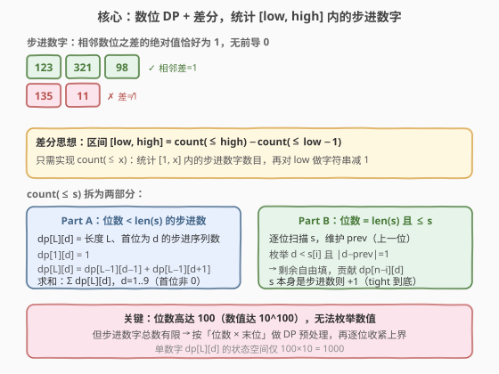
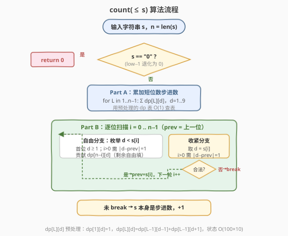
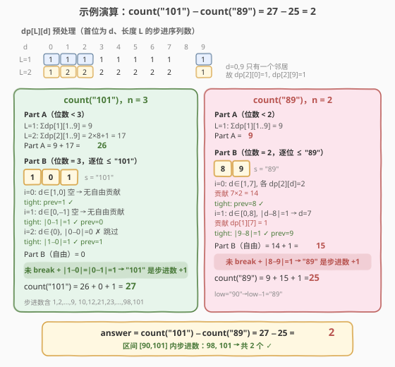

# 统计范围内的步进数字数目

- **题目名称**：统计范围内的步进数字数目
- **链接**：[2801. 统计范围内的步进数字数目](https://leetcode.cn/problems/count-stepping-numbers-in-range/)
- **难度**：困难
- **标签**：字符串、动态规划

## 1. 题目概述

给你两个正整数 `low` 和 `high`，都用字符串表示，请你统计闭区间 $[low, high]$ 内的**步进数字**数目。

如果一个整数相邻数位之间差的绝对值都**恰好**是 $1$，那么这个数字被称为**步进数字**。

请你返回一个整数，表示闭区间 $[low, high]$ 之间步进数字的数目。由于答案可能很大，请你将它对 $10^9 + 7$ **取余**后返回。

> ⚠️ **注意**：步进数字不能有前导 $0$。

**示例 1**：

```text
输入：low = "1", high = "11"
输出：10
解释：区间 [1,11] 内的步进数字为 1，2，3，4，5，6，7，8，9 和 10。总共有 10 个。
```

**示例 2**：

```text
输入：low = "90", high = "101"
输出：2
解释：区间 [90,101] 内的步进数字为 98 和 101。总共有 2 个。
```

**约束条件**：

- $1 \le \text{int(low)} \le \text{int(high)} < 10^{100}$
- $1 \le \text{low.length}, \text{high.length} \le 100$
- `low` 和 `high` 只包含数字。
- `low` 和 `high` 都不含前导 $0$。

> 💡 **关键约束**：数值可达 $10^{100}$，远超任何整型范围——必须**以字符串操作**，且不能枚举数值。突破口在于：步进数字的「相邻数位差恰好为 1」这个局部约束，天然适合**按数位做 DP**。

---

## 2. 解题思路

### 2.1 暴力思路

最直白地，从 `low` 到 `high` 逐个枚举整数，对每个数检查相邻数位之差是否全为 $1$。但数值高达 $10^{100}$，连遍历都无从下手（无法用整型表示，更别说枚举 $10^{100}$ 个数）。

突破口在于把问题拆成两部分：① 如何**快速统计** $\le$ 某上界的步进数字总数（而非逐个检查）；② 如何把**区间计数**转化为**前缀计数之差**。

### 2.2 核心观察：数位 DP + 差分



**差分转化**：区间 $[low, high]$ 的步进数字数 = $\text{count}(\le high) - \text{count}(\le low - 1)$。只需实现 $\text{count}(\le x)$（统计 $[1, x]$ 内的步进数字数目），再对 `low` 做一次**字符串减 1**即可。这是计数类问题的标准套路——把「区间」变成「两个前缀之差」。

**$\text{count}(\le s)$ 拆为两部分**：

| 部分 | 范围 | 方法 |
|------|------|------|
| **Part A** | 位数 $< \text{len}(s)$ 的所有步进数 | 用预处理 DP 表直接求和 |
| **Part B** | 位数 $= \text{len}(s)$ 且 $\le s$ 的步进数 | 逐位扫描，收紧上界 |

**预处理 DP 表**：定义 $\text{dp}[L][d]$ 为「长度为 $L$、首位为 $d$ 的步进序列数」：

$$
\text{dp}[1][d] = 1 \quad (d = 0, 1, \ldots, 9)
$$

$$
\text{dp}[L][d] = \text{dp}[L-1][d-1] + \text{dp}[L-1][d+1]
$$

（$d-1$ 或 $d+1$ 越界时该项为 $0$）。含义：首位定为 $d$ 后，第二位只能是 $d-1$ 或 $d+1$，剩余 $L-1$ 位递归。状态空间仅 $100 \times 10 = 1000$。

**Part A**：对每个长度 $L \in [1, n-1]$，求和 $\sum_{d=1}^{9} \text{dp}[L][d]$（首位不能为 $0$）。

**Part B**：逐位扫描 $s$，维护上一位 `prev`。在每个位置 $i$：

- **自由分支**：枚举 $d < s[i]$（首位 $d \ge 1$；非首位需 $|d - \text{prev}| = 1$），此时该数已严格小于 $s$，剩余位自由填，贡献 $\text{dp}[n-i][d]$。
- **收紧分支**：取 $d = s[i]$ 继续（非首位需 $|d - \text{prev}| = 1$，否则 `break`）。

若扫描完所有位未 `break`，说明 $s$ 自身是步进数，再 $+1$。

> 💡 **为何自由分支贡献是 $\text{dp}[n-i][d]$**：位置 $i$ 取 $d$ 后，剩余 $n-i$ 位（含位置 $i$）构成「以 $d$ 开头、长 $n-i$ 的步进序列」，正是 $\text{dp}[n-i][d]$ 的定义。$d$ 已固定为首位，$\text{dp}[n-i][d]$ 恰好等于后续 $n-i-1$ 位的所有合法填法。

### 2.3 算法流程图



流程要点：
1. **特判 $s = $ `"0"`**：$\text{count}(\le 0) = 0$（`low-1` 可能退化为 `"0"`）。
2. **Part A** 查预处理表，$O(n \times 10)$。
3. **Part B** 逐位扫描，每位 $O(10)$ 枚举 + $O(1)$ 查表，共 $O(n \times 10)$。
4. 扫描到底未 `break` → $s$ 是步进数，$+1$。

### 2.4 示例演算



以示例 2 `low = "90", high = "101"` 为例，`low - 1 = "89"`，求 $\text{count("101")} - \text{count("89")}$。

**预处理 dp 表**（$d = 0 \sim 9$）：

| | 0 | 1 | 2 | 3 | 4 | 5 | 6 | 7 | 8 | 9 |
|------|---|---|---|---|---|---|---|---|---|---|
| L=1 | 1 | 1 | 1 | 1 | 1 | 1 | 1 | 1 | 1 | 1 |
| L=2 | 1 | 2 | 2 | 2 | 2 | 2 | 2 | 2 | 2 | 1 |

（$d=0$ 只有右邻居 $1$，$d=9$ 只有左邻居 $8$，故 $\text{dp}[2][0] = \text{dp}[2][9] = 1$。）

**count("101")**（$n=3$）：
- Part A：$L=1$→$9$，$L=2$→$2 \times 8 + 1 = 17$，合计 $26$。
- Part B：$s = $ `101`
  - $i=0$：$d \in [1, 0]$ 空，无自由贡献；tight 取 $1$，$\text{prev}=1$。
  - $i=1$：$d \in [0, -1]$ 空，无自由贡献；tight 取 $0$，$|0-1|=1$ ✓，$\text{prev}=0$。
  - $i=2$：$d \in \{0\}$，$|0-0|=0 \ne 1$ 跳过；tight 取 $1$，$|1-0|=1$ ✓。
  - 未 break，`101` 是步进数（$|1-0|=|0-1|=1$），$+1$。
- Part B $= 0 + 1 = 1$，$\text{count("101")} = 26 + 1 = 27$。

**count("89")**（$n=2$）：
- Part A：$L=1$→$9$，合计 $9$。
- Part B：$s = $ `89`
  - $i=0$：$d \in [1, 7]$，各 $\text{dp}[2][d]=2$，贡献 $7 \times 2 = 14$；tight 取 $8$，$\text{prev}=8$。
  - $i=1$：$d \in [0, 8]$，$|d-8|=1 \Rightarrow d=7$（$d=9$ 不在 $[0,8]$ 内），贡献 $\text{dp}[1][7]=1$；tight 取 $9$，$|9-8|=1$ ✓。
  - 未 break，`89` 是步进数（$|8-9|=1$），$+1$。
- Part B $= 14 + 1 + 1 = 16$，$\text{count("89")} = 9 + 16 = 25$。

**答案** $= 27 - 25 = 2$ ✓（区间 $[90, 101]$ 内步进数为 $98, 101$）。

---

## 3. 参考代码

### C++

```cpp
class Solution {
public:
    int countSteppingNumbers(string low, string high) {
        const int MOD = 1000000007;
        const int MAXL = 105;
        // dp[L][d] = 长度 L、首位为 d 的步进序列数
        vector<vector<long long>> dp(MAXL, vector<long long>(10, 0));
        for (int d = 0; d <= 9; d++) dp[1][d] = 1;
        for (int L = 2; L < MAXL; L++)
            for (int d = 0; d <= 9; d++) {
                if (d > 0) dp[L][d] += dp[L - 1][d - 1];
                if (d < 9) dp[L][d] += dp[L - 1][d + 1];
                dp[L][d] %= MOD;
            }

        // 统计 [1, s] 内的步进数字数
        auto countLE = [&](const string& s) -> int {
            if (s == "0") return 0;
            int n = s.size();
            long long res = 0;
            // Part A：位数 < n
            for (int L = 1; L < n; L++)
                for (int d = 1; d <= 9; d++)
                    res = (res + dp[L][d]) % MOD;
            // Part B：位数 = n 且 <= s
            int prev = -1;
            bool ok = true;
            for (int i = 0; i < n; i++) {
                int cur = s[i] - '0';
                int lo = (i == 0) ? 1 : 0;
                for (int d = lo; d < cur; d++)
                    if (i == 0 || d == prev - 1 || d == prev + 1)
                        res = (res + dp[n - i][d]) % MOD;
                if (i > 0 && !(cur == prev - 1 || cur == prev + 1)) { ok = false; break; }
                prev = cur;
            }
            if (ok) res = (res + 1) % MOD;
            return (int)res;
        };

        // 字符串减 1
        auto dec1 = [](string s) -> string {
            int i = s.size() - 1;
            while (i >= 0 && s[i] == '0') { s[i] = '9'; i--; }
            if (i < 0) return "0";
            s[i]--;
            int st = 0;
            while (st < (int)s.size() && s[st] == '0') st++;
            return st == (int)s.size() ? "0" : s.substr(st);
        };

        int hi = countLE(high);
        int lo = countLE(dec1(low));
        return (hi - lo + MOD) % MOD;
    }
};
```

### Python

```python
class Solution:
    def countSteppingNumbers(self, low: str, high: str) -> int:
        MOD = 10 ** 9 + 7
        MAXL = 105
        # dp[L][d] = 长度 L、首位为 d 的步进序列数
        dp = [[0] * 10 for _ in range(MAXL)]
        for d in range(10):
            dp[1][d] = 1
        for L in range(2, MAXL):
            for d in range(10):
                if d > 0:
                    dp[L][d] += dp[L - 1][d - 1]
                if d < 9:
                    dp[L][d] += dp[L - 1][d + 1]
                dp[L][d] %= MOD

        def count_le(s: str) -> int:
            if s == "0":
                return 0
            n = len(s)
            res = 0
            # Part A：位数 < n
            for L in range(1, n):
                for d in range(1, 10):
                    res = (res + dp[L][d]) % MOD
            # Part B：位数 = n 且 <= s
            prev = -1
            ok = True
            for i in range(n):
                cur = int(s[i])
                lo = 1 if i == 0 else 0
                for d in range(lo, cur):
                    if i == 0 or abs(d - prev) == 1:
                        res = (res + dp[n - i][d]) % MOD
                if i > 0 and abs(cur - prev) != 1:
                    ok = False
                    break
                prev = cur
            if ok:
                res = (res + 1) % MOD
            return res

        def dec1(s: str) -> str:
            digits = list(s)
            i = len(digits) - 1
            while i >= 0 and digits[i] == "0":
                digits[i] = "9"
                i -= 1
            if i < 0:
                return "0"
            digits[i] = str(int(digits[i]) - 1)
            result = "".join(digits).lstrip("0")
            return result if result else "0"

        return (count_le(high) - count_le(dec1(low))) % MOD
```

> 💡 两处工程细节：① `dec1` 做字符串减 1 时从末尾借位（遇 0 变 9 继续借），结果去前导 0，`"1"`→`"0"`、`"100"`→`"99"`；② 最终 `(hi - lo + MOD) % MOD` 防止差为负数（两次取余后相减可能为负）。

---

## 4. 复杂度分析

| 维度 | 复杂度 | 说明 |
|------|--------|------|
| **时间** | $O(n \times 10)$ | 预处理 $O(\text{MAXL} \times 10)$；每次 `count_le` 逐位 $n$、每位枚举 $\le 10$，两次调用 $O(n \times 10)$ |
| **空间** | $O(\text{MAXL} \times 10)$ | dp 表 $100 \times 10 = 1000$ 个 long long，约 8 KB |

> ⚠️ 本题的瓶颈不在循环层数而在**数值表示**：$10^{100}$ 无法用整型承接，全程以字符串操作；步进约束的「相邻差为 1」使状态只需 `(位数, 末位)` 二维，DP 表极小。

---

## 5. 扩展：数位 DP 的通用模板

本题是**数位 DP**的经典应用。数位 DP 的一般框架：

1. **差分**：$\text{count}([L, R]) = \text{count}(\le R) - \text{count}(\le L-1)$。
2. **预处理**：与上界无关的「自由部分」用 DP 表预计算（本题的 $\text{dp}[L][d]$）。
3. **逐位收紧**：从高位到低位，在每个位置枚举「严格小于当前位」的数字（自由分支，查表求和），再尝试「等于当前位」继续（收紧分支），不合法则提前终止。
4. **边界收尾**：若全程合法，上界自身满足约束，$+1$。

> 💡 本题的约束是**相邻位差为 1**，所以状态只需 `(位置, 上一位)`。若约束变为「不含某子串」（如 [1397. 找到所有好字符串](https://leetcode.cn/problems/find-all-good-strings/)），状态需加入 **KMP 自动机状态**（已匹配的前缀长度）；若约束是「数位和 ≤ S」（如 [233. 数字 1 的个数](https://leetcode.cn/problems/number-of-digit-one/) 的变体），状态需加入**累计和**。状态维数随约束复杂度增长。

---

## 6. 面试要点

**Q1：为什么要用差分（前缀之差）而不是直接统计区间？**
> 直接在区间 $[low, high]$ 上统计需要同时维护两个上界，状态和转移都更复杂。差分把问题归约为「统计 $\le$ 某上界的合法数」，只需一个上界，再用 `count(≤high) − count(≤low−1)` 还原区间。这是所有计数型数位 DP 的标准起手式。

**Q2：dp[L][d] 为什么能同时服务于 Part A 和 Part B？**
> Part A 统计短位数步进数时，$\text{dp}[L][d]$（首位 $d$、长 $L$）直接求和即可。Part B 的自由分支选了 $d < s[i]$ 后，剩余 $n-i$ 位（含当前位置）正好是「以 $d$ 开头、长 $n-i$ 的步进序列」——同一张表、同一递推，无需另建状态。这就是把「自由部分」抽成预处理表的价值。

**Q3：Part B 的「自由分支 + 收紧分支」对应什么思想？**
> 这是数位 DP 的核心技巧：**按位从高到低，先处理严格更小的分支（一次性查表求和），再尝试相等的分支（继续收紧）**。一旦收紧分支不合法就 `break`——此后所有更低位都不可能合法了（因为高位已固定为 $s$ 的前缀）。若全程合法，上界自身是步进数，补 $+1$。

**Q4：字符串减 1 有哪些坑？**
> ① 借位：末尾为 0 时变 9 继续向左借（`"100"`→`"099"`→`"99"`）；② 去前导 0：借位后可能产生前导 0（如 `"10"`→`"09"`→`"9"`）；③ 退化为 `"0"`：`"1"`→`"0"`，需在 `count_le` 开头特判返回 0（$[1, 0]$ 为空区间）。

**Q5：为什么取模后相减还要 `+ MOD`？**
> `count_le` 返回的是 $\bmod\ 10^9+7$ 的值，两个 $[0, \text{MOD})$ 的数相减可能为负。`(hi - lo + MOD) % MOD` 把负差修正到 $[0, \text{MOD})$。Python 的大整数 `%` 对负数天然返回非负，但加 `MOD` 后再取余更直观、跨语言一致。

---

## 7. 同类练习题

- [233. 数字 1 的个数](https://leetcode.cn/problems/number-of-digit-one/)：数位 DP 母题，统计 $1 \sim n$ 中数字 1 出现的次数，逐位分类讨论
- [600. 不含连续 1 的非负整数](https://leetcode.cn/problems/non-negative-integers-without-consecutive-ones/)：数位 DP + 相邻位约束（无连续 1），状态含「上一位」，与本题「相邻差为 1」同构
- [902. 最大为 N 的数字组合](https://leetcode.cn/problems/numbers-at-most-n-given-digit-set/)：数位 DP + 受限数字集，自由分支查表 / 收紧分支逐位走
- [1012. 至少有 1 位重复的数字](https://leetcode.cn/problems/numbers-with-repeated-digits/)：数位 DP + 状态压缩（已用数位集合），正难则反（总数 − 无重复）
- [1397. 找到所有好字符串](https://leetcode.cn/problems/find-all-good-strings/)：数位 DP + KMP 自动机，状态额外含「已匹配的 evil 前缀长度」，本题的进阶版
