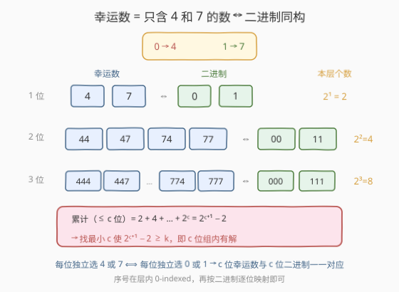
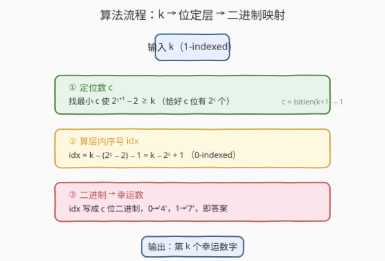
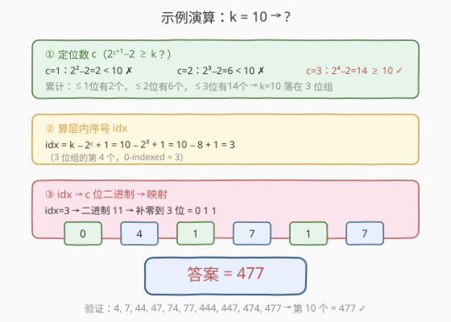

# 找出第 K 个幸运数字

- **题目名称**：找出第 K 个幸运数字
- **链接**：[2802. 找出第 K 个幸运数字](https://leetcode.cn/problems/find-the-k-th-lucky-number/)
- **难度**：中等
- **标签**：位运算、数学、字符串

## 1. 题目概述

> ⚠️ 本题为 LeetCode 付费题，题意描述根据官方示例用例与 hints 重建，可能与官方题面有出入。

「**幸运数字**」是只由数字 `4` 和 `7` 组成的正整数。将所有幸运数字**从小到大**排列，给定一个整数 $k$，返回第 $k$ 个幸运数字（以字符串形式）。

幸运数字按升序排列如下：

```text
4, 7, 44, 47, 74, 77, 444, 447, 474, 477, 744, 747, 774, 777, 4444, ...
```

即先按**位数**从小到大，同位数内按字典序（`4` < `7`）排列。

**示例 1**：

```text
输入：k = 4
输出："47"
解释：第 4 个幸运数字是 47（4, 7, 44, 47）。
```

**示例 2**：

```text
输入：k = 10
输出："477"
解释：第 10 个幸运数字是 477（…, 474, 477）。
```

**示例 3**：

```text
输入：k = 1000
输出："777747447"
```

**约束条件**（根据 hints 重建，$k$ 可达 $10^9$ 量级）：

- $1 \le k \le 10^9$

> 💡 **官方 hints 摘录**：① 恰好 $n$ 位的幸运数字有 $2^n$ 个；② 可求出第 $k$ 个有多少位 $c$；③ 算出 $c$ 位组中排在它前面的个数 $x$；④ 把 $x$ 写成 $c$ 位二进制（补前导零）；⑤ 把 `0`→`4`、`1`→`7` 即得答案。hints 已把最优解法完整拆成五步，核心是**二进制同构**。

---

## 2. 解题思路

### 2.1 暴力思路：队列逐个生成

用 BFS 队列按序生成幸运数字：初始队列为 `["4", "7"]`，每次弹出队首 $s$，把 $s +$`"4"` 和 $s +$`"7"` 入队。由于先入 `4` 后入 `7`，同层内天然字典序，跨层天然按位数递增，弹出顺序就是升序。弹 $k-1$ 次后队首即第 $k$ 个。

```python
from collections import deque
q = deque(["4", "7"])
for _ in range(k - 1):
    s = q.popleft()
    q.append(s + "4")
    q.append(s + "7")
return q[0]
```

> ⚠️ 暴力的浪费在于：每个幸运数字都被**逐一构造**，时间 $O(k \cdot c)$、空间 $O(2^c)$（队列同时持有当前层剩余 + 下一层）。$k = 10^9$ 时 $c \approx 30$，队列要存 $2^{30}$ 个字符串，直接爆内存。我们其实**不需要构造**它们——幸运数字的结构是高度规律的，可以用数学直接「跳」到第 $k$ 个。

### 2.2 核心观察：二进制同构 + 按位分层



幸运数字的每位独立取 `4` 或 `7`，**恰好** $n$ 位的幸运数字有 $2^n$ 个——这和 $n$ 位二进制数（每位取 `0` 或 `1`，共 $2^n$ 个）**结构完全同构**。只需建立映射 `0 → 4`、`1 → 7`，就能在「$c$ 位幸运数字」和「$c$ 位二进制串」之间**一一对应**。三个观察把 $O(k)$ 压到 $O(\log k)$：

**观察一（按位分层）**：恰好 $n$ 位的幸运数字有 $2^n$ 个，因此位数 $\le n$ 的幸运数字总数为

$$
\text{total}(n) = 2^1 + 2^2 + \cdots + 2^n = 2^{n+1} - 2.
$$

第 $k$ 个幸运数字落在**最小的 $c$** 使 $\text{total}(c) = 2^{c+1} - 2 \ge k$ 的那层。例：$k = 10$，$\text{total}(1)=2$、$\text{total}(2)=6$、$\text{total}(3)=14 \ge 10$，故 $c = 3$。

**观察二（层内序号）**：位数 $< c$ 的幸运数字共 $2^c - 2$ 个（即 $\text{total}(c-1)$），所以第 $k$ 个在 $c$ 位组内的 **0-indexed** 序号为

$$
\text{idx} = k - (2^c - 2) - 1 = k - 2^c + 1.
$$

例：$k = 10, c = 3$，$\text{idx} = 10 - 8 + 1 = 3$，即 $c$ 位组里第 4 个（0-indexed 3）。

> ⚠️ **快速求 $c$ 的小技巧**：$\text{total}(c) \ge k$ 即 $2^{c+1} - 2 \ge k$ 即 $2^{c+1} \ge k + 1$，故 $2^c \le k + 1 < 2^{c+1}$，于是 $c = \lfloor \log_2(k+1) \rfloor = \texttt{(k+1).bit\_length() - 1}$。这样无需循环累减，一步到位（Python 的 `int.bit_length()` 与 C++ 的 `31 - __builtin_clz` 同理）。

**观察三（二进制映射）**：把 $\text{idx}$ 写成 $c$ 位二进制（补前导零到 $c$ 位），再把每位 `0→4`、`1→7`，就是答案。例：$\text{idx} = 3 = (011)_2$，补到 3 位得 `011`，映射得 `477`。

> 💡 **为什么是补前导零到 $c$ 位？** $c$ 位幸运数字与 $c$ 位二进制串一一对应，序号 $\text{idx} \in [0, 2^c - 1]$ 恰好能表示所有 $c$ 位二进制串（含前导零）。补前导零就是把「不足 $c$ 位的二进制」对齐到 $c$ 位——前导零映射成前导 `4`，正好是同层字典序最小的那些。

### 2.3 算法流程图



三步串行，每步 $O(\log k)$：

1. **定位数 $c$**：$c = \lfloor \log_2(k+1) \rfloor$（等价于找最小 $c$ 使 $2^{c+1}-2 \ge k$）。
2. **算层内序号 $\text{idx}$**：$\text{idx} = k - 2^c + 1$（0-indexed）。
3. **二进制映射**：$\text{idx}$ 写成 $c$ 位二进制，逐位 `0→4`、`1→7`。

### 2.4 示例演算



以 $k = 10$ 为例完整走一遍：

| 步骤 | 计算 | 结果 |
|------|------|------|
| ① 定位数 $c$ | $\text{total}(1)=2<10$，$\text{total}(2)=6<10$，$\text{total}(3)=14\ge 10$ | $c = 3$ |
| ② 算 $\text{idx}$ | $10 - 2^3 + 1 = 10 - 8 + 1$ | $\text{idx} = 3$ |
| ③ 二进制 | $3 = (11)_2$，补零到 3 位 | `011` |
| ④ 映射 | `0`→`4`，`1`→`7`，`1`→`7` | `477` ✓ |

> 💡 **$k = 1000$ 验证**：$c = \lfloor\log_2(1001)\rfloor = 9$（$\text{total}(9) = 2^{10}-2 = 1022 \ge 1000$）；$\text{idx} = 1000 - 512 + 1 = 489$；$489 = (111101001)_2$，补到 9 位得 `111101001`，逐位映射 `1→7,1→7,1→7,1→7,0→4,1→7,0→4,0→4,1→7` 得 `777747447` ✓。

---

## 3. 参考代码

### Python（二进制同构 + 位运算）

```python
class Solution:
    def kthLuckyNumber(self, k: int) -> str:
        # ① 定位数 c：2^c <= k+1 < 2^(c+1)
        c = (k + 1).bit_length() - 1
        # ② 层内 0-indexed 序号
        idx = k - (1 << c) + 1
        # ③ 写成 c 位二进制，逐位 0->4, 1->7
        return ''.join('7' if b == '1' else '4' for b in format(idx, '0{}b'.format(c)))
```

### C++（循环累减定位数 + 位映射）

```cpp
class Solution {
public:
    string kthLuckyNumber(int k) {
        // ① 定位数 c：累减 2 + 4 + ... + 2^c，首个 >= k
        long long c = 1, total = 2;          // total = 2^1
        while (total < k) {
            c++;
            total += (1LL << c);             // 加 2^c
        }
        // ② 层内 0-indexed 序号
        long long idx = k - (total - (1LL << c)) - 1;  // = k - 2^c + 1
        // ③ 转 c 位二进制，0->'4', 1->'7'
        string res;
        for (long long i = c - 1; i >= 0; --i)
            res += ((idx >> i) & 1) ? '7' : '4';
        return res;
    }
};
```

> 💡 **两种定位数写法**：Python 版用 `(k+1).bit_length() - 1` 一步求 $c$，简洁；C++ 版用循环累减更直观，两者等价。C++ 中 `total` 可能达 $2^{31}-2$，用 `long long` 防溢出。也可用 `c = 31 - __builtin_clz(k + 1)` 一步求。

---

## 4. 复杂度分析

| 维度 | 复杂度 | 说明 |
|------|--------|------|
| **时间复杂度** | $O(\log k)$ | 位数 $c = O(\log k)$，构造 $c$ 位字符串即 $O(\log k)$ |
| **空间复杂度** | $O(\log k)$ | 答案字符串长度为 $c = O(\log k)$ |

> ⚠️ 对比暴力 BFS 的 $O(k)$，本题 $k$ 可达 $10^9$，暴力队列存 $2^{30}$ 个字符串不可行；数学法直接「跳」到第 $k$ 个，仅需 $O(\log k)$，差了 $k / \log k$ 倍。

---

## 5. 扩展：为什么 lucky number 选用 4 和 7？

在算法竞赛传统中，「lucky number」特指**只含 4 和 7 的数**（$4$、$7$ 在某些文化中被视为吉利）。这并非 LeetCode 原创，而是 Codeforces 等平台的经典概念（如 [122A. Lucky Division](https://codeforces.com/problemset/problem/122/A)）。其数学之美在于：每位独立二选一，与二进制**完全同构**——这是所有「逐位 $k$ 进制映射」问题的共同套路。

> 💡 **推广到 $k$ 种数字**：若幸运数由 $k$ 种数字组成（如只含 `a`、`b`、`c`），则恰好 $n$ 位有 $k^n$ 个，层内序号写成 $n$ 位 $k$ 进制再逐位映射。本题 $k=2$，映射 $\{0,1\} \to \{4,7\}$。

---

## 6. 面试要点

1. **为什么恰好 $n$ 位的幸运数字有 $2^n$ 个？**

   > 每位独立取 `4` 或 `7`，共 $n$ 位、每位 2 种选择，由乘法原理得 $2^n$。这与 $n$ 位二进制数有 $2^n$ 个是同一件事。

2. **如何 $O(1)$ 求位数 $c$？**

   > $\text{total}(c) = 2^{c+1}-2 \ge k$ 等价于 $2^{c+1} \ge k+1$，即 $2^c \le k+1 < 2^{c+1}$，故 $c = \lfloor\log_2(k+1)\rfloor$。代码中 `(k+1).bit_length() - 1` 一步到位，避免浮点 `log2` 的精度问题。

3. **层内序号为什么是 $k - 2^c + 1$？**

   > $< c$ 位的幸运数字共 $2^c - 2$ 个。从 1-indexed 的 $k$ 转成 $c$ 位组内 0-indexed：$\text{idx} = k - (2^c - 2) - 1 = k - 2^c + 1$。范围 $[0, 2^c - 1]$，恰好覆盖所有 $c$ 位二进制串。

4. **为什么要补前导零到 $c$ 位？**

   > $c$ 位幸运数字与 $c$ 位二进制串（含前导零）一一对应。不补零会丢掉前导 `4`——而前导 `4` 正是同层字典序靠前的那些（如 `444` 对应 `000`）。补零保证每个 $\text{idx} \in [0, 2^c-1]$ 都映射到唯一的 $c$ 位幸运数字。

5. **暴力和数学法的差距有多大？**

   > 暴力 BFS 需逐个生成前 $k$ 个，$O(k)$ 时间、$O(2^c)$ 空间；$k = 10^9$ 时队列存 $2^{30}$ 个字符串直接爆内存。数学法利用「二进制同构」直接算出第 $k$ 个的位模式，$O(\log k)$ 时间与空间。两者差 $k / \log k \approx 10^8$ 倍。

> 💡 **一句话总结**：2802 = 幸运数每位二选一 ⟺ 二进制 → 按 $k$ 定位数 $c$、算层内序号 $\text{idx}$、写成 $c$ 位二进制再 `0→4`/`1→7`。本质是 [60. 第 k 个排列](../0001-0100/60_第k个排列.md) 康托尔解码的「二进制特例」——都是把序号映射到组合的位模式。

---

## 7. 同类练习题

- [60. 第 k 个排列](https://leetcode.cn/problems/permutation-sequence/)（[站内题解](../0001-0100/60_第k个排列.md)）：同为「按序号定位组合」——用阶乘进制逐位解码排列；本题是其二进制特例（每位 2 选 1 而非 $n$ 选 1）
- [400. 第 N 位数字](https://leetcode.cn/problems/nth-digit/)（[站内题解](../0301-0400/400_第N位数字.md)）：同为「按位数分层定位」——每层贡献 $9 \times 10^{d-1} \times d$ 位，逐层减去锁定层数；结构与本题的 $2^n$ 分层一致
- [168. Excel 表列名称](https://leetcode.cn/problems/excel-sheet-column-title/)（[站内题解](../0001-0100/168_Excel表列名称.md)）：1-indexed 进制转换的逐位映射，`1→A`…`26→Z`；本题是 2 进制版（`0→4`、`1→7`），思路同构
- [504. 七进制数](https://leetcode.cn/problems/base-7/)（[站内题解](../0501-0600/504_七进制数.md)）：进制转换母题，把十进制转 $k$ 进制；理解了进制转换再来看本题的二进制映射会非常自然
- [1925. 统计平方和三元组的数目](https://leetcode.cn/problems/count-square-sum-triples/)（[站内题解](../1901-2000/1925_统计平方和三元组的数目.md)）：同为数学 + 枚举型，对比「直接枚举」与「数学跳过」的复杂度差异
