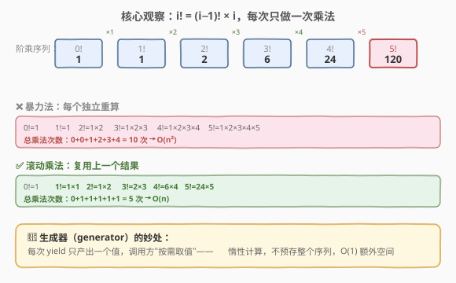
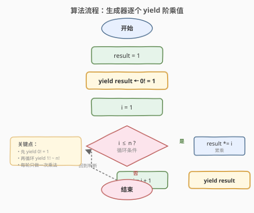
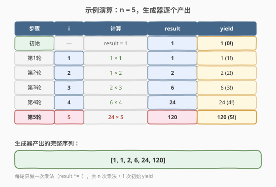

# LeetCode 阶乘生成器 题解

## 1. 题目概述

- **标题 / 题号**：阶乘生成器（#2803，easy）
- **链接**：https://leetcode.cn/problems/factorial-generator/
- **难度**：简单
- **标签**：数学、生成器

> ⚠️ 本题为 LeetCode 付费题，题意描述根据官方示例用例与 hints 重建，可能与官方题面有出入。

**题意**：编写一个**生成器函数**（generator function） `factorialGenerator(n)`，给定一个非负整数 `n`，依次产出（yield）阶乘序列 $0!,\; 1!,\; 2!,\; \dots,\; n!$。

阶乘的定义为：
- $0! = 1$
- $k! = k \times (k-1)!$（$k \geq 1$）

**示例 1**：

```text
输入：n = 5
输出：[1, 1, 2, 6, 24, 120]
解释：0!=1, 1!=1, 2!=2, 3!=6, 4!=24, 5!=120
```

**示例 2**：

```text
输入：n = 2
输出：[1, 1, 2]
解释：0!=1, 1!=1, 2!=2
```

**示例 3**：

```text
输入：n = 0
输出：[1]
解释：0!=1
```

**约束**：

- `0 <= n <= 10`（根据示例与难度推断的合理范围）

## 2. 解题思路

### 2.1 暴力思路：每个阶乘独立重算

最直观的做法是：对每个 $k$（$0 \leq k \leq n$），从 $1$ 乘到 $k$ 来计算 $k!$。

```text
for k in 0..n:
    result = 1
    for j in 1..k:
        result *= j
    yield result
```

问题在于大量**重复计算**：计算 $5!$ 时做了 $1 \times 2 \times 3 \times 4 \times 5$，而这些中间乘积在计算 $3!$、$4!$ 时已经算过了。总乘法次数为 $0 + 1 + 2 + \dots + n = \frac{n(n+1)}{2}$，即 $O(n^2)$。

> 💡 注意 $0! = 1$ 是阶乘的**基准情况**（空积约定），不要把它当作特殊逻辑处理——初始 `result = 1` 直接 yield 即可。

### 2.2 核心观察：滚动乘法，复用上一个结果



关键递推关系：

$$k! = (k-1)! \times k$$

也就是说，**当前阶乘 = 上一个阶乘 × 当前序号**。我们只需要维护一个"滚动乘积"变量 `result`，每次循环做**一次乘法**即可得到下一个阶乘值，无需从头重算。

对比两种方法：
- **暴力法**：每个阶乘独立计算，总乘法 $O(n^2)$ 次
- **滚动乘法**：复用上一个结果，总乘法 $O(n)$ 次（每轮恰好一次）

生成器（generator）的惰性求值特性让这一思路天然契合：每次 `yield` 只产出一个值，调用方"按需取值"，不预存整个序列，额外空间 $O(1)$。

### 2.3 算法流程图



流程很简洁：
1. 初始化 `result = 1`
2. **先 yield 一次**——这是 $0! = 1$（循环之外的特殊起始值）
3. 进入循环 $i = 1, 2, \dots, n$：`result *= i`，然后 `yield result`
4. 循环结束，生成器自动终止

> 💡 **为什么 $0!$ 要单独 yield 而不放进循环？** 因为 $0! = 1$ 不需要任何乘法（它是空积的定义值），而循环的语义是"每次乘一个数"。把 $0!$ 放在循环前 yield，语义更清晰，也避免了循环内对 $i=0$ 的特殊判断。

### 2.4 示例演算



以 `n = 5` 为例，逐步跟踪 `result` 的变化和每次 `yield` 的值：

| 步骤 | i | 计算 | result | yield |
|------|---|------|--------|-------|
| 初始 | — | result = 1 | 1 | 1 (0!) |
| 第1轮 | 1 | 1 × 1 | 1 | 1 (1!) |
| 第2轮 | 2 | 1 × 2 | 2 | 2 (2!) |
| 第3轮 | 3 | 2 × 3 | 6 | 6 (3!) |
| 第4轮 | 4 | 6 × 4 | 24 | 24 (4!) |
| 第5轮 | 5 | 24 × 5 | 120 | 120 (5!) |

最终生成器产出序列：`[1, 1, 2, 6, 24, 120]`。每轮只做一次乘法，共 5 次乘法 + 1 次初始 yield。

## 3. 参考代码

本题原生语言为 **JavaScript**（生成器是 JS 语言特性），同时给出 **Python**（原生生成器）和 **C++**（迭代器类模拟）版本。

### JavaScript（生成器函数）

```javascript
/**
 * @param {number} n
 * @return {Generator<number>}
 */
function* factorialGenerator(n) {
    let result = 1;
    yield result;          // 0! = 1
    for (let i = 1; i <= n; i++) {
        result *= i;       // k! = (k-1)! × k
        yield result;
    }
}
```

### Python（生成器函数）

```python
from typing import Generator

def factorial_generator(n: int) -> Generator[int, None, None]:
    result = 1
    yield result           # 0! = 1
    for i in range(1, n + 1):
        result *= i        # k! = (k-1)! × k
        yield result
```

### C++（迭代器类模拟生成器）

C++ 没有语言级 `yield`，用带状态的迭代器类模拟"按需取值"的语义：

```cpp
class FactorialGenerator {
    int n;
    long long current;
    int i;
    bool yielded_zero;

public:
    FactorialGenerator(int n) : n(n), current(1), i(1), yielded_zero(false) {}

    bool hasNext() const {
        return !yielded_zero || i <= n;
    }

    long long next() {
        if (!yielded_zero) {
            yielded_zero = true;
            return current;         // 0! = 1
        }
        current *= i;               // k! = (k-1)! × k
        ++i;
        return current;
    }
};
```

> ⚠️ **大数溢出**：阶乘增长极快，$20!$ 已超过 `long long` 上限（$\approx 9.2 \times 10^{18}$）。本题 `n` 较小（约 $\leq 10$），`int` 足够；若 `n` 较大，JS 会自动转 `BigInt`，Python 原生大整数无溢出，C++ 需手写大数或用 `__int128`。

## 4. 复杂度分析

| 维度 | 复杂度 | 说明 |
|------|--------|------|
| 时间复杂度 | $O(n)$ | 循环 $n$ 次，每轮一次乘法 + 一次 yield |
| 空间复杂度 | $O(1)$ | 仅维护 `result` 和 `i` 两个变量，生成器不预存序列 |

## 5. 扩展：生成器的惰性求值

生成器与普通函数的核心区别在于**惰性求值**（lazy evaluation）：

- **普通函数**：一次性计算所有结果并返回完整数组 → 空间 $O(n)$
- **生成器函数**：每次 `yield` 暂停执行、产出一个值，调用方取下一个值时才恢复 → 空间 $O(1)$

这意味着，如果调用方只需要前 $k$ 个阶乘（$k < n$），生成器只做 $k$ 次乘法就停下，不会浪费计算。例如：

```python
gen = factorial_generator(1000000)
first_three = [next(gen), next(gen), next(gen)]  # 只算 0!, 1!, 2!，不会算到 1000000!
```

这种"按需消费"的模式在流式处理、无限序列（如斐波那契生成器）等场景中非常有用。

## 6. 面试要点

1. **生成器函数和普通函数有什么区别？**

   - 普通函数调用后立即执行完毕并返回结果；生成器函数（JS 的 `function*` / Python 的 `yield`）每次执行到 `yield` 处**暂停**，产出一个值，调用方再次请求（`next()`）时才从暂停处恢复执行。生成器不一次性计算所有值，而是**惰性求值**，按需产出。

2. **为什么用滚动乘法而不是每次从头算？**

   - 阶乘有天然的递推结构 $k! = (k-1)! \times k$。从头算 $k!$ 需要做 $k$ 次乘法，而滚动乘法只需在上一个结果基础上做 **1 次**乘法。总复杂度从 $O(n^2)$ 降到 $O(n)$，且空间从 $O(n)$（存整个序列）降到 $O(1)$（只存一个变量）。

3. **`0! = 1` 为什么不是 0？**

   - 阶乘是"从 1 到 $n$ 所有正整数的乘积"，$0!$ 表示空积（empty product）。数学上空积约定为 $1$（乘法单位元），与 $n^0 = 1$（空幂）和 $\sum_{\varnothing} = 0$（空和）是同一类约定。这也保证了递推 $1! = 0! \times 1 = 1$ 成立。

4. **如果 n 很大，阶乘溢出了怎么办？**

   - 阶乘增长极快：$10! = 3628800$，$20! \approx 2.4 \times 10^{18}$（超过 `long long`），$100!$ 有 158 位。Python 的整数无上限不会溢出；JavaScript 超过 `Number.MAX_SAFE_INTEGER` 后精度丢失，可用 `BigInt`；C++ 需用字符串模拟大数乘法或第三方大数库。

5. **生成器的"暂停-恢复"机制底层是怎么实现的？**

   - Python 中生成器对象在 `yield` 处保存当前栈帧（局部变量、指令指针），`next()` 时恢复栈帧继续执行，实现协作式调度。JS 的 `function*` 同理，生成器对象内部维护执行上下文状态。C++20 协程（`co_yield`）提供了类似能力，但本题用迭代器类手动管理状态更为直观。

## 同类练习题

| # | 题目 | 与本题的关联 |
|---|------|-------------|
| 172 | [阶乘后的零](https://leetcode.cn/problems/factorial-trailing-zeroes/) | 同属阶乘家族，用勒让德公式统计 $n!$ 末尾零的个数（数因子 5 的幂次） |
| 509 | [斐波那契数](https://leetcode.cn/problems/fibonacci-number/) | 同样利用"前一项推出后一项"的滚动递推（$F(n) = F(n-1) + F(n-2)$），可与阶乘的滚动乘法对比（加法 vs 乘法） |
| 231 | [2 的幂](https://leetcode.cn/problems/power-of-two/) | 判断一个数是否为 $2^k$，与阶乘同为"连乘序列"性质，可用位运算 $n\ \&\ (n-1) == 0$ 判定 |
