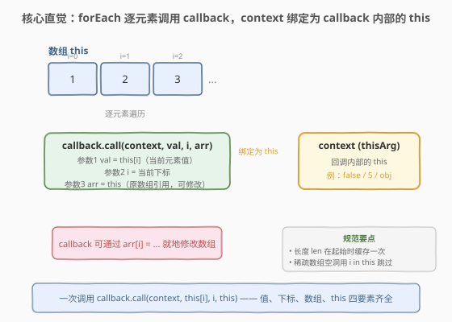
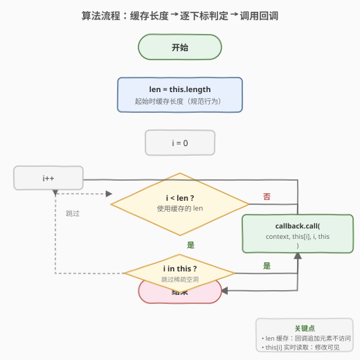
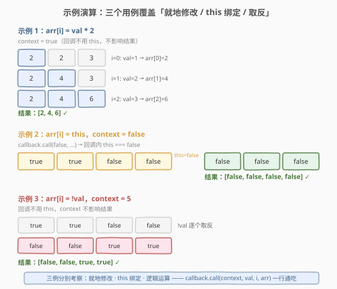

# 数组原型的forEach方法

- **题目名称**：数组原型的forEach方法
- **链接**：[2804. Array Prototype ForEach](https://leetcode.cn/problems/array-prototype-foreach/)
- **难度**：简单
- **标签**：数组、设计、迭代器、this 绑定

## 1. 题目概述

> ⚠️ 本题为 LeetCode 付费题，题意描述根据官方示例用例与 hints 重建，可能与官方题面有出入。

请你实现 `Array.prototype.forEach` 方法。该方法对数组的每个元素执行一次给定的回调函数。

**方法签名**：

```javascript
Array.prototype.forEach = function(callback, context) { ... }
```

- `callback`：对每个元素调用的函数，接收三个参数：
  - `currentValue`：当前正在处理的元素
  - `index`：当前元素的索引
  - `array`：调用 `forEach` 的数组（即 `this`）
- `context`（thisArg）：可选，执行 `callback` 时用作 `this` 的值

**示例 1**：

```text
输入：arr = [1,2,3]
      callback = function(val, i, arr){ arr[i] = val * 2 }
      context = {"context": true}
输出：[2,4,6]
解释：回调将每个元素翻倍，数组被就地修改。
```

**示例 2**：

```text
输入：arr = [true, true, false, false]
      callback = function(val, i, arr){ arr[i] = this }
      context = {"context": false}
输出：[false, false, false, false]
解释：context 为 false，回调内 this === false，每个元素被设为 false。
```

**示例 3**：

```text
输入：arr = [true, true, false, false]
      callback = function(val, i, arr){ arr[i] = !val }
      context = {"context": 5}
输出：[false, false, true, true]
解释：回调对每个布尔值取反，context 不影响结果。
```

**约束条件**：

- 数组长度 $n$ 不超过 $10^5$
- 本题仅开放 JavaScript / TypeScript 提交

> 💡 `context` 参数在测试框架中以 `{"context": X}` 包装，实际语义是将 `X`（如 `true`、`false`、`5`）绑定为回调内部的 `this`。示例 2 中 `this === false`，示例 3 中回调未使用 `this`，故 `context` 不影响结果。本题考察**原型方法实现 + `this` 绑定 + 数组迭代规范**三个要点。

---

## 2. 解题思路

### 2.1 朴素思路：直接循环调用

最直觉的写法：一个 `for` 循环，逐下标调用 `callback`：

```javascript
Array.prototype.forEach = function(callback, context) {
  for (let i = 0; i < this.length; i++) {
    callback.call(context, this[i], i, this);
  }
};
```

三个示例全部通过。但这个写法有两处**不符合 `forEach` 规范**：

1. **未缓存长度**：`this.length` 每轮重新求值。若回调向数组追加元素（如 `this.push(0)`），循环会无限增长，访问到迭代开始后新增的元素——规范要求长度在起始时**一次性确定**。
2. **未跳过稀疏空洞**：稀疏数组 `var a = [1, , 3]` 在下标 1 处是"空洞"（hole），`forEach` 应跳过空洞不调用回调。朴素写法会读取 `undefined` 并调用，行为不符。

> 💡 对于本题的三个示例，朴素写法已足够（数组非稀疏、回调不改变长度）。但理解规范行为是面试加分项，下文给出符合 ECMA-262 规范的完整实现。

### 2.2 核心观察：规范三要素 — this 绑定、长度缓存、空洞跳过



`forEach` 的本质是一次遍历 + 一次回调调用，核心在这一行：

```javascript
callback.call(context, this[i], i, this)
```

它携带四个要素：

| 要素 | 来源 | 作用 |
|------|------|------|
| **this 绑定** | `callback.call(context, ...)` 的第一参数 | 将 `context` 绑定为回调内的 `this` |
| **元素值** | `this[i]`（调用时实时读取） | 传给回调作 `currentValue` |
| **下标** | `i` | 传给回调作 `index` |
| **数组引用** | `this` | 传给回调作 `array`，回调可借此就地修改 |

> 💡 **为什么用 `.call()` 而非直接 `callback(this[i], i, this)`？** 直接调用时回调内的 `this` 取决于调用方式（严格模式为 `undefined`，非严格模式为全局对象）。`.call(context, ...)` 显式将 `this` 绑定为 `context`，是 `forEach` 第二参数 `thisArg` 的正确传递方式。

除核心调用外，规范还有两条保障：

- **长度缓存**：`const len = this.length` 在循环外取一次，之后回调解锁/追加元素不改变遍历范围。
- **空洞跳过**：`if (i in this)` 判断该下标是否有实际属性，稀疏数组的空洞（从未赋值的位置）会被跳过。

> ⚠️ **`i in this` 的含义**：`in` 操作符检测对象是否有某属性键。对数组 `[1, , 3]`，下标 1 从未赋值，`1 in arr` 为 `false`，故跳过。这与 `arr[i] === undefined` 不同——`arr[i]` 显式赋值为 `undefined` 时 `i in arr` 仍为 `true`，回调会被调用。

### 2.3 算法流程图



流程是**线性遍历 + 两个判定**：

1. 缓存 `len = this.length`（一次性，不可变）
2. `i` 从 0 递增到 `len - 1`
3. 判定 `i < len`：否则结束
4. 判定 `i in this`：空洞则跳过（`i++` 回到步骤 3）
5. 调用 `callback.call(context, this[i], i, this)`，然后 `i++` 回到步骤 3

> 💡 **缓存长度但不缓存值**：`len` 在起始确定，但 `this[i]` 在**调用回调时**实时读取。若前一轮回调修改了 `this[i]`（如下标 `i` 的值），本轮读到的是修改后的新值——这是规范行为，与"缓存长度"并不矛盾。

### 2.4 示例演算



**示例 1** `arr = [1,2,3]`，回调 `arr[i] = val * 2`：

| 步骤 | i | val（实时读） | 回调执行 | 数组状态 |
|------|---|--------------|----------|----------|
| 1 | 0 | `this[0]` = 1 | `arr[0] = 1*2 = 2` | `[2,2,3]` |
| 2 | 1 | `this[1]` = 2 | `arr[1] = 2*2 = 4` | `[2,4,3]` |
| 3 | 2 | `this[2]` = 3 | `arr[2] = 3*2 = 6` | `[2,4,6]` |

结果 `[2,4,6]` $\checkmark$。注意 `val` 是调用回调**前**读取的当前值，回调修改的是当前下标 `arr[i]`，不影响后续下标的读取。

**示例 2** `arr = [true,true,false,false]`，回调 `arr[i] = this`，`context = false`：

- `callback.call(false, ...)` → 回调内 `this === false`
- 每个元素被设为 `false` → `[false,false,false,false]` $\checkmark$

> ⚠️ 严格模式下，`callback.call(false, ...)` 会使 `this` 保持原始值 `false`（不装箱为 `Boolean` 对象）。非严格模式会装箱为 `Object(false)`，但 LeetCode 在 ES Module 环境下默认严格模式，`this` 保持原始值。

**示例 3** `arr = [true,true,false,false]`，回调 `arr[i] = !val`，`context = 5`：

- 回调未使用 `this`，`context` 不影响结果
- 逐元素取反：`[!true, !true, !false, !false]` = `[false,false,true,true]` $\checkmark$

---

## 3. 参考代码

### JavaScript / TypeScript（提交语言）

```javascript
/**
 * @param {Function} callback
 * @param {any} context
 * @return {undefined}
 */
Array.prototype.forEach = function (callback, context) {
    const len = this.length;          // 缓存长度：回调追加元素不影响遍历范围
    for (let i = 0; i < len; i++) {
        if (i in this) {              // 跳过稀疏空洞
            callback.call(context, this[i], i, this);
        }
    }
};
```

> 💡 三个示例不涉及稀疏数组与长度变化，朴素写法（去掉 `const len` 和 `i in this`）也能通过。但上述写法符合 ECMA-262 规范，能正确处理边界情况，是面试中值得展示的完整实现。

TypeScript 版（带类型标注）：

```typescript
Array.prototype.forEach = function (
    callback: (value: any, index: number, array: any[]) => void,
    context?: any
): void {
    const len: number = this.length;
    for (let i = 0; i < len; i++) {
        if (i in this) {
            callback.call(context, this[i], i, this);
        }
    }
};
```

### Python（概念等价）

> 本题 LeetCode 仅开放 JS/TS，Python 版作概念对照。⚠️ **核心差异**：Python 函数没有 `this` 绑定语义——JS 的 `callback.call(context, ...)` 将 `context` 绑定为回调内的 `this`，Python 中不存在这一机制，需用闭包捕获或 `functools.partial` 预绑定来模拟。此外，Python 列表无稀疏空洞（不存在 `i in arr` 的概念），故省略空洞检查。

```python
def array_for_each(arr, callback, context=None):
    """
    概念等价实现。

    JS: callback.call(context, this[i], i, this)
    Python 无 this 绑定，context 需在闭包中捕获。
    """
    length = len(arr)  # 缓存长度
    for i in range(length):
        callback(arr[i], i, arr)


# 模拟示例 2 的 this 绑定：用闭包捕获 context
def make_callback(context):
    """闭包捕获 context，等价于 JS 中 this = context 的效果。"""
    def callback(val, i, arr):
        arr[i] = context  # 等价于 arr[i] = this
    return callback


# 示例 2：context = False
arr = [True, True, False, False]
array_for_each(arr, make_callback(False))
print(arr)  # [False, False, False, False]
```

> ⚠️ Python 中用闭包 `make_callback(context)` 模拟 JS 的 `this` 绑定——`context` 被闭包捕获，等价于 `callback.call(context, ...)` 将 `this` 设为 `context`。Python 的 `True`/`False` 是 `bool` 类型（`int` 子类），与 JS 的 `true`/`false` 在类型系统上不同，但取反逻辑 `not val` 与 `!val` 语义一致。

---

## 4. 复杂度分析

| 维度 | 复杂度 | 说明 |
|------|--------|------|
| 时间复杂度 | $O(n)$ | 遍历数组一次，每个有效元素调用一次回调，总操作数 $\le 2n$ |
| 空间复杂度 | $O(1)$ | 仅维护 `len`、`i` 两个标量，无额外数据结构 |

> 💡 `i in this` 操作在数组上是 $O(1)$（内部哈希查找），不影响整体线性复杂度。`callback.call` 的开销取决于回调函数本身的复杂度，不计入 `forEach` 本身。

---

## 5. 扩展：`forEach` 与 `map` / `filter` / `reduce` 的同构骨架

`forEach`、`map`、`filter`、`reduce` 共享同一套**遍历 + 回调调用**的骨架，区别仅在回调的返回值如何处理：

| 方法 | 回调返回值 | `forEach` 的处理 | 额外能力 |
|------|-----------|-----------------|----------|
| **forEach** | 任意（忽略） | 不使用 | 无返回值（`undefined`） |
| **map** | 新值 | 收集到新数组 | 返回新数组，长度同原数组 |
| **filter** | 布尔 | 为真则保留原元素 | 返回新数组，长度 $\le$ 原数组 |
| **reduce** | 累加值 | 作为下一轮的 `accumulator` | 返回单个累加结果 |

```javascript
// map 的骨架：与 forEach 几乎相同，只多一步"收集返回值"
Array.prototype.map = function (callback, context) {
    const len = this.length;
    const result = new Array(len);
    for (let i = 0; i < len; i++) {
        if (i in this) {
            result[i] = callback.call(context, this[i], i, this);
        }
    }
    return result;
};
```

> 💡 掌握 `forEach` 的实现就等于掌握了 `map`/`filter`/`reduce` 的迭代骨架——它们只是换了"回调返回值怎么用"这一动作。这也是 [2634 过滤数组](../2601-2700/2634_过滤数组中的元素.md)（filter）、[2635 转换数组](../2601-2700/2635_转换数组中的每个元素.md)（map）、[2626 数组归约](../2601-2700/2626_数组归约运算.md)（reduce）三题与本题同构的根本原因。

### 5.1 `forEach` 无法提前终止

`forEach` 一旦开始就会遍历到结束，不能用 `break` 提前退出（回调内 `return` 只跳过当前元素，不终止遍历）。若需要提前终止，应使用：

- **`some()`**：回调返回 `true` 时停止（找满足条件的元素）
- **`every()`**：回调返回 `false` 时停止（验证全部满足条件）

```javascript
// 找到第一个 > 3 的元素就停
arr.some((v) => {
    if (v > 3) { console.log(v); return true; }  // 返回 true 终止
    return false;
});
```

> ⚠️ 这不是 `forEach` 的"缺陷"而是设计取舍：`forEach` 语义是"对每个元素执行副作用"，不关心提前终止；`some`/`every` 语义是"判定"，天然支持短路。

---

## 6. 面试要点

1. **`callback.call(context, ...)` 中的 `.call` 起什么作用？**

   > `.call(context, arg1, arg2, ...)` 以显式指定的 `this` 值调用函数。`forEach` 的第二参数 `thisArg`（即 `context`）通过 `.call` 绑定为回调内部的 `this`。若直接 `callback(this[i], i, this)` 调用，`this` 会退化为 `undefined`（严格模式）或全局对象（非严格模式），`context` 参数就形同虚设。

2. **为什么要缓存长度 `len = this.length`？**

   > 规范要求 `forEach` 在**调用开始时**确定遍历范围。若回调向数组追加元素（`this.push(x)`），朴素写法 `i < this.length` 会不断增长，访问到迭代开始后新增的元素——这是未定义行为。缓存 `len` 后，循环只遍历初始长度范围内的元素，符合规范。

3. **`i in this` 解决什么问题？稀疏数组是什么？**

   > 稀疏数组是存在"空洞"的数组，如 `var a = [1, , 3]`（下标 1 从未赋值）。`forEach` 规范要求跳过空洞，不调用回调。`i in this` 判断该下标是否有实际属性——空洞的 `i in arr` 为 `false`，故跳过。注意这与 `arr[i] === undefined` 不同：显式赋值 `arr[1] = undefined` 时 `1 in arr` 为 `true`，回调仍会被调用。

4. **严格模式下 `callback.call(false, ...)` 中 `this` 是什么？**

   > 严格模式下 `this` 保持原始值 `false`，不装箱为 `Boolean` 对象。非严格模式下会装箱为 `Object(false)`（一个 `Boolean` 包装对象），`arr[i] = this` 赋值的是包装对象而非原始值。LeetCode 的 ES Module 环境默认严格模式，故示例 2 的 `this === false` 直接生效。

5. **`forEach` 和 `map` 的区别？**

   > `forEach` 忽略回调返回值、无返回值（返回 `undefined`），适合执行副作用（如修改数组、打印日志）。`map` 收集回调返回值到新数组并返回，适合变换数据。两者共享同一套迭代骨架（缓存长度、跳过空洞、`callback.call`），区别仅在"回调返回值怎么用"——`map` 多了 `result[i] =` 这一步。

> 💡 **一句话总结**：2804 = 「`callback.call(context, this[i], i, this)` + 缓存长度 + 跳过空洞」。核心是 `.call` 绑定 `this` + 三参数（值、下标、数组）传递；规范行为靠 `const len` 和 `i in this` 保障。朴素循环可过示例，规范实现能应对边界。

---

## 7. 同类练习题

- [2634. 过滤数组中的元素](https://leetcode.cn/problems/filter-elements-from-array/)（[题解](../2601-2700/2634_过滤数组中的元素.md)）：实现 `filter`，与 `forEach` 共享迭代骨架，回调返回值为布尔，决定元素去留
- [2635. 转换数组中的每个元素](https://leetcode.cn/problems/apply-transform-over-each-element-in-array/)（[题解](../2601-2700/2635_转换数组中的每个元素.md)）：实现 `map`，与 `forEach` 共享迭代骨架，回调返回值收集到新数组
- [2626. 数组归约运算](https://leetcode.cn/problems/array-reduce-transformation/)（[题解](../2601-2700/2626_数组归约运算.md)）：实现 `reduce`，与 `forEach` 共享遍历骨架，回调返回累加值传至下一轮
- [2705. 精简对象](https://leetcode.cn/problems/compact-object/)（[题解](../2701-2800/2705_精简对象.md)）：JS 30 天系列题目，从数组遍历转向对象递归，同属 JS 原生 API 实现族
- [2704. 相等还是不相等](https://leetcode.cn/problems/to-be-or-not-to-be/)（[题解](../2701-2800/2704_相等还是不相等.md)）：JS 30 天系列题目，考察闭包与 `throw` 语义，与本题同属 JS 语言特性系列
