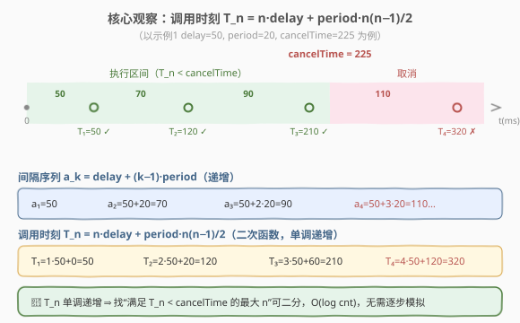
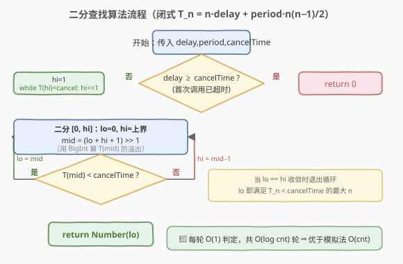
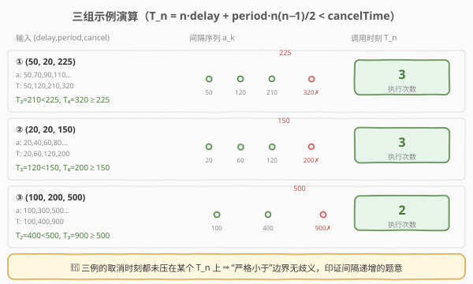

# LeetCode 自定义间隔 题解

## 1. 题目概述

- **标题 / 题号**：自定义间隔（#2805，medium）
- **链接**：https://leetcode.cn/problems/custom-interval/
- **难度**：中等
- **标签**：数学、模拟、二分查找、定时器

> ⚠️ 本题为 LeetCode 付费题（Plus 会员专享），官方题面与示例输出未公开。以下题意根据判题机配置 `metaData`（函数签名为 `foobar(delay, period, cancelTime)`，返回**整数**，仅开放 JavaScript / TypeScript 提交）与三组官方示例输入 $(50,\,20,\,225)$、$(20,\,20,\,150)$、$(100,\,200,\,500)$ 重建，可能与官方题面有出入。

**题意**：实现一个函数 `foobar(delay, period, cancelTime)`，模拟一种**自定义间隔**的定时调度：与 `setInterval` 的固定间隔不同，这里的调用间隔会**逐次递增**。具体规则为：

- 第 $1$ 次调用发生在 $\text{delay}$ 毫秒之后；
- 之后每两次调用之间的间隔**增加** $\text{period}$ 毫秒，即第 $k$ 次调用与第 $k-1$ 次调用之间的间隔为 $\text{delay} + (k-1)\cdot\text{period}$（$k \ge 1$，第 $0$ 次视作时刻 $0$）；
- 整个调度在 $\text{cancelTime}$ 毫秒时被**取消**——任何**发生在 $\text{cancelTime}$ 之前**（严格小于）的调用都会执行，其余不再执行。

请返回**被取消前实际执行的调用次数**。

**函数签名**：

```javascript
/**
 * @param {number} delay      首次调用延迟（也是首个间隔），毫秒
 * @param {number} period     每次间隔的递增量，毫秒
 * @param {number} cancelTime 取消时刻，毫秒
 * @return {number}           取消前实际执行的调用次数
 */
var foobar = function (delay, period, cancelTime) { ... };
```

> 💡 判题机 `metaData` 中的函数名记为 `foobar`，下文代码沿用此名；若官方模板改用 `customInterval` 等名称，重命名即可，逻辑不变。

**示例 1**：

```text
输入：delay = 50, period = 20, cancelTime = 225
输出：3
解释：调用间隔序列为 50, 70, 90, 110, …
      调用时刻为 50, 120, 210, 320, …
      50 < 225 ✓，120 < 225 ✓，210 < 225 ✓，320 ≥ 225 ✗
      共执行 3 次。
```

**示例 2**：

```text
输入：delay = 20, period = 20, cancelTime = 150
输出：3
解释：调用间隔序列为 20, 40, 60, 80, …
      调用时刻为 20, 60, 120, 200, …
      20, 60, 120 均 < 150，200 ≥ 150 ✗
      共执行 3 次。
```

**示例 3**：

```text
输入：delay = 100, period = 200, cancelTime = 500
输出：2
解释：调用间隔序列为 100, 300, 500, 700, …
      调用时刻为 100, 400, 900, …
      100, 400 均 < 500，900 ≥ 500 ✗
      共执行 2 次。
```

**约束条件**（根据示例与难度推断的合理范围）：

- $\text{delay},\ \text{period},\ \text{cancelTime}$ 均为非负整数
- $\text{cancelTime} \le 10^9$（推断）
- 本题仅开放 JavaScript / TypeScript 提交

## 2. 解题思路

### 2.1 暴力思路：模拟整条时间线

最直接的做法是**逐步模拟**调度过程：维护"上一次调用时刻" $t$、"当前间隔" $cur$、"已执行次数" $cnt$，每次判断"下一次调用时刻 $t + cur$ 是否仍 $< \text{cancelTime}$"，是则执行并推进，否则停止。

```text
cnt = 0, t = 0, cur = delay
while t + cur < cancelTime:
    t = t + cur        # 本次调用时刻
    cnt = cnt + 1
    cur = cur + period # 间隔递增
return cnt
```

复杂度 $O(\text{cnt})$，与答案成正比。当 $\text{cancelTime}$ 很大、$\text{period}$ 很小时，$\text{cnt}$ 可达 $\sim\sqrt{2\cdot\text{cancelTime}/\text{period}}$（例如 $\text{cancelTime}=10^9,\ \text{period}=1$ 时约 $4.5\times10^4$ 次），仍可接受；但若数量级更大则需要更优解法。

### 2.2 核心观察：调用时刻是单调递增的闭式数列

关键在于**调用时刻可以写成关于 $n$ 的闭式**，不必一步步累加。

设第 $n$ 次调用的时刻为 $T_n$（$n \ge 1$，$T_0 = 0$）。间隔序列为 $a_k = \text{delay} + (k-1)\cdot\text{period}$，则：

$$
T_n = \sum_{k=1}^{n} a_k = n\cdot\text{delay} + \frac{\text{period}\cdot n(n-1)}{2}
$$



由此得到两个重要性质：

1. **单调性**：$T_n$ 随 $n$ 严格递增（间隔为正），因此"满足 $T_n < \text{cancelTime}$ 的最大 $n$"可用**二分查找**在 $O(\log \text{cnt})$ 内定位，无需线性模拟。
2. **闭式可判**：判定某个 $n$ 是否合法只需代入上式做一次 $O(1)$ 计算，不必展开求和。

> 💡 为什么示例 3 的 $(100, 200, 500)$ 选得"刚好"？注意调用时刻 $100, 400, 900$ 没有一个落在 $500$ 上——这正是"严格小于 $\text{cancelTime}$"边界约定的体现。若改成固定间隔（间隔恒为 $200$），调用时刻 $100, 300, 500, 700$ 会让 $500$ 恰好压在取消时刻上产生歧义；而递增间隔让三组示例都**干净地避开边界**，也侧面印证了"间隔递增"的题意。

### 2.3 算法流程图



流程要点：

1. **特判**：若 $\text{delay} \ge \text{cancelTime}$，则首次调用 $T_1 = \text{delay} \ge \text{cancelTime}$，一次都执行不了，直接返回 $0$。
2. **定上界**：从 $hi = 1$ 开始倍增，直到 $T_{hi} \ge \text{cancelTime}$（保证答案落在 $[0, hi)$ 内）。
3. **二分**：在 $[0, hi]$ 内二分最大的 $n$ 使 $T_n < \text{cancelTime}$。
4. 用 `BigInt` 计算 $T_n$ 以规避大数精度/溢出风险，最终把 `BigInt` 结果转回 `Number` 返回。

### 2.4 示例演算



以三组官方输入逐步对照（$T_n = n\cdot\text{delay} + \frac{\text{period}\cdot n(n-1)}{2}$）：

| 示例 | (delay, period, cancel) | 间隔序列 | 调用时刻 $T_n$ | 判定 | 次数 |
|------|-------------------------|----------|----------------|------|------|
| 1 | (50, 20, 225) | 50, 70, 90, 110 | 50, 120, 210, 320 | $210<225,\ 320\ge225$ | 3 |
| 2 | (20, 20, 150) | 20, 40, 60, 80 | 20, 60, 120, 200 | $120<150,\ 200\ge150$ | 3 |
| 3 | (100, 200, 500) | 100, 300, 500 | 100, 400, 900 | $400<500,\ 900\ge500$ | 2 |

代入闭式复核示例 1：$T_3 = 3\cdot50 + \frac{20\cdot3\cdot2}{2} = 150 + 60 = 210 < 225$ ✓，$T_4 = 4\cdot50 + \frac{20\cdot4\cdot3}{2} = 200 + 120 = 320 \ge 225$ ✓，故 $n=3$。

## 3. 参考代码

本题原生语言为 **JavaScript / TypeScript**（仅这两种语言可提交），同时给出 **Python** 与 **C++** 的概念等价实现。

### JavaScript（模拟法，简洁直观）

```javascript
/**
 * @param {number} delay
 * @param {number} period
 * @param {number} cancelTime
 * @return {number}
 */
var foobar = function (delay, period, cancelTime) {
    let cnt = 0;
    let t = 0;          // 上一次调用时刻
    let cur = delay;    // 当前间隔
    while (t + cur < cancelTime) {
        t += cur;        // 本次调用时刻
        cnt += 1;
        cur += period;   // 间隔递增
    }
    return cnt;
};
```

### TypeScript（二分 + 闭式，规避大数溢出）

```typescript
function foobar(delay: number, period: number, cancelTime: number): number {
    if (delay >= cancelTime) return 0;

    const T = (n: number): bigint =>
        BigInt(n) * BigInt(delay) +
        (BigInt(period) * BigInt(n) * BigInt(n - 1)) / 2n;

    const limit = BigInt(cancelTime);
    let hi = 1;
    while (T(hi) < limit) hi <<= 1;        // 倍增找上界

    let lo = 0;
    while (lo < hi) {                       // 找最大的 n 使 T(n) < cancelTime
        const mid = (lo + hi + 1) >> 1;
        if (T(mid) < limit) lo = mid;
        else hi = mid - 1;
    }
    return lo;
}
```

### Python（概念等价）

```python
def foobar(delay: int, period: int, cancel_time: int) -> int:
    cnt, t, cur = 0, 0, delay
    while t + cur < cancel_time:
        t += cur
        cnt += 1
        cur += period
    return cnt
```

### C++（概念等价）

```cpp
class Solution {
public:
    int foobar(int delay, int period, int cancelTime) {
        long long cnt = 0, t = 0, cur = delay;
        while (t + cur < cancelTime) {
            t += cur;
            ++cnt;
            cur += period;
        }
        return static_cast<int>(cnt);
    }
};
```

> ⚠️ **大数溢出**：$T_n = n\cdot\text{delay} + \frac{\text{period}\cdot n(n-1)}{2}$ 在 $\text{delay},\text{period}\sim10^9$、$n\sim10^5$ 时可达 $\sim10^{14}$，仍在 `long long`（$\approx 9.2\times10^{18}$）范围内；但 JS 的 `Number` 超过 `Number.MAX_SAFE_INTEGER`（$\approx 9\times10^{15}$）后精度丢失，因此二分版用 `BigInt` 计算闭式。Python 整数无上限无需担忧。

## 4. 复杂度分析

| 维度 | 模拟法 | 二分闭式法 | 说明 |
|------|--------|------------|------|
| 时间复杂度 | $O(\text{cnt})$ | $O(\log \text{cnt})$ | 模拟法每次循环执行一次调用；二分法用闭式 $O(1)$ 判定，对数轮定位答案 |
| 空间复杂度 | $O(1)$ | $O(1)$ | 两者均只维护常数个变量，不随输入规模增长 |

其中 $\text{cnt}$ 为答案（实际执行次数）。当 $\text{cancelTime}$ 极大、$\text{period}$ 极小时，二分法的对数优势明显；常规规模下两者差异可忽略，模拟法更易读、不易写错。

## 5. 扩展：闭式直接求解

既然 $T_n$ 有闭式，也可不二分而**直接解二次不等式**。令 $T_n < \text{cancelTime}$：

$$
\frac{\text{period}}{2}\,n^2 + \left(\text{delay} - \frac{\text{period}}{2}\right)n - \text{cancelTime} < 0
$$

取正根即得阈值，答案为 $\left\lfloor n^* \right\rfloor$（再根据 $T_{\lfloor n^*\rfloor}$ 与 $\text{cancelTime}$ 的关系做一次 $O(1)$ 校正，处理浮点误差与"严格小于"边界）：

$$
n^* = \frac{-\left(\text{delay} - \frac{\text{period}}{2}\right) + \sqrt{\left(\text{delay} - \frac{\text{period}}{2}\right)^2 + 2\,\text{period}\,\text{cancelTime}}}{\text{period}}
$$

- $\text{period} = 0$ 时退化：间隔恒为 $\text{delay}$，$T_n = n\cdot\text{delay}$，答案 $n = \lceil \text{cancelTime}/\text{delay}\rceil - 1$（即 $\lfloor(\text{cancelTime}-1)/\text{delay}\rfloor$，当 $\text{delay}>0$）。
- 浮点开方在 $n\sim10^9$ 量级可能产生 $1$ 以内误差，故工程上更推荐**整数二分**（上面的 TypeScript 版），既无精度问题又保持 $O(\log)$ 复杂度。

> 💡 这类"求满足单调谓词的最大整数"的问题，二分查找比直接解方程更鲁棒——前者只需谓词 $T_n < \text{cancelTime}$ 可计算，后者还要处理浮点与边界特例。**优先二分**是面试中更稳妥的选择。

## 6. 面试要点

1. **这道题和普通 `setInterval` 的区别是什么？**

   - 普通 `setInterval(fn, t)` 的调用间隔**恒定**为 $t$；本题的"自定义间隔"要求间隔**逐次递增**（每次加 $\text{period}$），调用时刻不再是等差数列而是"二阶等差数列"（间隔本身是等差数列）。因此调用时刻 $T_n$ 是关于 $n$ 的**二次**函数而非线性函数。

2. **为什么调用次数能直接算出来，而不需要真的开定时器？**

   - 因为调度完全确定：间隔序列 $\text{delay},\ \text{delay}+\text{period},\ \text{delay}+2\text{period},\dots$ 是确定的，调用时刻 $T_n$ 有闭式 $n\cdot\text{delay} + \frac{\text{period}\cdot n(n-1)}{2}$，取消时刻 $\text{cancelTime}$ 也已知。所谓"调用次数"就是"满足 $T_n < \text{cancelTime}$ 的最大 $n$"，是 $(\text{delay},\text{period},\text{cancelTime})$ 的纯函数，无需异步定时器。

3. **"严格小于取消时刻"的边界怎么处理？**

   - 题意是"发生在 $\text{cancelTime}$ **之前**的调用才执行"，即 $T_n < \text{cancelTime}$（严格小于）。若某次调用时刻恰好等于 $\text{cancelTime}$，它发生在取消的同一瞬间，按取消处理不计入。二分时谓词用 $T_n < \text{cancelTime}$ 即可自然表达该边界，无需额外特判。

4. **大数情况下如何避免溢出？**

   - $T_n$ 含 $n(n-1)$ 项，$n$ 与 $\text{period}$ 都可能很大。C++ 用 `long long` 通常足够；JavaScript `Number` 在超过 `MAX_SAFE_INTEGER` 后精度丢失，二分版用 `BigInt` 计算闭式最稳妥；Python 整数天然无上限。模拟法因为每次只做加法、值逐步增长，溢出风险相对低，但仍建议用足够宽的类型。

5. **模拟法和二分法各适合什么场景？**

   - 模拟法 $O(\text{cnt})$ 简单直观、不易写错，适合 $\text{cnt}$ 不大的常规规模；二分法 $O(\log\text{cnt})$ 在 $\text{cancelTime}$ 极大、$\text{period}$ 极小（$\text{cnt}$ 很大）时优势明显。面试中可先讲模拟法建立思路，再升级到二分/闭式展示优化意识。

## 同类练习题

| # | 题目 | 与本题的关联 |
|---|------|-------------|
| 2725 | [取消间隔执行](https://leetcode.cn/problems/interval-cancellation/) | 本题的"固定间隔"原型——`setInterval` 每隔 $t$ 毫秒调用一次并在 `cancelTimeMs` 取消，对比理解"恒定间隔 vs 递增间隔" |
| 2627 | [防抖](https://leetcode.cn/problems/debounce/) | 另一类定时器控制——延迟到停止调用 $t$ 毫秒后才执行，与本题的"间隔调度"同为 30 天 JavaScript 系列的定时器主题 |
| 2621 | [休眠](https://leetcode.cn/problems/sleep/) | `setTimeout` 入门题——延迟 $t$ 毫秒后执行一次，是理解本题"首次调用延迟 $\text{delay}$"的基础 |
