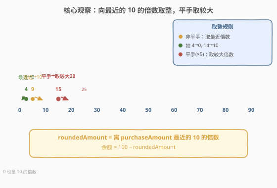
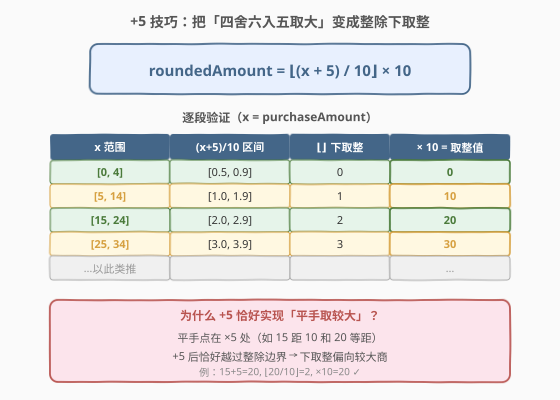
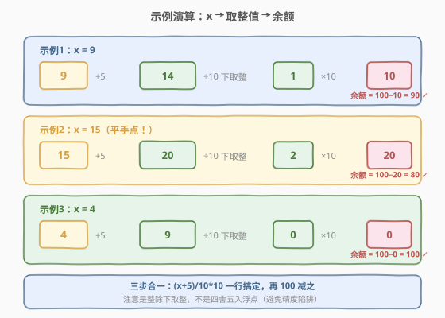

# LeetCode 取整购买后的账户余额 题解

## 1. 题目概述

- **标题 / 题号**：取整购买后的账户余额（#2806，easy）
- **链接**：https://leetcode.cn/problems/account-balance-after-rounded-purchase/
- **难度**：简单
- **标签**：数学

**题意**：一开始，你的银行账户里有 **100** 块钱。给你一个整数 `purchaseAmount`，表示你在一次购买中愿意支出的金额。

实际支出的金额会向**最近**的 **10 的倍数**取整。换句话说，你实际会支付一个**非负**金额 `roundedAmount`，满足 `roundedAmount` 是 10 的倍数且 $\lvert \text{roundedAmount} - \text{purchaseAmount}\rvert$ 的值**最小**。

如果存在多于一个最接近的 10 的倍数，**较大的倍数**是你的实际支出金额。

请你返回购买之后剩下的余额。

> ⚠️ **注意**：`0` 也是 10 的倍数。

**示例 1**：

```text
输入：purchaseAmount = 9
输出：90
解释：最接近 9 的 10 的倍数是 10。账户余额为 100 - 10 = 90。
```

**示例 2**：

```text
输入：purchaseAmount = 15
输出：80
解释：有 2 个最接近 15 的 10 的倍数：10 和 20，较大的 20 是实际开销。
     账户余额为 100 - 20 = 80。
```

**示例 3**：

```text
输入：purchaseAmount = 10
输出：90
解释：10 本身就是 10 的倍数，取整值仍为 10。账户余额为 100 - 10 = 90。
```

**约束**：

- $0 \le \text{purchaseAmount} \le 100$

> 💡 关键转化：本题只有两件事——(1) 把 `purchaseAmount` 按「最近 10 的倍数、平手取较大」规则映射到 `roundedAmount`；(2) 返回 $100 - \text{roundedAmount}$。难点全部集中在 (1) 的取整规则上。

## 2. 解题思路

### 2.1 暴力思路：枚举所有 10 的倍数

由于 $0 \le \text{purchaseAmount} \le 100$，候选倍数只有 $\{0, 10, 20, \dots, 100\}$ 共 11 个。最直接的思路：遍历这 11 个候选 $c$，找到使 $\lvert c - \text{purchaseAmount}\rvert$ 最小的 $c$；若存在两个等距候选（即平手），取较大者。

时间复杂度 $O(1)$（候选个数固定为 11），写法直观。但「枚举 11 个再比距离」掩盖了取整的本质——其实这是一道**整数取整的数学题**，可以用一个公式一步算出。

### 2.2 核心观察：+5 后整除下取整



取整规则本质是**对 10 的「四舍六入、五取大」**（round half up）：把 `purchaseAmount` 除以 10，看余数——

- 余数 $< 5$：向下取到较小的倍数（如 $9 \to 10$，$4 \to 0$）；
- 余数 $= 5$：平手，取较大的倍数（如 $15 \to 20$）；
- 余数 $> 5$：向上取到较大的倍数（如 $16 \to 20$）。

有一个经典的整数技巧能一步实现「round half up」：

$$\text{roundedAmount} = \left\lfloor \frac{\text{purchaseAmount} + 5}{10} \right\rfloor \times 10$$

即**先加 5，再除以 10 下取整，最后乘回 10**。

> ⚠️ 这里的 $\div 10$ 必须是**整除下取整**（C++/Python 的整数除法），不能用浮点四舍五入，否则可能踩到精度陷阱（如 `round(2.5)` 在 Python 中得到 2 而非 3）。

### 2.3 公式推导



为什么「+5 再下取整」恰好等价于「平手取较大」？关键在于**平手点恰好在 $\times 5$ 处**：

- $15$ 距 $10$ 和 $20$ 等距（各差 $5$），是平手点；
- $15 + 5 = 20$，$\lfloor 20/10 \rfloor = 2$，$\times 10 = 20$ —— 恰好取了较大的 $20$ ✓。

不加 5 的话，$\lfloor 15/10 \rfloor = 1$ 会得到 $10$（取较小）。**加 5 的作用是把平手点推过整除边界**，让下取整的商偏向较大一侧：

| `purchaseAmount` 范围 | `+5` 后 `/10` 区间 | 下取整 | $\times 10$ = 取整值 |
|----------------------|-------------------|--------|---------------------|
| $[0, 4]$ | $[0.5, 0.9]$ | $0$ | $0$ |
| $[5, 14]$ | $[1.0, 1.9]$ | $1$ | $10$ |
| $[15, 24]$ | $[2.0, 2.9]$ | $2$ | $20$ |
| $[25, 34]$ | $[3.0, 3.9]$ | $3$ | $30$ |
| $\dots$ | $\dots$ | $\dots$ | $\dots$ |

每个取整值覆盖一个长度为 10 的左闭右闭区间，且区间左端点恰好是 $\times 5$ 的平手点——与规则完全吻合。

### 2.4 示例演算



**示例 1：`purchaseAmount = 9`**

$9 + 5 = 14$，$\lfloor 14/10 \rfloor = 1$，$\times 10 = 10 \Rightarrow$ 余额 $= 100 - 10 = 90$ $\checkmark$

**示例 2：`purchaseAmount = 15`（平手点）**

$15 + 5 = 20$，$\lfloor 20/10 \rfloor = 2$，$\times 10 = 20 \Rightarrow$ 余额 $= 100 - 20 = 80$ $\checkmark$

**示例 3：`purchaseAmount = 4`**

$4 + 5 = 9$，$\lfloor 9/10 \rfloor = 0$，$\times 10 = 0 \Rightarrow$ 余额 $= 100 - 0 = 100$ $\checkmark$

> 💡 注意示例 3 中取整值为 $0$——题目明确「0 也是 10 的倍数」，所以买很便宜的东西（愿意支出 $0\sim4$）实际花费 $0$，余额保持 $100$。这正是为什么要加 5 而非加 4：加 4 会让 $4 \to 0.8 \to 0$ 正确，但 $5 \to 0.9 \to 0$ 就错了（$5$ 应平手取 $10$）。常数必须是**除数的一半**即 $5$。

## 3. 参考代码

### C++

```cpp
class Solution {
public:
    int accountBalanceAfterPurchase(int purchaseAmount) {
        int rounded = (purchaseAmount + 5) / 10 * 10;
        return 100 - rounded;
    }
};
```

### Python

```python
class Solution:
    def accountBalanceAfterPurchase(self, purchaseAmount: int) -> int:
        rounded = (purchaseAmount + 5) // 10 * 10
        return 100 - rounded
```

> 💡 Python 中务必用 `//`（整除下取整）而非 `/`（浮点除法）。若写成 `int((purchaseAmount + 5) / 10) * 10`，虽然本题数据范围小到不会出错，但浮点 `round` 在 `.5` 处采用「银行家舍入」（四舍六入五凑偶），与本题「五取大」语义冲突，是大坑。

## 4. 复杂度分析

| 维度 | 复杂度 | 说明 |
|------|--------|------|
| 时间复杂度 | $O(1)$ | 一次加法、一次整除、一次乘法、一次减法，常数步 |
| 空间复杂度 | $O(1)$ | 仅用若干整型标量 |

> 💡 暴力枚举 11 个倍数同样是 $O(1)$，但公式法只需一行、无循环、无比较，更体现对取整本质的理解。两者在数据范围内实测无性能差异，公式法胜在简洁。

## 5. 扩展：取整规则与「+k/2」通用模板

### 5.1 三种常见取整模式对比

| 模式 | 规则 | 整数实现 | 典型代表 |
|------|------|---------|---------|
| **向下取整**（floor） | 一律取较小倍数 | $\lfloor x/n \rfloor \times n$ | C++ 整除默认 |
| **向上取整**（ceil） | 一律取较大倍数 | $\lfloor (x+n-1)/n \rfloor \times n$ | 分页页数计算 |
| **四舍六入五取大**（round half up） | 最近倍数，平手取较大 | $\lfloor (x+n/2)/n \rfloor \times n$ | 本题 |

三者只差一个加法常数：floor 加 $0$，round half up 加 $n/2$，ceil 加 $n-1$。掌握这个「加偏移再下取整」的统一框架，就能随手写出任意取整模式。

### 5.2 为什么不用语言内置 round

多数语言的 `round` 函数在 $0.5$ 处采用**银行家舍入**（round half to even）：`round(2.5)=2`、`round(3.5)=4`。这与本题「五取大」不一致。因此涉及整数的取整时，应优先用**整数运算**（加偏移 + 整除下取整），既快又无精度坑。

## 6. 面试要点

1. **「平手取较大」如何用整数运算实现？**

   > 用 $\lfloor (x+5)/10 \rfloor \times 10$。加 5（除数 10 的一半）把平手点推过整除边界，使下取整的商偏向较大一侧，等价于 round half up。

2. **为什么加的是 5 而不是 4 或 6？**

   > 5 是除数 10 的一半。加 4 会让 $x=5$（平手点）算成 $0$ 而非 $10$；加 6 会让 $x=4$（应取 $0$）算成 $10$。只有恰好加 $n/2$ 才能让平手点正确归到较大倍数，同时不影响非平手点的归属。

3. **Python 中 `/` 和 `//` 在本题有什么区别？**

   > `/` 是浮点除法，`int((x+5)/10)` 会走浮点 round，在 `.5` 处可能触发银行家舍入；`//` 是整除下取整，结果确定且无精度问题。本题必须用 `//`。

4. **如果题目改成「向上取整」该怎么做？**

   > 改用 $\lfloor (x+9)/10 \rfloor \times 10$（加 $n-1$）。通用模板：floor 加 $0$、ceil 加 $n-1$、round half up 加 $n/2$，只改偏移常数。

5. **0 是 10 的倍数吗？对结果有何影响？**

   > 是。当 $x \in [0,4]$ 时取整值为 $0$，余额为 $100$。若误以为最小倍数是 $10$，会漏掉 $0$ 这一候选导致 $x=0$ 时多扣 $10$。

## 同类练习题

| # | 题目 | 与本题的关联 |
|---|------|-------------|
| 29 | [两数相除](https://leetcode.cn/problems/divide-two-integers/)（[题解](../0001-0100/29_两数相除.md)） | 位运算模拟除法，与本题共享「整数除法的下取整语义」底层 |
| 7 | [整数反转](https://leetcode.cn/problems/reverse-integer/) | 整数逐位运算基础，与本题同属「只用整数运算避开浮点」的数学题族 |
| 2243 | [计算分数字符串的十个字符](https://leetcode.cn/problems/calculate-digit-sum-of-a-string/) | 按 $k$ 分组取整，可对比「固定步长的整数分组」与本题「固定步长的整数取整」 |
| 1283 | [使结果不超过阈值的最小除数](https://leetcode.cn/problems/find-the-smallest-divisor-given-a-threshold/) | 二分答案 + 整除上取整求和，与本题「整数除法取整」相关但方向相反（求除数而非求余数） |
| 400 | [第 N 位数字](https://leetcode.cn/problems/nth-digit/)（[题解](../0301-0400/400_第N位数字.md)） | 按位数分层定位，与本题「按区间映射到取整值」共享「分段整数映射」思路 |
