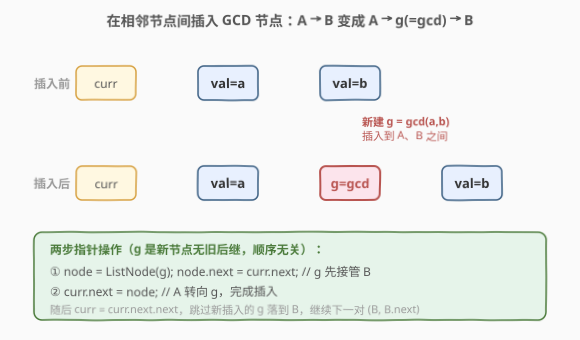
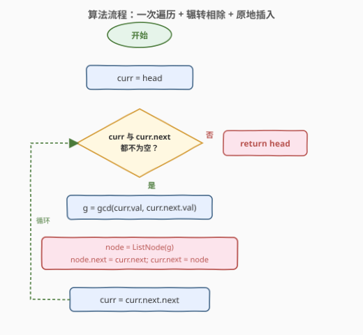
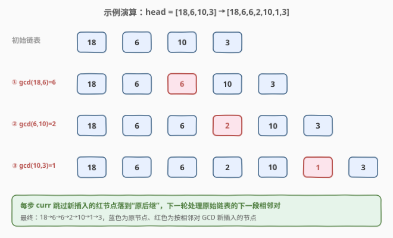

# 在链表中插入最大公约数

- **题目名称**：在链表中插入最大公约数
- **链接**：[2807. 在链表中插入最大公约数](https://leetcode.cn/problems/insert-greatest-common-divisors-in-linked-list/)
- **难度**：中等
- **标签**：链表、数学、数论

## 1. 题目概述

给你一个链表的头节点 `head`，每个节点含一个整数值。在每两个**相邻节点**之间，插入一个新节点，其值为这两个相邻节点值的**最大公约数**（GCD）。返回插入后的链表。

两个数的**最大公约数**是能同时整除这两个数的最大正整数。

**示例 1**：

```text
输入：head = [18,6,10,3]
输出：[18,6,6,2,10,1,3]
解释：
- gcd(18,6)=6，插入第 1、2 个节点之间
- gcd(6,10)=2，插入第 2、3 个节点之间
- gcd(10,3)=1，插入第 3、4 个节点之间
```

**示例 2**：

```text
输入：head = [7]
输出：[7]
解释：只有一个节点，无相邻对，返回原链表。
```

**约束条件**：

- 链表节点数目在 `[1, 5000]` 之间
- `1 <= Node.val <= 1000`

> 💡 本题是「链表指针操作」与「辗转相除法求 GCD」的简单组合：一次遍历 + 原地插入。难点不在数据结构而在 **GCD 的实现**与**指针顺序**。承接 [24. 两两交换链表中的节点](../0001-0100/24_两两交换链表中的节点.md) 的相邻对指针操作与 [2709. 最大公约数遍历](2709_最大公约数遍历.md) 的数论应用。

---

## 2. 解题思路

### 2.1 暴力思路：转数组重建

把链表所有值收集到数组，对相邻位置算 GCD，再用值序列重建一条全新链表。能过但浪费空间——多出 $O(n)$ 数组与一条新链表，且脱离了"链表原地操作"的考察意图。面试官会追问"能不能原地做、不开数组？"

> ⚠️ 暴力法的硬伤：① $O(n)$ 额外数组空间（除输出外）；② 重建新链表丢掉了"原地插入指针操作"的考察点。链表题的正解是改指针，而非搬运数据。

### 2.2 核心观察：一次遍历原地插入 + 辗转相除

关键观察：插入只发生在相邻节点**之间**，不改变头节点（头永远不会被删/换），所以**无需哑节点**，直接返回 `head` 即可。用游标 `curr` 从 `head` 出发，每轮处理 `curr` 与 `curr.next` 这一对：

1. 算 $g = \gcd(\text{curr.val}, \text{curr.next.val})$
2. 新建节点 `node(g)`
3. 两步接上：`node.next = curr.next`（$g$ 先接管后继 B）；`curr.next = node`（A 转向 $g$）
4. `curr` 前进两步：`curr = curr.next.next`（跳过刚插入的 $g$ 落到 B，准备处理下一对 `(B, B.next)`）



**GCD 的实现**：用辗转相除法（欧几里得算法），$\gcd(a,b) = \gcd(b, a \bmod b)$，直到 $b=0$ 时 $a$ 即为 GCD，单次复杂度 $O(\log(\min(a,b)))$。C++17 起可直接用 `<numeric>` 里的 `std::gcd`，Python 用 `math.gcd`，但面试常要求手写。

> 💡 **两步指针顺序**：因为 `node` 是全新节点（`next` 初为空），`node.next` 与 `curr.next` 是**不同对象的字段**，先改哪个都不覆盖对方——即便调换顺序也安全。但仍建议养成"先接后继、再改前驱"的习惯，在 [24. 两两交换链表中的节点](../0001-0100/24_两两交换链表中的节点.md) 这类**改旧节点指针**的题里能避免覆盖丢链。

### 2.3 算法流程图



**完整步骤**：

1. **初始化**：`curr = head`
2. **循环**：当 `curr` 与 `curr.next` 都非空（至少还有一对）：
   - `g = gcd(curr.val, curr.next.val)`
   - `node = ListNode(g)`
   - `node.next = curr.next`；`curr.next = node`
   - `curr = curr.next.next`（跳过新节点）
3. **返回** `head`（头未变）

> ⚠️ 循环条件 `curr && curr.next` 保证每轮都有一对完整节点。单节点链表首轮即不满足，直接返回原链表。`curr = curr.next.next` 之所以安全：插入后 `curr.next` 必为新节点 $g$，`g.next` 必为原 B（本轮 B=`curr.next` 原本存在），故 `curr.next.next` 即 B，不会空指针。

### 2.4 示例演算

以 `head = [18,6,10,3]` 为例：



| 步骤 | 处理对 | gcd | 插入后链表 | curr 落点 |
|------|--------|-----|-----------|-----------|
| 初始 | — | — | 18→6→10→3 | 节点 18 |
| ① | 18,6 | 6 | 18→6→6→10→3 | 节点 6(原) |
| ② | 6,10 | 2 | 18→6→6→2→10→3 | 节点 10 |
| ③ | 10,3 | 1 | 18→6→6→2→10→1→3 | 节点 3 |
| 结束 | 3,null | — | — | — |

最终返回 `18→6→6→2→10→1→3`，与示例 1 一致。

> 💡 注意 `curr` 每步跳过新插入的 $g$ 落到"原后继 B"，因此下一轮处理的总是原始链表里的下一段相邻对，不会在 $g$ 与 B 之间重复插入。这就是"前进两步"的含义。

---

## 3. 参考代码

### C++

```cpp
/**
 * Definition for singly-linked list.
 * struct ListNode {
 *     int val;
 *     ListNode *next;
 *     ListNode() : val(0), next(nullptr) {}
 *     ListNode(int x) : val(x), next(nullptr) {}
 *     ListNode(int x, ListNode *next) : val(x), next(next) {}
 * };
 */
class Solution {
    int gcd(int a, int b) {
        while (b != 0) {
            int t = a % b;
            a = b;
            b = t;
        }
        return a;
    }
public:
    ListNode* insertGreatestCommonDivisors(ListNode* head) {
        ListNode* curr = head;
        while (curr != nullptr && curr->next != nullptr) {
            int g = gcd(curr->val, curr->next->val);
            ListNode* node = new ListNode(g);
            node->next = curr->next;     // g 接管后继 B
            curr->next = node;            // A 转向 g
            curr = curr->next->next;      // 跳过 g，落到 B
        }
        return head;
    }
};
```

### Python

```python
# Definition for singly-linked list.
# class ListNode:
#     def __init__(self, val=0, next=None):
#         self.val = val
#         self.next = next
import math

class Solution:
    def insertGreatestCommonDivisors(self, head: Optional[ListNode]) -> Optional[ListNode]:
        curr = head
        while curr and curr.next:
            g = math.gcd(curr.val, curr.next.val)
            node = ListNode(g)
            node.next = curr.next      # g 接管后继 B
            curr.next = node           # A 转向 g
            curr = curr.next.next      # 跳过 g，落到 B
        return head
```

> 💡 C++ 手写 `gcd` 体现算法功底；实际工程可用 `std::gcd`（C++17 `<numeric>`）。Python 直接调 `math.gcd`。两版逻辑一致。注意 C++ 用 `new` 建节点，LeetCode 不要求手动释放。

---

## 4. 复杂度分析

| 维度 | 复杂度 | 说明 |
|------|--------|------|
| **时间复杂度** | $O(n \log V)$ | 遍历 $n-1$ 对，每对 GCD 为 $O(\log V)$，$V = \max(\text{Node.val}) \le 1000$ |
| **空间复杂度** | $O(1)$ | 除输出用的新节点外，只用常数个指针变量 |

> ⚠️ 新建节点是题目要求的输出组成部分，不计入辅助空间复杂度。若 GCD 用递归实现，递归深度 $O(\log V)$ 极浅（$V \le 1000$ 时约 10 层），不影响结论，但迭代写法更稳妥。

---

## 5. 扩展：递归写法与 std::gcd

### 5.1 递归写法

插入也可以递归理解：处理完当前对后，对后继子链递归插入。

```python
def insertGreatestCommonDivisors(self, head):
    if not head or not head.next:
        return head
    g = math.gcd(head.val, head.next.val)
    node = ListNode(g, head.next)   # g 直接接上后继
    head.next = node
    self.insertGreatestCommonDivisors(node.next)  # 对 B 开头的子链递归
    return head
```

代码简洁，但递归深度 $O(n)$，长链表（5000 节点）可能栈溢出，迭代法更安全。

### 5.2 C++17 std::gcd

工程中可直接用标准库，无需手写：

```cpp
#include <numeric>
int g = std::gcd(curr->val, curr->next->val);
```

`std::gcd` 对负数取绝对值、对 0 返回另一个数，行为稳健。面试时建议先手写辗转相除，再提"也可用 `std::gcd`"。

---

## 6. 面试要点

1. **为什么不需要哑节点？**

   - 插入只发生在相邻节点之间，头节点永远保留在首位，不会被删除或替换。引入哑节点反而多余。对照 [24. 两两交换链表中的节点](../0001-0100/24_两两交换链表中的节点.md)（头会变）、[21. 合并两个有序链表](../0001-0100/21_合并两个有序链表.md)（头可能换）——那两题才需要哑节点统一边界。

2. **两步赋值的顺序重要吗？**

   - 本题不重要：`node` 是新节点，`node.next` 与 `curr.next` 是不同字段，先改哪个都不覆盖对方。但养成"先接后继、再改前驱"的习惯，能在改旧节点指针的题里避免覆盖丢链。

3. **curr 为什么前进两步而不是一步？**

   - 插入后链表变成 `curr → A → g → B`。`curr` 当前在 A，若只走一步到 $g$，下一轮会处理 `(g, B)` 这对——但 $g$ 是新插入的，不该再参与。走两步 `curr.next.next` 跳过 $g$ 落到 B，下一轮处理原始链表的下一段 `(B, B.next)`。

4. **循环条件为什么是 `curr && curr.next`？**

   - 保证至少还有一对相邻节点。单节点或链尾节点不满足"两个"，自动跳过。短路求值保证 `curr` 为空时不求 `curr.next`，避免空指针。

5. **辗转相除法为什么是 $O(\log V)$？**

   - 每次取模后较大的数至少被折半（两步后较大数至少减半），故辗转次数以斐波那契数列为上界，$O(\log V)$ 收敛，$V \le 1000$ 时最多约 10 次。

> 💡 **一句话总结**：2807 是链表插入的入门题——头不变故无需哑节点，游标 `curr` 每轮算一对 GCD、两步接上、再前进两步跳过新节点。核心是**指针顺序**与**辗转相除**。$O(n \log V)$ 时间、$O(1)$ 辅助空间。

---

## 7. 同类练习题

- [24. 两两交换链表中的节点](https://leetcode.cn/problems/swap-nodes-in-pairs/)（[题解](../0001-0100/24_两两交换链表中的节点.md)）：同为相邻对链表操作，三步交换指针顺序更需防覆盖
- [21. 合并两个有序链表](https://leetcode.cn/problems/merge-two-sorted-lists/)（[题解](../0001-0100/21_合并两个有序链表.md)）：哑节点统一头处理的基础用法，对照本题为何无需哑节点
- [2. 两数相加](https://leetcode.cn/problems/add-two-numbers/)（[题解](../0001-0100/2_两数相加.md)）：链表原地构造新节点（进位）的经典模拟
- [2709. 最大公约数遍历](https://leetcode.cn/problems/greatest-common-divisor-traversal/)（[题解](2709_最大公约数遍历.md)）：GCD 进阶应用，质因子并查集判连通
- [1071. 字符串的最大公因子](https://leetcode.cn/problems/greatest-common-divisor-of-strings/)：辗转相除在字符串上的应用，GCD 算法训练
