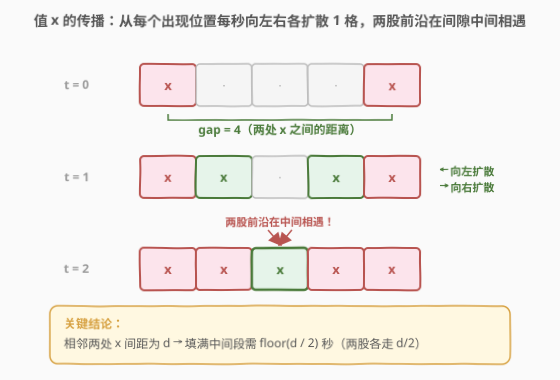
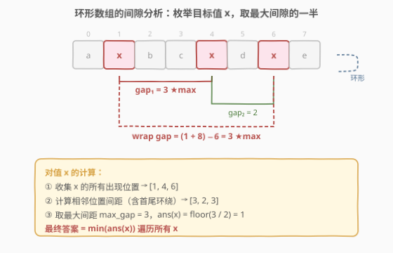
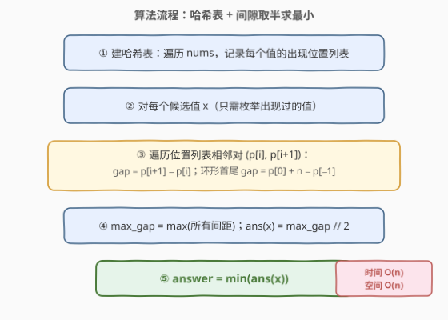
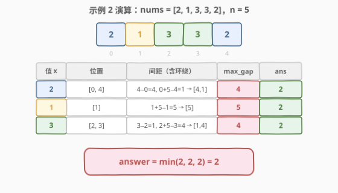

# 使循环数组所有元素相等的最少秒数

- **题目名称**：使循环数组所有元素相等的最少秒数
- **链接**：[2808. 使循环数组所有元素相等的最少秒数](https://leetcode.cn/problems/minimum-seconds-to-equalize-a-circular-array/)
- **难度**：中等
- **标签**：数组、哈希表

## 1. 题目概述

给你一个下标从 **0** 开始长度为 $n$ 的数组 `nums`。每一秒，你可以对数组执行以下操作：

- 对于范围在 $[0, n - 1]$ 内的每一个下标 $i$，将 `nums[i]` 替换成 `nums[i]`、`nums[(i - 1 + n) % n]` 或者 `nums[(i + 1) % n]` 三者之一。

**注意**，所有元素会被同时替换。

请你返回将数组 `nums` 中所有元素变成相等元素所需要的 **最少** 秒数。

**示例 1**：

```text
输入：nums = [1,2,1,2]
输出：1
解释：我们可以在 1 秒内将数组变成相等元素：
- 第 1 秒，将每个位置的元素分别变为 [nums[3],nums[1],nums[3],nums[3]]。变化后，nums = [2,2,2,2]。
1 秒是将数组变成相等元素所需要的最少秒数。
```

**示例 2**：

```text
输入：nums = [2,1,3,3,2]
输出：2
解释：我们可以在 2 秒内将数组变成相等元素：
- 第 1 秒，将每个位置的元素分别变为 [nums[0],nums[2],nums[2],nums[2],nums[3]]。变化后，nums = [2,3,3,3,3]。
- 第 2 秒，将每个位置的元素分别变为 [nums[1],nums[1],nums[2],nums[3],nums[4]]。变化后，nums = [3,3,3,3,3]。
2 秒是将数组变成相等元素所需要的最少秒数。
```

**示例 3**：

```text
输入：nums = [5,5,5,5]
输出：0
解释：不需要执行任何操作，因为一开始数组中的元素已经全部相等。
```

**约束条件**：

- $1 \leq n = \text{nums.length} \leq 10^5$
- $1 \leq \text{nums}[i] \leq 10^9$

> 💡 本题的核心是**逆向思维**：不模拟操作过程，而是枚举最终目标值 $x$，分析 $x$ 从所有出现位置「扩散」到全数组所需的时间。关键观察是——每个 $x$ 每秒向左右各扩散 1 格（类似多源 BFS），相邻两处 $x$ 之间的间隙越大，填满越慢，答案由**最大间隙**决定。承接 [994. 腐烂的橘子](../0901-1000/994_腐烂的橘子.md) 的多源 BFS 扩散思想与 [918. 最大环形子数组和](../0901-1000/918_最大环形子数组和.md) 的环形数组处理技巧。

---

## 2. 解题思路

### 2.1 暴力思路：逐步模拟 BFS

最直观的做法是对每个候选目标值 $x$，模拟扩散过程：每秒 $x$ 从所有已有位置向左右邻居扩散，直到全数组变为 $x$，记录所需秒数。最后取所有 $x$ 的最小值。

问题在于：最坏情况下 $x$ 只出现一次，扩散需要 $O(n)$ 秒，每秒模拟 $O(n)$ 个位置，单值 $O(n^2)$，所有值合计 $O(n^3)$。$n = 10^5$ 时完全不可行。

> ⚠️ 暴力法的硬伤：逐秒模拟扩散过程，每一秒都要遍历整个数组更新状态。没有利用到「间隙决定时间」的数学结构，白白做了大量重复扫描。

### 2.2 核心观察：间隙取半——多源扩散的闭式解

三个关键观察将问题从模拟转为闭式计算：

**观察一：最终值一定是数组中已有的某个值。**

每个位置只能取自身或左右邻居的值，而邻居也只能取自身或其邻居的值——值只能沿数组「传播」，无法凭空产生。因此最终统一的值必定是 `nums` 中已存在的某个值。我们只需枚举 `nums` 中出现过的所有不同值作为候选 $x$。

**观察二：每个 $x$ 每秒向左右各扩散 1 格，等效于多源 BFS。**

固定目标值 $x$，将所有值为 $x$ 的位置视为「源头」。每秒，每个源头向左、右各传播 1 格，传播到的位置也变成 $x$ 并加入传播。这恰好是多源 BFS：所有源头同时开始，以速度 1 向两侧扩展。

**观察三：相邻两个源头之间的间隙 $d$ 需要 $\lfloor d / 2 \rfloor$ 秒填满。**

两个源头分别在位置 $i$ 和 $j$（$j > i$），间距 $d = j - i$。两股扩散前沿相向而行，各走 $\lfloor d / 2 \rfloor$ 格后在中间相遇，间隙段 $[i+1, j-1]$ 被完全填满。



> 💡 间隙 $d$ 段内有 $d - 1$ 个非 $x$ 位置。若 $d$ 为偶数，两股各走 $d/2$ 格恰好相遇；若 $d$ 为奇数，两股各走 $(d-1)/2$ 格后中间剩 1 格，再走 1 秒填满——总耗时 $\lfloor d / 2 \rfloor$。这与 `max_gap // 2`（整数除法）完全一致。

**综合**：对值 $x$，收集其所有出现位置 $p_0 < p_1 < \cdots < p_{k-1}$，计算所有相邻间距（含**环形首尾环绕**间距 $p_0 + n - p_{k-1}$），取最大间距 $\text{max\_gap}$，则将全数组变为 $x$ 需要 $\text{max\_gap} // 2$ 秒。最终答案为所有候选 $x$ 中的最小值。



> ⚠️ **环形首尾间距不可遗漏**：数组是环形的，最后一个 $x$ 与第一个 $x$ 之间存在环绕间距 $p_0 + n - p_{k-1}$。若只算线性间距而漏掉环绕间距，会遗漏最长的间隙导致答案偏小。这是本题最常见的 WA 原因。

### 2.3 算法流程图



**完整步骤**：

1. **建哈希表**：遍历 `nums`，用哈希表 `pos` 收集每个值的出现位置列表（天然有序，因为按下标遍历）
2. **枚举候选值**：对哈希表中的每个值 $x$，取其位置列表
3. **计算间距**：遍历相邻位置对 $(p[i], p[i+1])$，算间距 $p[i+1] - p[i]$；额外算环形首尾间距 $p[0] + n - p[-1]$
4. **取最大间距**：$\text{max\_gap} = \max(\text{所有间距})$，$\text{ans}(x) = \text{max\_gap} // 2$
5. **求最小**：$\text{answer} = \min(\text{ans}(x))$，遍历所有 $x$

> 💡 **初始化技巧**：`ans` 初始化为 $n$（而非 `INT_MAX`），因为最坏情况是某值只出现一次，$\text{max\_gap} = n$，$\text{ans} = n // 2 < n$，$n$ 是安全的上界。所有元素相同时 $\text{ans} = 0$，自然取到最小。

### 2.4 示例演算

以 `nums = [2, 1, 3, 3, 2]`（$n = 5$）为例：



| 值 $x$ | 出现位置 | 间距（含环绕） | max\_gap | ans = max\_gap // 2 |
|---------|----------|---------------|----------|---------------------|
| 2 | $[0, 4]$ | $4 - 0 = 4$，$0 + 5 - 4 = 1$ → $[4, 1]$ | 4 | 2 |
| 1 | $[1]$ | $1 + 5 - 1 = 5$ → $[5]$ | 5 | 2 |
| 3 | $[2, 3]$ | $3 - 2 = 1$，$2 + 5 - 3 = 4$ → $[1, 4]$ | 4 | 2 |

三个候选值的 ans 均为 2，最终答案 $= \min(2, 2, 2) = 2$，与示例一致。

> 💡 注意 $x = 1$ 只出现一次，其唯一间隙是环绕整圈的 $n = 5$，$\lfloor 5 / 2 \rfloor = 2$——单源扩散到最远点（距离 $\lfloor n/2 \rfloor$）需要 2 秒。这验证了「只出现一次」的退化情况也能被间隙公式正确覆盖。

---

## 3. 参考代码

### C++

```cpp
class Solution {
public:
    int minimumSeconds(vector<int>& nums) {
        int n = nums.size();
        unordered_map<int, vector<int>> pos;
        for (int i = 0; i < n; i++) {
            pos[nums[i]].push_back(i);
        }
        int ans = n;
        for (auto& [val, positions] : pos) {
            int maxGap = positions[0] + n - positions.back();
            for (int i = 1; i < (int)positions.size(); i++) {
                maxGap = max(maxGap, positions[i] - positions[i - 1]);
            }
            ans = min(ans, maxGap / 2);
        }
        return ans;
    }
};
```

### Python

```python
class Solution:
    def minimumSeconds(self, nums: List[int]) -> int:
        n = len(nums)
        pos = defaultdict(list)
        for i, v in enumerate(nums):
            pos[v].append(i)
        ans = n
        for positions in pos.values():
            max_gap = positions[0] + n - positions[-1]  # 环形首尾环绕间距
            for i in range(1, len(positions)):
                max_gap = max(max_gap, positions[i] - positions[i - 1])
            ans = min(ans, max_gap // 2)
        return ans
```

> 💡 两版逻辑完全一致。C++ 用 `unordered_map<int, vector<int>>` 收集位置；Python 用 `defaultdict(list)`。位置列表天然有序（按下标遍历），无需额外排序。环形首尾间距 `positions[0] + n - positions[-1]` 是容易遗漏的边界，务必单独计算。

---

## 4. 复杂度分析

| 维度 | 复杂度 | 说明 |
|------|--------|------|
| **时间复杂度** | $O(n)$ | 遍历一次建哈希表 $O(n)$；遍历所有位置列表合计 $O(n)$（每个元素恰好被访问一次）；总计 $O(n)$ |
| **空间复杂度** | $O(n)$ | 哈希表存储所有元素的位置，最坏 $n$ 个不同值各 1 个位置，或 1 个值 $n$ 个位置，均为 $O(n)$ |

> ⚠️ 虽然有两层循环（外层遍历不同值，内层遍历位置列表），但内层访问的位置总数恰为 $n$（每个数组元素恰好出现在一个位置列表中），故总时间为 $O(n)$ 而非 $O(n^2)$。这是「均摊分析」的典型应用。

---

## 5. 扩展：为什么最终值必须是数组中已有的值？

**反证法**：假设最终所有元素变为 $v$，而 $v$ 不在原数组中。考虑第 0 秒（初始状态），没有任何位置的值为 $v$。第 1 秒时，每个位置只能取自身或邻居的值——而此时所有值都来自初始数组，不可能出现 $v$。归纳可知，任意时刻数组的值域始终是初始数组值域的子集，$v$ 永远不可能出现。矛盾。

更直观的理解：值的传播像「染色」——只有已有的颜色才能扩散，不可能凭空产生新颜色。每个位置每秒从自身和两个邻居中选一个值「复制」，复制操作不创造新值。

**与多源 BFS 的等价性**：固定目标值 $x$，将 $x$ 的出现位置视为 BFS 的初始源点集合。每秒所有 $x$ 位置向左右邻居扩散，邻居变为 $x$ 后加入下一轮扩散——这恰好是多源 BFS 的层序扩展。BFS 的最大层数即为最远点到最近源点的距离，对应最大间隙的一半。

---

## 6. 面试要点

1. **为什么最终值必须是数组中已有的值？**

   - 每秒的替换操作本质是「从自身和两个邻居中复制一个值」，不创造新值。归纳可知任意时刻值域是初始值域子集，故最终统一值必在原数组中。只需枚举出现过的值作为候选。

2. **为什么间隙 $d$ 的填充时间是 $\lfloor d / 2 \rfloor$ 而不是 $d - 1$？**

   - 间隙两端的 $x$ 同时向中间扩散（双源相向而行），各走 $\lfloor d / 2 \rfloor$ 步后相遇。若只有一个源（间隙只在一端有 $x$），则需 $d - 1$ 步——但本题中每个间隙两端都有 $x$，故双源合流将时间减半。

3. **环形首尾间距怎么算？为什么不能忽略？**

   - 环形数组中，最后一个 $x$ 的位置 $p_{k-1}$ 与第一个 $x$ 的位置 $p_0$ 之间存在环绕间隙 $p_0 + n - p_{k-1}$。忽略它会漏掉可能的最大间隙，导致答案偏小。例如 `[2,1,3,3,2]` 中 $x = 3$ 的环绕间距 $2 + 5 - 3 = 4$ 恰好是最大间隙。

4. **`ans` 初始化为 $n$ 而非 `INT_MAX` 有什么好处？**

   - 最坏情况（某值只出现一次）的最大间隙为 $n$，$\text{ans} = n // 2 < n$，故 $n$ 是安全上界。用 $n$ 比 `INT_MAX` 更语义化，直接表达「不超过半圈」的物理含义。

5. **两层循环为什么是 $O(n)$ 而非 $O(n^2)$？**

   - 外层遍历不同值，内层遍历该值的位置列表。所有位置列表的长度之和恰为 $n$（每个元素恰好属于一个列表），故内层总工作量为 $O(n)$。这是均摊分析的标准结论。

> 💡 **一句话总结**：2808 的精髓在于将「逐秒模拟扩散」转化为「枚举目标值 + 间隙取半」的闭式计算——哈希表收集位置，最大间距除以 2 即为单值答案，取最小即为最终结果。$O(n)$ 时间、$O(n)$ 空间。核心洞察是多源 BFS 扩散的双源合流减半效应。

---

## 7. 同类练习题

- [994. 腐烂的橘子](https://leetcode.cn/problems/rotting-oranges/)（[题解](../0901-1000/994_腐烂的橘子.md)）：多源 BFS 扩散的标杆题，每秒所有腐烂橘子向四周扩散，求填满时间——与本题「值 x 扩散」思想完全同构
- [918. 最大环形子数组和](https://leetcode.cn/problems/maximum-sum-circular-subarray/)（[题解](../0901-1000/918_最大环形子数组和.md)）：环形数组处理的经典题，首尾衔接的技巧与本题环绕间距计算一脉相承
- [2134. 最少交换次数来组合所有的 1 II](https://leetcode.cn/problems/minimum-swaps-to-group-all-1s-together-ii/)：环形数组 + 滑动窗口，将环形展开为线性的技巧与本题位置列表环绕间距处理同源
- [2439. 最小化数组中的最大值](https://leetcode.cn/problems/minimize-maximum-of-array/)（[题解](../2401-2500/2439_最小化数组中的最大值.md)）：「使所有元素接近相等」的变体，用二分答案 + 贪心验证，对照本题的枚举目标值思路
