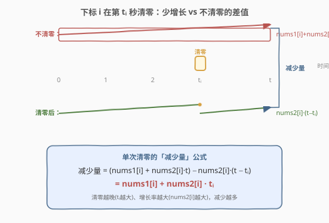
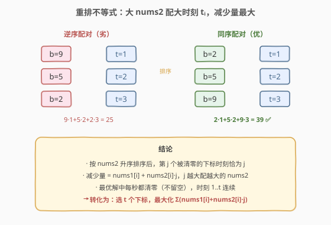
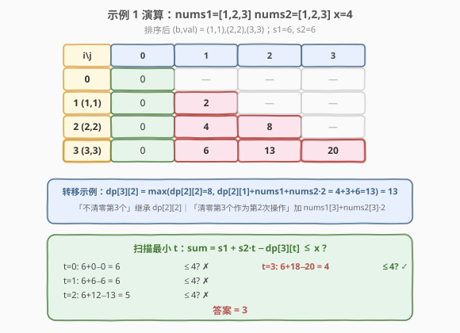

# LeetCode 使数组和小于等于 x 的最少时间 题解

## 1. 题目概述

- **标题 / 题号**：使数组和小于等于 x 的最少时间（#2809，hard）
- **链接**：https://leetcode.cn/problems/minimum-time-to-make-array-sum-at-most-x/
- **难度**：困难
- **标签**：数组、动态规划、排序、重排不等式、0-1 背包

**题意**：给定两个下标从 **0** 开始、长度相等的整数数组 `nums1` 和 `nums2`。每一秒，对所有下标 `0 <= i < nums1.length`，`nums1[i]` 都增加 `nums2[i]`。操作**完成后**，可执行：

- 选择任一满足 `0 <= i < nums1.length` 的下标 `i`，令 `nums1[i] = 0`。

同时给定整数 `x`。返回使 `nums1` 中所有元素之和**小于等于** `x` 所需的**最少**时间，若无法实现返回 `-1`。

**示例 1**：

```text
输入：nums1 = [1,2,3], nums2 = [1,2,3], x = 4
输出：3
解释：
第 1 秒，对 i = 0 操作，得到 nums1 = [0,2+2,3+3] = [0,4,6]。
第 2 秒，对 i = 1 操作，得到 nums1 = [0+1,0,6+3] = [1,0,9]。
第 3 秒，对 i = 2 操作，得到 nums1 = [1+1,0+2,0] = [2,2,0]。
此时 nums1 的和为 4。不存在更少次数的操作，故返回 3。
```

**示例 2**：

```text
输入：nums1 = [1,2,3], nums2 = [3,3,3], x = 4
输出：-1
解释：无论如何操作，nums1 的和总会超过 x。
```

**约束**：

- $1 \leq \text{nums1.length} \leq 10^3$
- $1 \leq \text{nums1[i]} \leq 10^3$
- $0 \leq \text{nums2[i]} \leq 10^3$
- $\text{nums1.length} == \text{nums2.length}$
- $0 \leq x \leq 10^6$

> 💡 本题的难点不在数据结构，而在**建模**：要把"何时清零哪个下标"的最优化，转化为一个可 DP 的"选若干下标、按 nums2 排序后第 $j$ 个清零贡献 $\text{nums1}[i]+\text{nums2}[i]\cdot j$"的子集选取问题。三个关键步骤——①证明每个下标最多清零一次；②用重排不等式确定清零顺序；③用 0-1 背包式 DP 求最大减少量——缺一不可。

## 2. 解题思路

### 2.1 暴力思路

每一秒要么对某个下标清零（每个下标最多一次，最多 $n$ 个），要么不清零。朴素枚举所有"操作序列"：从 $n$ 个下标中选若干个并全排列，复杂度 $O(\sum_{k} \binom{n}{k} k!)$，$n=1000$ 时直接爆炸。

> 💡 暴力的浪费在于：①不知道哪些下标值得清零；②不知道清零顺序如何影响结果。先把这两个问题想清楚，操作序列的选择就塌缩成一个背包问题。

### 2.2 核心观察：减少量公式 + 重排不等式定序



**观察一：每个下标最多清零一次。** 若对同一下标 $i$ 清零两次（时刻 $t_1 < t_2$），第一次清零后的增长全部被第二次覆盖；把第一次清零删掉、其后的操作整体"左移一秒"，总时间少 1 而结果不变或更优。故最优解中每个下标至多清零一次。

**观察二：单次清零的减少量只与时刻有关。** 设下标 $i$ 在第 $t_i$ 秒被清零，最终总时间为 $t$。

- **不清零**：第 $t$ 秒末值为 $\text{nums1}[i] + \text{nums2}[i]\cdot t$（全程增长）。
- **清零**：$t_i$ 秒末置 0，之后又增长 $t - t_i$ 秒，末值为 $\text{nums2}[i]\cdot(t - t_i)$。

两者之差即"减少量"：

$$
\text{减少量}(i, t_i) = \bigl(\text{nums1}[i] + \text{nums2}[i]\cdot t\bigr) - \text{nums2}[i]\cdot(t - t_i) = \text{nums1}[i] + \text{nums2}[i]\cdot t_i
$$

> ⚠️ 关键：减少量与最终时间 $t$ **无关**，只取决于清零时刻 $t_i$。$t_i$ 越大、$\text{nums2}[i]$ 越大，减少越多。

**观察三：总和公式。** 设 $S_1 = \sum \text{nums1}$，$S_2 = \sum \text{nums2}$，被清零下标集合为 $O$。第 $t$ 秒末总和为

$$
\text{sum}(t) = S_1 + S_2\cdot t - \sum_{i \in O}\bigl(\text{nums1}[i] + \text{nums2}[i]\cdot t_i\bigr)
$$

即"原始全增长的总和"减去"清零带来的减少量"。目标 $\text{sum}(t) \le x$，等价于**最大化减少量**。

**观察四：重排不等式定清零顺序。** 若选 $k$ 个下标在时刻 $1,2,\dots,k$ 清零（见下"不留空"），减少量 $= \sum \text{nums1}[i_j] + \sum \text{nums2}[i_j]\cdot j$。其中 $\sum \text{nums1}[i_j]$ 只取决于选了谁，而 $\sum \text{nums2}[i_j]\cdot j$ 取决于"谁配哪个时刻"。由**重排不等式**，两序列同序排列时乘积和最大——把较大的 $\text{nums2}$ 配较大的时刻 $j$：



因此**按 $\text{nums2}$ 升序排序**后，第 $j$ 个被清零的下标恰好取时刻 $j$，减少量最大。

**观察五：每秒都清零（不留空）最优。** 若某秒空闲（不清零任何下标），可把该秒用来清零一个新下标，减少量只增不减（$\text{nums1}[i]\ge 1$）。故最优解中时刻 $1,2,\dots,t$ 连续、恰好清零 $t$ 个下标，且 $t \le n$（每个下标最多一次）。超出 $n$ 后无新下标可清，$S_2\cdot t$ 持续增长只会更差。

> 💡 综合四、五：最终问题 = **从 $n$ 个（按 $\text{nums2}$ 升序排好的）下标中选 $t$ 个，第 $j$ 个贡献 $\text{nums1}[i]+\text{nums2}[i]\cdot j$，求 $t\in[0,n]$ 中使 $S_1+S_2\cdot t - \text{最大减少量}(t) \le x$ 的最小值。**

### 2.3 算法流程图

1. 计算 $S_1 = \sum\text{nums1}$、$S_2 = \sum\text{nums2}$。
2. 将下标按 $\text{nums2}$ **升序**排序，得到 $(b_i, a_i)$ 序列（$b_i=\text{nums2}[i]$，$a_i=\text{nums1}[i]$）。
3. **01 背包式 DP**：$dp[j]$ = 前 $i$ 个元素中选 $j$ 个清零的最大减少量（滚动一维）。
   - 初始 $dp[0]=0$，其余为 $0$。
   - 对每个元素 $(b, a)$，$j$ 从 $i+1$ **倒序**到 $1$：

     $$dp[j] = \max\bigl(dp[j],\; dp[j-1] + a + b\cdot j\bigr)$$

     「不清零当前元素」继承 $dp[j]$；「清零当前元素作为第 $j$ 次」加 $a + b\cdot j$。
4. 扫描 $t = 0, 1, \dots, n$，找第一个满足 $S_1 + S_2\cdot t - dp[t] \le x$ 的 $t$；若无则返回 $-1$。

> ⚠️ **滚动方向**：$dp[j]$ 依赖上一轮的 $dp[j]$（不清零）和 $dp[j-1]$（清零）。$j$ **倒序**保证读到的 $dp[j-1]$ 仍是上一轮旧值，与 [416. 分割等和子集](../0401-0500/416_分割等和子集.md) 的 0-1 背包滚动写法完全一致。同时 $j$ 上界限制为 $i+1$（已处理的元素个数），避免用"0 个元素凑 $j>0$"的非法状态。

### 2.4 示例演算

以 `nums1 = [1,2,3], nums2 = [1,2,3], x = 4` 为例。$S_1=6, S_2=6$，排序后 $(b,a)=(1,1),(2,2),(3,3)$。



$dp$ 表演化（行=已处理元素数 $i$，列=清零次数 $j$）：

| $i$ (元素) | $j=0$ | $j=1$ | $j=2$ | $j=3$ |
|------------|-------|-------|-------|-------|
| 0（初始）  | 0     | —     | —     | —     |
| 1 (1,1)    | 0     | 2     | —     | —     |
| 2 (2,2)    | 0     | 4     | 8     | —     |
| 3 (3,3)    | 0     | 6     | 13    | 20    |

> 💡 以 $dp[3][2]=13$ 为例：不清零第 3 个 → 继承 $dp[2][2]=8$；清零第 3 个作为第 2 次操作 → $dp[2][1] + \text{nums1}[3] + \text{nums2}[3]\cdot 2 = 4 + 3 + 6 = 13$。取较大者 $13$。

最终 $dp=[0,6,13,20]$，扫描：

| $t$ | $S_1+S_2\cdot t - dp[t]$ | $\le 4$? |
|-----|--------------------------|----------|
| 0   | $6+0-0=6$                | ✗        |
| 1   | $6+6-6=6$                | ✗        |
| 2   | $6+12-13=5$              | ✗        |
| 3   | $6+18-20=4$              | ✓        |

答案为 **3**。

## 3. 参考代码

### C++（一维滚动 DP）

```cpp
class Solution {
  public:
    int minimumTime(vector<int>& nums1, vector<int>& nums2, int x) {
        int n = nums1.size();
        vector<pair<int, int>> a(n);
        for (int i = 0; i < n; ++i)
            a[i] = {nums2[i], nums1[i]};          // 按 nums2 排序，故 first 放 nums2
        sort(a.begin(), a.end());                  // nums2 升序

        vector<int> dp(n + 1, 0);                  // dp[j] = 选 j 个清零的最大减少量
        for (int i = 0; i < n; ++i) {
            int b = a[i].first, v = a[i].second;
            for (int j = i + 1; j >= 1; --j) {     // j 倒序 + 上界 i+1
                dp[j] = max(dp[j], dp[j - 1] + v + b * j);
            }
        }

        long long s1 = accumulate(nums1.begin(), nums1.end(), 0LL);
        long long s2 = accumulate(nums2.begin(), nums2.end(), 0LL);
        for (int t = 0; t <= n; ++t) {
            if (s1 + s2 * t - dp[t] <= x) return t;
        }
        return -1;
    }
};
```

### Python

```python
class Solution:
    def minimumTime(self, nums1: List[int], nums2: List[int], x: int) -> int:
        n = len(nums1)
        a = sorted(zip(nums2, nums1))            # 按 nums2 升序

        dp = [0] * (n + 1)                       # dp[j] = 选 j 个清零的最大减少量
        for i in range(n):
            b, v = a[i]
            for j in range(i + 1, 0, -1):        # j 倒序 + 上界 i+1
                dp[j] = max(dp[j], dp[j - 1] + v + b * j)

        s1, s2 = sum(nums1), sum(nums2)
        for t in range(n + 1):
            if s1 + s2 * t - dp[t] <= x:
                return t
        return -1
```

> 💡 **正确性要点**：内层 $j$ 的上界取 $i+1$（而非 $n$）是防错关键——它保证 $dp[j-1]$ 引用的"上一轮 $j-1$ 次操作"状态是合法的（不超过已处理元素数）。比较时用 `long long` 防 $S_2\cdot t$（可达 $10^9$）与 $dp[t]$ 相减溢出。

## 4. 复杂度分析

| 维度       | 复杂度          | 说明                                                       |
|------------|-----------------|------------------------------------------------------------|
| 时间复杂度 | $O(n^2)$        | 排序 $O(n\log n)$ + DP 双重循环 $\sum_{i=1}^{n} i = O(n^2)$ |
| 空间复杂度 | $O(n)$          | 一维滚动数组 $dp$，长度 $n+1$                              |

> 💡 $n \le 10^3$ 时 $n^2 = 10^6$，完全在时限内。二维 $O(n^2)$ 空间也可过，但滚动到一维是面试加分项。

## 5. 扩展：为什么时刻 1..t 连续而不"先空转再清零"？

直觉上"先让数组增长、最后集中清零"似乎能减少更多——因为清零时刻 $t_i$ 越大、减少量 $\text{nums1}[i]+\text{nums2}[i]\cdot t_i$ 越大。但这忽略了**空转期间所有未清零元素也在增长**：总和 $S_1+S_2\cdot t$ 中 $t$ 增大同样推高基线。

形式化地，设选 $k$ 个下标在末尾时刻 $t-k+1,\dots,t$ 清零，减少量 $= \sum a_{i_j} + (t-k)\sum b_{i_j} + \sum b_{i_j}\cdot j$，代入总和：

$$
\text{sum} = S_1 + S_2\cdot t - \sum a_{i_j} - (t-k)\sum b_{i_j} - \sum b_{i_j}\cdot j
$$

其中 $(t-k)\sum b_{i_j}$ 恰好抵消了空转带来的部分增长，但 $S_2\cdot t$ 仍含**未清零元素**在空转期的增长（$\sum_{\notin O} b_i \cdot t$）。把空转秒改作清零新下标：减少量新增 $\text{nums1}[i]+\text{nums2}[i]\cdot t_i \ge 0$，$t$ 不变，sum 只降不升。故"不留空"严格更优，时刻必为 $1..t$ 连续。

## 6. 面试要点

1. **为什么每个下标最多清零一次？**

   - 若下标 $i$ 被清零两次（$t_1 < t_2$），$t_1$ 到 $t_2$ 间的增长被第二次清零完全抹除，第一次清零"白做"。删掉第一次、后续操作左移一秒，总时间 $-1$ 而末状态不变。故最优解无重复清零。

2. **减少量公式是怎么推出的？为什么和最终时间 $t$ 无关？**

   - 不清零末值 $\text{nums1}[i]+\text{nums2}[i]\cdot t$；清零末值 $\text{nums2}[i]\cdot(t-t_i)$（清零后再生 $t-t_i$ 秒）。相减后 $t$ 的项 $\text{nums2}[i]\cdot t$ 抵消，得 $\text{nums1}[i]+\text{nums2}[i]\cdot t_i$。这意味着减少量是"清零时刻的局部量"，可独立 DP。

3. **为什么按 nums2 升序排序？**

   - 选定 $k$ 个下标后，减少量中 $\sum \text{nums1}$ 固定，最大化 $\sum \text{nums2}[i_j]\cdot j$。由重排不等式，两序列同序相乘和最大——大的 $\text{nums2}$ 配大的 $j$。排序后第 $j$ 个清零者自然取时刻 $j$，无需再枚举排列。

4. **DP 状态为什么是"选 $j$ 个的最大减少量"而非"前 $i$ 秒的最小总和"？**

   - 直接按时间 DP 会有"每秒选哪个下标"的排列维度，状态爆炸。把视角转为"选哪些下标清零 + 按贡献加和"，贡献 $a_i+b_i\cdot j$ 只依赖"它是第几个被选的"（排序后确定），于是塌缩成 01 背包：选或不选当前元素，转移 $O(1)$。

5. **滚动数组为什么 $j$ 倒序、上界取 $i+1$？**

   - 倒序：$dp[j]$ 依赖上一轮 $dp[j]$ 和 $dp[j-1]$，倒序更新保证读 $dp[j-1]$ 时它尚未被本轮覆盖，与 0-1 背包同理。上界 $i+1$：已处理 $i+1$ 个元素最多选 $i+1$ 个，避免用 0 元素凑出"假阳性"的 $j>0$ 状态。

6. **答案为什么在 $[0, n]$ 内？**

   - 每个下标最多清零一次，故最多 $n$ 次操作、$t\le n$。$t>n$ 后无新下标可清，减少量固定，而 $S_2\cdot t$ 继续增长（$S_2\ge 0$），sum 只增不减，不可能更优。

## 同类练习题

| # | 题目 | 与本题的关联 |
|---|------|-------------|
| 416 | [分割等和子集](https://leetcode.cn/problems/partition-equal-subset-sum/)（[题解](../0401-0500/416_分割等和子集.md)） | 0-1 背包选子集母题，对比"选 j 个使减少量最大"的滚动写法 |
| 1049 | [最后一块石头的重量 II](https://leetcode.cn/problems/last-stone-weight-ii/)（[题解](../1001-1100/1049_最后一块石头的重量II.md)） | 0-1 背包求最值，同样"赋 ±号求两组差最小"的建模转换 |
| 474 | [一和零](https://leetcode.cn/problems/ones-and-zeroes/)（[题解](../0401-0500/474_一和零.md)） | 二维费用 0-1 背包，巩固"倒序滚动 + 上界剪枝"的写法 |
| 646 | [最长数对链](https://leetcode.cn/problems/maximum-length-of-pair-chain/)（[题解](../0601-0700/646_最长数对链.md)） | 排序预处理 + 贪心/DP，对比"先排序再 DP"的通用范式 |
| 377 | [组合总和 IV](https://leetcode.cn/problems/combination-sum-iv/)（[题解](../0301-0400/377_组合总和IV.md)） | 完全背包求排列数，对比外层元素/外层容量的循环顺序差异 |
