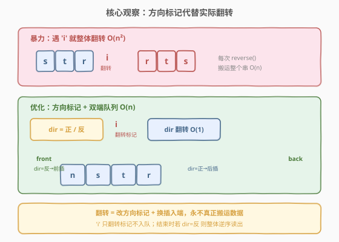
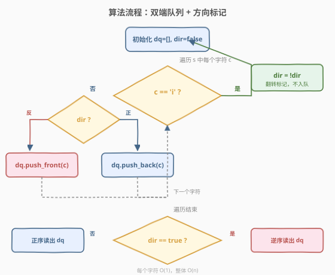
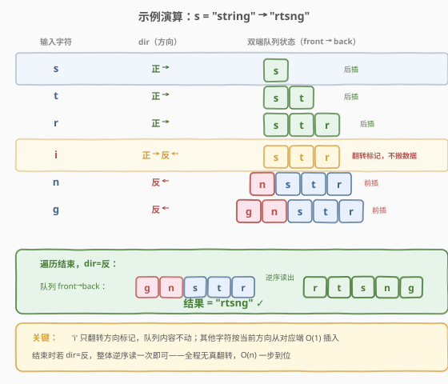

# LeetCode 故障键盘 题解

## 1. 题目概述

- **标题 / 题号**：故障键盘（#2810，easy）
- **链接**：https://leetcode.cn/problems/faulty-keyboard/
- **难度**：简单
- **标签**：字符串、模拟

**题意**：你的笔记本键盘存在故障，每当你在上面输入字符 `'i'` 时，它会**反转**你当前所写的字符串。而输入其他字符则可以正常工作。

给你一个下标从 **0** 开始的字符串 `s`，请你用故障键盘依次输入每个字符。返回最终笔记本屏幕上输出的字符串。

**示例 1**：

```text
输入：s = "string"
输出："rtsng"
解释：
输入第 1 个字符后，屏幕上的文本是："s"。
输入第 2 个字符后，屏幕上的文本是："st"。
输入第 3 个字符后，屏幕上的文本是："str"。
因为第 4 个字符是 'i'，屏幕上的文本被反转，变成 "rts"。
输入第 5 个字符后，屏幕上的文本是："rtsn"。
输入第 6 个字符后，屏幕上的文本是："rtsng"。
因此，返回 "rtsng"。
```

**示例 2**：

```text
输入：s = "poiinter"
输出："ponter"
解释：
输入第 1 个字符后，屏幕上的文本是："p"。
输入第 2 个字符后，屏幕上的文本是："po"。
因为第 3 个字符是 'i'，屏幕上的文本被反转，变成 "op"。
因为第 4 个字符是 'i'，屏幕上的文本被反转，变成 "po"。
输入第 5 个字符后，屏幕上的文本是："pon"。
输入第 6 个字符后，屏幕上的文本是："pont"。
输入第 7 个字符后，屏幕上的文本是："ponte"。
输入第 8 个字符后，屏幕上的文本是："ponter"。
因此，返回 "ponter"。
```

**约束**：

- $1 \le \text{s.length} \le 100$
- `s` 由小写英文字母组成
- `s[0] != 'i'`

> 💡 关键转化：本题只有两种操作——(1) 遇到 `'i'` 时**反转**当前字符串；(2) 遇到其他字符时**追加**到末尾。难点不在逻辑，而在「每次反转搬运整个串」的高昂代价——可以用方向标记把它降为 $O(1)$。

## 2. 解题思路

### 2.1 暴力思路：遇到 'i' 就真反转

最直接的模拟：维护一个字符串 `res`，逐个读入字符 `c`——

- 若 `c == 'i'`：对 `res` 整体执行一次 `reverse`，时间 $O(n)$；
- 否则：`res.push_back(c)`，时间 $O(1)$。

由于 `s` 中最多有 $n$ 个 `'i'`，最坏情况下每次都要翻转长度递增的串，总时间 $O(n^2)$。本题 $n \le 100$ 足以通过，但「每次真反转搬运整个串」掩盖了问题的本质——**反转只是改变了书写方向，并没有改变内容**。

### 2.2 核心观察：方向标记代替实际翻转



关键洞察是：**翻转不改变字符集合，只改变书写方向**。因此我们不必真的搬运数据，只需记住「当前该从哪头写」：

- 维护一个**双端队列** `dq` 和一个**方向标记** `dir`（`false`=正，`true`=反）；
- 遇到 `'i'`：**只翻转 `dir`**，不搬任何数据，$O(1)$；
- 遇到其他字符 `c`：
  - `dir == false`（正）→ `dq.push_back(c)`，从右端写；
  - `dir == true`（反）→ `dq.push_front(c)`，从左端写；
- 遍历结束后，若 `dir == false`，正序读出 `dq`；若 `dir == true`，逆序读出 `dq`。

> ⚠️ 注意 `push_front` 是「逐字符前插」，不是把整段插到前面。每个字符独立判断方向后插入对应端，因此能正确还原「反转后继续追加」的语义。

这样每个字符都是 $O(1)$（双端队列两端插入均摊常数），总时间降到 $O(n)$。

### 2.3 算法流程图



流程概括为三步：

1. **初始化**：`dq = []`，`dir = false`；
2. **遍历 `s`**：`'i'` 翻转 `dir`，其他字符按 `dir` 从对应端插入；
3. **收尾**：`dir == true` 则逆序读出 `dq`，否则正序读出。

### 2.4 示例演算



以 `s = "string"` 为例，逐步追踪队列状态与方向标记：

| 输入字符 | dir | 操作 | 队列（front → back） |
|---------|-----|------|---------------------|
| `s` | 正 | push_back | `[s]` |
| `t` | 正 | push_back | `[s, t]` |
| `r` | 正 | push_back | `[s, t, r]` |
| `i` | 正→反 | 翻转标记 | `[s, t, r]`（不动） |
| `n` | 反 | push_front | `[n, s, t, r]` |
| `g` | 反 | push_front | `[g, n, s, t, r]` |

遍历结束，`dir = 反`，逆序读出 `[g, n, s, t, r]` 得到 `"rtsng"` ✓。

> 💡 注意第 4 行 `'i'`：队列内容**完全没有移动**，只是 `dir` 从正翻成反——这就是「方向标记代替翻转」的精髓。

## 3. 参考代码

### C++

```cpp
class Solution {
public:
    string finalString(string s) {
        deque<char> dq;
        bool rev = false;
        for (char c : s) {
            if (c == 'i') rev = !rev;
            else (rev ? dq.push_front(c) : dq.push_back(c));
        }
        string res(dq.begin(), dq.end());
        if (rev) reverse(res.begin(), res.end());
        return res;
    }
};
```

### Python

```python
from collections import deque

class Solution:
    def finalString(self, s: str) -> str:
        dq = deque()
        rev = False
        for c in s:
            if c == 'i':
                rev = not rev
            elif rev:
                dq.appendleft(c)
            else:
                dq.append(c)
        res = ''.join(dq)
        return res[::-1] if rev else res
```

> 💡 两种语言都用**双端队列**（`std::deque` / `collections.deque`）保证两端插入均为 $O(1)$。收尾时只做**一次**整体反转（或切片逆序），而非每次遇 `'i'` 都反转。

## 4. 复杂度分析

| 维度 | 复杂度 | 说明 |
|------|--------|------|
| 时间复杂度 | $O(n)$ | 每个字符 $O(1)$：`'i'` 翻转标记，其他字符双端队列端插；收尾至多一次 $O(n)$ 反转 |
| 空间复杂度 | $O(n)$ | 双端队列存储全部非 `'i'` 字符，最坏 $n$ 个 |

> 💡 暴力法时间 $O(n^2)$、空间 $O(n)$；本题 $n \le 100$ 二者实测无差异，但方向标记法在 $n$ 更大时（如 $10^5$）优势显著，是更本质的解法。

## 5. 扩展：奇偶抵消与分段视角

### 5.1 连续两个 'i' 相互抵消

观察示例 2 `"poiinter"`：第 3、4 个字符都是 `'i'`，方向翻转两次后又回到正——**两个 `'i'` 恰好抵消**。这是因为反转是**对合操作**（involution）：反转两次等于没反转。因此只有 `'i'` 出现次数的**奇偶性**影响最终方向，连续的 `'i'` 可以成对消除。

### 5.2 按 'i' 分段的等价视角

把 `s` 按 `'i'` 切成若干段 $\text{seg}_0, \text{seg}_1, \dots, \text{seg}_k$（第 $j$ 段前方恰好有 $j$ 个 `'i'`）。方向标记的初值为正，每遇一个 `'i'` 翻转一次，因此：

- 第 $j$ 段进入时的方向 = $j$ 的奇偶性（偶数→正，奇数→反）。

以 `s = "string"` 为例：$\text{seg}_0 = \text{"str"}$、$\text{seg}_1 = \text{"ng"}$。

- $\text{seg}_0$（$j=0$，正）：正序写在右端；
- $\text{seg}_1$（$j=1$，反）：逐字符前插，等价于逆序写在左端。

最终结果 $= \text{reverse}(\text{seg}_0) + \text{seg}_1 = \text{"rts"} + \text{"ng"} = \text{"rtsng"}$ ✓。

这一视角说明：**双端队列的方向标记，本质上是在做「分段交替方向书写」的延迟求值**——不真正搬运，只在收尾时一次性确定读出方向。

## 6. 面试要点

1. **为什么用双端队列而不是普通字符串？**

   > 普通字符串只能在尾部 $O(1)$ 追加，头部插入是 $O(n)$。方向标记法需要在「正/反」时分别从右端、左端写入，双端队列两端插入均摊 $O(1)$，正好匹配需求。

2. **为什么 `'i'` 不需要入队？**

   > `'i'` 的语义是「触发反转」而非「产生字符」。在方向标记模型里，反转被抽象成翻转 `dir`，`'i'` 本身不产生任何输出字符，因此不入队。

3. **收尾时为什么要判断 `dir` 决定读出方向？**

   > 方向标记记录的是「当前书写方向」。若最终 `dir = 反`，意味着队列的 front→back 顺序与真实书写顺序相反，需逆序读出才还原；若 `dir = 正`，正序读出即可。

4. **暴力法和方向标记法在什么数据规模下才有性能差距？**

   > 暴力法 $O(n^2)$、方向标记法 $O(n)$。当 $n \le 100$（本题约束）两者都可接受；一旦 $n$ 达到 $10^5$，暴力法的反复 `reverse` 会超时，方向标记法仍轻松通过。

5. **如果题目改成「遇到某字符就删除最后一个字符」，还能用类似技巧吗？**

   > 可以，但双端队列的「两端弹出」特性更关键——删除尾部可改为 `pop_back`，仍是 $O(1)$。方向标记解决的是「反转」这类**整体换向**操作，删除这类**局部**操作则直接利用双端队列的双端弹出能力。

## 同类练习题

| # | 题目 | 与本题的关联 |
|---|------|-------------|
| 344 | [反转字符串](https://leetcode.cn/problems/reverse-string/)（[题解](../0301-0400/344_反转字符串.md)） | 双指针原地反转基础，是理解「反转」操作的母题 |
| 541 | [反转字符串 II](https://leetcode.cn/problems/reverse-string-ii/)（[题解](../0501-0600/541_反转字符串II.md)） | 分段条件反转，与本题「按 'i' 分段交替方向」共享分段反转思路 |
| 557 | [反转字符串中的单词 III](https://leetcode.cn/problems/reverse-words-in-a-string-iii/)（[题解](../0501-0600/557_反转字符串中的单词III.md)） | 逐词反转，可对比「按分隔符切分后分段反转」与本题的方向标记延迟求值 |
| 345 | [反转字符串中的元音字母](https://leetcode.cn/problems/reverse-vowels-of-a-string/)（[题解](../0301-0400/345_反转字符串中的元音字母.md)） | 双指针选择性反转，与本题「特定字符触发操作」同属字符串上的条件反转族 |
| 2000 | [反转单词前缀](https://leetcode.cn/problems/reverse-prefix-of-word/)（[题解](../1901-2000/2000_反转单词前缀.md)） | 到首次出现字符为止反转前缀，对比本题「每次遇 'i' 全量反转」的触发粒度差异 |
