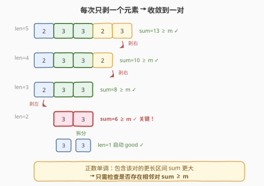
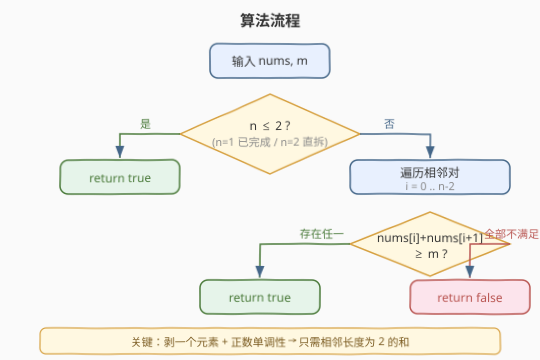
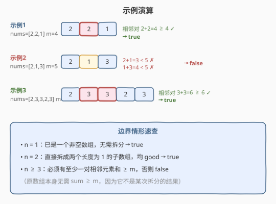

# LeetCode 判断是否能拆分数组 题解

## 1. 题目概述

- **标题 / 题号**：判断是否能拆分数组（#2811，medium）
- **链接**：https://leetcode.cn/problems/check-if-it-is-possible-to-split-array/
- **难度**：中等
- **标签**：贪心、数组、动态规划

**题意**：给你一个长度为 $n$ 的数组 `nums` 和一个整数 $m$。判断能否通过一系列操作将数组拆分成 $n$ 个**非空**子数组。

一个子数组是**好的**，当且仅当：
- 其长度为 $1$，**或者**
- 其元素之**和** $\geq m$。

每一步操作中，你选择一个**长度至少为 2** 的现有数组，将其拆分成 **2 个**子数组，且得到的**每个**子数组都必须是好的。问能否最终拆成 $n$ 个长度为 1 的子数组。

**示例 1**：

```text
输入：nums = [2, 2, 1], m = 4
输出：true
解释：[2,2,1] → [2,2] + [1]；[2,2] → [2] + [2]。[2,2] 和=4≥4 good，[1] 长度1 good。
```

**示例 2**：

```text
输入：nums = [2, 1, 3], m = 5
输出：false
解释：无论从哪头剥，剩下的长度2子数组 [2,1] 和=3 或 [1,3] 和=4，都 < 5，无法 good。
```

**示例 3**：

```text
输入：nums = [2, 3, 3, 2, 3], m = 6
输出：true
解释：存在相邻对 3+3=6≥6，可逐步剥到这对再拆。
```

**约束**：

- $1 \leq n = \text{nums.length} \leq 100$
- $1 \leq \text{nums}[i] \leq 100$
- $1 \leq m \leq 200$

> 💡 官方提示一句话点破天机："**如果能拆出多于一个元素的子数组，那就能改为只拆出一个元素**。"这意味着任何合法拆分序列都可等价为"每次只从一端剥一个元素"。再叠加**正数单调性**，本题可从区间 DP 降到 $O(n)$ 贪心。承接 [410. 分割数组的最大值](../0401-0500/410_分割数组的最大值.md) 的二分答案切分与 [53. 最大子数组和](../0001-0100/53_最大子数组和.md) 的子数组性质。

## 2. 解题思路

### 2.1 暴力思路：区间 DP

最直白的做法是把"子数组 `nums[i..j]` 能否被完全拆分"定义成状态 $dp[i][j]$：

- $dp[i][i] = \text{true}$（长度 1，已是一个最终块）。
- 对长度 $L \geq 2$ 的区间，枚举切点 $k \in [i, j-1]$，若**左半 $[i,k]$ 与右半 $[k+1,j]$ 各自 good**（长度 1 或 和 $\geq m$），且 $dp[i][k]$、$dp[k+1][j]$ 均为 true，则 $dp[i][j] = \text{true}$。

配合前缀和 $O(1)$ 查区间和，总复杂度 $O(n^3)$，$n \leq 100$ 完全可过。但它没有利用"每次只剥一个元素"的结构，做了大量无用的中间切点枚举。

> ⚠️ 区间 DP 的硬伤：① $O(n^3)$ 时间、$O(n^2)$ 空间，远超必要；② 把"任意位置切两半"全部纳入搜索，而本题最优解只需"从端点剥一个"。优化空间明显。

### 2.2 核心观察：每次只剥一个 + 正数单调性

利用官方提示的引理——**任何合法拆分都可改写为"每次只从某一端剥掉一个元素"**——拆分序列变成一条单调收缩的路径：

1. **剥一个元素**：被剥下的那块长度恒为 1，天然 good；剩下的那块是原数组的**连续子段**。
2. **剩余子段必须 good**：长度 $\geq 2$ 时要求其和 $\geq m$（长度 1 则自动 good）。
3. 因此整条路径是：从 `[0..n-1]` 出发，每步把左端或右端去掉一个，**不断收缩到一个长度为 2 的子段**，最后把它拆成两个长度 1。

关键在于：路径上所有剩余子段是**逐层嵌套**的（外层包含内层），而 `nums[i]` 均为正数 → **外层的和严格大于内层**。所以只要最内层那个长度为 2 的子段和 $\geq m$，外面所有包含它的更长子段和必然更大，自动满足。



于是判定条件被压缩成一句话：

> $n \leq 2$ 直接 true；$n \geq 3$ 时，**当且仅当存在某对相邻元素 `nums[i] + nums[i+1] >= m`**。

至于能否"剥到"任意指定的相邻对：只要从两头把目标对之外的元素依次剥掉即可，每步剩余仍是该对的外包段（和更大），首步剥哪头都行——目标对在左端就先剥右端、在右端就先剥左端、在中间则两端皆可先剥。存在性得证。

> 💡 **为什么原数组本身不需要 sum ≥ m？** 因为它是题目"给定"的初始数组，不是某次拆分**产生**的结果，无须满足 good 条件；只需要能被拆开。而对 $n=2$，直接拆成两个长度 1，两块都 good，与 $m$ 无关。

### 2.3 算法流程图



**完整步骤**：

1. **判短**：若 $n \leq 2$，返回 `true`。
2. **扫相邻对**：遍历 $i = 0 \ldots n-2$，一旦 `nums[i] + nums[i+1] >= m` 立刻返回 `true`。
3. **全不达标**：扫完仍无满足者，返回 `false`。

> ⚠️ 别把"原数组和"误当作判据。判据是**某个相邻对的和**，不是整体和。整体和大但中间没有 $\geq m$ 的相邻对时仍为 false（见示例 2）。

### 2.4 示例演算

以三个官方示例对照，并补两个边界：



| 输入 | $n$ | 关键相邻对 | 结论 |
|------|-----|-----------|------|
| `[2,2,1], m=4` | 3 | $2+2=4 \geq 4$ ✓ | true |
| `[2,1,3], m=5` | 3 | $2+1=3<5$、$1+3=4<5$ | false |
| `[2,3,3,2,3], m=6` | 5 | $3+3=6 \geq 6$ ✓ | true |
| `[1], m=1` | 1 | — | true（无需拆分） |
| `[1,1], m=100` | 2 | — | true（直拆两块长度 1） |

> 💡 示例 3 中目标对 `[3,3]` 在中间（下标 1、2），可先剥右端 `3` 得 `[2,3,3,2]`（和 10≥6），再剥右端 `2` 得 `[2,3,3]`（和 8≥6），再剥左端 `2` 得 `[3,3]`（和 6≥6），最后拆成 `[3]`、`[3]`。每步剩余都 $\geq m$。

## 3. 参考代码

### C++

```cpp
class Solution {
public:
    bool canSplitArray(vector<int>& nums, int m) {
        int n = nums.size();
        if (n <= 2) return true;
        for (int i = 0; i + 1 < n; ++i) {
            if (nums[i] + nums[i + 1] >= m) return true;
        }
        return false;
    }
};
```

### Python

```python
class Solution:
    def canSplitArray(self, nums: List[int], m: int) -> bool:
        n = len(nums)
        if n <= 2:
            return True
        return any(nums[i] + nums[i + 1] >= m for i in range(n - 1))
```

> 💡 两版逻辑一致。`n <= 2` 短路在循环前，避免对 $n=1$ 越界、对 $n=2$ 误判。Python 版用 `any` 带短路，命中即停。

## 4. 复杂度分析

| 维度 | 复杂度 | 说明 |
|------|--------|------|
| **时间复杂度** | $O(n)$ | 至多扫描一遍相邻对，$n \leq 100$ 下瞬时完成 |
| **空间复杂度** | $O(1)$ | 只用常数个变量，无前缀和数组 |

> ⚠️ 区间 DP 版为 $O(n^3)$ 时间 / $O(n^2)$ 空间，对本题规模也能过，但贪心把指数级的"切点自由度"压到线性，是更本质的解法。

## 5. 扩展：区间 DP 通解

若去掉"正数"假设（允许 $0$ 或负数），单调性失效，贪心不再成立，需回退到区间 DP。模板如下，可用于同类"切分子数组"题：

```cpp
class Solution {
public:
    bool canSplitArray(vector<int>& nums, int m) {
        int n = nums.size();
        vector<int> pre(n + 1, 0);
        for (int i = 0; i < n; ++i) pre[i + 1] = pre[i] + nums[i];
        auto sum = [&](int l, int r) { return pre[r + 1] - pre[l]; };
        auto good = [&](int l, int r) { return l == r || sum(l, r) >= m; };

        vector<vector<char>> dp(n, vector<char>(n, 0));
        for (int i = 0; i < n; ++i) dp[i][i] = 1;          // 长度 1
        for (int len = 2; len <= n; ++len)
            for (int i = 0; i + len - 1 < n; ++i) {
                int j = i + len - 1;
                for (int k = i; k < j; ++k)               // 枚举切点
                    if (good(i, k) && good(k + 1, j)
                        && dp[i][k] && dp[k + 1][j]) {
                        dp[i][j] = 1; break;
                    }
            }
        return dp[0][n - 1] == 1;
    }
};
```

对照贪心版，能直观感受"引理 + 单调性"省掉了多少切点枚举。注意 `good` 判定里"长度 1 即 good"必须单独写，否则 $m$ 很大时会误判单元素块。

## 6. 面试要点

1. **为什么"每次只剥一个元素"是充分的？**

   - 官方引理：若某次拆分产出了长度 $\geq 2$ 的两块，可改为先剥掉那块里的一个元素（一次拆一），剩余递归处理——等价但不改变可行性。所以枚举"任意切点"是多余的，只需考虑"剥左端"或"剥右端"。

2. **正数单调性为什么把 $O(n^2)$ 状态压成 $O(n)$？**

   - 剥一个元素后剩余是连续子段，整条路径是逐层嵌套；正数下外包段和 $>$ 内层和。最内层长度 2 的和 $\geq m$ 蕴含所有外层 $\geq m$。故只需找一个相邻对达标，状态从"哪些子段可行"塌缩为"哪对相邻元素可行"。

3. **$n=2$ 为什么不看 $m$？**

   - 直接把长度 2 拆成两个长度 1，两块都因"长度 1"而 good，与和无关。原数组是给定初始值，不是某次拆分的结果，无须 good。$n=1$ 更是无需任何拆分即已是答案。

4. **如果 `nums[i]` 可为 0 或负，结论还成立吗？**

   - 不成立。单调性失效后，外包段和可能小于内层，相邻对达标不代表外层达标。此时回退到区间 DP，$O(n^3)$ 是稳妥通解。

5. **能否改成"拆成恰好 $k$ 个非空数组"的变体？**

   - 可行但需重新设计：把"长度 1 或 和 $\geq m$"的 good 条件保留，状态加一维"已拆出几块"，$dp[i][j][c]$ 表示 `nums[i..j]` 拆成 $c$ 块的可行性。本题 $k=n$ 的特殊情形恰好让"长度1"成为终点，才有了贪心退化。

> 💡 **一句话总结**：2811 的精髓是"剥一个元素 + 正数单调"双重简化——把区间 DP 的任意切点收敛为端点剥离，再把嵌套子段的可行性塌缩为单对相邻元素的和。$O(n)$ 时间、$O(1)$ 空间。

## 同类练习题

| # | 题目 | 与本题的关联 |
|---|------|-------------|
| 410 | [分割数组的最大值](https://leetcode.cn/problems/split-array-largest-sum/)（[题解](../0401-0500/410_分割数组的最大值.md)） | 同样是"切子数组"，但目标是最小化最大段和，走二分答案 + 贪心划分，对照本题"可行性判定"的贪心 |
| 53 | [最大子数组和](https://leetcode.cn/problems/maximum-subarray/)（[题解](../0001-0100/53_最大子数组和.md)） | 子数组求和性质的基础题，承接正数前缀和单调的直觉 |
| 1011 | [在 D 天内送达包裹的能力](https://leetcode.cn/problems/capacity-to-ship-packages-within-d-days/)（[题解](../1001-1100/1011_在D天内送达包裹的能力.md)） | 连续子数组切分 + 贪心验证的经典二分答案，与 410 同族 |
| 343 | [整数拆分](https://leetcode.cn/problems/integer-break/)（[题解](../0301-0400/343_整数拆分.md)） | 另一种"拆分到不可再拆"的 DP，对照切分目标的差异 |
| 132 | [分割回文串 II](https://leetcode.cn/problems/palindrome-partitioning-ii/)（[题解](../0101-0200/132_分割回文串II.md)） | 区间 DP 拆分串的最小切割数，对照本题区间 DP 通解的切点枚举 |
