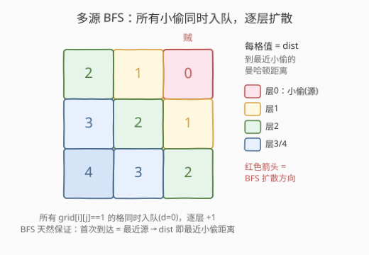
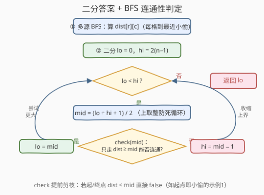
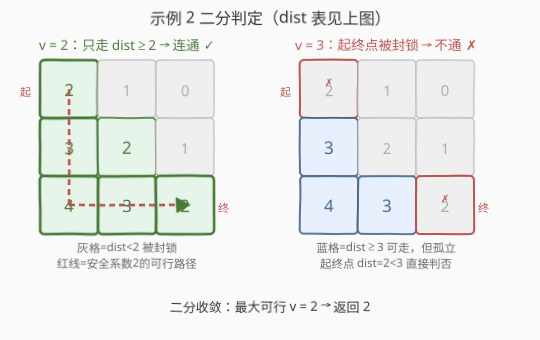

# LeetCode 找出最安全路径 题解

## 1. 题目概述

- **标题 / 题号**：找出最安全路径（#2812，medium）
- **链接**：https://leetcode.cn/problems/find-the-safest-path-in-a-grid/
- **难度**：中等
- **标签**：广度优先搜索、并查集、二分查找、矩阵、堆（优先队列）

**题意**：给你一个下标从 **0** 开始、大小为 `n x n` 的矩阵 `grid`，其中 `grid[r][c] = 1` 表示该格有小偷，`grid[r][c] = 0` 表示空格。你从 `(0, 0)` 出发，每步可移动到上下左右任一相邻单元格（含小偷格）。

一条路径的**安全系数**定义为：路径上任一单元格到矩阵中**任一小偷**所在单元格的**最小**曼哈顿距离（即路径上离小偷最近的那一格的距离）。返回所有从 `(0,0)` 通向 `(n-1, n-1)` 的路径中的**最大安全系数**。

> 💡 直觉：每条路径都有一个"最危险的一步"（离小偷最近的那格），我们想让这条最危险的一步尽量远——即**最大化路径上的最小距离**。这是一个典型的「**maximin 路径**（瓶颈路）」问题：找一条路，使路上最窄处尽量宽。

**示例 1**：

```text
输入：grid = [[1,0,0],[0,0,0],[0,0,1]]
输出：0
解释：起点 (0,0) 与终点 (2,2) 本身就是小偷，任何路径的安全系数都被这两格拉到 0。
```

**示例 2**：

```text
输入：grid = [[0,0,1],[0,0,0],[0,0,0]]
输出：2
解释：路径 (0,0)→(1,0)→(2,0)→(2,1)→(2,2) 上离小偷 (0,2) 最近的格是 (0,0)，
     曼哈顿距离 |0-0|+|0-2| = 2，故安全系数为 2，没有更高的路径。
```

**示例 3**：

```text
输入：grid = [[0,0,0,1],[0,0,0,0],[0,0,0,0],[1,0,0,0]]
输出：2
```

**约束**：

- `1 <= grid.length == n <= 400`
- `grid[i].length == n`
- `grid[i][j]` 为 `0` 或 `1`
- `grid` 至少存在一个小偷

## 2. 解题思路

### 2.1 暴力思路：枚举所有路径

朴素地枚举从 `(0,0)` 到 `(n-1,n-1)` 的所有简单路径，对每条路径取路径上各格到最近小偷距离的最小值，再在所有路径中取最大。但路径数量随 `n` 指数增长（`n=400` 时天文数字），且对每条路径求最小距离还需逐格比对所有小偷，完全不可行。

> ⚠️ 暴力法两重硬伤：① 路径数指数爆炸；② 路径上每格到小偷的距离若逐个重算，单条路径就需 $O(n^2)$，雪上加霜。必须先做**全局预处理**把"格到最近小偷距离"一次算清，再设计高效选路。

### 2.2 核心观察：多源 BFS 预处理 + 二分答案连通性判定

把思路拆成两步，每步都把指数级化为多项式级：

**第一步——多源 BFS 算「每格到最近小偷的距离」**。把所有小偷格作为 BFS 的**初始源**同时入队（距离 0），逐层向外扩散。因为 BFS 按层数增长，第一次到达某格时所走的层数正是它到**最近**小偷的曼哈顿距离（BFS 天然保证最先到的是最近的源）。记结果为 `dist[r][c]`，整张表 $O(n^2)$ 一次算清。



**第二步——二分答案 + BFS 连通性判定**。设安全系数答案为 `v`，则我们只允许走那些 `dist >= v` 的格（更近小偷的格视为"被封锁"）。若此时 `(0,0)` 与 `(n-1,n-1)` 仍连通（且两端 `dist >= v`），就存在一条安全系数 $\ge v$ 的路径。`v` 越大封锁越严、越难连通，这正是**单调性**——可二分。

> 💡 **单调性来源**：`dist >= v` 的格集合随 `v` 增大而**单调缩小**（可走的格越来越少），连通性只能从"通"变"不通"，不会反向恢复，满足二分答案所需的判定函数单调性。二分找到最大的"仍连通"的 `v`，即答案。

> ⚠️ 注意边界：若起点或终点本身 `dist < v`（例如示例 1 起点就是小偷 `dist=0`），则 `v>=1` 时直接不通，答案被压到 0。判定函数里先检查两端 `dist >= v` 可省去无谓搜索。

### 2.3 算法流程图



**完整步骤**：

1. **收集小偷**：扫一遍 `grid`，把所有 `grid[r][c]==1` 的坐标入队 `q`，`dist[r][c]=0`，其余置 `-1`（未访问）。
2. **多源 BFS**：从 `q` 逐层扩散，每弹出一格向四邻扩展，若邻居 `dist==-1` 则 `dist[邻]=dist[cur]+1` 并入队。结束时 `dist` 即每格到最近小偷距离。
3. **二分答案**：`lo=0, hi=2*(n-1)`（最大可能曼哈顿距离）。
   - `mid = (lo+hi+1)/2`（上取整防死循环）。
   - 调 `check(mid)`：若起点或终点 `dist < mid` 直接返回 `false`；否则只走 `dist >= mid` 的格做 BFS，问能否从 `(0,0)` 到 `(n-1,n-1)`。
   - `check(mid)` 为真 → `lo=mid`（`mid` 可行，尝试更大）；为假 → `hi=mid-1`。
4. **返回 `lo`**。

> ⚠️ 二分写法用 `mid=(lo+hi+1)/2` 配 `lo=mid`/`hi=mid-1`，避免 `lo` 停滞不前的死循环（标准的"求上界"模板，与 [704. 二分查找](../0701-0800/704_二分查找.md) 的下界模板对照记忆）。

### 2.4 示例演算

以示例 2 `grid = [[0,0,1],[0,0,0],[0,0,0]]`（小偷在 `(0,2)`）为例，多源 BFS 后：

| 格 | (0,0) | (0,1) | (0,2) | (1,0) | (1,1) | (1,2) | (2,0) | (2,1) | (2,2) |
|----|-------|-------|-------|-------|-------|-------|-------|-------|-------|
| dist | 2 | 1 | 0 | 3 | 2 | 1 | 4 | 3 | 2 |



二分过程：

| 轮次 | lo,hi | mid | check(mid)：只走 dist≥mid 的格能否连通 | 结果 |
|------|-------|-----|------------------------------------------|------|
| ① | 0,4 | 2 | 走 (0,0)d2→(1,0)d3→(2,0)d4→(2,1)d3→(2,2)d2，连通 | lo=2 |
| ② | 2,4 | 3 | 起点旁 (1,0)d3 可走但 (0,0)d2<3 被封锁，起终点不通 | hi=2 |
| 收敛 | 2,2 | — | — | 返回 2 |

> 💡 **为什么不用 Dijkstra？** 本题答案范围是整数距离 $[0, 2n-2]$，值域小、判定是布尔连通，二分答案最直观、常数最小。第 5 节给出更"一步到位"的最大堆 Dijkstra 变体，省去二分，但单次松弛需堆操作，常数略大——两者渐近复杂度同阶，按手感取舍。

## 3. 参考代码

### C++

```cpp
class Solution {
    using pii = pair<int,int>;
    int n;
    int dx[4] = {0,0,1,-1};
    int dy[4] = {1,-1,0,0};

    // 二分判定：只走 dist>=v 的格，能否从 (0,0) 到 (n-1,n-1)
    bool check(vector<vector<int>>& d, int v) {
        if (d[0][0] < v || d[n-1][n-1] < v) return false; // 起终点本身被封锁
        vector<vector<char>> vis(n, vector<char>(n, 0));
        queue<pii> q;
        q.push({0,0}); vis[0][0] = 1;
        while (!q.empty()) {
            auto [x,y] = q.front(); q.pop();
            if (x==n-1 && y==n-1) return true;           // 到达终点
            for (int k=0;k<4;k++){
                int nx=x+dx[k], ny=y+dy[k];
                if (nx<0||nx>=n||ny<0||ny>=n) continue;
                if (vis[nx][ny]) continue;
                if (d[nx][ny] < v) continue;             // 离小偷太近，封锁
                vis[nx][ny]=1; q.push({nx,ny});
            }
        }
        return false;
    }
public:
    int maximumSafenessFactor(vector<vector<int>>& grid) {
        n = grid.size();
        // 第一步：多源 BFS 算每格到最近小偷的距离
        vector<vector<int>> d(n, vector<int>(n, -1));
        queue<pii> q;
        for (int i=0;i<n;i++)
            for (int j=0;j<n;j++)
                if (grid[i][j]==1){ d[i][j]=0; q.push({i,j}); }
        while (!q.empty()){
            auto [x,y]=q.front(); q.pop();
            for (int k=0;k<4;k++){
                int nx=x+dx[k], ny=y+dy[k];
                if (nx<0||nx>=n||ny<0||ny>=n||d[nx][ny]!=-1) continue;
                d[nx][ny]=d[x][y]+1; q.push({nx,ny});
            }
        }
        // 第二步：二分答案
        int lo=0, hi=2*(n-1);
        while (lo < hi){
            int mid = (lo+hi+1)/2;            // 上取整，防死循环
            if (check(d, mid)) lo = mid;
            else hi = mid-1;
        }
        return lo;
    }
};
```

### Python

```python
from collections import deque

class Solution:
    def maximumSafenessFactor(self, grid: List[List[int]]) -> int:
        n = len(grid)
        dx, dy = (0,0,1,-1), (1,-1,0,0)

        # 第一步：多源 BFS 算每格到最近小偷的距离
        dist = [[-1]*n for _ in range(n)]
        q = deque()
        for i in range(n):
            for j in range(n):
                if grid[i][j] == 1:
                    dist[i][j] = 0
                    q.append((i, j))
        while q:
            x, y = q.popleft()
            for k in range(4):
                nx, ny = x+dx[k], y+dy[k]
                if 0 <= nx < n and 0 <= ny < n and dist[nx][ny] == -1:
                    dist[nx][ny] = dist[x][y] + 1
                    q.append((nx, ny))

        # 第二步：二分答案 + BFS 连通性判定
        def check(v: int) -> bool:
            if dist[0][0] < v or dist[n-1][n-1] < v:
                return False
            vis = [[False]*n for _ in range(n)]
            dq = deque([(0, 0)]); vis[0][0] = True
            while dq:
                x, y = dq.popleft()
                if (x, y) == (n-1, n-1):
                    return True
                for k in range(4):
                    nx, ny = x+dx[k], y+dy[k]
                    if 0 <= nx < n and 0 <= ny < n and not vis[nx][ny] and dist[nx][ny] >= v:
                        vis[nx][ny] = True
                        dq.append((nx, ny))
            return False

        lo, hi = 0, 2*(n-1)
        while lo < hi:
            mid = (lo + hi + 1) // 2     # 上取整，防死循环
            if check(mid):
                lo = mid
            else:
                hi = mid - 1
        return lo
```

> 💡 两版结构一致：先多源 BFS 距离表，再二分 + 连通 BFS。`check` 里提前判起终点 `dist<v` 返回 `false`，省掉示例 1 这种起点即小偷的无效搜索。C++ 用 `auto [x,y]=q.front()`（C++17 结构化绑定），Python 用 `deque.popleft`。

## 4. 复杂度分析

| 维度 | 复杂度 | 说明 |
|------|--------|------|
| **时间复杂度** | $O(n^2 \log n)$ | 多源 BFS 一次 $O(n^2)$；二分 $\log(2n)$ 轮，每轮 BFS 判定 $O(n^2)$ |
| **空间复杂度** | $O(n^2)$ | `dist` 距离表、BFS 队列、判定时的 `vis`，均为 $O(n^2)$ |

> ⚠️ 二分上界取 $2(n-1)$（左上到右下的曼哈顿距离，即最大可能的最小距离）。实际最大值不会超过它，故区间长度 $O(n)$，$\log$ 轮内收敛。`n=400` 时约 9 轮，每轮 BFS 16 万格，总操作百万级，轻松 AC。

## 5. 扩展：最大堆 Dijkstra 变体（一步到位）

二分答案把"选路"和"定答案"拆成两层。其实可**合并**：把每格视作带权 `dist[x][y]` 的节点，求一条从 `(0,0)` 到 `(n-1,n-1)` 使路径上最小权最大的路——经典的 **bottleneck shortest path（瓶颈最短路 / maximin 路径）**。用**最大堆**做 Dijkstra 变体：堆里存 `(到该格的瓶颈值, x, y)`，每次弹出瓶颈最大的格子去松弛邻居，邻居的瓶颈 = `min(当前路径瓶颈, dist[邻居])`。终点首次出堆时其瓶颈值即答案。

```cpp
// 最大堆 Dijkstra 变体（省去二分，一次松弛出解）
int maximumSafenessFactorDijkstra(vector<vector<int>>& grid) {
    int n = grid.size();
    int dx[4]={0,0,1,-1}, dy[4]={1,-1,0,0};
    vector<vector<int>> d(n, vector<int>(n,-1));
    queue<pair<int,int>> q;
    for (int i=0;i<n;i++) for (int j=0;j<n;j++)
        if (grid[i][j]==1){ d[i][j]=0; q.push({i,j}); }
    while(!q.empty()){                       // 多源 BFS 距离表（同上）
        auto [x,y]=q.front(); q.pop();
        for(int k=0;k<4;k++){int nx=x+dx[k],ny=y+dy[k];
            if(0<=nx&&nx<n&&0<=ny&&ny<n&&d[nx][ny]==-1){d[nx][ny]=d[x][y]+1;q.push({nx,ny});}}
    }
    vector<vector<int>> best(n, vector<int>(n,-1));
    priority_queue<tuple<int,int,int>> pq;    // 默认大根堆
    best[0][0]=d[0][0]; pq.push({d[0][0],0,0});
    while(!pq.empty()){
        auto [v,x,y]=pq.top(); pq.pop();
        if (v < best[x][y]) continue;        // 过期堆项
        if (x==n-1 && y==n-1) return v;      // 终点出堆即答案
        for(int k=0;k<4;k++){int nx=x+dx[k],ny=y+dy[k];
            if(0<=nx&&nx<n&&0<=ny&&ny<n){
                int nv = min(v, d[nx][ny]);   // 瓶颈 = 路径最窄处
                if (nv > best[nx][ny]){best[nx][ny]=nv; pq.push({nv,nx,ny});}
            }}
    }
    return -1;
}
```

> 💡 该变体复杂度同为 $O(n^2 \log n)$（堆操作），但只跑一遍 BFS+一遍 Dijkstra，省去 $\log$ 轮重复连通判定，常数更优，代码更紧凑。还有第三种等价写法——**并查集 + 按距离降序加点**：把所有格按 `dist` 从大到小加入并查集，加入时与四邻 union，每加一轮检查 `(0,0)` 与 `(n-1,n-1)` 是否首次同根，该轮 `dist` 即答案（Kruskal 思想）。三种方法殊途同归，均 $O(n^2 \log n)$。

## 6. 面试要点

1. **为什么用多源 BFS 而不是对每个格子单独 BFS 找最近小偷？**

   - 单源逐格 BFS 是 $O(n^2 \times n^2)=O(n^4)$，`n=400` 直接超时；多源 BFS 把所有小偷**同时**入队做一次 BFS，$O(n^2)$ 一次算清全表。BFS 按层扩散保证首次到达某格的源就是最近的——这正是多源 BFS 求"到最近源距离"的标准用法。

2. **二分答案的判定函数为什么单调？**

   - `check(v)` 问"只走 `dist>=v` 的格能否连通"。`v` 越大，可走的格**越少**，集合单调缩小，连通性只能由"通"变"不通"，不会反向恢复。这种"阈值越大越难达成"的单调性正是二分答案的前提。

3. **起终点 `dist<v` 时为什么要提前返回 false？**

   - 若起点或终点本身被封锁（`dist<v`），即便路径其余部分连通，端点也进不了"可走集合"，必不通。提前剪枝省掉整次 BFS，示例 1 这种起点即小偷（`dist=0`）的情况，`v>=1` 时 $O(1)$ 判否。

4. **二分写 `mid=(lo+hi+1)/2` 配 `lo=mid/hi=mid-1`，为何不能写 `mid=(lo+hi)/2` 配 `lo=mid/hi=mid-1`？**

   - 后者在 `lo+1==hi` 且 `check(lo)=true` 时会算出 `mid=lo`，于是 `lo=mid=lo` 不前进，死循环。上取整模板让 `mid` 偏向 `hi`，保证区间必缩。求"最大可行值"用上取整模板，求"最小可行值"用下取整模板——与 [704](../0701-0800/704_二分查找.md) 一脉相承。

5. **三种解法（二分 / Dijkstra 变体 / 并查集）怎么选？**

   - **二分**最直观、易写易调，判定逻辑清晰，面试首选；**Dijkstra 变体**一次出解、常数略优但需熟练手写瓶颈松弛；**并查集**适合已会 Kruskal 的人，思路最"图论"。三者渐近同阶 $O(n^2 \log n)$，按手感与题型积累取舍。

> 💡 **一句话总结**：2812 是「多源 BFS 求最近源距离」+「二分答案做连通性判定」的经典组合。前者把每格到最近小偷的距离 $O(n^2)$ 算清，后者利用"阈值越大越难连通"的单调性二分出最大安全系数。$O(n^2 \log n)$ 时间、$O(n^2)$ 空间。

## 同类练习题

| # | 题目 | 与本题的关联 |
|---|------|-------------|
| 542 | [01 矩阵](https://leetcode.cn/problems/01-matrix/) | 多源 BFS 求每格到最近 0 的距离，正是本题第一步的母题 |
| 1162 | [地图分析](https://leetcode.cn/problems/as-far-from-land-as-possible/) | 多源 BFS 求离陆地最远的海格，同源不同问 |
| 1631 | [最小体力消耗路径](https://leetcode.cn/problems/path-with-minimum-effort/) | minimin 路径，二分 / 并查集 / Dijkstra 变体三解通用，与本题对称 |
| 778 | [水位上升的游泳](https://leetcode.cn/problems/swim-in-rising-water/) | 并查集按高度逐步加点判连通，对照本题第三种解法 |
| 1102 | [得分最高的路径](https://leetcode.cn/problems/path-with-maximum-minimum-value/)（付费） | maximin 路径的纯最大堆 Dijkstra 训练，与本题扩展解同构 |
