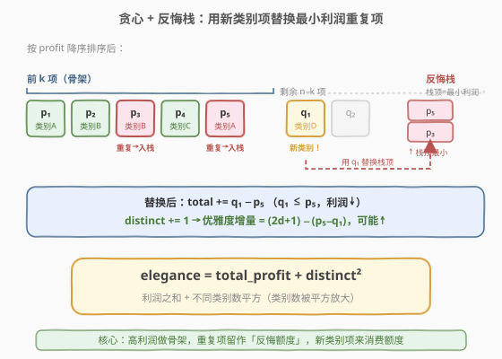
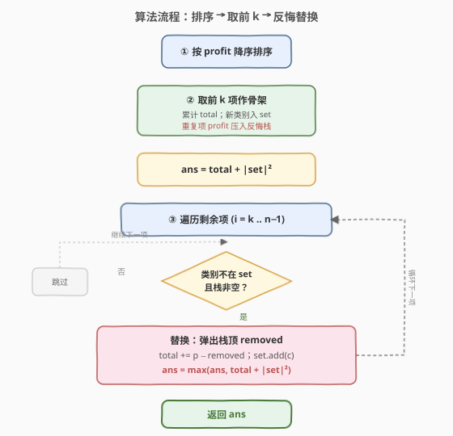
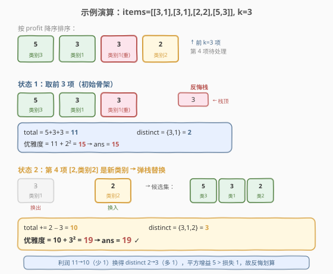

# 子序列最大优雅度

- **题目名称**：子序列最大优雅度
- **链接**：[2813. 子序列最大优雅度](https://leetcode.cn/problems/maximum-elegance-of-a-k-length-subsequence/)
- **难度**：困难
- **标签**：贪心、数组、栈、哈希表、排序

## 1. 题目概述

给定一个长度为 `n` 的二维整数数组 `items` 和一个整数 `k`。`items[i] = [profit_i, category_i]`，分别表示第 `i` 个项目的利润和类别。

定义 `items` 的**子序列**的**优雅度**为：

$$\text{elegance} = \text{total\_profit} + \text{distinct\_categories}^2$$

其中 `total_profit` 是子序列中所有项目的利润总和，`distinct_categories` 是所选子序列中不同类别的数量。

任务：从 `items` 所有长度恰好为 `k` 的子序列中，找出**最大优雅度**，以整数形式返回。

> 💡 子序列由原数组删除若干（可不删）元素得到，且不改变剩余元素相对顺序。

**示例 1**：

```text
输入：items = [[3,2],[5,1],[10,1]], k = 2
输出：17
解释：选 [3,2] 和 [10,1]。总利润 = 3 + 10 = 13，不同类别数 = 2，优雅度 = 13 + 2² = 17。
```

**示例 2**：

```text
输入：items = [[3,1],[3,1],[2,2],[5,3]], k = 3
输出：19
解释：选 [3,1]、[2,2]、[5,3]。总利润 = 3 + 2 + 5 = 10，不同类别数 = 3，优雅度 = 10 + 3² = 19。
```

**示例 3**：

```text
输入：items = [[1,1],[2,1],[3,1]], k = 3
输出：7
解释：必须全选。总利润 = 6，不同类别数 = 1，优雅度 = 6 + 1² = 7。
```

**约束条件**：

- `1 <= n == items.length <= 10^5`
- `items[i].length == 2`
- `1 <= profit_i <= 10^9`
- `1 <= category_i <= n`
- `1 <= k <= n`

---

## 2. 解题思路

### 2.1 暴力思路

枚举所有长度为 `k` 的子序列，共 $\binom{n}{k}$ 个，对每个子序列累加利润、统计类别并计算优雅度取最大。当 `n = 10^5` 时组合数是天文数字，必然超时。

优雅度由两部分相加：**利润之和**（越大越好）与**类别数平方**（类别越多越好，平方放大了类别数的价值）。难点在于这两者存在 trade-off——为了多一个类别，可能要放弃一个高利润项。

### 2.2 核心观察：贪心 + 反悔栈



先把两件事想清楚：

1. **利润越大越好**：把 `items` 按 `profit` **降序**排序后，最优解一定以「前 `k` 大利润」为骨架。因为若最优解漏掉了某个前 `k` 大利润项而选了一个更小利润的项，把它换进来总利润不降、类别数不减（若同类别）或可能增加，优雅度不会变差。
2. **类别越多越好**：选满 `k` 个后，骨架里可能有**同类别重复项**——这些重复项对 `distinct` 毫无贡献，正是「可被替换」的候选。把一个重复项换成一个**新类别**项，`distinct` 加 1（贡献 $(2d+1)$ 的平方增量），代价是利润减少「被换出项利润 − 新项利润」。

由此得到**反悔贪心**流程：

- **第 1 步**：排序后取前 `k` 项作为初始候选集，计算 `total_profit`、`distinct` 集合，并把「同类别重复项」的利润压入一个**栈**（因按利润降序扫描，后压入的利润更小，栈顶恰是**最小利润的重复项**）。
- **第 2 步**：遍历剩余 `n − k` 项（仍按利润降序）。若当前项类别**不在**候选集中、且栈非空，就用它**替换栈顶**那个最小利润重复项：`total_profit += p − removed`、`distinct += 1`，更新答案。
- 因为被换出的重复项利润 ≥ 新项利润（都在已排序序列里，新项排更靠后），`total_profit` 单调不增；而 `distinct` 单调递增，所以优雅度非单调，需对每次替换后的状态取 `max`。

> 💡 **为什么用栈而非堆？** 排序保证了「前 `k` 项中的重复项」是按利润降序入栈的，栈顶天然就是最小利润重复项，弹出 `O(1)`；小顶堆也能做（更通用），但这里栈更轻量。这正是「栈」标签的来源。

> ⚠️ **正确性关键**：每次替换都换出「最小利润重复项」、换入「最大利润的新类别项」（因为剩余项按利润降序处理）。对固定的替换次数 `s`，前 `s` 次替换的利润损失总和最小，故「所有替换前缀」中必含全局最优——取前缀最大即可。

### 2.3 算法流程图



### 2.4 示例演算



以示例 2 `items = [[3,1],[3,1],[2,2],[5,3]]`, `k = 3` 为例：

1. **排序**（按利润降序）：`[[5,3],[3,1],[3,1],[2,2]]`。
2. **取前 3**：`[5,3]`、`[3,1]` 入新类别，`[3,1]` 类别 1 重复 → 栈压 `3`。`total = 11`，`distinct = {3,1}` → `2`，优雅度 = `11 + 2² = 15`，`ans = 15`。
3. **处理第 4 项 `[2,2]`**：类别 2 不在集合、栈非空 → 弹出 `3`，`total += 2 − 3 = 10`，`distinct = {3,1,2}` → `3`，优雅度 = `10 + 3² = 19`，`ans = 19`。
4. 遍历结束，返回 `19`。

---

## 3. 参考代码

### C++（贪心 + 反悔栈）

```cpp
class Solution {
  public:
    long long findMaximumElegance(vector<vector<int>>& items, int k) {
        // 按利润降序排序
        sort(items.begin(), items.end(), [](const auto& a, const auto& b) {
            return a[0] > b[0];
        });

        long long total = 0;
        unordered_set<int> categories;     // 已选类别集合
        vector<int> dup;                  // 反悔栈：可被换出的重复项利润（栈顶最小）

        // 取前 k 项作为初始骨架
        for (int i = 0; i < k; i++) {
            int p = items[i][0], c = items[i][1];
            total += p;
            if (categories.count(c)) {
                dup.push_back(p);         // 类别已存在 → 重复项，可替换
            } else {
                categories.insert(c);
            }
        }
        long long d = categories.size();
        long long ans = total + d * d;

        // 反悔：用新类别项替换最小利润重复项
        for (int i = k; i < (int)items.size(); i++) {
            int p = items[i][0], c = items[i][1];
            if (!categories.count(c) && !dup.empty()) {
                int removed = dup.back();
                dup.pop_back();
                total += p - removed;    // 利润减少（p <= removed）
                categories.insert(c);
                d += 1;
                ans = max(ans, total + d * d);
            }
        }
        return ans;
    }
};
```

### Python

```python
class Solution:
    def findMaximumElegance(self, items: List[List[int]], k: int) -> int:
        items.sort(key=lambda x: -x[0])  # 按利润降序

        total = 0
        categories = set()
        dup = []  # 反悔栈：重复项利润，栈顶最小

        for i in range(k):
            p, c = items[i]
            total += p
            if c in categories:
                dup.append(p)
            else:
                categories.add(c)

        d = len(categories)
        ans = total + d * d

        for i in range(k, len(items)):
            p, c = items[i]
            if c not in categories and dup:
                removed = dup.pop()
                total += p - removed
                categories.add(c)
                d += 1
                ans = max(ans, total + d * d)

        return ans
```

> ⚠️ **数据范围**：`profit_i` 可达 `10^9`，`k` 可达 `10^5`，`total_profit` 可达 `10^14`，再加 `distinct²`（≤ `10^10`），C++ 必须用 `long long`；Python 整数自带高精度无此顾虑。

---

## 4. 复杂度分析

| 维度 | 复杂度 | 说明 |
|------|--------|------|
| 时间复杂度 | $O(n \log n)$ | 排序主导；两次线性扫描 + 哈希/栈操作均 $O(1)$ 摊还 |
| 空间复杂度 | $O(k)$ | 类别集合与反悔栈最多存 $k$ 个元素 |

---

## 5. 扩展：用小顶堆代替栈

若不预先排序（或希望处理动态场景），可用**小顶堆**维护「候选集中可替换项」的最小利润：

- 取前 `k` 项时，把每个**重复项**利润 push 进小顶堆；
- 反悔时 `pop` 堆顶（最小利润重复项）替换。

堆法更通用（不依赖排序后的入栈顺序），但需 $O(\log k)$ 弹出。本题因排序后重复项天然按利润降序入栈，**栈顶即最小**，故栈法 $O(1)$ 弹出更优。这也是题目标签同时含「栈」与「堆」的原因——两条等价路径。

---

## 6. 面试要点

1. **为什么最优解一定以「前 k 大利润」为骨架？**

   - 交换论证：若最优解漏掉某前 `k` 大利润项 `A` 而选了更小利润项 `B`，把 `B` 换成 `A`：利润不降，类别数不减（同类别）或可能增加，优雅度不降，故存在以「前 `k` 大利润」为骨架的最优解。

2. **为什么换出的是「最小利润的重复项」而不是任意重复项？**

   - 替换会让 `total_profit` 减少 `removed − p`。对固定次数的替换，要最小化总损失，就应每次都换出当前**最小利润**的重复项，这正是栈/堆顶的作用。

3. **优雅度非单调，为什么要对每次替换后取 max？**

   - `total_profit` 随替换单调不增、`distinct` 单调递增，二者相加没有单调性：早期「高利润少类别」与后期「低利润多类别」都可能更优。对全部替换前缀取最大，即覆盖了所有「替换 `s` 次」的最优解。

4. **栈和堆在这里等价吗？为什么选栈？**

   - 本题排序后，前 `k` 项中重复项按利润降序入栈，栈顶即最小，故栈能正确给出「最小利润重复项」，与堆等价；但栈弹出 $O(1)$、堆 $O(\log k)$，故选栈。若输入不可排序（流式），则必须用堆。

5. **如果所有项类别各不相同怎么办？**

   - 前 `k` 项已含 `k` 个不同类别，栈为空，第二轮不触发任何替换，答案即「前 `k` 大利润之和 + k²」——也是理论最优（利润与类别数都拉满）。

---

## 7. 同类练习题

- [630. 课程表 III](https://leetcode.cn/problems/course-schedule-iii/)：反悔贪心 + 小顶堆的经典模板，每次用当前课程替换堆中持续时间最长者，思路与本题「换出最小利润重复项」同构。
- [502. IPO](https://leetcode.cn/problems/ipo/)：贪心 + 大顶堆，按资本门槛解锁项目、每轮取最大利润，对照本题「排序解锁 + 堆取最值」范式。
- [871. 最低加油次数](https://leetcode.cn/problems/minimum-number-of-refueling-stops/)：贪心 + 反悔大顶堆，路过加油站先把油量入堆、缺油时从堆顶补最大油量，与本题「先收集后反悔取最大」一致。
