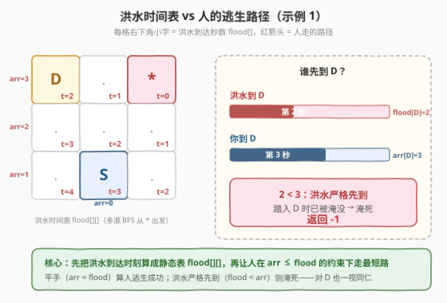
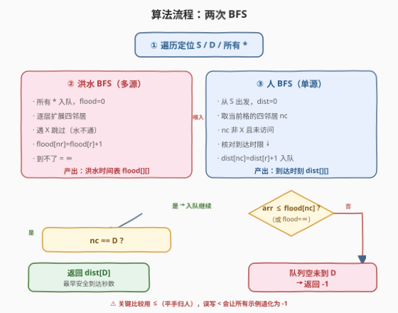
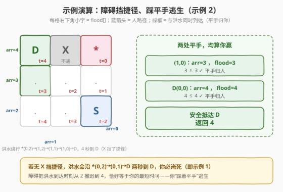

# LeetCode 避免淹死并到达目的地的最短时间 题解

## 1. 题目概述

- **标题 / 题号**：避免淹死并到达目的地的最短时间（#2814，hard）
- **链接**：https://leetcode.cn/problems/minimum-time-takes-to-reach-destination-without-drowning/
- **难度**：困难
- **标签**：广度优先搜索、数组、矩阵

> ⚠️ 本题为 LeetCode 付费题（Plus 会员专享），官方题面与示例输出均不可见。以下题意、约束与示例输出根据官方提供的 `jsonExampleTestcases`（三个示例输入）、三条 `hints` 以及同构姊妹题 [2258. 逃离火灾](https://leetcode.cn/problems/escape-the-spreading-fire/) 重建，**可能与官方题面有出入**。核心算法（两次 BFS）由 hints 明确给出，可放心学习。

**题意**：给定 `m×n` 网格 `grid`，每个格子是一个字符串：

- `.` 空地（可通行）
- `X` 障碍（人与洪水均不可通过）
- `S` 你的起点
- `D` 目的地
- `*` 洪水源（洪水从此处涌出）

**洪水蔓延**：从所有 `*` 同时开始，每秒向上下左右四邻接的**非 `X`** 格子蔓延一层（多源 BFS）。第 `t` 秒，与某 `*` 的最短步数 `≤ t` 的格子（途中不穿过 `X`）即被淹没。

**你的移动**：每秒可走到上下左右一个非 `X` 格子，或原地不动。`*` 在第 0 秒就被淹没，你无法踏入。

**淹死判定**：若洪水**严格先于你**到达你所在的格子，你被淹死。即格子 `c` 在第 `t` 秒对你安全，当且仅当 $\text{flood}[c] \ge t$（洪水不晚于你到则没事——**同时到达算你逃生成功**，平手归你）。该判定对所有格子（含目的地 `D`）一视同仁。

返回到达 `D` 的最少秒数；若无法安全到达，返回 `-1`。

**示例 1**：

```text
输入：grid = [["D",".","*"],[".",".","."],[".","S","."]]
输出：-1
解释：洪水从 (0,2)* 出发，沿上排 2 秒就淹没 D(0,0)；而你从 (2,1) 至少要走 3 秒才到 D。
      洪水严格先于你抵达 D（2 < 3），到达即淹死，故返回 -1。
```

**示例 2**：

```text
输入：grid = [["D","X","*"],[".",".","."],[".",".","S"]]
输出：4
解释：(0,1)=X 挡住了洪水走捷径，水只能绕行：*(0,2)→(1,2)→(1,1)→(1,0)→D(0,0)，4 秒到 D。
      你走 (2,2)S→(2,1)→(2,0)→(1,0)→D 也是 4 秒。在 (1,0) 与 D 上你均与洪水"同时到达"（平手归你），
      安全逃生，返回 4。
```

**示例 3**：

```text
输入：grid = [["D",".",".",".","*","."],[".","X",".","X",".","."],[".",".",".",".","S","."]]
输出：-1
解释：顶排 D......* 全是空地，洪水沿顶排 4 秒直达 D(0,0)；而你从 (2,4) 到 (0,0) 至少 6 秒。
      洪水 4 < 你 6，D 先被淹，返回 -1。
```

**约束条件（推断）**：

- `m == grid.length`，`n == grid[i].length`
- `1 <= m, n`（规模使 `O(m·n)` 两次 BFS 通过）
- `grid[i][j]` 为 `"."`、`"X"`、`"S"`、`"D"`、`"*"` 之一
- 恰好一个 `"S"`、一个 `"D"`，零或多个 `"*"`

## 2. 解题思路

### 2.1 暴力思路：每秒全网格模拟

每秒先让洪水扩展一层、再让人走一步，逐秒推演直到人到达 `D` 或确定不可能。能过但每秒都要重扫全网格，且"人何时淹死"的状态判定容易写错（同一秒洪水与人的先后）。复杂度偏高、边界易错。

> ⚠️ 暴力法的硬伤：① 每秒 `O(m·n)` 全扫，最坏 `O(T·m·n)`；② "同时到达算谁赢"的平手规则在逐秒模拟里极易写反方向，是本题最大坑点。

### 2.2 核心观察：两次 BFS（洪水时间表 + 人的最短路）



三条 `hints` 已经把算法骨架点透：

1. 先用一次**多源 BFS** 算出每个格子被洪水淹没的时刻 $\text{flood}[r][c]$（所有 `*` 同时入队，遇 `X` 不通）。
2. 再用一次 **BFS** 模拟人的移动，每走到邻居 `nc` 时核对：到达时刻 $\text{arr} \le \text{flood}[nc]$（或洪水永远到不了，即 $\text{flood}[nc]=\infty$）才安全。
3. `D` 的最早到达时刻即为答案；若不可达返回 `-1`。

> 💡 **为什么是两次 BFS 而非一次？** 洪水与人**同速**（都每秒一格），但起点不同、扩散方向无序，无法在单次 BFS 里同时刻画"谁先到"。把洪水的到达时刻**预先算成一张静态表** $\text{flood}[][]$，人的 BFS 就退化为"带到达时限约束的最短路"——约束变成常数时间的查表比较，干净利落。这正是 [994. 腐烂的橘子](../0901-1000/994_腐烂的橘子.md) 多源 BFS 思想的两段式应用：第一次多源 BFS 算"何时被淹"，第二次单源 BFS 算"何时能到"。

### 2.3 算法流程图



**完整步骤**：

1. **定位**：遍历网格，记录起点 `(sr,sc)`、目的地 `(dr,dc)`，所有 `*` 收集到列表 `water`。
2. **洪水 BFS**（多源）：所有 `*` 入队、$\text{flood}=0$；逐层扩展，遇 `X` 跳过，$\text{flood}[nr][nc]=\text{flood}[r][c]+1$。到不了的格子保持 $\infty$。
3. **人 BFS**（单源）：从 `S` 出发，$\text{dist}[sr][sc]=0$ 入队。对当前格 `(r,c)` 的四邻居 `(nr,nc)`：
   - 越界或是 `X` → 跳过
   - 已访问 → 跳过
   - 否则若 $\text{flood}[nr][nc]=\infty$ 或 $\text{dist}[r][c]+1 \le \text{flood}[nr][nc]$ → 标记 $\text{dist}[nr][nc]=\text{dist}[r][c]+1$ 并入队
4. **返回** $\text{dist}[dr][dc]$（未访问则为 `-1`）。

> ⚠️ **关键比较是 `≤` 不是 `<`**：平手（你与洪水同秒到达）算你逃生成功，这是本题最大的坑。若误写成 `<`，三个示例会全部退化为 `-1`，与题意相悖。同理，判定对 `D` 也用 `≤`——`D` 不是免死金牌，洪水若先到 `D`，你踏进去照样淹死。

### 2.4 示例演算

以示例 2 为例（`D X * / . . . / . . S`），展示"障碍挡捷径、平手逃生"的精髓：



**洪水时间表**（多源 BFS 从 `(0,2)*` 出发，`X(0,1)` 不通）：

| 格子 | (0,2)* | (1,2) | (1,1) | (2,2)S | (1,0) | (2,1) | (0,0)D | (2,0) |
|------|--------|-------|-------|--------|-------|-------|--------|-------|
| flood | 0 | 1 | 2 | 2 | 3 | 3 | 4 | 4 |

**人的逃生路径**（每步核对 `arr ≤ flood`）：

| 秒 | 位置 | arr | flood | arr≤flood? |
|----|------|-----|-------|-----------|
| 0 | (2,2) S | 0 | 2 | ✓ |
| 1 | (2,1) | 1 | 3 | ✓ |
| 2 | (2,0) | 2 | 4 | ✓ |
| 3 | (1,0) | 3 | 3 | ✓（平手！） |
| 4 | (0,0) D | 4 | 4 | ✓（平手！） |

在 `(1,0)` 与 `D` 两处你都与洪水**同时到达**，平手归你，安全抵达 `D`，返回 `4`。

> 💡 若没有 `(0,1)=X` 这块障碍挡住洪水的捷径，洪水会沿上排 `*(0,2)→(0,1)→(0,0)D` 两秒直达 `D`，你必淹死（这正是示例 1 的情形）。障碍把洪水的到达时刻从 2 推迟到 4，恰好等于你的最短时间，于是你"踩着平手"逃生——这是本题设计最精巧的一笔。

## 3. 参考代码

### C++

```cpp
class Solution {
  public:
    int minimumSecondsToReachDestination(vector<vector<string>>& grid) {
        int m = grid.size(), n = grid[0].size();
        const int INF = 1e9;
        int sr = -1, sc = -1, dr = -1, dc = -1;
        vector<pair<int,int>> water;
        for (int i = 0; i < m; i++)
            for (int j = 0; j < n; j++) {
                const string& c = grid[i][j];
                if (c == "S") { sr = i; sc = j; }
                else if (c == "D") { dr = i; dc = j; }
                else if (c == "*") water.push_back({i, j});
            }

        int dirs[4][2] = {{0,1},{0,-1},{1,0},{-1,0}};
        // 第一遍：多源 BFS 算洪水到达时刻（遇 X 不通）
        vector<vector<int>> flood(m, vector<int>(n, INF));
        queue<pair<int,int>> q;
        for (auto& [r, c] : water) { flood[r][c] = 0; q.push({r, c}); }
        while (!q.empty()) {
            auto [r, c] = q.front(); q.pop();
            for (auto& d : dirs) {
                int nr = r + d[0], nc = c + d[1];
                if (nr < 0 || nr >= m || nc < 0 || nc >= n) continue;
                if (grid[nr][nc] == "X") continue;
                if (flood[nr][nc] > flood[r][c] + 1) {
                    flood[nr][nc] = flood[r][c] + 1;
                    q.push({nr, nc});
                }
            }
        }

        // 第二遍：人 BFS，到达 nc 安全当且仅当 arr <= flood[nc]（或 flood 为 INF）
        vector<vector<int>> dist(m, vector<int>(n, -1));
        dist[sr][sc] = 0;
        q.push({sr, sc});
        while (!q.empty()) {
            auto [r, c] = q.front(); q.pop();
            if (r == dr && c == dc) return dist[r][c];
            for (auto& d : dirs) {
                int nr = r + d[0], nc = c + d[1];
                if (nr < 0 || nr >= m || nc < 0 || nc >= n) continue;
                if (grid[nr][nc] == "X" || dist[nr][nc] != -1) continue;
                int arr = dist[r][c] + 1;
                if (flood[nr][nc] == INF || arr <= flood[nr][nc]) {
                    dist[nr][nc] = arr;
                    q.push({nr, nc});
                }
            }
        }
        return -1;
    }
};
```

### Python

```python
class Solution:
    def minimumSecondsToReachDestination(self, grid: List[List[str]]) -> int:
        m, n = len(grid), len(grid[0])
        INF = 10 ** 9
        sr = sc = dr = dc = -1
        water = []
        for i in range(m):
            for j in range(n):
                c = grid[i][j]
                if c == 'S':   sr, sc = i, j
                elif c == 'D': dr, dc = i, j
                elif c == '*': water.append((i, j))

        dirs = [(0,1),(0,-1),(1,0),(-1,0)]
        # 第一遍：多源 BFS 算洪水到达时刻（遇 X 不通）
        flood = [[INF] * n for _ in range(m)]
        q = collections.deque()
        for r, c in water:
            flood[r][c] = 0
            q.append((r, c))
        while q:
            r, c = q.popleft()
            for di, dj in dirs:
                nr, nc = r + di, c + dj
                if 0 <= nr < m and 0 <= nc < n \
                   and grid[nr][nc] != 'X' \
                   and flood[nr][nc] > flood[r][c] + 1:
                    flood[nr][nc] = flood[r][c] + 1
                    q.append((nr, nc))

        # 第二遍：人 BFS，到达 nc 安全当且仅当 arr <= flood[nc]（或 flood 为 INF）
        dist = [[-1] * n for _ in range(m)]
        dist[sr][sc] = 0
        q = collections.deque([(sr, sc)])
        while q:
            r, c = q.popleft()
            if (r, c) == (dr, dc):
                return dist[r][c]
            for di, dj in dirs:
                nr, nc = r + di, c + dj
                if not (0 <= nr < m and 0 <= nc < n):
                    continue
                if grid[nr][nc] == 'X' or dist[nr][nc] != -1:
                    continue
                arr = dist[r][c] + 1
                if flood[nr][nc] == INF or arr <= flood[nr][nc]:
                    dist[nr][nc] = arr
                    q.append((nr, nc))
        return -1
```

> 💡 方法名与签名系依据题意重建（官方 `codeSnippets` 不可见）。核心是两段 BFS 与 `arr <= flood[nc]` 的平手判定。洪水到不了的格子 `flood=INF` 恒安全；`*` 的 `flood=0`，人 `arr≥1`，自然被挡住、无需特判。

## 4. 复杂度分析

| 维度 | 复杂度 | 说明 |
|------|--------|------|
| **时间复杂度** | $O(m \cdot n)$ | 两遍 BFS 各访问每格至多一次 |
| **空间复杂度** | $O(m \cdot n)$ | `flood`、`dist` 两个矩阵 + 队列 |

> ⚠️ 人 BFS 不需要"等待/原地不动"分支：洪水到达时刻是固定静态表，等待只会让 `arr` 变大、使 `arr ≤ flood` 更难满足，故最优解必是最短路，单次 BFS 足矣。这与姊妹题 [2258. 逃离火灾](https://leetcode.cn/problems/escape-the-spreading-fire/)（需在起点二分等待时长）不同——2258 要**最大化**等待，本题要**最小化**到达时间，方向相反。

## 5. 扩展：与 2258 逃离火灾的异同

| 维度 | 2258 逃离火灾 | 2814 本题 |
|------|--------------|-----------|
| 洪水/火源 | 单元 `1` | 单元 `*` |
| 障碍 | `2` 墙 | `X` |
| 起终点 | `(0,0)` → 右下 | `S` → `D` |
| 中间格判定 | $\text{arr} < \text{fire}$（严格） | $\text{arr} \le \text{flood}$（**平手归人**） |
| 目标格判定 | $\text{arr} \le \text{fire}$ | $\text{arr} \le \text{flood}$（同中间格） |
| 是否需等待 | 是（最大化起点等待→二分） | 否（最小化时间→单次 BFS） |
| 解法 | 二分 + BFS | 两次 BFS |

两者同构于"洪水时间表 + 人在约束下的最短路"，差异只在比较算子的开闭与优化方向。掌握其一即通另一。

## 6. 面试要点

1. **为什么要先做一遍洪水 BFS 再做人 BFS？**

   - 洪水与人同速但扩散无序，无法在一次 BFS 中同时判定"谁先到某格"。
   - 把洪水的到达时刻**预算成静态表** `flood[][]` 后，人的移动约束变成 $O(1)$ 查表比较，问题降为"带到达时限的最短路"，两次 BFS 各 $O(m·n)$。

2. **`≤` 和 `<` 怎么选？写错会怎样？**

   - 平手（人与洪水同秒到达）算人逃生成功，故用 `arr <= flood[nc]`。
   - 若误写 `<`（平手算淹死），示例 2 中 `(1,0)`（arr3=flood3）与 `D`（arr4=flood4）两处平手都会失败，返回 `-1`；三个示例全退化为 `-1`，与题意矛盾。这是本题最大坑点。

3. **`D` 需要特殊处理吗？洪水先到 `D` 怎么办？**

   - 不需要特殊处理。`D` 与普通格一样用 `arr <= flood[D]`：洪水若先到（`flood[D] < arr`），你踏入即淹死，返回 `-1`（示例 1、3 即如此）。`D` 不是免死金牌。
   - 若洪水永远到不了 `D`（`flood[D]=INF`），则只要人能走到 `D` 即可。

4. **为什么人 BFS 不需要"原地等待"分支？**

   - 洪水到达时刻是固定静态表，等待只会增大 `arr`，使 `arr <= flood` 更难满足，绝不会帮上忙。
   - 故最优解必是最短到达路径，单次 BFS 即可（对比 2258 要**最大化**等待才需二分）。

5. **洪水到不了的格子怎么表示？`*` 怎么自动被挡？**

   - 到不了的格子 `flood = INF`，`arr <= INF` 恒成立，视为永远安全。
   - `*` 的 `flood = 0`，人 `arr >= 1`，`arr <= 0` 必不成立，自然被挡住，无需特判 `*`。

> 💡 **一句话总结**：2814 是"洪水时间表 + 人在时限下最短路"的两次 BFS 题。先多源 BFS 算 `flood[][]`，再单源 BFS 让人走、每步核对 `arr <= flood[nc]`（平手归人）。坑在 `≤` 不在 `<`，`D` 不免死。$O(m·n)$ 时间、$O(m·n)$ 空间。

## 同类练习题

| # | 题目 | 与本题的关联 |
|---|------|-------------|
| 2258 | [逃离火灾](https://leetcode.cn/problems/escape-the-spreading-fire/) | 同构姊妹题，火源 BFS + 人 BFS，中间格严格 `<`、目标格 `≤`、需二分最大化等待，对照本题的 `≤` 与最小化 |
| 994 | [腐烂的橘子](https://leetcode.cn/problems/rotting-oranges/)（[题解](../0901-1000/994_腐烂的橘子.md)） | 多源 BFS 算"何时被感染"，是本题洪水 BFS 的母题 |
| 542 | [01 矩阵](https://leetcode.cn/problems/01-matrix/) | 多源 BFS 求"每个格子到最近 0 的距离"，与洪水时间表同构 |
| 1926 | [迷宫中离入口最近的出口](https://leetcode.cn/problems/nearest-exit-from-entrance-in-maze/) | 带障碍的单源网格 BFS，对照本题人的 BFS 部分 |
| 1091 | [二进制矩阵中的最短路径](https://leetcode.cn/problems/shortest-path-in-binary-grid/) | 八方向网格最短路径 BFS 基础训练 |
